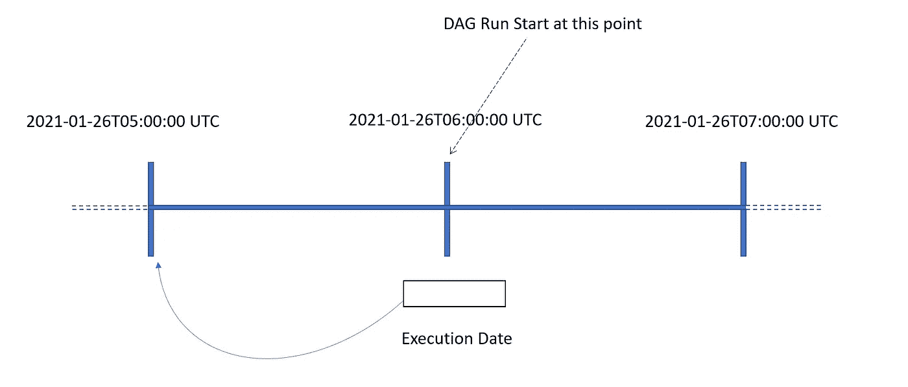
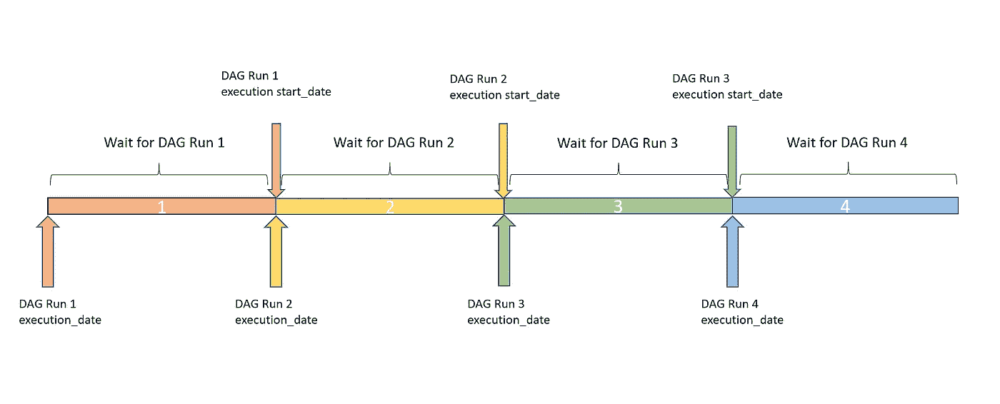
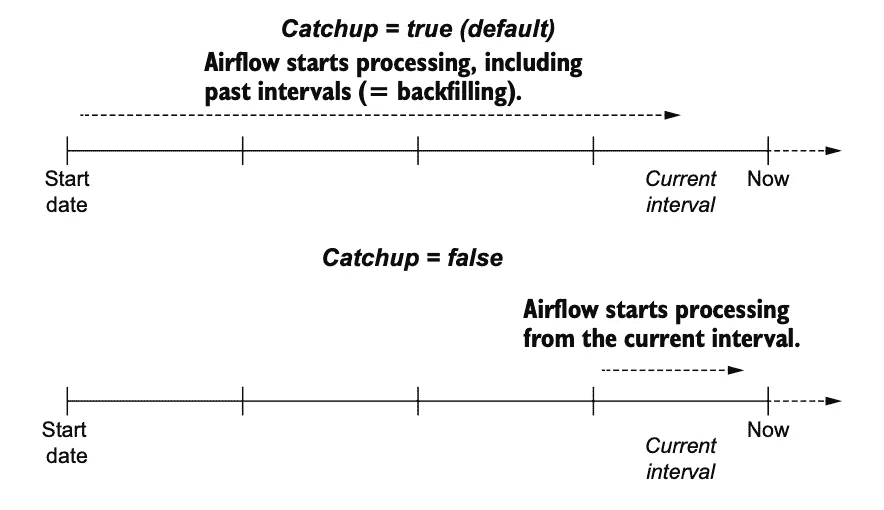
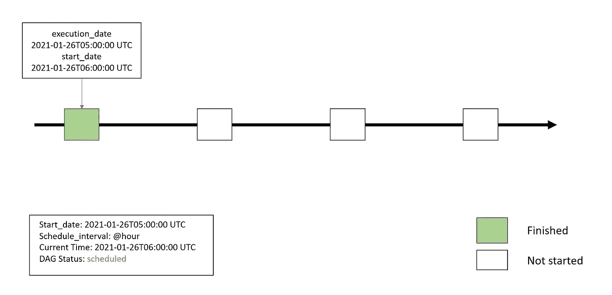
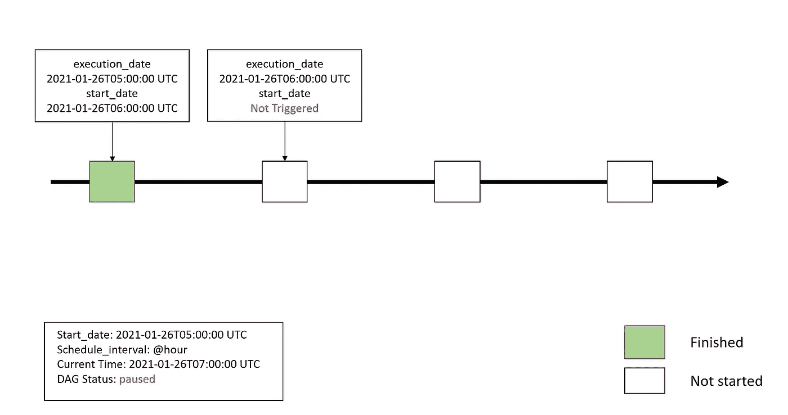
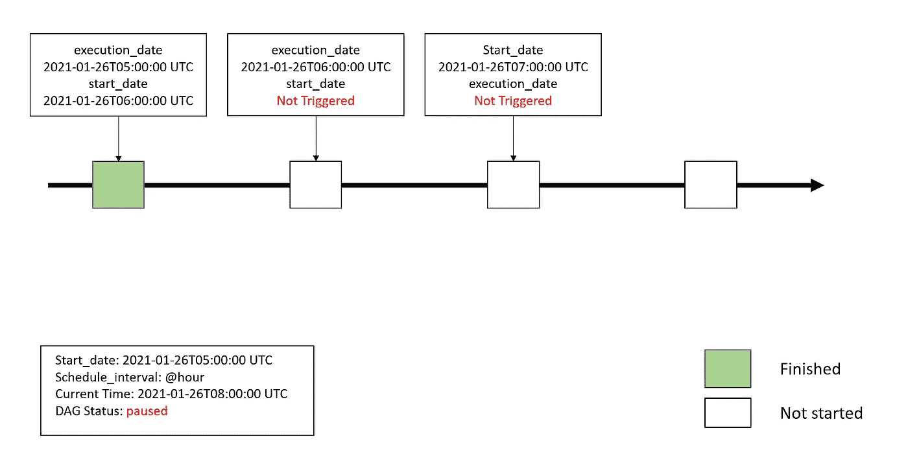
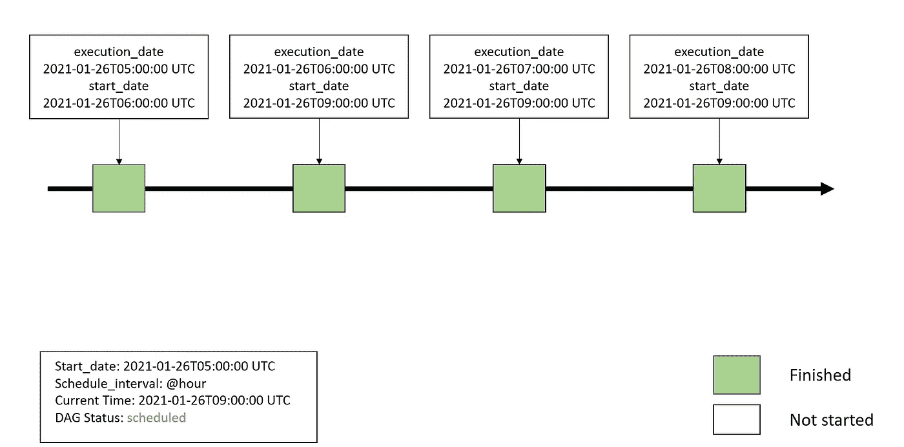

# 气流收集和回填——揭秘

> 原文：<https://medium.com/nerd-for-tech/airflow-catchup-backfill-demystified-355def1b6f92?source=collection_archive---------0----------------------->

在我之前的[博客](/nerd-for-tech/airflow-mwaa-automating-etl-for-a-data-warehouse-f5e50d14713c)中，我们讨论了气流的基本原理。这个博客将涵盖一些先进的话题。

气流允许再次调度错过的 DAG 运行，以便管道赶上由于某种原因错过的调度。它还允许手动重新运行回溯日期的 Dag，并回填这些运行。回填和追赶乍一看令人困惑。在这个博客中，我们将理解这些概念。但是在我们开始这些之前，我们需要刷新“开始日期”和“执行日期”。

## 开始日期和执行日期

> **开始日期** — *开始计划 DAG 的日期*
> 
> **schedule_interval** — *距离我们希望 DAG 被触发的最小 start_date 的时间间隔。*



对于来自 2021 年 1 月 1 日至 26 日 05:00:00 的数据，开始日期为 2021 年 1 月 1 日至 26 日 06:00:00 UTC 且计划间隔为 1 小时的 DAG 实际执行时间为 2021 年 1 月 1 日至 26 日 05:00:00。

```
Trigger Point → start_date + { schedule_interval } → till the end.
```



执行日期是需要处理数据的期间的开始。

## 调味酱

默认情况下，Airflow 将运行任何过去计划但尚未运行的时间间隔。为了避免追赶，我们需要在 DAG 定义中显式传递参数`catchup=False`。



让我们用一个 catchup=true 的例子来理解这一点。



在上图中，我们有一个初始配置，其中一切正常，我们的 DAG 运行发生在 6。然后我们暂停了 DAG。



这里我们看到，由于在下一个计划 DAG 运行暂停，因此计划的 start_date 不可用。



在下一个计划中，发生了同样的情况(未触发 DAG 运行)。现在，我们从控制台启用或计划 DAG 运行。



在上图中，我们看到在下一个计划中，触发了以前错过的 DAG 运行。请注意，start_date 是下一个计划(9)。如果您注意到，虽然执行日期是实际日期，但 start_date 在最后三次 DAG 运行中是相同的。这表示回填。因此，执行日期为 6 的第一次 DAG 运行发生在 7，然后是 8。

## 回填

如果出于某种原因，我们希望按照特定计划手动重新运行 Dag，我们可以使用以下 CLI 命令来执行此操作。

```
airflow backfill -s <START_DATE> -e <END_DATE> --rerun_failed_tasks -B <DAG_NAME>
```

这将执行在 START_DATE & END_DATE **之间安排的所有 DAG 运行，而不管 airflow.cfg 中的 catchup 参数**的值。

注意这里-B 表示我们希望 DAG 运行是向后进行的。首先是最近的日期，然后是较早的日期。

```
airflow backfill -m -s <START_DATE> -e <END_DATE> <DAG_NAME>
```

上述命令将在给定的时间间隔内将所有任务标记为“成功”。

*注意:使用以上 CLI 命令进行回填 DAG 运行时，其 ID 中将带有* `*backfill_*` *前缀。*

希望这是有帮助的！！