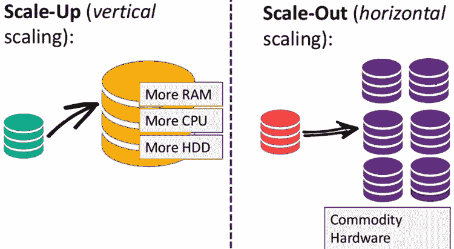
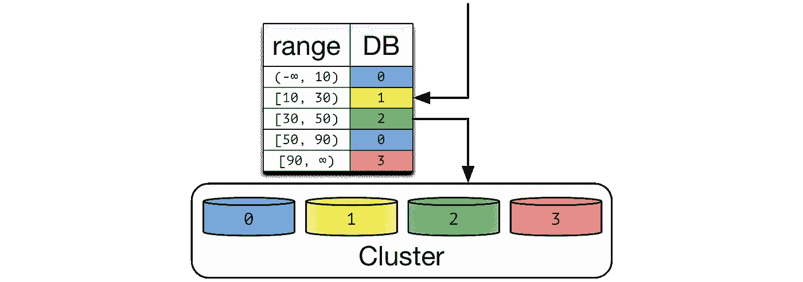

# 数据库分片|纵向扩展数据库

> 原文：<https://medium.com/nerd-for-tech/all-about-database-sharding-scaling-up-the-database-3b6172491cd?source=collection_archive---------3----------------------->

有没有想过脸书、Instagram、亚马逊是如何处理他们的数据库的？像这样一个平台拥有数十亿用户，你可以想象每天是如何产生数据的。

托拜厄斯·菲舍尔在 [Unsplash](https://unsplash.com?utm_source=medium&utm_medium=referral) 上的照片

他们如何扩展他们的数据库？答案是数据库分片。在我们理解数据库分片之前，让我们先理解某种类型的缩放。

# 缩放类型

## 垂直缩放

假设您有一家 5 层楼的酒店，随着时间的推移，酒店的需求增加了，因此您在酒店中增加了两层楼。它通过在现有建筑中增加楼层来纵向扩展酒店。

类似地，根据需求，当现有服务器中的 CPU、RAM、磁盘等服务器资源在垂直方向上扩展时。

## 水平缩放

假设你有一家餐馆，随着时间的推移，你的餐馆的需求增加了，所以你在同一城市开了一家新的分店。它通过在城市中增加一个新的分支来横向扩展餐馆。

类似地，根据需求，当并行添加更多服务器时，您会在水平方向上进行扩展。

垂直缩放和水平缩放

# 什么是数据库分片？

数据库分片是一种水平扩展的架构模式。它建议根据某个方面对数据库进行多个分区。隔板可以是两种类型:垂直隔板、水平隔板。

## 垂直分区

在这个分区中，我们根据列来划分表。假设您有一个用户表，其中包含“名”、“姓”、“收藏夹颜色”列。因此，您划分了表格，将名和姓保存在一个数据库中，将 favourite _ color 保存在另一个数据库中。

## 水平分区

在这个分区中，我们根据行来划分表。假设您有一个用户表，其中包含“名”、“姓”、“收藏夹颜色”列。因此，您划分表，将 100 行保存在一个数据库中，将 100 行保存在另一个数据库中。

垂直分区和水平分区

# 分片的优缺点

## 优势

*   **分散负荷:**因为可以有多台机器并行运行。可以根据执行查询所需的系统来分配负载。
*   **加快查询响应时间:**如前所述，与实际可能存在的总数据相比，这些数据要少得多，这自动导致更快的查询。
*   **高度可扩展:**您可以根据需要随时添加新机器。
*   **更可靠:**由于您的数据被分成多个系统，如果由于某种原因任何系统瘫痪了，也不会影响整个系统。

## 不足之处

*   **重新共享很复杂:**一旦您对数据进行了分片，过了一段时间，需求增加/减少，您想要添加/删除其中一台服务器，那么重新共享数据将会很复杂。因为它必须根据共享数据的条件重新排列数据。并且执行操作也很昂贵。
*   **分片最终会变得不平衡:**假设您基于月份对数据进行分片。有些月份的数据可能比其他月份多得多。这可能会导致不同设备上的数据不平衡
*   **合并分片很复杂:**一旦数据库被分片，如果很难回到非共享架构。并且进行手术的成本也很高。
*   **执行连接操作复杂:**在关系数据库中，我们执行连接操作来获取关系数据。如果数据分布在多个服务器上，那么就需要从所有的服务器上执行连接操作，这非常复杂。

# 数据库分片架构

## 基于算法/密钥的分片

在这种方法中，您选择一个列或列的组合，然后将它传递给一个散列函数，得到一个散列值。你有 4 个碎片，所以要决定哪个碎片你想发送读或写操作的数据。因此，要决定它，需要基于值进行模块化操作，这样就可以决定要重定向到哪个碎片。

基于算法/密钥的分片

重新共享数据可能很有挑战性。它需要更新分片函数并围绕分片移动数据。在保持一致性和可用性的同时做到这两点是很困难的。更好地选择分片函数可以减少传输的数据量。 [**一致哈希**](https://purnendukar.medium.com/consistent-hashing-99ea4caaa24d) 就是这样一种算法。

## 动态分片

在这种方法中，我们为每个碎片设置一个类别。策略是将数据集合划分成块，并将它们分组到同一个碎片中。这些类别可以是任何地区、年龄等。

动态分片

这种方法的一个缺点是它的配置存储在一个称为查找表的独立数据库中。如果它由于某种原因而关闭，那么整个系统都会关闭。为了应对这种情况，您可以使用副本进行备份。

当您希望基于某个类别(如区域)来分布数据时，可以使用这种方法。

## 基于范围的分片

这是一个基于范围创建分片的策略，范围可以是日期范围、主键或其他内容。你可能认为这和动态分片是一样的。与此类似，但这个查找表不是必需的，因为这些范围是以逻辑模式设置的。

基于范围的分片

这种方法的一个缺点是数据不平衡。假设在数据库中存储一些销售数据。与另一个月相比，节日月份会有更多的销售数据。这将自动导致碎片中不平衡的数据。

当您希望基于范围查询数据时，可以使用这种方法。

## 基于实体组的分片

在这种方法中，我们基于数据的实体组对数据进行分片。假设您基于用户数据共享数据，但是可能存在与该用户相关的数据。如果我们将关系数据保存在另一个碎片中，那么执行连接操作将会很复杂。为了克服这个问题，我们将与该用户相关的所有数据保存在同一个碎片中。这使得执行连接操作变得简单，也优化了查询性能。

基于实体组的分片

这种策略更适合关系数据库。它简化了执行连接操作以减少查询时间。

# 结论

没有一种技术是完美的，每样东西都有它的优点和缺点。哪种方法更合适取决于你的要求。

您也可以选择混合方法，让我们通过示例来了解一下。亚马逊在全球拥有庞大的基础设施。如何扩展亚马逊的数据库？

第一级将是**动态分片**第一级将基于国家第二级将基于城市。

第二层将基于**基于密钥的分片**，这里所有的初始数据如用户注册数据都可以被管理。

第三层将是基于**实体组的分片**所有与用户相关的数据都将存储在同一个共享中。

采用混合方法有时也能减少缺点，增加整体架构的优势。