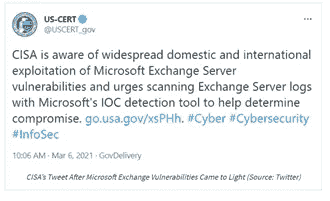

# 关于网络安全你需要知道的一切！！！

> 原文：<https://medium.com/nerd-for-tech/all-you-need-to-know-about-cyber-security-2c437488b79f?source=collection_archive---------16----------------------->

关于网络安全你需要知道的一切！！！

**一次大规模网络攻击影响了全球数百万微软客户**，其中威胁者积极利用**微软 Exchange 服务器**中的四个零日漏洞。

www.twitter.com

据信，仅在美国就有**九个政府机构、**以及超过 **60，000 家私营公司受到攻击**。

但是什么是网络攻击呢？

网络攻击是针对计算机信息系统、基础设施、计算机网络或个人计算机设备的任何进攻性策略。攻击者是指试图在未经授权的情况下访问数据、功能或系统的其他受限区域的人或进程，可能怀有恶意。

为了保护我们自己免受这种网络攻击，我们需要网络安全。

www.unsplash.com

**但什么是网络安全？**

根据维基百科，网络安全是保护计算机系统和网络免受信息泄露、硬件、软件或电子数据被盗或损坏，以及所提供服务的中断或误导。

网络安全涉及帮助保护各种数字组件、网络、数据和计算机系统免受未经授权的数字访问的技术。

那么，让我们来看看我们可能面临的各种网络攻击。

www.unsplash.com

最常见的网络攻击类型之一是恶意软件攻击，例如特洛伊广告软件和间谍软件。如果您在线或系统下载任何可疑附件，您的设备可能会被嵌入附件中的某些恶意病毒损坏。

接下来是网络钓鱼攻击，黑客通常会发送看似来自合法来源的欺诈性电子邮件。这样做是为了安装恶意软件或窃取敏感数据，如信用卡信息和登录凭证。

另一种攻击是中间人攻击。在这里，黑客可以访问你的设备和网站服务器之间的信息路径。黑客的电脑接管了一个 IP 地址。通过这样做，一个应用程序和网站之间的通信线路被秘密拦截。

由 shady mate 创建。

为了防止任何类型的网络攻击，我们试图在个人层面实施一些网络安全措施。

**他们中的一些人保持防火墙打开，使用防病毒和反间谍软件**，安全地使用无线网络**，**为每个在线帐户使用唯一的密码**，**备份您的数据，双重认证等。

网络攻击不仅局限于个人，还包括公共和私人组织，在这些地方进行的网络攻击更加致命，并导致巨大的损失。这种攻击的动机很多，从篡改关键数据到金钱收益。

[www.unsplash](http://www.unsplash) 。com

通过这样做，黑客可以查看、编辑和删除数据库中的表格。对于拥有多个网络和服务器的组织来说，确保完全的安全性确实是一个挑战。这不是一项简单的任务，为了帮助完成这项任务，网络安全专家被雇佣来识别网络威胁和保护公司网络。

根据您对网络安全的兴趣，您可以选择不同类型的工作，这些工作可能需要专门的技能认证。例如，渗透测试员，也称为道德黑客，搜索并利用应用程序、网络和系统中的安全漏洞。

www.unslpash.com

要成为渗透测试员，你需要获得其他 IT 工作的经验，如安全管理员、网络管理员和系统管理员。这些工作中的每一项都需要自己的一套技能，帮助你成为一个组织的宝贵财富。

如果黑客让你着迷，那么一个有道德的黑客的角色是值得探索的。

但是，如果您希望设计健壮的安全结构，那么安全架构师的角色更合适

首席信息安全官 CSO 在企业安全中起着至关重要的作用，负责组织中信息的整体安全。

www.unsplash.com

**结论**

网络安全涉及帮助保护各种数字组件、网络、数据和计算机系统免受未经授权的数字访问的技术。最常见的网络攻击类型之一是恶意软件攻击，例如特洛伊广告软件和间谍软件。

网络攻击不仅局限于个人，还包括公共和私人组织，在这些地方进行的网络攻击更加致命，并导致巨大的损失。这种攻击的动机很多，从篡改关键数据到金钱收益。