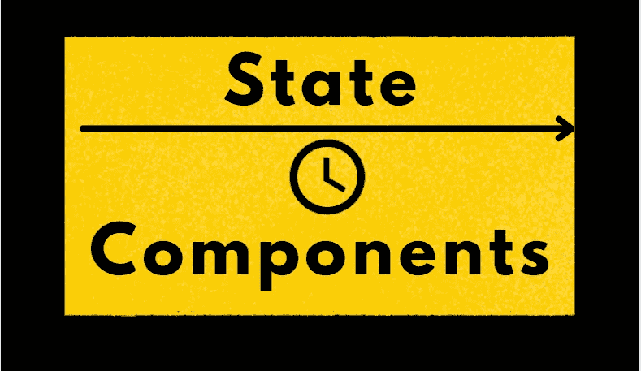

# 调查指南反应 JS[国家和道具]第九部分

> 原文：<https://medium.com/nerd-for-tech/an-investigative-guide-to-react-js-state-and-props-part-ix-c92f00fc4dee?source=collection_archive---------2----------------------->

直到上一篇文章，我们一直在处理 React 的 UI 部分。现在让我们转到 react 的数据部分。数据为 react 应用程序带来了活力，因为如果没有数据可以显示，构建应用程序还有什么意义呢？

> *我们去网站主要是因为我们需要信息。*
> 
> *什么是信息？理解数据*

数据可以是从文字到图像的任何东西。数据可以是**静态的**或**动态的。**静态数据包括博客、登陆页面等。动态数据就在我们身边，如 OTT 平台、直播流等。事实上，在现实世界中，所有的 web 应用程序都是静态和动态数据的组合。

> *这在某种程度上帮助我们根据我们设计的布局放置数据。*

我们知道 React 是基于**元素的。**我们使用一个返回元素的函数，相应的函数称为**组件。**因此，react 由组件组成，因此 web 应用程序基于组件的排列和组合。

这实质上意味着组件使用数据。

> *简单来说，组件=数据在布局中的位置*

如果组件使用静态数据，我们在 2000 年代早期将它硬编码为静态网页。如果组件使用动态数据，我们使用**状态**。

*注:* *状态和道具虽然看似重叠却不一样*

当我们在特定的时间内测量/观察一个事物时，我们称它为一种状态。这实质上意味着它有过去、现在和未来。举个例子，我将一个板球队的实时比分存储在变量 **X.** 中

问这个问题，

**X** 是静态的还是动态的？显然，它是动态，因为 X 从零运行开始，以某个有限的未知数结束。因此 X 变量有过去、现在和未来。

在 web 的情况下，**状态**改变页面/布局的内容。因此我需要改变 DOM(虚拟的和真实的)。这导致一个**新的渲染。**

这种重新呈现(新的呈现)是由状态改变和承载该改变(即状态改变)的组件引起的。这意味着宿主对组件的状态有完全的控制权。

我知道我把很多事情都简化了，如果你碰巧已经在用 State 的话。我想给出一些国家背后的直觉。

*原载于 2022 年 3 月 28 日 https://www.pansofarjun.com***。**