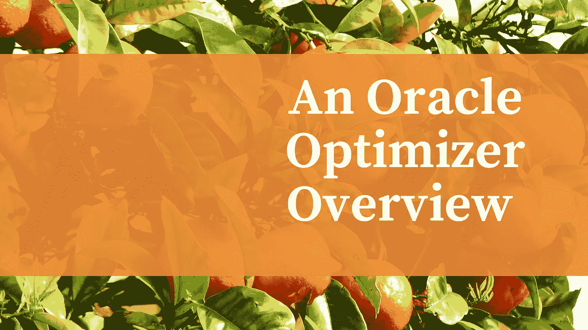
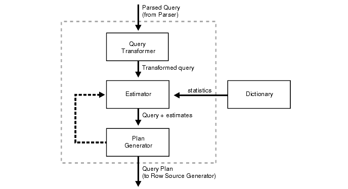

# Oracle 中的优化器概述|访谈问答

> 原文：<https://medium.com/nerd-for-tech/an-overview-of-optimizer-in-oracle-36fcb0a6787c?source=collection_archive---------1----------------------->

# 在这里，我们将了解 oracle 中的优化器处理步骤

什么是优化器？

*   优化器为我们的查询创建最佳执行计划。
*   它根据 SQL 语句访问的表或索引的统计信息，通过分解信息来检查所有可用的访问路径。

Oracle 中的优化器概述

**优化器组件:**

*   在查询解析之后，它由优化器处理。在优化器中。它有三个组成部分
*   **查询变压器**
*   **估计器**
*   **计划生成器**

oracle 优化器概述

**查询变压器:**

*   查询转换器将我们的查询转换成更好的查询。
*   有许多方法来转换我们的查询，Oracle 试图找到返回相同结果但性能更好的最佳查询。因此，要执行的查询可能与您的查询完全不同。但是，它返回相同的结果。

**估计器:**

*   下一个组件是估计器。它通过成本优化了我们的查询。
*   成本是我们的查询的 CPU 使用、内存使用和磁盘使用的组合。
*   它只是计算读取单个块的成本，然后将结果乘以要读取的块。
*   这只是基于统计数据的估计。不执行语句，我们不知道真正的成本。因为，统计数据是在特定时间收集的，但真实数据会立即发生变化。因此，估计器估计作为输入输入的查询的成本，并返回估计的成本。

**计划生成器:**

*   评估完成后，它进入计划生成器
*   作为一个简单的定义，计划生成器通过检查不同的访问路径、连接方法和连接顺序来为我们的查询计算各种计划。
*   它生成一个计划，把它交给估算者来估算它的成本，然后创建另一个计划，让估算者找到它的成本，再找到另一个计划，让估算者估算成本，如此继续下去，直到所有可能的执行计划都被创建。
*   除非你改变它，否则它必须在一秒钟内找到最佳方案。因此，由于所有可用的执行计划及其成本都已准备好，计划生成器将决定成本最低的计划，并将该执行计划传递给行源生成器。
*   行源生成器是查询拥有执行计划的最后一站。
*   在行源生成之后，它被存储在共享 SQL 区域中。

图片来源:甲骨文