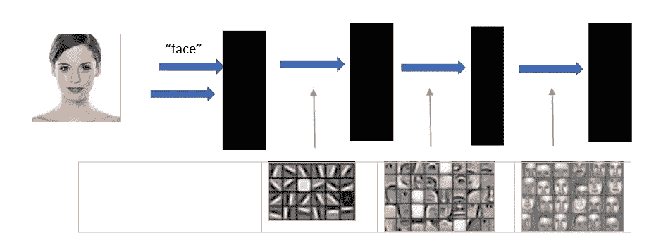
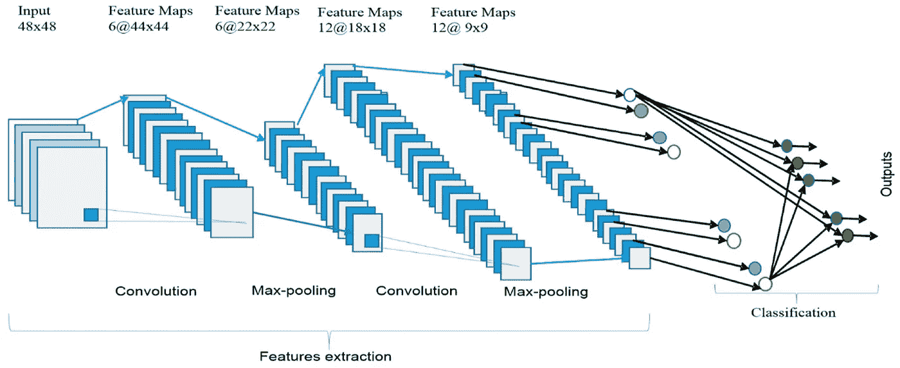
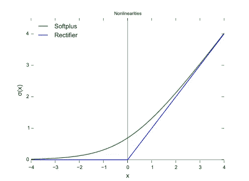
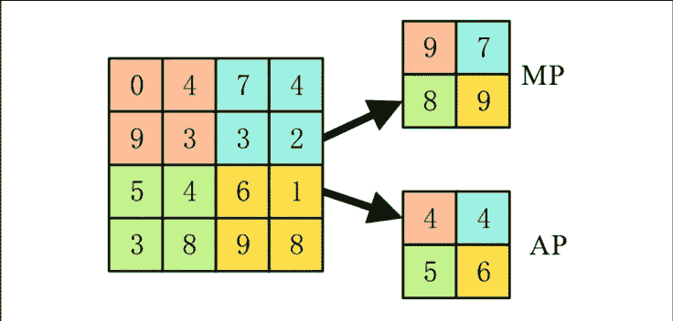
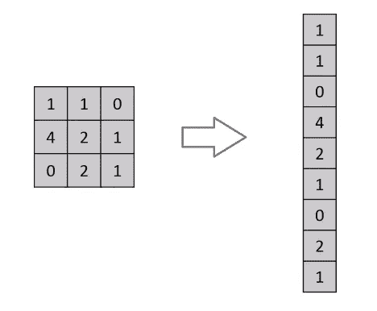

# 卷积神经网络体系结构概述:卷积神经网络(CNN)的历史和描述

> 原文：<https://medium.com/nerd-for-tech/an-overview-of-the-architectures-of-convolutional-neural-networks-history-and-description-of-3439f44e19c8?source=collection_archive---------15----------------------->

Patrick Schneider 在 [Unsplash](https://unsplash.com/s/photos/augmented-reality?utm_source=unsplash&utm_medium=referral&utm_content=creditCopyText) 上的照片

# 卷积神经网络的历史

使用计算机进行所谓的计算机视觉(CV)被认为是在 2012 年 AlexNet 架构赢得 ImageNet 竞赛时变得广泛，然而，使用机器识别图像中的形状的尝试已经存在了几十年。

二十世纪五六十年代的事件被认为是计算机视觉应用的一个转折点。1959 年，两位神经心理学家 David Hubel 和 Thorsten Weasle 发表了一篇题为“猫纹状皮层中单个神经元的感受野”的论文，他们在论文中得出结论，视觉处理总是从定向边缘等简单结构开始。[4]

Larry Roberts 被认为是该领域的创始人，他在 1963 年的作品《Block World》中描述了基于不同的 2D 视图提取物体的 3D 几何信息的可能性。这项工作很重要，因为它符合人性。不管形状的方向或光源的变化，人类都能够识别形状。他的工作是基于识别物体边缘的重要性。在这之后，1970 年，第一个用于视觉识别的算法发表了，叫做广义圆柱模型，它是由斯坦福大学人工智能实验室发表的。这个想法的核心是世界由简单的形状组成，世界上的每个物体都是这些简单形状的组合。下一个算法是基于一个通用的圆柱模型，但引入了字符串作为部分之间的连接，因此可变性的概念是结构的图像模型。[5]

# 卷积神经网络的描述

卷积神经网络是一种特殊类型的多层神经网络，其主要功能是以最少的处理来识别图像中的视觉模式。像前面描述的神经网络类型一样，这种类型的网络也由具有适当权重的神经元组成。[5]

提醒一下，前面提到的神经网络只有一个通过隐藏层传播的输入向量。这些网络的特点是，每个隐藏层由连接到前一层所有神经元的神经元组成(完全连接)。在一层中，每个神经元都是独立的，与该层的神经元没有任何联系。最后，还有一个输出层，在图像示例中，它通常表示类。[5]

物体识别系统中的分类问题可以归结为以下两个想法之一:

图 1:清晰分离的特征提取器和分类器

其中“特征提取”意味着有效计算的参数化函数，并且能够有效学习特征。在这个想法中，用于分离特征和分类器的部分被清楚地分离。

第二个想法是，这些元素之间没有明确的界限，所有东西都代表一个从原始像素到最终分类的单一非线性系统。

由此产生的问题是如何实现这一点？解决方法是将简单的函数组合成更复杂的函数。例如，使用函数 sin (x)，cos (x)，x3，exp (x)等。我们可以形成更复杂的函数比如:sin (exp (log (x3)).这种函数的组合是深度学习的基础。[6]

最简单的就是图形化的表示深度学习背后的直觉。如果我们看下面的插图我们可以看到，事实上每个黑色矩形都可以有一些训练参数，这些矩形的组成，简单的函数，形成了一个复杂的非线性系统。每个矩形的出口实际上是正在被分类的东西的当前表示，即一些特征。[6]

图 2:深度学习特征提取

卷积神经网络通常有一个三阶输入张量。张量的意思是矢量的概括，它们的数学表示是矩阵。张量可以是 1D 矩阵(向量)，3D 矩阵，甚至 0D 矩阵(一个数字)，但也可以是任何其他难以可视化的多维结构。

这种输入的一个例子是，例如，高度为 H、宽度为 W 并且具有 3 个颜色通道(红色、绿色和蓝色)的图像。这种类型的神经网络的入口将是任何其他多维张量，学习过程在本质上没有变化。输入经过一系列过程步骤，其中每个步骤称为一层。每一层都可以是卷积层、用于减少表示的空间大小的层(池化)、用于归一化的层、完全连接的层、用于计算损耗的层等。[7]

## 卷积层

图像表示和特征检测器的例子可以在图 3 中看到。

图 3:左边是黑白图像的例子，中间是特征检测器的例子，右边是结果图像

在示例中，特征检测器(过滤器、内核)是 3x3。滤波器尺寸因架构而异，以下章节将展示不同的滤波器尺寸。

例如，通过捕获原始图像的前九个像素(用红色标记)并将图像的每个包含的像素乘以其在过滤器中的对应值，将该过滤器应用于图像。乘法结果作为结果图像中的像素值输入。在图像上移动滤镜的步幅决定了结果图像中的像素数。例如，如果我们向右移动 1 个像素，这意味着我们将能够在初始图像的一行中移动过滤器 6 次，因此结果图像在第一行中将有 6 个像素，而原始图像中有 8 个像素。如果将过滤器应用于绿色矩形中的像素，我们会看到一个匹配，因此该行中该像素的值将是适当的。重复该过程，直到整个画面被通过。步骤的值取决于需要，结果是较小尺寸的图像，例如对于步骤二，图像将在高度和宽度上小两倍。这当然对计算机资源的消耗有积极的作用。出现的问题是我们会失去信息吗？当然了。输出图像的像素数少于输入的像素数，一定量的信息丢失了，但滤波器的目的是在原始图像中找到某些特征，所以丢失的很可能不是滤波器要提取的任务。剩下的正是过滤器应该揭示的特征。应当注意的是，当移动滤波器时，可能发生滤波器超出图像边界的情况，例如从图 4 中，如果我们将滤波器移动第二步，注意到滤波器的第三列将不会覆盖原始图像的任何像素。这个问题有两种解决方法。第一种方法是忽略简单的像素，如果丢失该信息是可以接受的，这通常称为有效填充。另一种方法是用丢失的像素扩展原始图像，这通常被称为填充本身。

在图 4 中，如果我们看看卷积层，我们可以看到有更多的滤波器，在这个特定的例子中有六个。几个过滤器的存在与文本的前一部分直接相关，因此，每个过滤器的任务是寻找某些特征，例如，第一个过滤器只寻找水平线，第二个过滤器只寻找垂直线，等等。这样就保留了原图像的很大一部分信息，减少了损失，即。它在一定程度上得到了优化，因为只存储对解决问题更重要的信息。

图 4:卷积神经网络的一般架构

图 4 缺少了一个步骤。这是 ReLU(整流线性单元—整流器):

图 5: ReLU

它是一个激活函数，其任务是增加非线性。因为图像本质上是非线性的，所以引入了增加的非线性，尤其是如果图像中有大量重叠的对象。图像具有大量的非线性元素，并且相邻像素之间的过渡在许多情况下是非线性的。然而，通过引入滤波器，我们有可能失去这种非线性，也就是说，我们创建了线性过渡，例如，它不对应于原始图像。目标是尽可能避免非线性，即“校正”引入的线性。[10]

## 最大池化

在图 4 中，可以观察到最大池层的存在。这种类型的层的任务是减少图像的空间表现。如上所述，卷积层实际上是一堆特征图(应用了适当过滤器的原始图像)。增加滤波器的数量会增加维数，这会影响训练网络时需要调整的参数数量的增加。池层的任务是通过减少表示的空间大小来控制过度拟合，从而减少参数的数量。该层的输入是卷积层最常见的输出。最大分摊法是最常用的，但平均分摊法也在许多情况下得到应用。[5]

池化包括选择适当的操作，然后选择通常比应用它的特征图小的过滤器，一些常用的值是具有步骤 2 的 2x2 过滤器。这意味着它将在适当的特征图中将高度和宽度值减半。Max pooling 的工作方式类似于应用图 4 中的过滤器，该层的过滤器以适当的步骤拖过图像，并适当填充缺失的过滤器，窗口中的最大值被选择并输入到该层的最终特征图中。平均池的情况是相同的，除了寻找当前被过滤的像素的平均值而不是最大值。

图 6:最大和平均池的例子

训练的下一步是扁平化。为了让目前所做的一切都能够传递到神经网络进行训练，需要形成一个向量。这就是这一步的意义。[10]

图 7:形成矩阵的向量

此后，网络的其余部分通常与 MLP 重合，形成完全连接的层，并执行适当的分类。

## 拒绝传统社会的人

当涉及到完全连接的层时，它们通常包含最大数量的参数，因此这些层中的神经元在训练期间建立影响每个神经元的影响的相互依赖性，这可能导致网络过度训练。辍学是一种技术，应该有助于解决这个问题。想法是排除一定数量的节点，即。在提前传播阶段不参与任何培训步骤。这样，防止了权重向相同值的收敛。除了排除单个神经元，还有可能排除整个层。

第一部: [*深度神经网络*](https://mikevastech.medium.com/an-overview-of-the-architectures-of-convolutional-neural-networks-deep-neural-networks-a08929f60b23)
下一部续集不久:*图像增强和迁移学习*

## 资源

[1][https://www.mathworks.com/discovery/deep-learning.html](https://www.mathworks.com/discovery/deep-learning.html)
【2】[https://skymind.com/wiki/multilayer-perceptron](https://skymind.com/wiki/multilayer-perceptron)
【3】[https://keras.io/](https://keras.io/)
【4】[https://hacker noon . com/a-brief-history-of-computer-vision-and-convolutionalneural-Networks-8 Fe 8 aacc 79 f 3](https://hackernoon.com/a-brief-history-of-computer-vision-and-convolutionalneural-networks-8fe8aacc79f3)
【5】实用的 Convolutiona 神经网络，莫希特·塞沃克，马里兰州雷佐尔·卡里姆，帕拉德普·普贾里，ISBN 978–1–71 pack Publishing ltd .
【6】[https://cs . NYU . edu/~ Fergus/tutorials/deep _ learning _ cvpr 12/tutorial _ p2 _ nnets _ ranz at](https://cs.nyu.edu/~fergus/tutorials/deep_learning_cvpr12/tutorial_p2_nnets_ranzat)o _ short . pdf
【7】[https://cs.nju.edu.cn/wujx/teaching/15_CNN.pdf](https://cs.nju.edu.cn/wujx/teaching/15_CNN.pdf)
【8】[https://www.mdpi.com/2079-9292/8/3/292/htm](https://www.mdpi.com/2079-9292/8/3/292/htm)
【9】[https://en . Wikipedia . org/wiki/Rectifier _(neural _ networks)](https://en.wikipedia.org/wiki/Rectifier_(neural_networks))