# 分析 freeCodeCamp.org 视频记录和元数据

> 原文：<https://medium.com/nerd-for-tech/analyzing-freecodecamp-org-video-transcripts-and-metadata-66034767f078?source=collection_archive---------37----------------------->

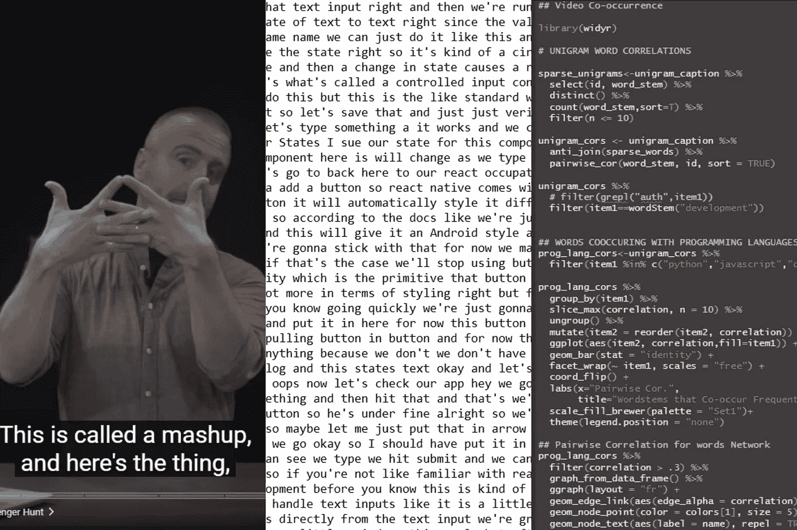

文本分析管道的可视化表示(数据源->非结构化文本数据->分析)

# 目录

1.  介绍
2.  从 Youtube 下载视频转录和元数据
3.  视频课程和趋势概述(EDA)
4.  文本分析的预处理
5.  看看词频
6.  寻找独特的术语(TF-IDF)
7.  共现术语
8.  情感分析
9.  主题建模
10.  摘要

## [GitHub 回购的分析](https://github.com/dgulacsy/ds3_final_assignment)

# #1 简介

在本文中，我将使用来自 freeCodeCamp.org[的数据，这是最流行的编程和软件开发免费教育资源平台之一。就数据而言，我指的是在该组织的 Youtube 频道上可获得的**1000 多个**视频。这是一个令人惊叹的视频课程选择，几乎涵盖了从机器学习到前端开发的每个编码方面。](https://www.freecodecamp.org)

请想一想这份长达 1，151 小时的教育材料中包含的大量信息，其中充满了动手实践教程和最佳实践宝石。以每周 20 小时的观看速度，浏览一半的视频需要 1 年零 1 个月的时间。我想大多数人会很乐意掌握这方面的知识，但是，我不得不痛心地承认，阅读这篇文章不会让你在 10 分钟内成为编程天才。尽管如此，我还是希望你能接触到一些你以前没有真正意识到的新术语或关系。例如，在这个过程中，我了解了一些身份验证概念。

在详细介绍之前，我想提一下，这一分析是受爱德华多·阿里尼奥·德拉鲁比亚和他的书籍推荐的启发

# #2 从 Youtube 下载视频转录和元数据

获取原始数据比我最初想象的要容易。这种轻松愉快的感觉都要归功于一个非常简洁且记录良好的命令行工具，名为 [youtube-dl](https://github.com/ytdl-org/youtube-dl) 。它主要用于 Youtube，但也适用于 udemy 或 Vimeo 上的视频。基本上，您只需要提供频道或播放列表的 URL，它就会自动开始下载与视频相关的资源(视频文件、info.json、字幕)。Youtube 上的大多数视频都没有经过验证的字幕。相比之下，大多数视频都有自动生成的字幕。使用下面的一行程序，我可以下载 VTT ( [视频文本轨道](https://developer.mozilla.org/en-US/docs/Web/API/WebVTT_API))格式的字幕和上传到 freeCodeCamp 频道的每个视频的元数据 JSON 文件:

请注意，我使用了指向播放列表的 URL，而不是指向频道本身的 URL。您可以通过点击频道页面上的“视频”,在下拉菜单中选择“上传”,然后点击旁边的“播放全部”,找到包含所有上传视频的播放列表。

下载完成后，我交叉检查了 JSON 文件和标题文件，并删除了那些没有相应标题文件的文件。因为我找不到一个合适的包来实现基本的 VTT 到数据帧的解析功能，所以我编写了自己的解析器函数，它可以提取文本段以及它们的开始和结束时间戳。如果你对它感兴趣，你可以在这里找到它。实际上，我在这个分析中并没有真正利用这些低层次的数据，尽管它可以用于进一步的开发。例如创建基于关键字的搜索功能，该功能推荐观看视频的某些部分。总之，有了这些，我最终到达了一个每视频一行的数据帧，它包含了每个视频的全部标题。

# #3 视频课程和趋势概述(EDA)

形成我的分析的中心要素的主要特征是视频抄本。尽管如此，我也简要地介绍了一些一般的视频特征，例如查看趋势以给出文本分析的背景。首先，我看看最重要的变量的分布。基于此，我们可以看到，不喜欢计数、喜欢计数和观看计数变量极度向右倾斜，几乎所有视频的平均评级都在 4 到 5 之间，平均视频长度约为 1 小时，但也有一些视频超过 3 小时。

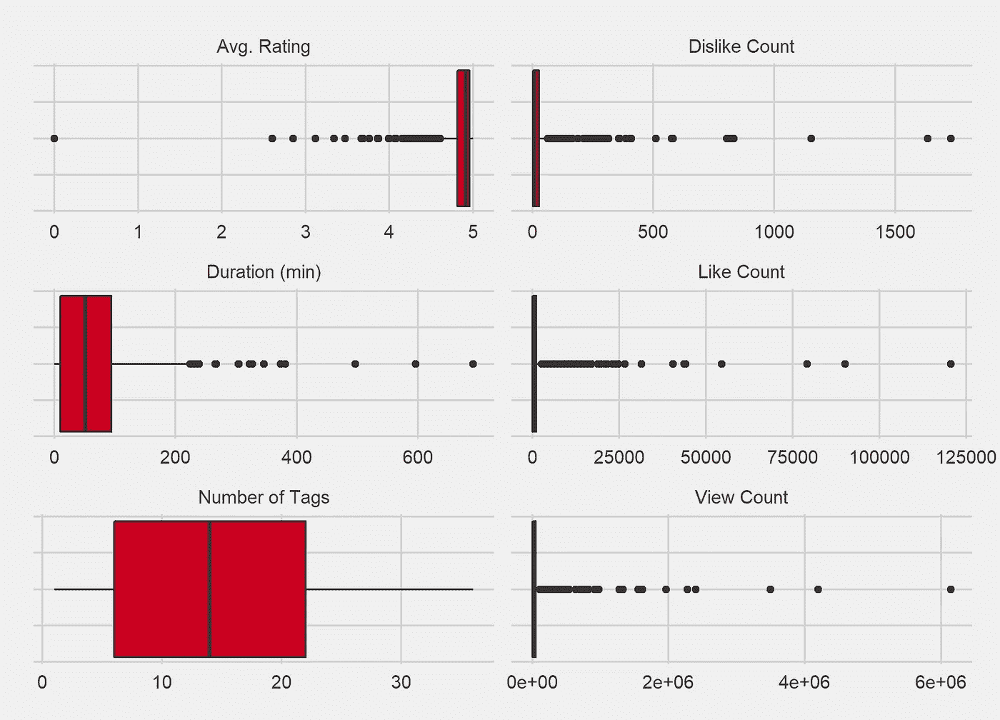

视频特征分布

平均评级来自喜欢计数和不喜欢计数的重新调整比率。正如我们可能看到的，平均评级并没有真正向我们展示一个清晰的画面，即哪些视频更受欢迎，因为它被挤在一个非常小的分位数范围内。实际上，平均视频评分约为 4.84，这引起了人们对这一变量是否可以用作可靠的流行度指标的关注，因为我们无法真正区分这些视频。基于此，我们可能会选择一个绝对变量，而不是相对变量，例如 like count。这方面的潜在问题与用户行为有关。我的意思是，大多数用户不会点击喜欢按钮，即使他们真的喜欢该内容，所以喜欢计数并没有真正衡量我们可能建议它衡量的东西。鉴于这种不确定性，我决定用观看次数作为流行度的代理变量，并使用观看次数四分位数作为分界点将视频分为 4 类。(点击了解更多关于 Youtube 如何统计浏览量的信息

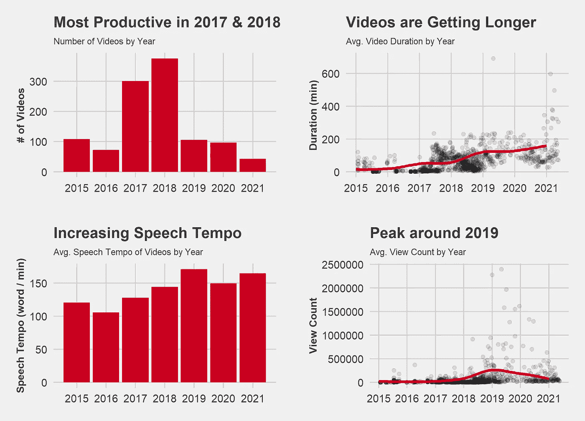

视频特征趋势注:2021 年仅包含截至 2021/05/21 发布的视频。

根据图表，我们可以看到大多数视频都是在 2017 年和 2018 年发布的，看起来从 2019 年开始，每年的视频数量预计将停滞在 100 个。从 2015 年到 2021 年，一个平均视频的长度显著增加。从 2019 年开始，我们可以看到碱基长度的变化。我想这是因为该频道开始关注更深入的教程。除此之外，我们还可以看到，到 2019 年，语音节奏也呈增长趋势，这支持了格式转换的想法。就受欢迎程度而言，我们可以看到 2019 年左右的高峰，其中一些视频的点击率极高，超过 100 万次。如果你感兴趣，你可以看看点击率最高的 5 个视频:

```
1\. [Learn JavaScript - Full Course for Beginners](https://www.youtube.com/watch?v=PkZNo7MFNFg) | 6.1 M
2\. [C Programming Tutorial for Beginners](https://www.youtube.com/watch?v=KJgsSFOSQv0) | 4.2 M
3\. [HTML Full Course - Build a Website Tutorial](https://www.youtube.com/watch?v=pQN-pnXPaVg) | 3.5 M
4\. [Learn HTML5 and CSS3 From Scratch - Full Course](https://www.youtube.com/watch?v=mU6anWqZJcc) | 2.4 M
5\. [Python Django Web Framework - Full Course for Beginners](https://www.youtube.com/watch?v=F5mRW0jo-U4) | 2.3 M
```

# #4 文本分析的预处理

为了继续进行文本分析，我必须对数据帧中的文本数据进行预处理。我应用了“每行一个标记**”**的整齐文本原则，这是在用 R 的[文本挖掘一书中介绍的，类似于 Hadley Wickham 的整齐数据概念。基本上，数据的结构应该如下所示，其中每个变量是一列，每个视频令牌对是一行:](https://www.tidytextmining.com/index.html)

我们可以通过利用 [tidytext](https://github.com/juliasilge/tidytext) 库中的`unnest_tokens`函数来实现这种格式。不幸的是，在我的例子中，我遇到了一些默认单词标记化的问题。这是因为我也想标记编程语言的名字(例如 Python，Javascript)。当像 **+#$！**等。因此像 C#和 C++这样的表达式被简化为普通的字母 **c** 。另一个问题是，通常在标记化之后，也存在于停用字词表中的字词被移除。由于该表还包括字母，一些编程语言被完全删除。为了克服这一点，我相应地修改了停用词，另外我还添加了一些我在分析中遇到的词，但我认为它们在这种情况下没有意义。

# #5 查看术语频率

作为第一步，我看简单的词频。我从去掉视频标题的嵌套开始，查看最常出现的单词。

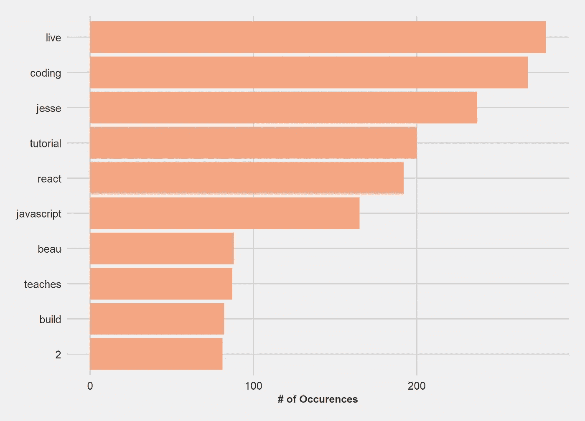

标题中最常用的单词

前三个词实际上密切相关，因为该频道上有超过 230 个“Jesse 现场编码”会话。杰西和博都是主持人/导师的名字。除此之外，我们可以理解，该频道的主要内容是制作关于 Javascript 和 React 等主题的教程。同样地，看看与视频相关的标签，我们会得到或多或少相同的图片。我们看到很多关于 CSS 和 JavaScript 以及一般的 web 开发的教程视频。

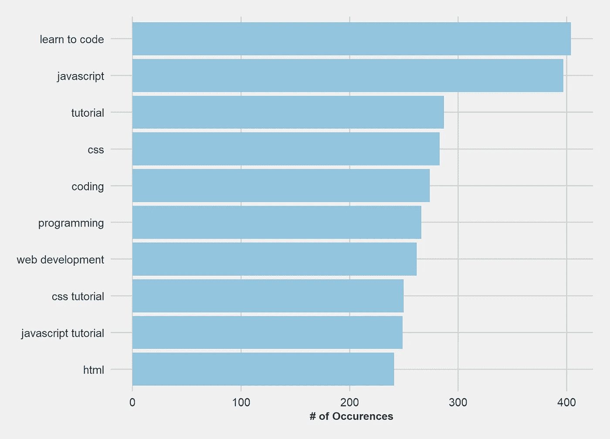

最常用的视频标签

最后，我将同样的方法应用到视频标题上，以找出哪些单词使用得最多。然而，这一次在整理我的数据帧之后，我还添加了一个额外的列，其中包含了标记化单词的词干版本。词干将消除特定单词的不同形式。例如，将“创建”、“创建”、“创建”和“创建”转换为词干“创建”，这样我们就可以更好地检测文本中的语言宏观模式。

我的结果显示，主持人/导师使用时间、数据、设置、添加和创建等词最多。这组单词告诉我们一些关于导师在他们的课程中通常使用什么样的语言编码。我们还可以意识到，他们谈论了很多关于添加和创建像文件或函数这样的元素。

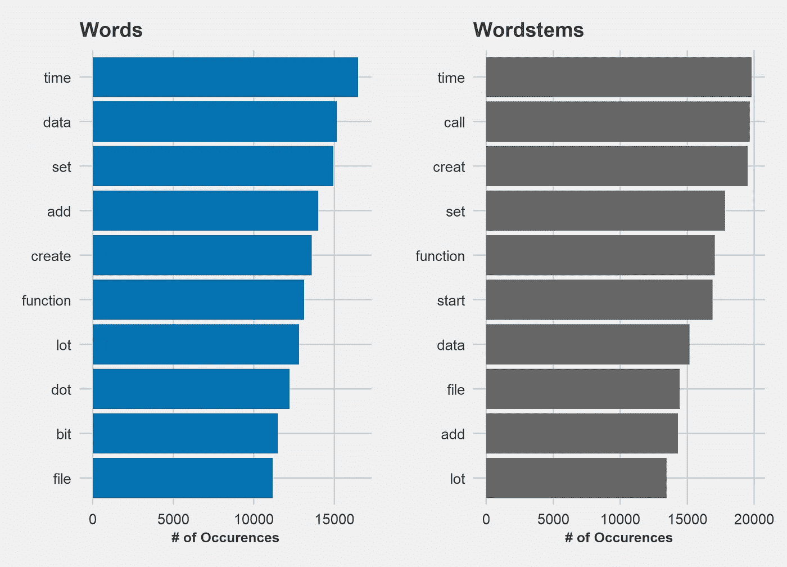

最常用的单词和词汇

在玩了一会儿这个标记化的字幕数据帧后，我意识到我也可以很快了解到频道上覆盖最多的编程语言以及这些年来这种情况是如何变化的。所以我把我的数据框架按年份分组，并计算全年的词频。结果显示，JavaScript 一直排在前 2 位，而 CSS 则相对频繁地被提及，直到 2020 年显著下降。我们还可以看到，自 2018 年以来，导师们开始更频繁地谈论 Python，这是 2020 年覆盖面最广的语言。

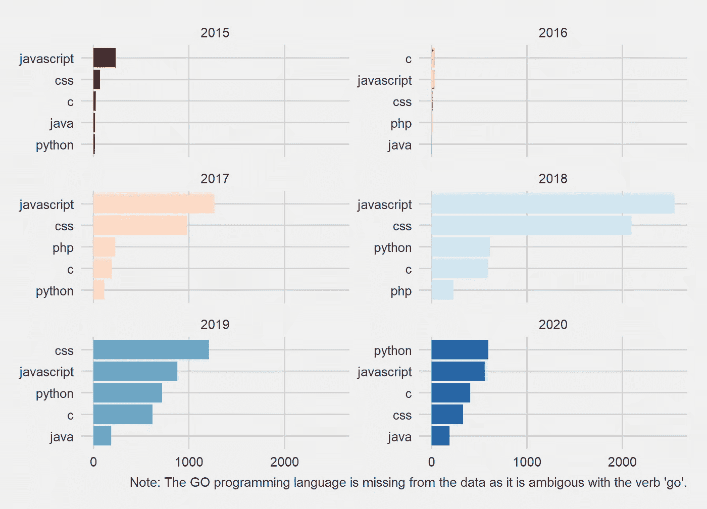

按年份列出的最常提及的编程语言

# #6 寻找独特的术语(TF-IDF)

现在我们看了常用术语，让我们试着找出那些可以被认为与特定视频集有区别的表达。我们将通过计算 TF-IDF 比值来实现这一点，该比值结合了两个重要的测量值:

1.  **TF =词频**；就像以前一样，它告诉我们一个给定的表达式在文档中出现了多少次。
2.  **IDF =逆文档频率**；这向我们展示了一个特定的术语对于相应的文档是多么的独特。

为了计算文档中每个术语的 TF-IDF，我们需要定义文档实例。自然，我们可能会说一个文档应该是一个视频。然后我们会得到一个单词列表，这些单词可以被认为是特定视频所独有的。我们也许可以将这些单词与视频相关的标签进行比较，以评估标签的独特性。这个应用程序很棒，但我们也可以尝试按我们可能感兴趣的某种变量对视频进行分组，并检查哪些关键字真正区分了这些组。

对于这个分析，我决定使用观看次数分类——以前使用四分位数作为分界点创建的——和年份来对视频进行分组。为了获得“文档”中每个术语的 TF-IDF，我通过分组变量计算词干，并借助于`bind_tf_idf`函数计算术语和逆文档频率。我也将对标签进行同样的操作，看看结果有多相似。

在下面的图表中，我们可以看到浏览量少、浏览量中等或浏览量高的视频特有的前 5 个词。来自字幕数据的文字并没有真正向我们描绘出什么样的视频内容受欢迎或不受欢迎的清晰画面。我们在难以联想的地方找到一些词，如“塞巴斯蒂安”、“汉森”和“库欣”。此外，我们还可以看到一些与技术相关的术语，如“changelog”、“quasar”、“stencil”或“fft”，以及“asteroid”、“tetromino”或“pacman”等很可能与游戏开发相关的术语。然而，我们无法确定与受欢迎程度相关的一般方面。

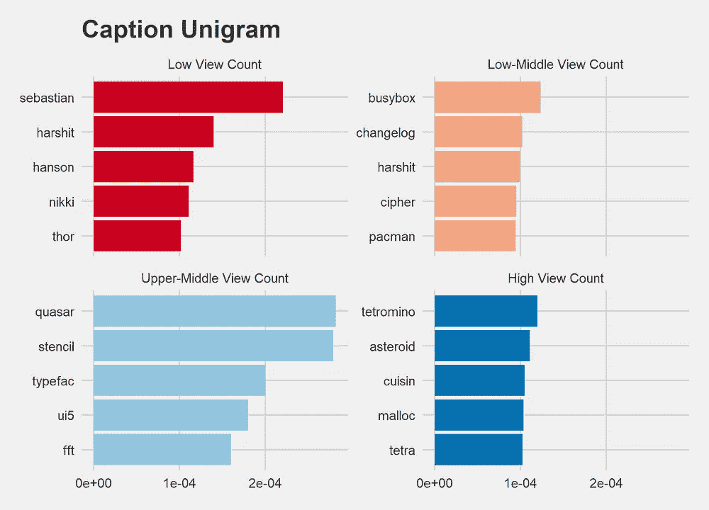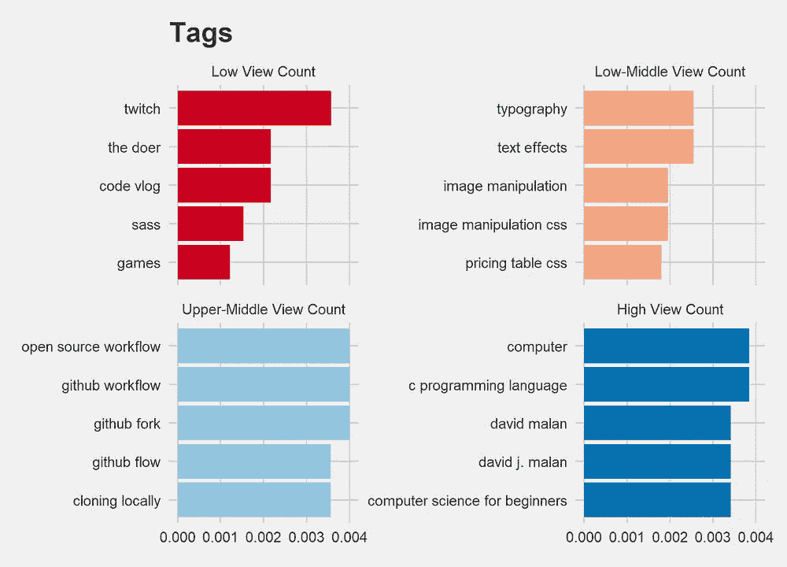

按查看次数分类，TF-IDF 最高的前 5 个词项和标签

这些不清楚的单词集的一个潜在原因可能是影响字幕生成的因素。例如，可能的情况是，教师有很重的口音或在嘈杂的环境中讲话，因此转录准确度降低，并且误识别的术语将最终具有高 TF-IDF，因为它们出现在模式中。幸运的是，我们也有标签数据，这是非常干净和过滤下来。当然，我们应该记住，我们并没有真正意识到这些标签是如何产生的，以及随后它包含了什么样的偏见。看看上面的词，我们可以看到流行视频比其他视频更有可能专注于计算机科学。我们也可以看到大卫·马兰的哈佛 CS50 视频很受欢迎。在中上视图计数类别中，我们可以看到与开源、Git 和 GitHub 相关的短语。中下类别告诉我们，一般来说，关于视觉的视频不是很受欢迎。最后，最低观看计数类别也有点不清楚，但我们可以看到，例如 vlog 和流媒体相关的视频相当不受欢迎。

虽然对结果的解释并不直接，也不可否认是有争议的，但它对我来说非常有趣，所以我很兴奋地重复了这个过程，并查看了几年。通过这种方式，我们可以了解某一年哪些内容是特别的。我们可以看到，例如早期的教程与“篝火”，某种学习平台相关联。我们还可以看到，2019 年哈佛 CS50 视频课程和涵盖 docker 和神经网络的视频是特色。

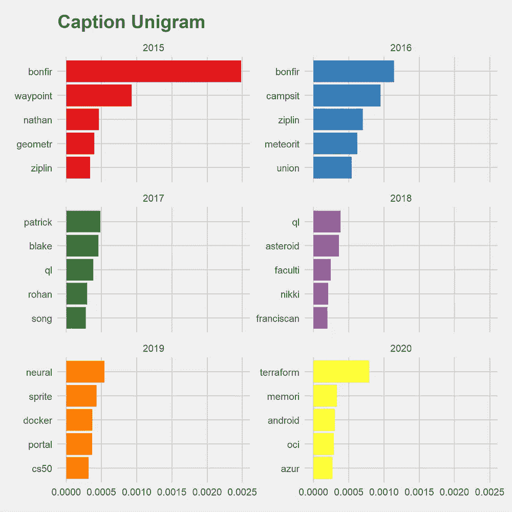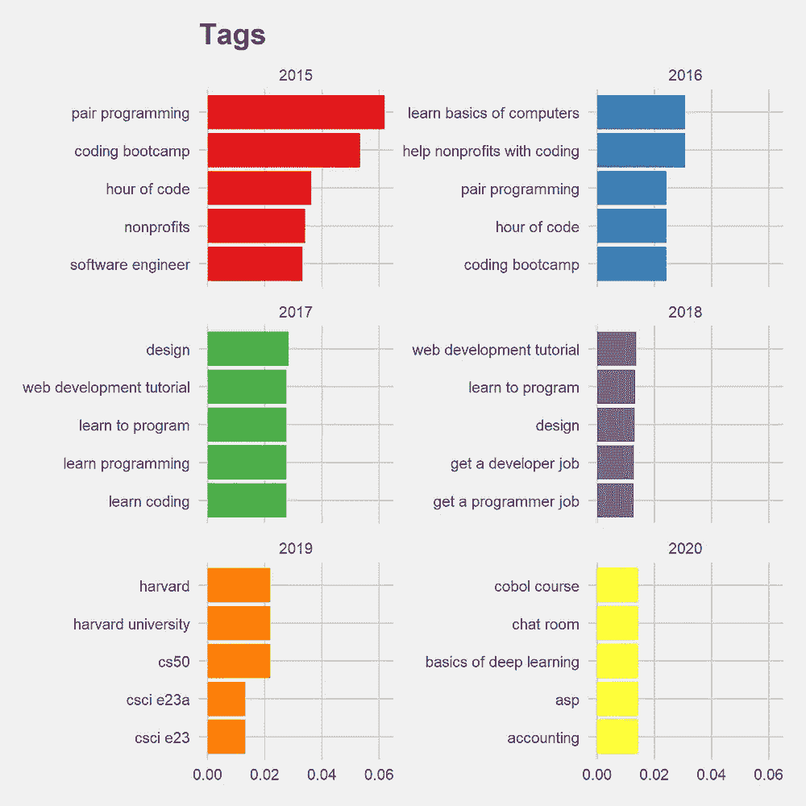

按查看次数分类，TF-IDF 最高的前 5 个词项和标签

# #7 共现术语

除了常用术语和独特的关键字之外，我们可能感兴趣的另一件事是共现术语的概念。我们可以用不同的方式定义共现，但在这里我涵盖了二元模型(相邻词对)和视频中共现的词对。为了查看相邻的单词，我在使用二元语法标记化创建新的文本数据帧后，将共现计数可视化为一个网络。

绘制网络告诉我们一些共同出现的相关术语。一个有趣的观察是，我们可以在数据中看到一些节点的集群以及这些集群之间的一些连接。例如，我们可以看到有许多关于 web 开发和后端开发中使用的单词之间的连接、创建文件和编写函数的集群。我们还可以看到一个与语言相关的集群，连接着“漂亮”、“容易”、“简单”和“酷”等词。

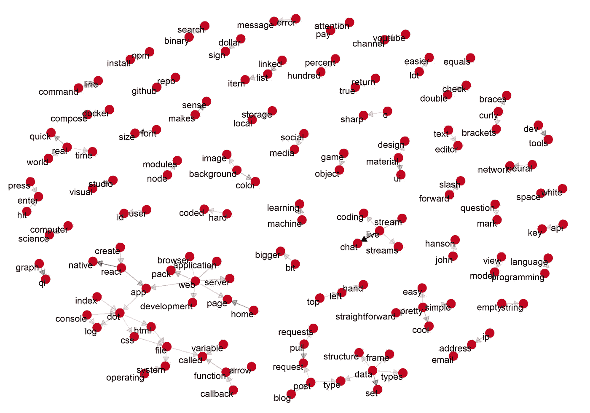

二元词之间成对关联的网络表示

我通过计算给定视频中出现的每个单词之间的成对相关性，得到了更广泛的共现定义。与同现计数相比，这是一个相对测量值，因此它表示成对出现的频率与它们分开出现的频率之比。

为了让它更有趣，我还过滤了成对的词对，其中一个术语是频道上覆盖最广的语言之一(Python、JavaScript、C、CSS)。这给了我们一个概念，什么样的东西与不同的语言相关联。例如，我们可以看到，CSS 与一堆词高度相关，如“Bootstrap”、“template”、“margin”、“div”、“scroll”、“height”和“flex”，如果你对 CSS 有一点了解，这是完全有意义的。有趣的是，我们还可以看到“jquery”、“html”、“page”、“dev”等连接 JavaScript 和 CSS 的节点。Python 似乎与像“语言”、“pip”、“tupl”(tuple)和“numpi”(numpy)这样的词最相关。

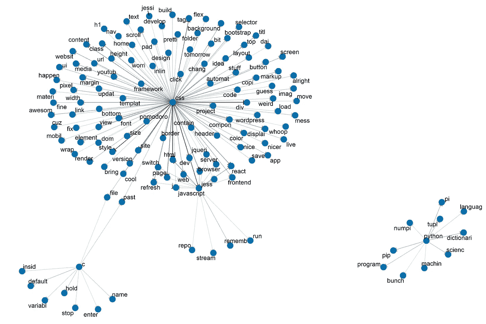

覆盖良好的程序设计语言和其它词项之间成对关系的网络表示

# #8 情感分析(基于词典)

在这一部分，我对视频的标题进行情感分析。我对这种情感分析的渴望是了解更多关于哪些视频具有最积极和最消极的情感，并展示特定领域词汇和消歧的重要性。我使用 AFINN 情感词典来计算视频的情感得分。与之前类似，我将视频标题标记化为每行一个标记的数据帧，使用 AFINN 情感词典进行内部连接，并通过视频对标记的情感值求和。现在，我可以列出 4 个积极和消极情绪最多的视频。

不知何故，看起来游戏开发与相当消极的情绪有关，而前 4 个最积极的视频中有 2 个是针对某种社会事件的。虽然我明白为什么后者可能是这样，但我并不真的相信游戏开发一定是很糟糕的事情，所以我研究了什么样的词对特定视频的总情绪得分影响最大。我用一个词的情感得分乘以出现的次数来衡量情感贡献。

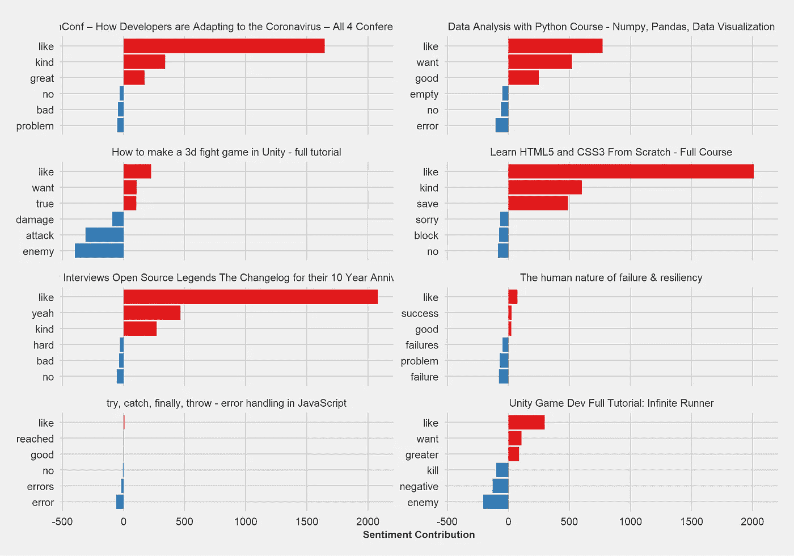

每个视频正面和负面情绪贡献最高的前 3 个词

显然，这里有一些严重的危险信号。例如，我们可以看到，对于游戏开发视频来说，负面贡献词都是游戏开发中使用的领域语言的一部分。因此，像“攻击”、“敌人”和“杀戮”这样的词应该被分配一个中性的情感分数，因为它们只是游戏开发过程中不可或缺的元素。这也是错误处理视频的情况，我们可以看到，情绪主要由术语“错误”决定，因为它是视频内容的中心元素，所以应该被认为是中性的。我们还可以看到，我们赋予 like 这个词很大的价值，这又是一个很成问题的问题，因为 like 这个词可以有几十种意思，其中许多根本不是正面的。在这种情况下，我们需要消除歧义，这就是为什么语境如此重要。这也是为什么一般的文本分析，尤其是情感分析，比连接表格和计算单词要复杂得多，因为我们很容易被愚弄。

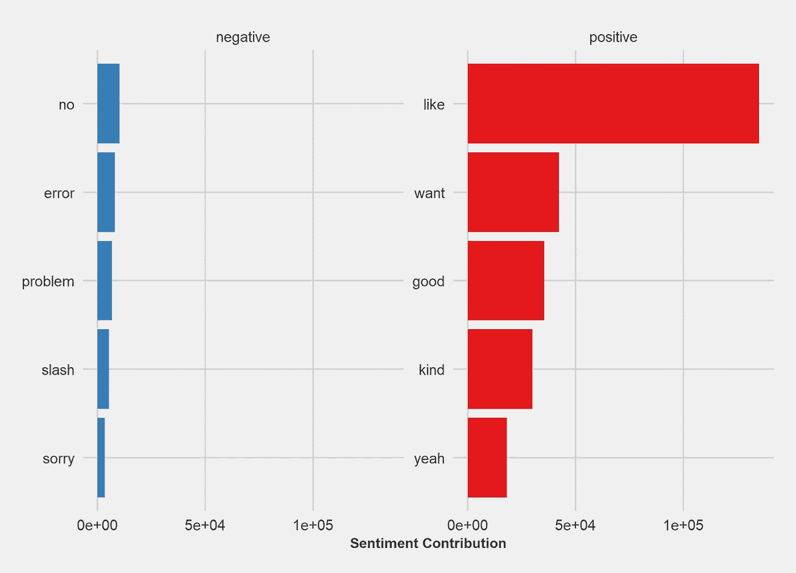

具有最高情感贡献的单词

以进一步阐述 AFINN 词典对该视频字幕数据的可用性。我也看有很高情感贡献但前面有否定的词。正如我们所看到的，大多数具有高情感贡献的词在被否定时都暗示着相反的情感。参见“不好”、“不好”和“没有错误”的例子。然而，也可能发生否定形式变得中性甚至与原义一致的情况。例如，“没关系”也是积极的，而“不喜欢”可以是消极的或完全中立的根据上下文。

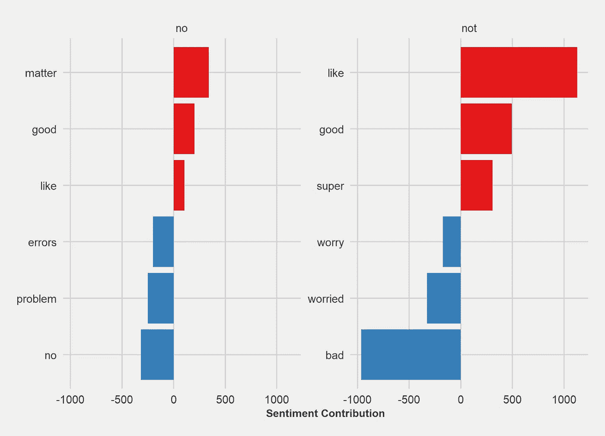

否定词的情感贡献

# #9 主题建模(LDA)

在我的分析的最后一部分，我将谈到主题建模在视频字幕数据中的应用。主题建模的一种方法是 LDA(潜在狄利克雷分配)。这种方法假设每个文档(这里是视频)是主题的混合，而每个主题实际上是单词的组合。使用这种方法，我们可以让主题之间有重叠，并计算每个单词出现在某个`k`主题中的概率。

我对标记化的视频字幕数据运行 LDA，方法是将它转换为文档术语矩阵，然后整理文档术语矩阵，最后将其转换回 tidytext 表以便可视化。使用`beta`值，我们可以发现哪些单词与预定数量的主题最相关。我选择了六个主题，但这完全是临时的。根据图表，我们可以看到，乍看之下，主题并不真正代表技术分类。它只是一组相互关联的单词。

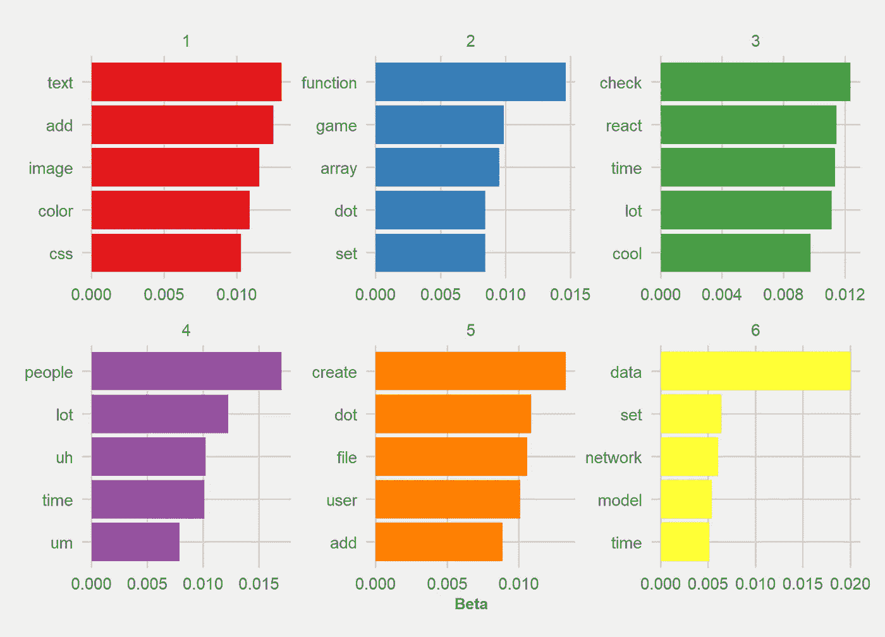

与 LDA 创建的 6 个主题关联度最高的单词

然而，在对我们最确定类别的视频进行分类后，我们可以看到，根据标题，视频确实非常相似。例如，我们将第一个主题分配给了一堆涵盖 web 开发(CSS、HTML、UI 设计)的视频。第二个主题似乎封装了更多关于数据结构和相关数学或编程概念的视频。此外，第三个主题似乎主要包括 Git 和“Jesse 现场编码”视频。第四个主题显然代表了关于运营商发展和社会事件的视频，而第五个主题似乎涵盖了构建 web 应用程序。最后，第六个主题显然是一组教授初级计算机科学的视频。

# #10 摘要

我们在这个分析中涵盖了很多内容。首先，我们看了如何使用简单易用的工具 youtube-dl 下载 YouTube 频道的视频字幕和元数据。然后我们看了视频的一般趋势和特征，让我们在文本分析时有一个背景。之后，我们讨论了文本处理和视频数据特有的细微差别。然后，我们开始分析词频，试图了解频道的概况，以及哪些编程语言覆盖面最广。从那以后，我们继续关注 TF-IDF 值，它向我们展示了哪些关键词和短语对于不同的视频组来说是最有特色的。在 TF-IDF 之后，我们还关注了同现问题。我们将代表二元模型和术语之间成对相关性的网络可视化。我们探究了哪些术语与 Python、JavaScript 或 CSS 等编程语言最相关。接下来，我们谈到了情感分析领域，我们意识到我们应该非常小心地解释结果，并承认文本分析带来的大量复杂性，这是我们在应用基于词典的方法时所忽略的。

作为结束语，我想明确强调的一件事是，在查看这里展示的文本分析结果时，我们应该始终记住，我们的解释并不总是与数据显示的相符。人类在瞬间下意识地进行归纳和简化的能力有时是一种福气，有时对分析的完整性是一个巨大的威胁。