# 使用 Kinesis 数据分析来分析推特的 Kinesis 数据流

> 原文：<https://medium.com/nerd-for-tech/analyzing-kinesis-data-streams-of-tweets-using-kinesis-data-analytics-c59d7a3ef76d?source=collection_archive---------0----------------------->

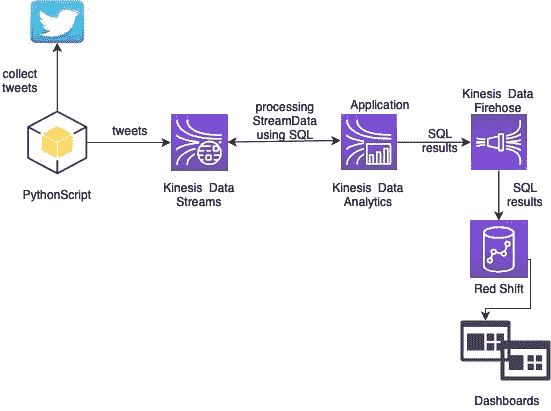

在这篇文章中，我演示了如何将推文收集到 kinesis 数据流中，然后使用 kinesis 数据分析来分析推文。

我遵循的步骤:

1.  创建一个 kinesis 数据流。

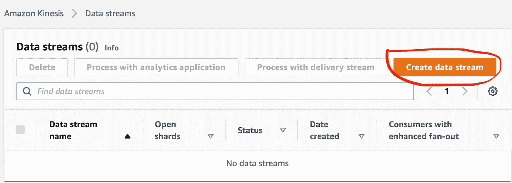

我用一个碎片创建了一个我称之为“twitter”的 kinesis 数据流。

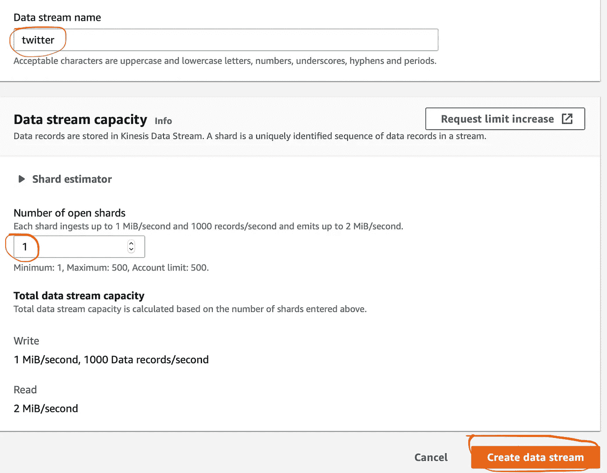

2.准备将收集推文并将其写入 kinesis 数据流的脚本。

我准备了以下 python 脚本，从每条 tweet 中选择 11 个属性，并确保将它们写入我在第一步中创建的“Twitter”kinesis 数据流。我从本地机器上运行脚本，但是您可以在 EC2 实例上运行脚本，甚至可以使用 nohup 来运行脚本，以确保脚本即使在断开 ssh 会话之后也能在后台运行。

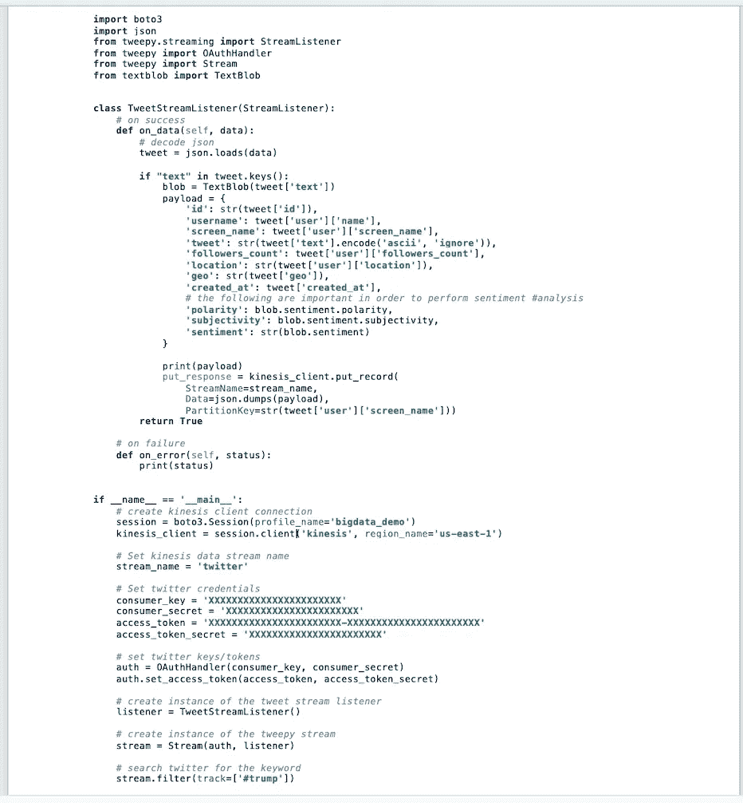

**Python 脚本**

在上面的脚本中，我正在对我的 twitter 证书进行硬编码，这是不推荐的。还有其他更安全的选择，比如使用环境变量或者向脚本传递参数。

3.在 kinesis 数据分析中创建一个应用程序，用于分析 kinesis 数据流中的数据。

我在 kinesis 数据分析中创建了一个应用程序，我称之为“twitter_analysis”。我还选择使用默认选项 SQL 来处理数据，然后单击 create application。

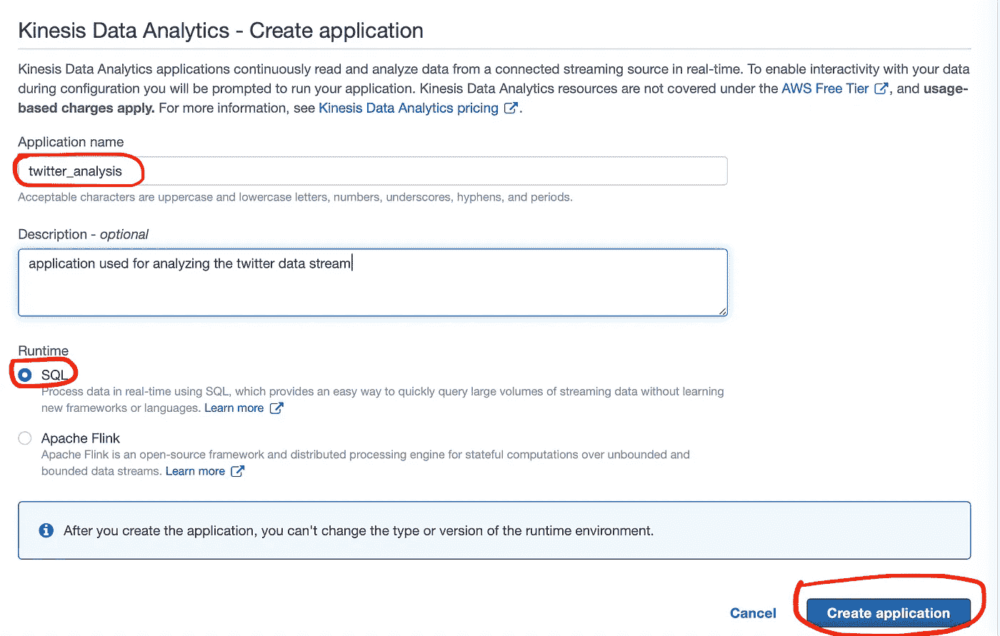

成功创建应用程序后，我单击 connect streaming data 以选择数据流的来源。数据流的源只能是一个流数据源。

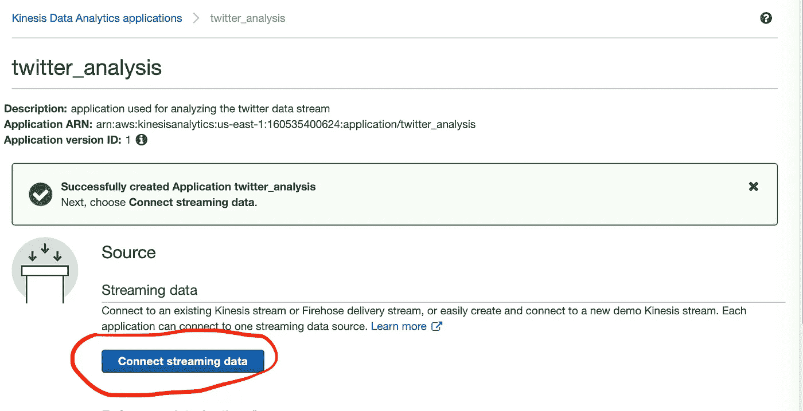

有两个选项，您可以选择之前创建的现有源，也可以配置新的流。

默认为“选择一个源”，我选择了我之前创建的 kinesis 数据流，即“twitter”数据流。

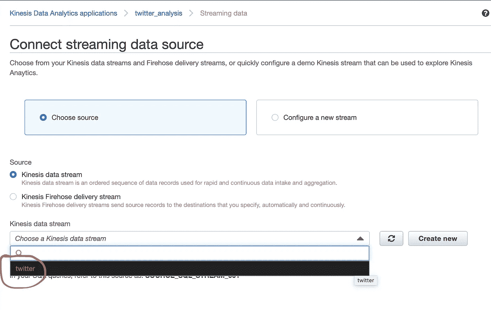

我点击了“发现模式”按钮。

如下所示，模式被成功发现。

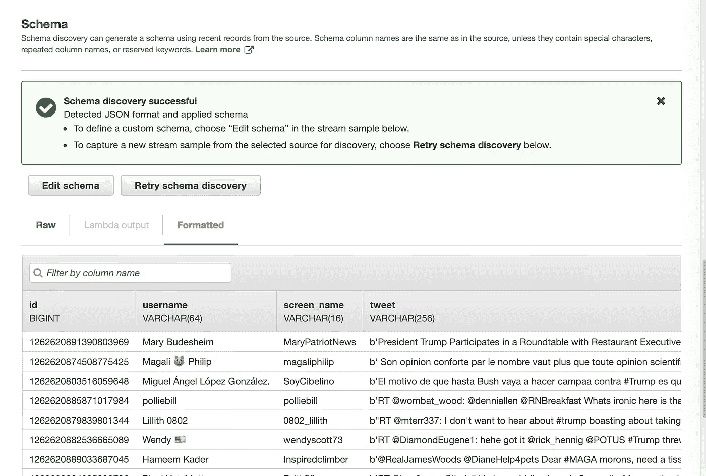

我必须在 SQL 编辑器中使用的“Twitter”kine sis 数据流的名称如下所示，即“SOURCE_SQL_STREAM_001”。

我点击了“转到 SQL 编辑器”按钮。

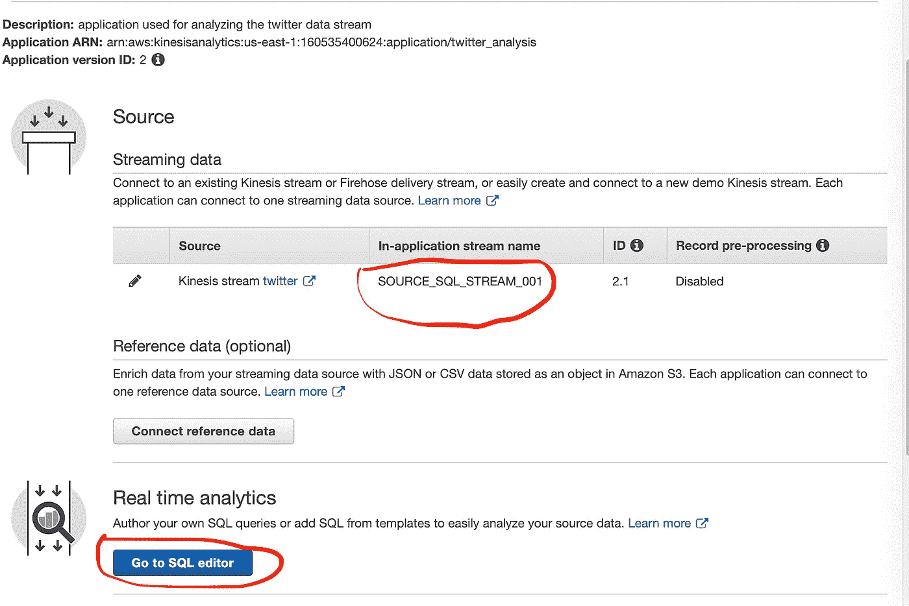

我收到一条消息，要求我开始运行我创建的 kinesis 数据分析应用程序“twitter_analysis”。我选择了“是，开始应用程序”选项。

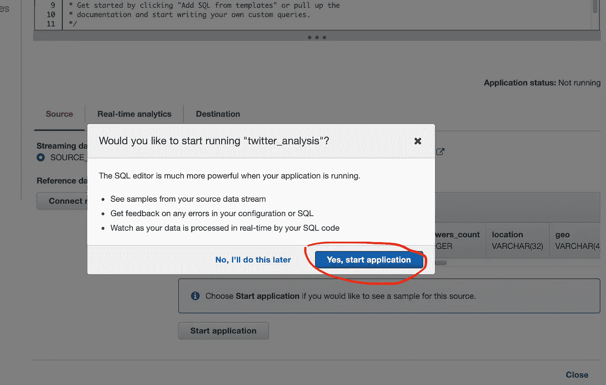

下面显示了来自源 kinesis 数据流“twitter”的流数据的示例，该数据流被称为“SOURCE_SQL_STREAM_001”流。

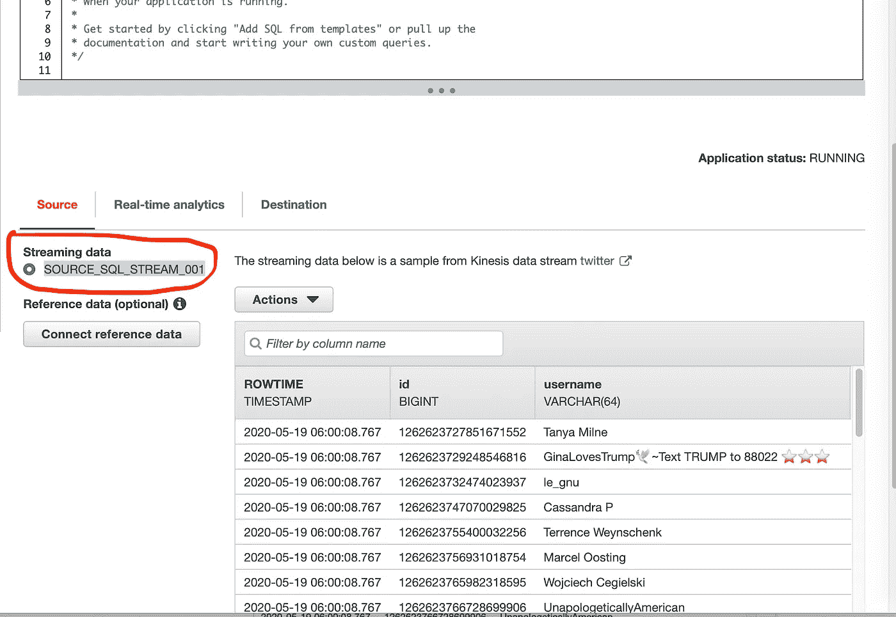

**推特数据流**

第一个选项卡“保存并运行 SQL”将允许您编写 SQL 语句，并在流源数据上运行代码。

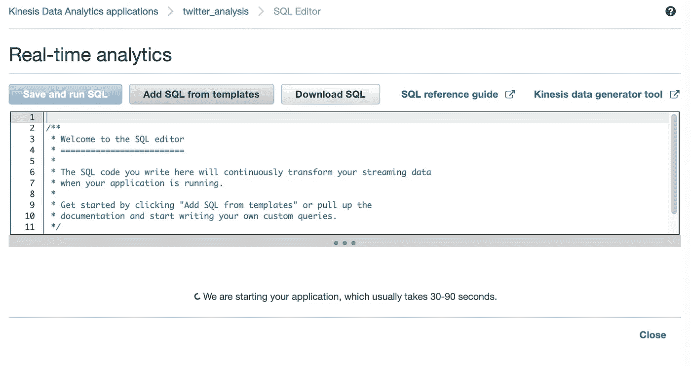

**SQL 编辑器**

当您选择“从模板添加 SQL”选项卡时，将打开以下窗口，该窗口将向您显示一些现成的模板，允许您对流数据执行一些分析，如异常检测。

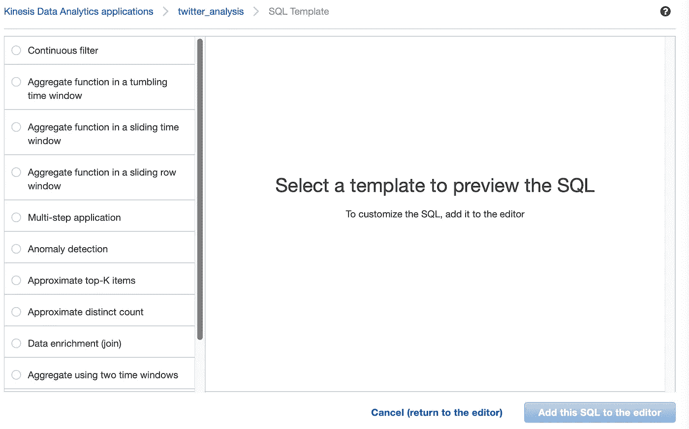

**SQL 模板**

下面，我将展示我在 SQL 编辑器中编写的三个 SQL 语句示例，并点击“保存并运行 SQL”选项卡来显示结果。以下示例只是为了说明如何在 SQL 编辑器中编写 SQL 并显示结果，在清理流数据后，可以对其执行更多有用的查询。

**例 1:**

在下面的例子中，我只选择了 tweets 列。

如您所见，首先我创建了一个流，它将保存我想要的输出，我将这个流称为“TEMP_STREAM”。

然后，我*通过关键字“*创建或替换泵”准备了一个泵*，将从源流“SOURCE_SQL_STREAM_001”中选择的 tweet coulmn 的值插入到输出*流“TEMP_STREAM”中。

**TEMP_STREAM**

下面显示了“TEMP_STREAM”的输出。

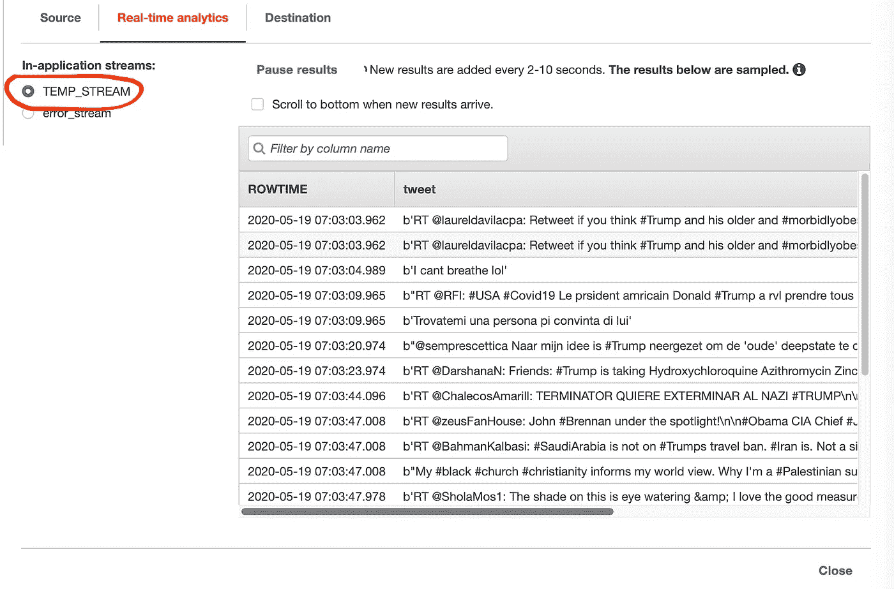

**例 2:**

在下面的例子中，我只选择了带有单词 trump present 的 tweets。

如您所见，首先我创建了一个流，它将保存我想要的输出，我将这个流称为“TEMP_STREAM”。

然后，我*通过关键字“*创建或替换泵”准备了一个泵*,以将 tweet coulmn 的值插入到输出*流“TEMP_STREAM”中，这些值是从包含单词“trump”的源流“SOURCE_SQL_STREAM_001”中选择的。

**温度流**

下面显示了“TEMP_STREAM”的输出。

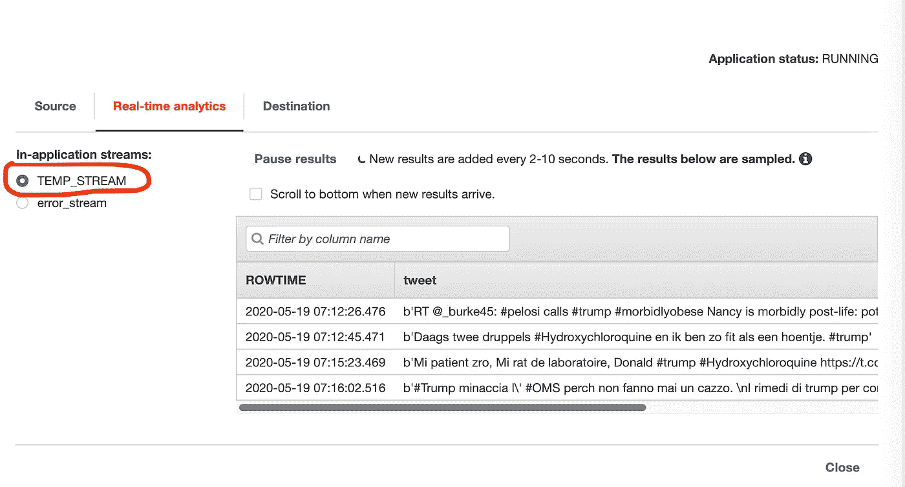

**例 3:**

在下面的例子中，我只选择了有负面情绪的推文。

如您所见，首先我创建了一个流，它将保存我想要的输出，我将这个流称为“TEMP_STREAM”。

然后，我*通过关键字“*创建或替换泵”准备了一个泵*,将从具有负面情绪的源流“SOURCE_SQL_STREAM_001”中选择的 tweet coulmn 的值插入到输出*流“TEMP_STREAM”中。

**温度流**

下面显示了“TEMP_STREAM”的输出，如果有新的结果，它会每 2 到 10 秒更新一次。

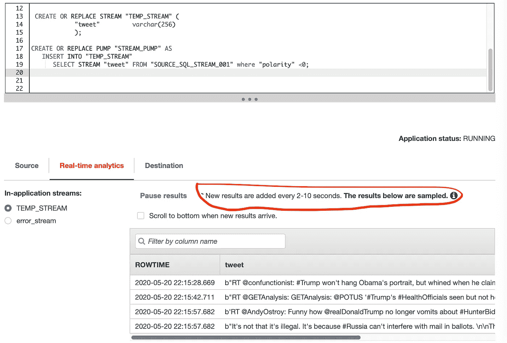

输出流每 2-10 秒更新一次新结果。因此，正如你所看到的，随着时间的推移，新的推文被添加进来，带有负面情绪的推文被添加到源流中。

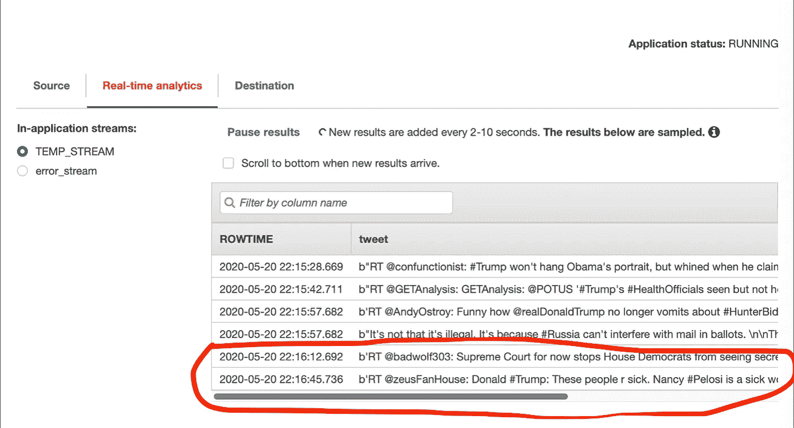

请注意，应用程序内的流(如上面的“TEMP_STREAM ”)可以连接到 Kinesis 流或 Firehose 交付流，以将 SQL 结果连续交付到 AWS 目的地。

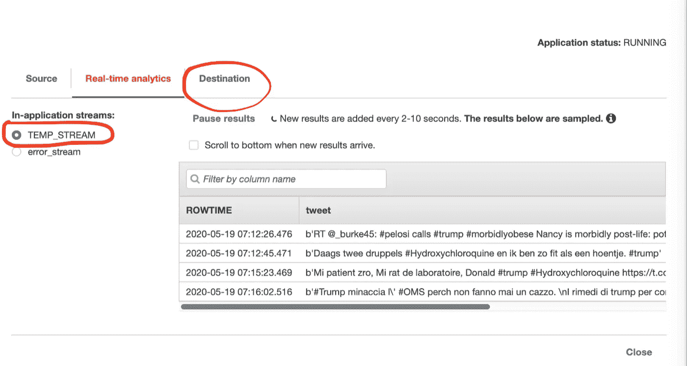

每个应用程序的目的地限制为三个。您可以选择一个现有的目的地或创建一个新的目的地。

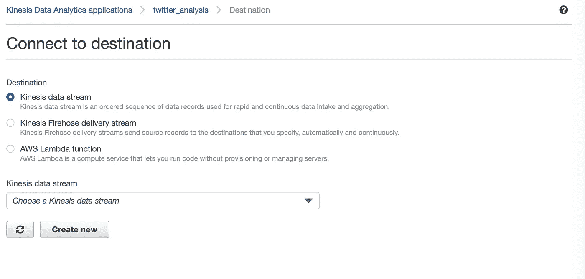

你也可以选择输出格式是 Json 还是 CSV。

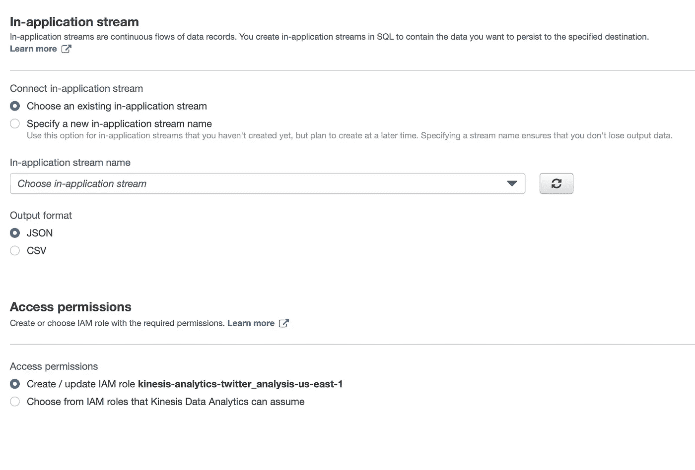

请注意，如果您选择您的目的地是 kinesis firehose，您可以在红移中写入结果，并在超集仪表板上显示结果。