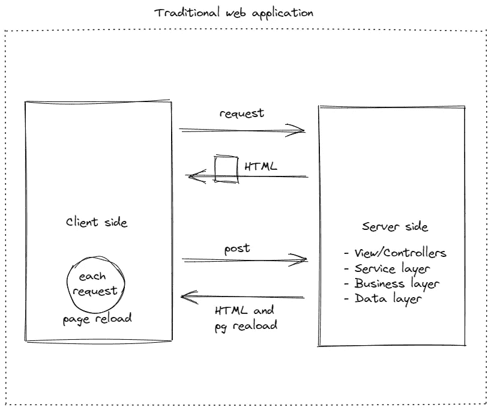
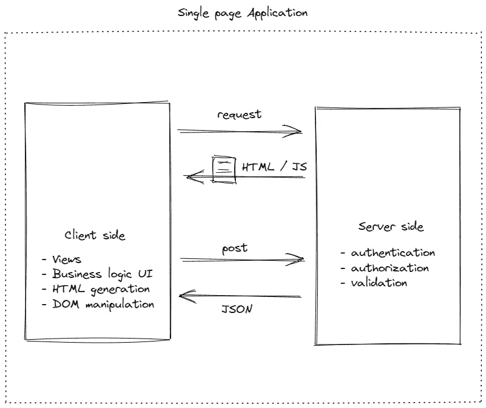
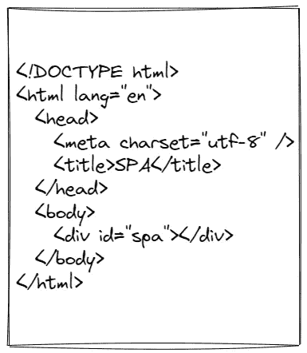
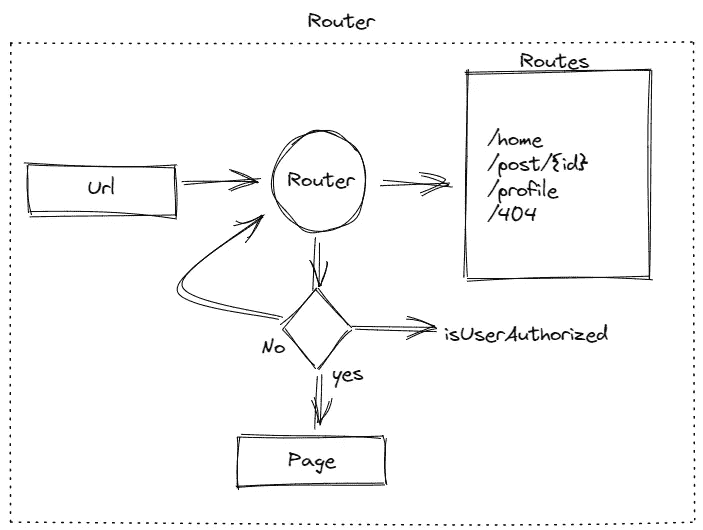

# SPA 剖析(单页应用程序)

> 原文：<https://medium.com/nerd-for-tech/anatomy-of-a-spa-single-page-application-f8b8456543ee?source=collection_archive---------2----------------------->

## 了解水疗中心的幕后运作方式可以让你在时机到来时做出正确的决定…

你好。在本文中，我们将讨论 SPA(单页应用程序),并了解在 JavaScript 和浏览器发展到支持 web 开发新时代之前，网站是如何工作的。这篇文章的主要目标是理解 SPA 的解剖。我将保持这篇文章的高水平，以便让我们理解在可能用于构建 SPA 的框架或库之外发生了什么。虽然本文不是关于如何用 React 或 Angular 实现 SPA，但它们将在这里作为例子被引用。

## 为什么您应该理解框架背后发生的事情？

如今学习一个框架已经不够了，正如你可能知道的，技术变化如此之快，似乎你所学的一切都不够，你无法战胜这场竞赛。这是今天的一个问题，因为当你学习一个像 Angular 这样的框架时，你学习的是如何使用这个框架，而不是它如何在幕后工作。

我想让你花一点时间和我一起思考一下浏览器，如果你不是 web 编程的初学者，你应该知道浏览器在过去几年里几乎没有什么变化。框架和库变化如此之快的主要原因是为了提供更大的灵活性、更高的生产率和最大的安全性，等等…但是请记住，这些库和框架是由 JavaScript 和浏览器的特性构成的。因此，了解 SPA 在幕后是如何工作的，可以让您在选择下一个框架或库来开始新项目时做出正确的决定。

## 传统 web 应用程序

在我们深入 SPA 之前，我们必须了解 web 应用程序以前是如何工作的。让我们来看看在传统的 web 应用程序/页面中视图是如何构建的。

传统 Web 应用程序

正如您所看到的，在第一次请求中，您收到了一个 HTML 页面，这看起来还可以，但是如果您再看一看，并且如果您是一个初学 web 开发的人，这可能看起来很奇怪，因为您发出的每个获取新“数据”的请求都会收到一个 HTML 页面作为响应。正如您所料，对于每个请求，您都必须刷新整个页面，这可能会导致像闪白这样的问题，因此，您的网站可能会很慢，并赶走用户，因为您必须等到重绘完成。

当异步开始在网页设计中传播时，有可能使用 AJAX 和 JavaScript 来动态更新 DOM(文档对象模型)，但是这个过程变得更加困难和复杂。

*我们来列举一下传统 web 应用/页面的优缺点:*

**优点:**

*   对搜索引擎有好处；
*   简单的应用程序；
*   只读。

**缺点:**

*   整页重新加载；
*   对于每个需要新数据的交互，都需要向服务器请求获取 HTML
*   内容不会被重复使用；
*   维护起来并不容易。

## 什么是 SPA？

简单来说，SPA(单页应用)是一个在使用过程中不会刷新你的页面的 web 应用。Spa 向用户提供了高体验，这种体验可以与桌面应用程序相媲美。选择 SPA 来开发你的项目的一个主要优势是因为它不需要客户端的插件，你可以只用 HTML，JS 和 CSS 来构建你的项目。让我们来看看水疗中心背后的设计。

单页应用程序

在上图中，您可以看到，除非您需要获取一些数据，否则不再需要服务器，但是在构建视图的过程中，客户端就足够了。SPA 设计可行的主要原因是 XMLHttpRequest，它允许请求一段数据。在这种情况下，我们应该考虑到，对于客户端来说，您在服务器端使用什么样的技术并不重要，因为您的 API 提供了客户端所期望的东西。

需要提醒您的是，当您选择 SPA 而不是传统的 web 应用程序时，您的堆栈、实践和结构将会完全不同，因为在 SPA 中，对服务器的唯一响应是提供数据服务。

## 客户端发生了什么？

现在，您已经简要了解了什么是 SPA 以及 SPA 与传统 web 应用程序之间的区别。是时候了解客户端如何处理视图和业务逻辑了。正如你已经知道的，当需要改变客户端的某些东西时，传统 web 的工作方式并不神秘，但是在 SPA 中，事情开始变得更有趣了。让我们仔细看看它是如何工作的。

文件— HTML

HTML 文件是您第一次向服务器发出请求时加载的初始 HTML。如果你看一下这个文件，只有一个空的**<*div/>****和一个 ***ID*** 。这是您的应用程序启动 web 应用程序和防止页面在需要出现或替换新内容时完全刷新所需的最低要求。*

*如果你还记得传统网络应用相对于 SPA 的优势之一是搜索引擎，我认为你很清楚为什么 SPA 不适合搜索引擎，你最初的 HTML 并没有说明你的网站。如果你正在建立一个网站，要求对搜索引擎有好处，你应该考虑这是水疗中心的问题。*

## *书页在哪里？*

*关于页面，我们将只看到处理路由所需的部分机制。在使用网站的过程中，您可能会使用工具栏的 URL 来键入地址或更改网站的位置，在传统网站中，当发送新的 URL 或使用按钮在历史记录中导航时，您会收到一个 HTML 页面作为响应。在 SPA 中，仍然可以导航这些功能。*

**

*路由器*

*如上所述，路由器位于中间，作为匹配路由路径的中介。你可能会问“如果用户试图进入一个他不被允许的页面会发生什么？”在这种情况下，可以验证内存中的实际状态，以证明用户是否被允许，如果他不被允许，您可以移动他。也许用户尝试了一个无效的路径，在这种情况下，您可以配置将他移动到一个特定的路由。*

*使用 HTML5 历史 API，可以使用浏览器的历史返回到另一个页面，而无需刷新整个页面，这是两个方法 pushState 和 replaceState，请注意，旧浏览器不提供支持。*

# *结论*

*正如你可能看到的，学习和理解一个 SPA 是非常复杂的。需要提醒您的是，SPA 是使用模块来组织的，这样不会导致变量崩溃，也不会阻碍用户与服务器的异步通信。使用 SPA 的主要原因是交付具有桌面应用程序体验的应用程序，并提高您的工作效率。*