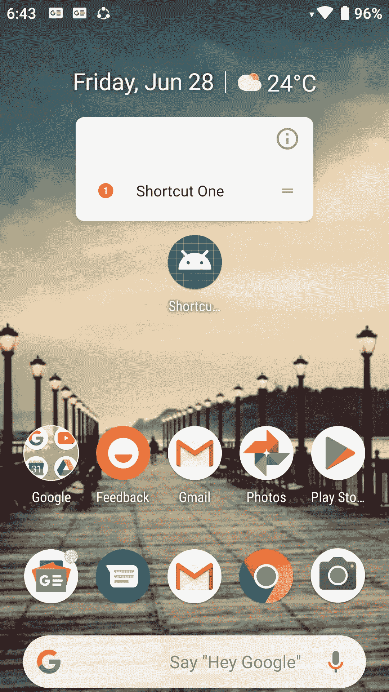

# Android 动态快捷键。

> 原文：<https://medium.com/nerd-for-tech/android-dynamic-shortcuts-dccb8cc4162?source=collection_archive---------3----------------------->

Android 快捷方式是在 Android 7.1 中引入的，Api 级别 25 及更高。我们可以通过长按应用程序启动器图标来查看可用的应用程序快捷方式。应用程序快捷方式的主要目的是直接立即跳转到应用程序内容屏幕，而无需在所有层级中移动。直接查看我们需要的内容变得更加容易，而不是经历从应用程序闪屏到所需目的地的所有流程。

有两种类型的快捷方式可以用于我们的应用程序。

1.  **静态快捷方式**:这些是静态的快捷方式，运行时不能更改或修改。它们在应用程序清单中声明，并为其创建单独的快捷菜单 XML。
2.  **动态快捷方式**:这些快捷方式是在运行时使用 Java 和 ShortcutManager Api 手动添加和删除的。这些快捷方式可以在应用程序的不同使用之间改变，甚至可以在应用程序运行时改变

本文的主要目的是熟悉使用**快捷方式管理器** Api 添加和删除动态快捷方式运行时的基本用法。

我已经创建了一个演示应用程序，它将演示，

1.  如何创建动态快捷方式？
2.  如何在快捷方式点击时打开特定的目的地？
3.  如何将新的快捷方式添加到以前创建的快捷方式列表中。

出于演示的目的，我在 FragmentOne 上添加了两个按钮。按钮 1 单击创建快捷方式一，按钮 2 单击创建快捷方式二。

要创建快捷方式，我们需要检查应用程序版本是否高于 Android 7.1。**快捷方式管理器** & **快捷方式信息**用于创建快捷方式。创建快捷方式需要的主要参数是 **shortLabel、longLabel、icon 和 action。**

为了处理目的地，在用户点击快捷方式后，我们需要从意图获得行动，并基于此，我们需要打开应用程序的特定屏幕。创建快捷方式时，请不要忘记**设置意图**中的**设置操作**。

可能会有这样一种情况，我们希望将新快捷方式动态添加到以前添加的快捷方式列表中。为此，我们需要检查是否已经添加了任何快捷方式，并将当前快捷方式添加到列表中。

这里有完整的源代码供您参考。

 [## SatyamGondhale/short cute 示例

### 关于在 Android 中创建和删除动态快捷方式的教程-SatyamGondhale/shortcute example

github.com](https://github.com/SatyamGondhale/ShortcutExample.git) 

比你强。请随意分享你的想法和掌声。

 [## 随时了解最新内容。

### 随时了解最新内容。注册后，如果您还没有中型帐户，您将创建一个。回顾…

gondhalesatyam-28082.medium.com](https://gondhalesatyam-28082.medium.com/subscribe)