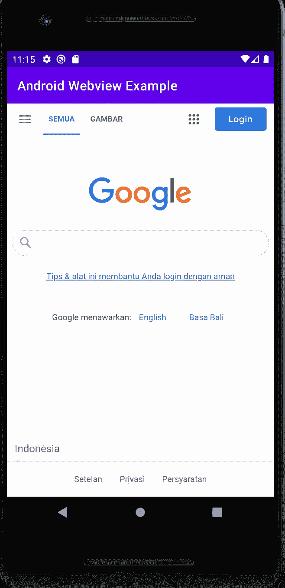

# Android 的 WebView 常见挑战及其解决方案

> 原文：<https://medium.com/nerd-for-tech/androids-webview-common-challenges-and-it-s-solution-part-1-9b970b95a482?source=collection_archive---------1----------------------->

丹尼尔·罗梅罗在 [Unsplash](https://unsplash.com?utm_source=medium&utm_medium=referral) 拍摄的照片

在 Android 开发中，我们经常会遇到一个网页被加载到我们的应用程序中，并在应用程序中的嵌入式网页和原生页面之间进行交互。这是由谷歌团队使用 Android 的`WebView`实现的。根据谷歌在 Android 开发者文档中的说法，`WebView`类是 Android 的`[View](https://developer.android.com/reference/android/view/View)`类的扩展，允许你将网页显示为活动布局的一部分。所以基本上你可以在一个 XML 布局中包含`WebView`布局，然后加载一个 URL 显示给用户。

XML 格式的 Webview

在 MainActivity.kt 中加载 URL

结果

公平地说，使用`WebView`非常简单，但是 Android 的`WebView`可能会比我们之前想象的更加复杂。在以下情况下，事情可能会变得更加复杂:

1.  当`WebView`开始加载一个 URL 时，显示闪烁的加载或加载对话框，直到它完成加载网页。
2.  如果本地应用程序支持从`WebView`重定向的任何 URL，则重定向到本地页面。
3.  `WebView’s`崩溃时的错误处理。

现在，我们将在 Android 中使用`WebView`解决上述常见挑战。为了能够应对这些挑战，我们可能需要使用由`WebView`提供的`WebViewClient`。`WebViewClient` 基本上是一个类，它使得任何`WebView’s`回调都有可能让我们覆盖或监听`WebView`行为。这些常见的挑战可以通过使用`WebViewClient`来解决。我们需要做的第一件事是创建一个`WebViewClient`并将其设置到我们的`WebView`中。

下面是代码片段。

Webview 中的 WebviewClient

正如我们在这里看到的，`WebViewClient`给了我们很多选项来处理来自`WebView`的回调。正如我在上面分享的，这些方法中的一些将会解决我们遇到的一些挑战。但在开始之前，我要解释一下代码中的一些方法及其用法:

1.  `onPageStarted`方法是在`WebView`开始加载网页期间触发的回调方法。我们可以使用这个回调来开始闪烁或任何本地加载行为来告诉用户等待，直到网页完成加载。
2.  `onPageFinished`方法与`onPageStarted`用法相反。此方法在`WebView`完成加载时触发。如前所述，我们在`onPageStarted`开始加载，然后我们可以在这里忽略闪烁或其他加载。`onPageStarted`和`onPageFinished`方法对于我们处理本地加载行为非常有用，这样用户就不需要在等待页面加载时看到空白的加载页面。
3.  `shouldOverrideUrlLoading`方法是当`WebView`试图加载 URL 时从`WebView`触发的回调方法。有时当`WebView`重定向到另一个网页时会发生这种情况。这里是关于`shouldOverrideUrlLoading`的伟大之处，正如你所看到的，这个方法期望我们返回一个`Boolean`。一个`Boolean`返回类型给了我们一个权限，允许或取消在我们的`WebView`中加载另一个 URL。为了允许加载 URL，我们可以返回 true 或其他值。该方法主要用于检查 URL 是否支持在本地页面中打开，如果支持，我们可以启动一个新活动并在`shouldOverrideUrlLoading`方法中返回`true`。这种方法肯定可以用来解决从`WebView`加载本地页面支持的 URL 时打开本地页面的需求。
4.  `onReceivedHttpError`方法帮助我们在有任何 API 或资源错误时接收回调，特别是≥ 400 HTTP 状态代码。我们在这里可以使用的用例是显示或处理任何本机错误处理，如显示 toast 来告诉用户网页中有错误，并期望他们刷新或任何其他错误处理。
5.  `onRenderProcessGone`方法通知我们`WebView`的渲染进程已经退出，这意味着`WebView`应该被有计划地处理和清理，因为我们不能在崩溃的`WebView`中加载任何 URL。我们可以关闭`WebView’s`活动并告诉用户重新打开它，或者我们从视图层次结构中移除`WebView`类并以编程方式重新添加它以继续使用`WebView`。我们应该注意的一点是，`WebView`引擎可以在多个活动中共享，因此`onRenderProcessGone`可以在托管这些共享的`WebView`引擎的多个活动中被调用，而`onRenderProcessGone`方法仅在 Android 的 API 26 及以上版本中可用。`onRenderProcessGone`方法使我们能够优雅地处理`WebView`中的`WebView`崩溃。

我们已经演练了一些可以在`WebViewClient`使用的方法。让我们看看常见的挑战，并尝试使用我们从`WebViewClient`功能中获得的知识来解决这些挑战。

1.  当`WebView`开始加载 URL 时显示闪烁或加载对话框，直到完成网页加载。

为了解决这个挑战，我们可以使用`WebViewClient`中的`onPageStarted`和`onPageFinished`方法作为触发器，在每次页面加载时显示加载和隐藏加载。我们还可以使用这个回调来跟踪`WebView`完全加载页面需要多长时间。

2.如果有任何从本地应用程序支持的`WebView`重定向的 URL，重定向到本地页面。

为了检测和拦截来自`WebView`的任何重定向，我们可以使用`shouldOverrideUrlLoading`，如果支持重定向到原生页面，则返回 true，以便`WebView`停止网页中的 URL 重定向并停留在当前页面。

3.`WebView’s`崩溃时的错误处理。

发动机可能死机是常有的事。当`WebView`崩溃时，它会将崩溃传播到应用程序，并停止应用程序运行，导致用户体验不佳。为了优雅地处理这个崩溃，我们可以使用`onRenderProcessGone`来监听`WebView’s`渲染崩溃事件并重新创建`WebView`。

这就是 Android 的 WebView 中的常见挑战。请继续关注我的下一篇关于`WebView`的文章，它将讨论使用`JavascriptInterface`和`evaluateJavascript`在 Web 应用和 Android 的`WebView`之间传递数据和交互。谢谢你。