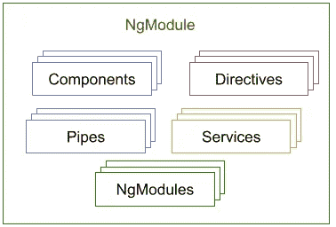
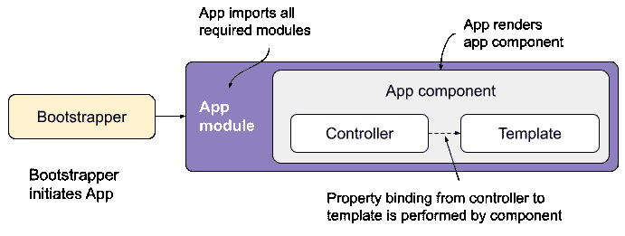
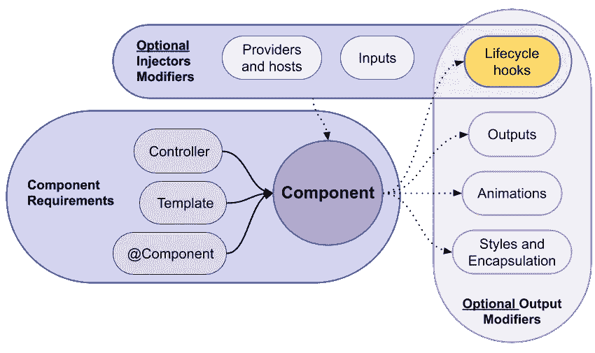
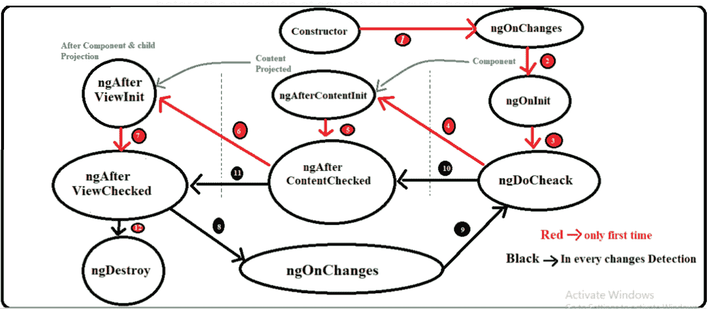
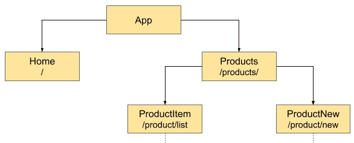

# 角度解剖学

> 原文：<https://medium.com/nerd-for-tech/angular-8dca6c0e6af6?source=collection_archive---------17----------------------->

Angular framework 已经成熟，与 Vue.js 和 reactive.js 等其他竞争对手相比，它提供了非常重要的功能。就我个人而言，代码的分离是我喜欢的，大多数情况下，我不喜欢使用混合 CSS、HTML 和 js 代码的库，即使它们可以在某些领域提供更好的性能。Angular 的组件构造良好，易于维护。由于其特性，它实际上是复杂应用程序的良好候选。如果你计划创建一个简单的网站，由于漫长的学习曲线，angular 可能会很麻烦。然而，其坚固的结构也可以成为未来发展的优势。

在本教程中，我的意图是给出一条理解如何使用 angular 框架元素的途径，以及它们是如何开始和交互的。由于框架本身非常庞大，我将在后续教程中逐步解释。

**角度基础知识**

Angular framework 是为创建由 HTML 和 TypeScript 语言组成的单页应用程序而设计的。它完全是用 TypeScript 编写的，并作为一组 TypeScript 库提供其功能。该框架由几个为特定角色和功能而设计的实体组成:

角度元素

*   **模块**有助于更好地组织依赖关系。angular 应用程序的核心概念是模块化和可重用，以实现独立的组件。这减少了开发时间，也使维护变得容易。
*   **组件**旨在创建应用程序的结构和逻辑。
*   指令改变元素的结构，赋予它们新的特性并改变行为
*   **Pipes** 表示在数据呈现之前对其进行整形的函数
*   **服务**是完成任务的对象，例如访问数据库或其他服务中的数据，它们是可以为所有相关组件提供服务的公共对象。

我们将在下面详细介绍所有这些实体。

**angular 如何开始渲染一个 app？**

应用程序引导过程启动渲染过程，下图说明了在此过程中起关键作用的所有重要部分。

一个 Angular 应用程序的引导捕捉过程(灵感来自 [Angular in Action](https://www.oreilly.com/library/view/angular-in-action/9781617293313/) )

在所有应用程序初始化之前，Angular CLI 通过 webpack 构建并编译所有的 Javascript 代码，并将它们附加到 index.html 中。一旦网页，index.html，被调用，引导程序被启动，以启动 Angular。每当 Angular 启动时，都会加载 App 模块并读取所有依赖项。接下来是作为应用程序根的应用程序组件的呈现。如果 App 组件是一个组件树，那么所有其他组件也会被呈现。同时，建立控制器和模板之间的绑定。最后，呈现代码的所有部分。

除了加载过程之外，应用程序的生命周期始于用户的交互，例如从一个组件切换到另一个组件、它们的加载和呈现过程等。

**组件和模板**

角度组件是形成应用程序界面数据结构的一种方式。HTML 模板是 HTML 符号的扩展版本，它与一个组件相连，使该组件能够在网页中显示数据。从这个意义上说，我们可以在 android 应用程序的视图中看到组件和模板的共同使用。组件和模板之间的数据路径是通过所谓的数据绑定或属性绑定来建立的。组件中的控制器元素嵌入在 HTML 页面中，数据的任何变化都会直接反映到 HTML 页面中。此外，用户的输入也可以绑定到组件，输入的文本可以直接映射到控制器中的元素。为了提高 HTML 元素的可用性，还可以使用指令来实现模板中的逻辑，特别是这可以用于不发送到数据库的数据。

组件及其与其他元素的“必须”和可选关系可以在下图中描述。所有这些元素，比如模板、指令、特定于角度的控制器，都被转换成 HTML 元素。

角度组件及其与其他组件的关系受[角度在起作用](https://www.oreilly.com/library/view/angular-in-action/9781617293313/)

我们将组件中的项目分为“必须的”和“可选的”。必备组件是必须可用的必要项目。根据期望的功能或特征，可能需要可选的组件。下面给出了它们的描述以及它们在典型角度应用中的样子:

**组件要求**

@Component 用作装饰器，用于在 angular 框架内定义一个组件，并将其注册到 Angular。控制器对应于组件所需的类，它继承了该组件的所有参数和方法。从与用户交互到从角度服务中检索数据的组件逻辑都是在这个类下操作的。模板是涉及指令和 HTML 元素的地方，控制器启用与这些 HTML 元素的交互，处理数据并在需要时与其他平台通信。最后一个功能也可以通过角度服务来执行。

在下图中，component decorator 将模板 URL 表示为 HTML 文件，selector 是组件的名称，它可以用作上层组件中的 HTML 标记，而 styleURLs 表示将应用于该组件的样式表文件的数组。这里的控制器是类“ProductComponent ”,在与模板交互时接管全部功能。

组件代码和[组件可视化](https://ng-girls.gitbook.io/todo-list-tutorial/workshop-todo-list/component)

**输入和提供者和主持人**

@Input decorator 用于将数据(属性绑定)从父组件传递到子组件。组件属性应该用@Input decorator 进行注释，以充当输入属性。例如，这个[页面](https://www.c-sharpcorner.com/article/input-and-output-decorator-in-angular/)给出了输入使用的详细视图。

提供者和宿主是可以提供给组件的服务。如果 HTTP 通信或公共数据处理操作可以通过提供者执行，因为它们也可以被其他服务消费。这里的主要思想是将公共功能推送到一个服务下，并允许多个服务使用它们。此外，诸如异步执行的后台操作也可以通过服务来执行。提供者和主机可以作为服务注入到一个组件中，如果它在应用程序启动期间还没有被加载。开发人员应该考虑服务注入，以减少浏览器的内存使用，并创建更高效的单页面应用程序。

**生命周期挂钩、样式和封装、动画和输出**

Styles 表示应用于组件的 CSS 样式文件。由于每种组件风格都可以单独设计，这就带来了组件设计的隔离或封装。应用程序中何时涉及样式由组件管理。

动画也是一种面向设计的视图，通过应用程序中涉及的库向组件提供动画能力。

输出可以被视为其他组件之间的数据交换或共享点。它被定义为一个属性，并绑定到其他组件可能感兴趣的事件。

一个组件的生命周期可以依赖于各种挂钩，这些挂钩将组件置于不同的状态。生命周期支持更结构化的组件，并定义在哪个钩子上做什么。当预期的情况实现时，这可能是非常重要的，并且在这个阶段必须执行一些事情。例如组件的初始化和关闭、更改等。控制器中用于确保该功能的方法可以是例如 OnInit、OnChanges、OnDestroy 等

[角度生命周期](https://nalawadeshivani98.medium.com/angular-lifecycle-d34c57bf147)

**服务**

服务用于提供可由组件或其他服务共同使用的功能。一些典型的例子可以是登录操作或与处理用户输入数据的后端服务通信，或简单的天气服务，或通过服务在控制器之间共享数据，等等。可以很好地增加服务实例的数量。这里的关键点是要弄清楚要定义的服务对于所有其他组件来说是足够通用的，而不是特定于控制器的。

服务可以在应用中用于不同的目的，并且基于此，可以定义不同的服务角色:I)可注入服务与角度依赖注入机制一起工作，并且这些服务可以被注入到组件中。iii)助手服务定义组件的公共功能或简化控制器中的请求任务。iv)数据服务可以负责在组件之间共享数据。

**路由**

网页大多由不止一个页面组成，通过点击链接，我们可以从一个页面切换到另一个页面。由于 Angular framework 建立在单页面应用程序上，它创建了一个“路由”概念，使我们能够在不同的视图或内容之间导航。Angular 用一个专用的路由库来解决路由问题，生成简单和复杂的导航模式。在它的帮助下，我们可以自己定义路线，并在视图之间切换。下图向我们展示了一个由单个模块和多个嵌套组件组成的简单路由示例。在这种情况下，从一个组件到另一个组件的过渡例如即将到家是可能的。根据应用程序的复杂性，在视图之间导航时，模块也可以进行切换。

角度路由

上图显示了简单的路由可视化。要详细了解角度路由，我强烈推荐阅读以下链接， [link1](https://vsavkin.com/angular-2-router-d9e30599f9ea) 和 [link2](/angular-in-depth/angular-router-series-pillar-2-navigation-d050286bf4fa) ，它们用示例描述了路由:

**指令和管道**

指令是更改圆顶元素和角度组件的外观或行为的类。@Directive decorator 用于定义角度指令。它与组件有着巨大的相似性，因此我们可以说组件可以是指令的扩展版本。在 angular 应用程序的渲染过程中，DOM 会根据指令中的定义进行调整。该指令可以用作 HTML 标记的属性。

Angular 的框架支持大量的指令和管道，减少了代码重复，提高了效率。ngFor 和 ngIf 是广泛使用的指令。第一个可以接收一个列表，并根据请求的视图将它呈现为 HTML 元素，而第二个在某些条件发生时执行定义的规则。除此之外，特别是数据操作，如从一种货币值转换到另一种货币值，或者减少位数，格式化值等。

一般来说，内置的指令和管道对于应用程序来说可能已经足够了，但是，如果您需要一个将在大多数视图中使用的特殊元素，那么创建一个管道或指令来简化开发过程是有意义的。自定义指令有两种方法:I)第一种方法修改组件的行为，ii)第二种方法定义如何将元素添加到页面中。为了根据定制要求格式化数据，可以实现定制管道。由于定义良好的小代码块，指令和管道可以将代码变成更易于维护和重用的形式。

在这个[链接](/@venkateshece1105/concepts-of-angular-directives-527ae0ca5995)中可以看到指令的简单用法。