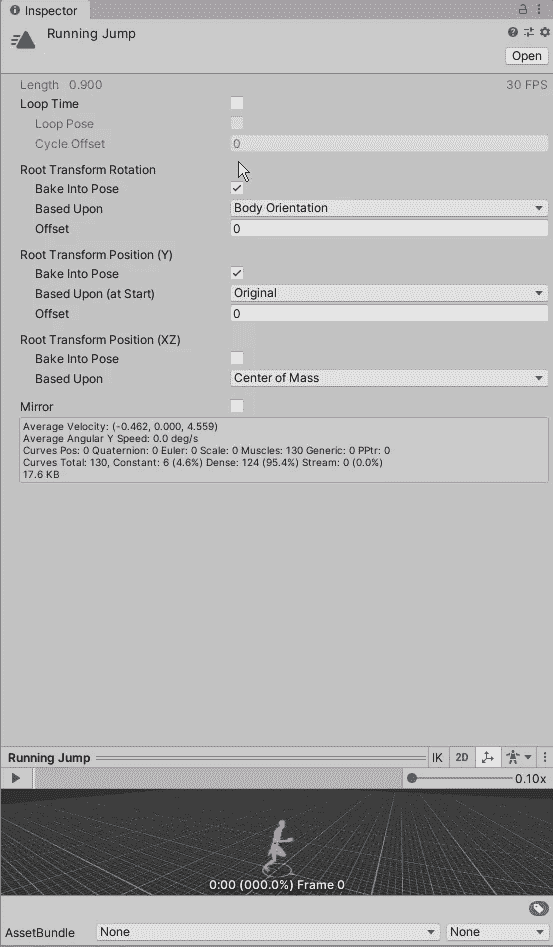
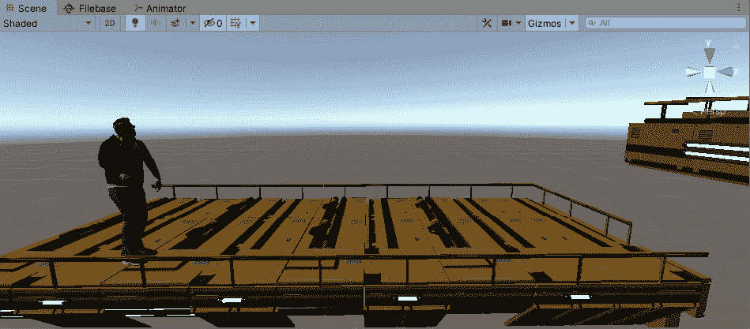
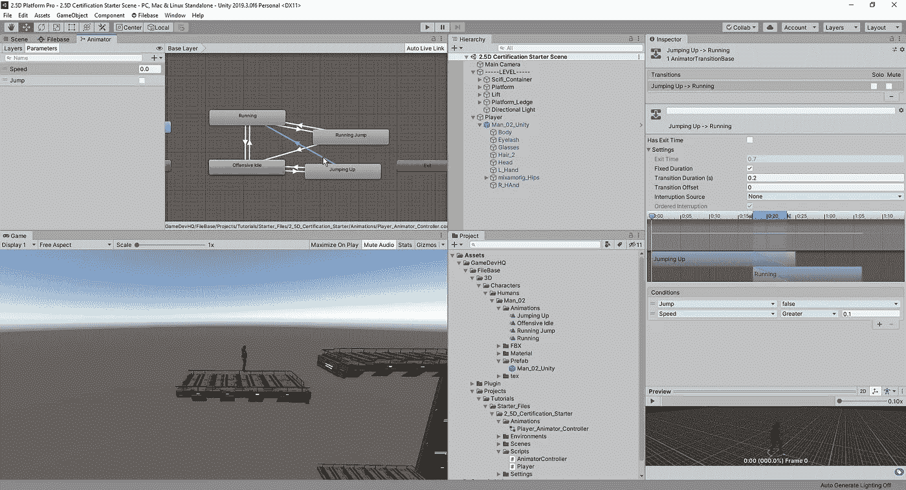
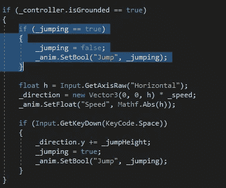
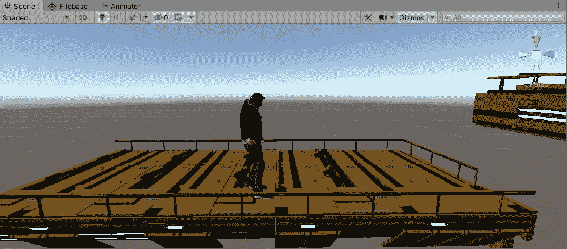
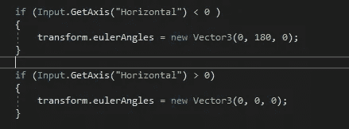
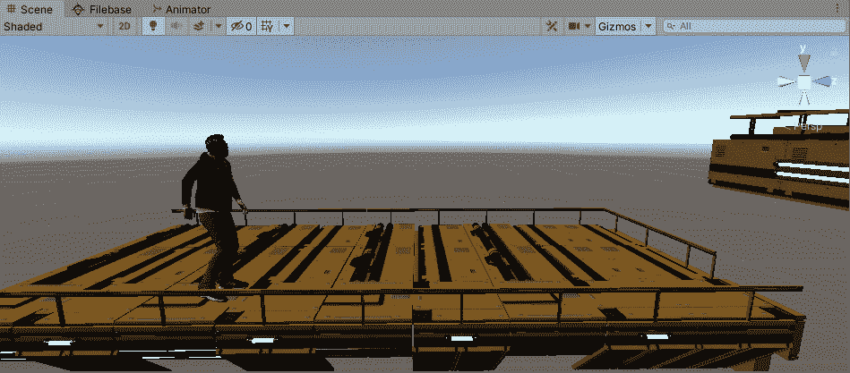

# 制作角色动画第 2 部分

> 原文：<https://medium.com/nerd-for-tech/animating-the-character-part-2-7d874c1da736?source=collection_archive---------12----------------------->

现在，我们已经在上一篇文章中实现了一个空闲和一个奔跑的动画，让我们看看如何添加一个跳跃的动画，同时翻转我们的角色，使他面向他奔跑的方向，而不是笨拙地奔跑或向后跳跃。然而，首先，让我们看看如何为我们的角色添加一个奔跑跳跃的动画。至于我们想要的动画，我们可以回到 Mixamo，选择一个我们喜欢的。从那里开始，我们重复之前动画的过程，但是在这种情况下，我们想要对动画进行额外的调整，因为它自然地推动我们的角色前进，我们想要防止这种情况发生:

烘焙我们的旋转和姿势将阻止我们的角色移动额外的量。否则，我们的跳转将看起来像:

在这种情况下，我将为跑步跳跃和空转跳跃添加动画。一旦我们将它们添加到我们的 Unity HUB 中，我们就可以将它们添加到我们的动画窗口中，并创建所需的过渡:

除了为我们的动画设置新的参数之外，我们还需要为过渡创造条件。因为我们有空闲和运行的动画，我们返回到它们的转换需要有适当的要求来返回到那些条件。为了做到这一点，我们将简单地使用速度参数和跳转参数来确定我们是在跳转后运行还是回到空闲状态。我们的跳转都设置好了，现在我们可以看看如何设置我们的代码。有一个选项来运行它作为一个触发器，但是，由于我们不断地激活动画，可能会出现一些小的视觉错误。如果这是一个已经完成的动画，比如死亡，触发器将是一个更好的工作方法。因此，我们将在这种情况下使用一个 bool，这样我们就可以在代码中更有效地触发它。一旦我们在脚本中创建了一个 bool 来使用，我们就可以开始链接动画参数并创建我们的动画过渡:

正如我们所看到的，我们将创建一个新的 if 语句来结束我们的动画，当我们的球员被禁足，并激活动画时，我们按下空间。为了将参数设置为 true 或 false，我们将把 our _jumping bool 的状态链接到参数的 true 或 false 语句。有了所有这些，我们可以检查我们的游戏，看看它看起来如何:

现在我们已经有了跳跃的地方，让我们来看看当我们向另一个方向奔跑时，如何让我们的角色翻转。要做到这一点，我们将想要玩我们的欧拉角，并在条件满足时翻转我们的角色:

有了这个代码，我们就可以让我们的角色根据我们前进的方向进行旋转。只要输入的值是正的，我们就向右移动，如果是负的输入，我们就向左移动:

现在我们已经有了一个角色模型和动画，让我们开始考虑如何在适当的位置安装一个抓岩架系统，这样我们的角色就可以够到那个太远而无法跳过的岩架。