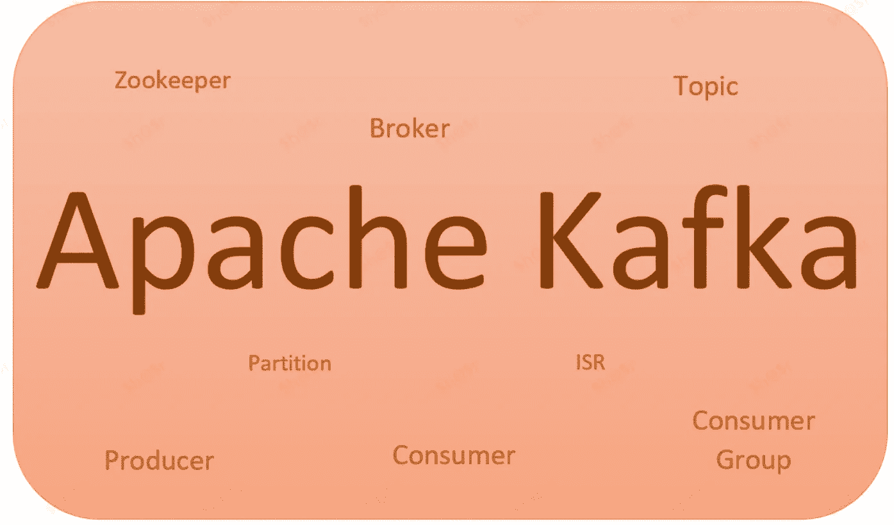
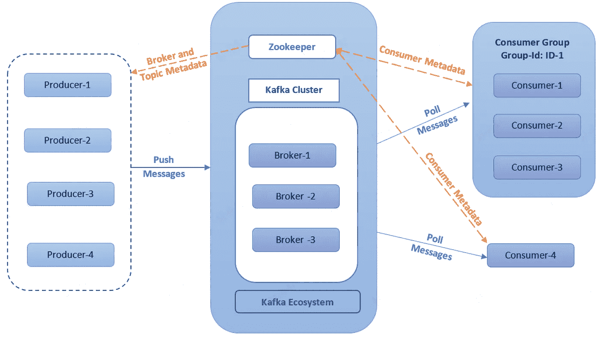
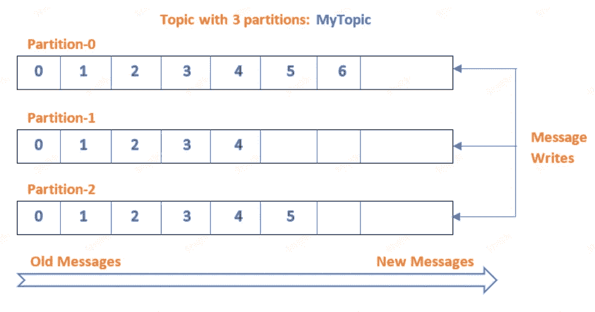
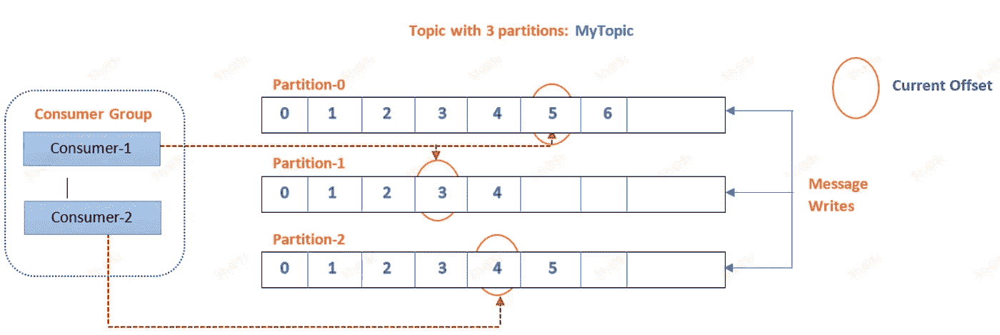
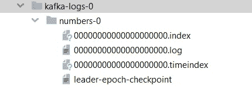
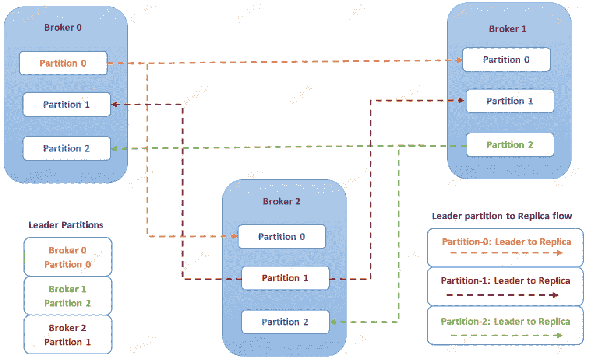
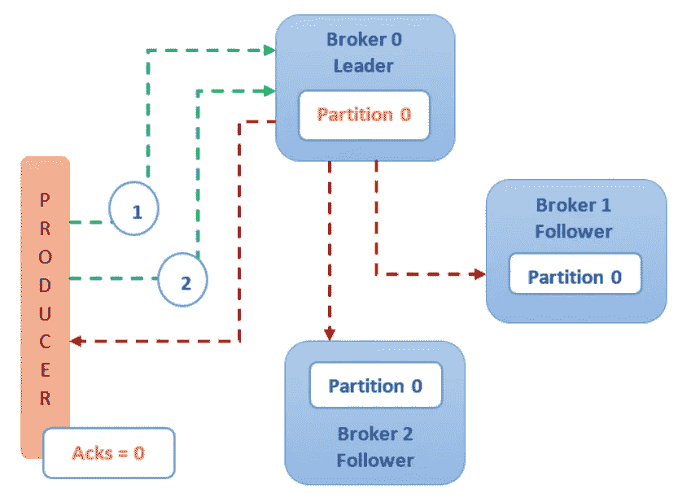
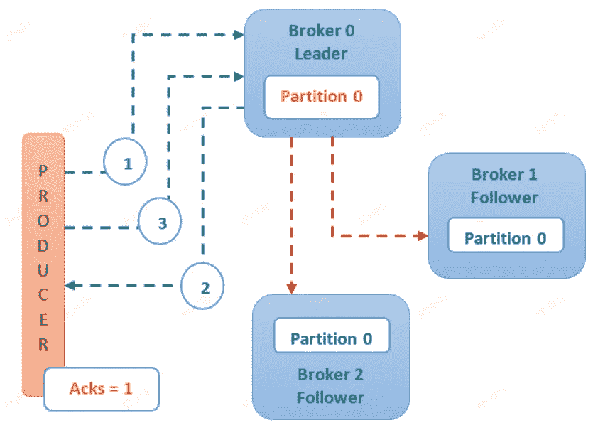
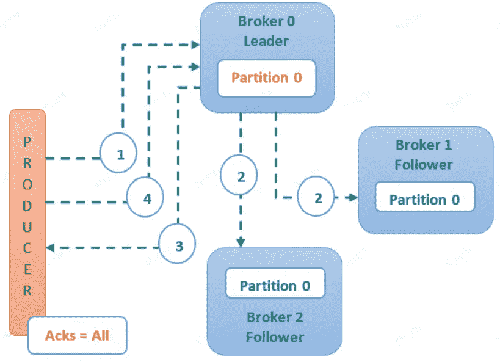

# 阿帕奇卡夫卡:快速入门

> 原文：<https://medium.com/nerd-for-tech/apache-kafka-quick-start-1edeef53773e?source=collection_archive---------2----------------------->

阿帕奇卡夫卡

在这篇文章中，我们将探讨 Kafka 基础，这有助于 Kafka 初学者了解 Kafka 的组成部分。

1.制作人
2。消费者
3。消费者群体
4。话题
5。分区
6。偏移
7。分段
8。复制因子
9。领导者和追随者
10。ISR-In 同步副本
11。确认(Acks，1，all)
12。动物园管理员 13。代理/节点/引导服务器
14。控制器

Apache Kafka 是一个可扩展、容错的分布式流媒体平台，具有以下主要功能。

-发布和订阅记录/事件流。
-以容错的持久方式存储记录/事件流。
-记录/事件流发生时进行处理。

Kafka 最适合实时流需求

-构建在应用程序之间获取数据的实时流数据管道
-构建对数据流做出反应的实时流应用程序(事件驱动系统)

阿帕奇卡夫卡生态系统

**监制**:

Producer 创建新消息并将数据发布到主题。生产者负责选择将哪个记录分配给主题中的哪个分区。

默认情况下，生产者并不关心消息被写到哪个主题分区，而是在一个主题的所有分区中公平地平衡消息。生产者基于消息键和分割器将消息/记录定向到分区。

**消费者和消费群体**

消费者可以订阅一个或多个主题，并按照消息产生的顺序阅读消息。消费者还可以借助消息偏移量来跟踪已经阅读的消息。

使用者组指的是一个或多个分担工作负载的使用者组成的组。消费者被映射到具有 group-id/name 的特定消费者组。

使用者组确保发布到主题的每个记录都可以被同一使用者组中的一个使用者实例读取。这些记录将在来自同一个使用者组的使用者之间进行负载平衡。

一个记录可以被来自不同消费者组的多个消费者读取。

**题目及分区:**

主题可以被认为是数据库中的表或文件系统中的文件夹。Kafka 将记录发布到主题中，可以有零个或一个或多个消费者来读取写入主题的数据。此外，主题还被分成几个部分。Kafka 集群为每个主题维护一个提交日志。

下图显示了一个包含 3 个分区的主题

示例:包含 3 个分区的 Kafka 主题

分区可以被描述为一个不可变的消息集合，其中消息可以以仅附加的方式编写。Kafka 中的记录排序可以保证每个分区。

每个主题可以有一个或多个分区。主题的分区副本数量取决于主题创建期间配置的复制因子(RF)。

示例:
-如果 RF=1，则只有领导者拥有该分区，并且该分区没有追随者。
-如果 RF=2，意味着有 2 个分区副本。一个有领导者，另一个有跟随者。
-如果 RF=3，意味着有 3 份分区。一个有领导者，两个有追随者。

**偏移:**

Offset 是分配给分区上的记录的唯一数字。每当发布新记录时，current offset 将递增 1，并将该记录添加到分区上。从消费者处读取数据时，偏移量起着至关重要的作用(消费者根据上次提交的偏移量读取数据)。

例如:卡夫卡消费-电流偏移

**段**:

每个分区被细分为段，段是一个分区的记录集合。Kafka 没有将一个分区的所有信息保存在一个日志中，而是将它分成更小的块(段)。

Kafka 总是将记录写入分区的活动段。如果达到段大小，将创建一个新的段，并作为活动段。

例如:卡夫卡片段

**复制因子**

它表示一个分区存在的副本数量。复制因子配置在可用性方面起着重要作用。N 的复制因子允许您失去 N-1 个代理，同时仍然能够可靠地读取/写入记录到主题。

有两种类型的副本

*   ***领导者*** :

一个分区由集群中的一个代理拥有，该代理被称为该分区的领导者。正如我们所知，生产者和消费者在领导者分区上执行写/读数据，同样的操作将在从者分区上复制。一旦分区领导者通过领导者选举被选出，关于新领导者的信息将被通知给所有代理

*   ***跟随者*** *:*

从分区负责监控分区领导者，以复制与领导者中相同的读/写，并与领导者保持最新。最新的或与当前领导者同步的追随者是 ISR 列表的一部分，当当前领导者副本去世时，他们有资格参加领导者选举。

***一条记录如何从生产者传播到主题分区？***

生产者从 Zookeeper 获取分区领导者信息，并且它总是向分区领导者发送记录，从者从分区领导者获取记录。当生产者向分区的领导者发送记录时，记录将被复制到从者(副本)分区，如下所示。

1.  生产者向分区 0(代理 0 处的领导者)发送记录，该记录将被传播到跟随者分区(如图中的代理 1 和代理 2)。
2.  生产者向分区 1(代理 2 处的领导者)发送记录，该记录将被传播到跟随者分区(如图中的代理 0 和代理 1)。
3.  生产者向分区 2(代理 1 处的领导者)发送记录，该记录将被传播到跟随者分区(如图中的代理 0 和代理 2)。

例子:卡夫卡领导，追随者记录从领导流向追随者

**ISR —同步副本**

ISR 是与当前分区领导者数据完全同步的代理(即，分区偏移号反映领导者和 ISR 的相同)，当当前分区领导者失败时，控制器负责通过领导者选举从 ISR 列表中选择一个代理作为分区领导者。

**确认(ack)**

确认—“确认”表示在将消息视为成功写入之前，确认消息的代理数量。ack 将在生产者处配置。

“ack”接受 3 个值“0”、“1”和“全部”

1.  **ack = 0**

例如:Kafka acknowledge-acks = 0

这里，Producer 不会等待来自代理的确认，而是转到下一个请求。一旦制作者发送了记录，就认为记录发送成功。在这种情况下，producer 不知道记录是成功发布到代理，还是由于某些错误而失败。使用此设置，消息丢失的可能性很高。

该设置可用于实现非常高的吞吐量，因为生产者可以以网络支持的速度发送消息。

*2。****ack = 1***

示例:卡夫卡确认—确认=1

一旦主副本收到消息，代理(带有主分区)就向生产者发送成功响应。

如果主代理终止/未能接收到消息，生产者可能会收到错误响应，并可以重试发送消息。

与“acks = 0”相比，此设置减少了丢失消息的百分比，因为生产者等待来自领导者副本的确认，但是吞吐量可能下降(取决于同步/异步传输),因为生产者等待领导者确认。

3.***ack = All***

例如:卡夫卡致谢—确认=全部

在这里，一旦所有同步副本接收到记录，生产者将认为写入成功。

该设置确保记录是安全的，因为多个代理接收该消息，并且该消息即使在崩溃的情况下也将继续存在。

注意:有些情况下，leader 是使用复制因子为 1、分区为 1、一个代理创建的唯一同步副本(or)主题。设置“acks = all”可能会根据最低 ISR 配置给出错误响应。

**动物园管理员**

动物园管理员负责

*   集群成员 : Kafka 使用 Zookeeper 来维护当前集群成员的经纪人列表。每个代理用唯一的代理 id 向 Zookeeper 注册。
*   *控制器选举* **:** 在集群中启动的第一个代理通过在 Zookeeper 中创建一个 ephermal 节点成为控制器。Zookeeper 维护控制器信息和其他代理信息。当当前控制者死亡时，Zookeeper 从列表中的活动代理中选择新的控制者。
*   *主题配置* : Zookeeper 维护主题元数据——如所有主题的列表、每个主题的分区数量、所有副本的分区领导信息和位置、主题的定制/覆盖配置等..
*   ACL(访问控制列表) : Zookeeper 维护 ACL 信息，帮助控制谁可以做什么。

**代理(或)节点(或)引导服务器**

它是一个实例/虚拟机/物理机，Kafka 在其中运行。在卡夫卡的世界里，服务器被称为代理。

Kafka Broker 负责管理分区，处理来自客户端(生产者、消费者)的读/写请求，管理分区复制。

**控制器代理(或)集群控制器(或)控制器:**

Kafka 集群只不过是一组一个或多个代理，其中一个代理充当集群控制器(当活动控制器由于某种原因死亡/失败时，在集群中启动的第一个代理成为从集群的活动成员中自动选出的控制器)。在任一时间点，群集只能有一个活动控制器。

控制者就像一个普通的经纪人，有额外的责任。它将履行管理分区、处理读/写请求、管理分区复制等常见代理职责。

控制器的其他职责包括—将分区分配给代理，跟踪节点，适当处理加入/失败/离开集群的代理，并相应地重新分配分区。

这就是这篇关于 Kafka 基础的文章，希望它有助于从 Kafka 学习开始对 Kafka 组件有一个基本的概述。

将撰写新文章来深入理解这些组件。

学习 Kafka Connect: [Kafka Connect:快速入门](https://techcolors.medium.com/kafka-connect-quick-start-e9249ec2bbaa)

参考:
[https://kafka.apache.org/documentation/](https://kafka.apache.org/documentation/)
[https://docs.confluent.io/home/kafka-intro.html](https://docs.confluent.io/home/kafka-intro.html)