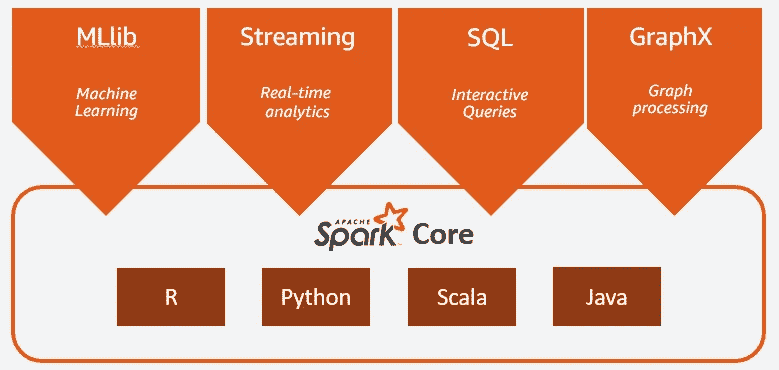

# Apache Spark —多部分系列:什么是 Apache Spark？

> 原文：<https://medium.com/nerd-for-tech/apache-spark-multi-part-series-what-is-apache-spark-63c3f6caa3c?source=collection_archive---------5----------------------->

Apache Spark 的主要驱动目标是使用户能够通过一个统一的平台以一种可访问和熟悉的方式构建大数据应用程序。Spark 的设计使得传统的数据工程师和分析开发人员能够轻松地整合他们当前的技能，无论是编码语言还是数据结构。

但是这是什么意思，你还没有回答这个问题！

[https://www . datanami . com/2019/03/08/a-十年后-Apache-spark-still-going-strong/](https://www.datanami.com/2019/03/08/a-decade-later-apache-spark-still-going-strong/)

Apache Spark 是一个包含多个 API(应用程序编程接口)的计算引擎，这些 API 允许用户使用传统方法与后端 Spark 引擎进行交互。Apache Spark 的一个关键方面是它不会长时间存储数据。众所周知，将数据从一个位置移动到另一个位置非常昂贵，因此 Apache Spark 利用其计算功能来处理数据，无论数据位于何处。在 Apache Spark 用户界面中，Spark 试图确保每个存储系统看起来相当相似，这样应用程序就不需要担心它们的数据存储在哪里。

该计算引擎允许用户创建一个端到端的解决方案，该解决方案利用多台机器的分布式功能，所有这些机器都朝着一个共同的目标工作。这可能是大规模聚合、大数据集上的机器学习，甚至是具有大吞吐量的数据流。这些问题通常被称为*、【大数据】、*。

# 为什么大数据是个问题？

大数据有许多定义，但有一个让我印象深刻:

> 如果数据太大，无法在您的设备上显示，这就是大数据！

“大数据”这个术语已经存在了很多年。因此，几乎从计算开始以来，能够对这些数据进行分析就一直是一个挑战！有许多引擎和系统被构建来帮助管理大数据，它们都利用不同的方法来提高速度、效率和可靠性。并行计算就是这些发展之一。随着技术的进步，收集数据的速度呈指数增长，收集数据的成本也越来越低。许多机构为了收集和记录而收集数据，因此，能够从这些数据中回答业务关键问题过去和现在都变得越来越昂贵，因为 Apache Spark 之前的计算引擎已经老化。

Spark 的开发是为了解决一些世界上最大的大数据问题，从简单的数据操作一直到深度学习。

# 谁创造的？

> Spark 最初由 Matei Zaharia 于 2009 年在加州大学伯克利分校的 AMPLab 创建，并于 2010 年在 T2 BSD 许可下开源。
> 
> 2013 年，该项目被捐赠给阿帕奇软件基金会，并将其许可切换到[阿帕奇 2.0](https://en.wikipedia.org/wiki/Apache_License) 。2014 年 2 月，Spark 成为了[顶级 Apache 项目](https://en.wikipedia.org/wiki/Apache_Software_Foundation#Projects)。
> 
> 2014 年 11 月，Spark 创始人 M. Zaharia 的公司 [Databricks](https://en.wikipedia.org/wiki/Databricks) 利用 Spark 创造了大规模排序的新世界纪录。
> 
> Spark 在 2015 年有超过 1000 名贡献者，这使它成为 Apache 软件基金会中最活跃的项目之一，也是最活跃的开源[大数据](https://en.wikipedia.org/wiki/Big_data)项目之一。
> 
> [https://en.wikipedia.org/wiki/Apache_Spark](https://en.wikipedia.org/wiki/Apache_Spark)

# Spark 库:

Apache Spark 中有许多可用的库，其中许多是由 Spark 社区直接开发的。这些库包括但不限于:

*   MLlib
*   火花流
*   GraphX

这些库是以可解释的方式开发的，这意味着它们首次能够在相同的引擎环境中编写端到端的解决方案。

# Spark 语言功能:

Spark 允许用户用 Python、Java、Scala R 或 SQL 编写代码，但 Python 和 R 等语言要求用户安装相关解释器的实例。所有的 Python、R、Scala 和 SQL 都被编译成 Java。这是因为您编写的代码运行在 JVM (Java 虚拟机)内部。因此，无论在哪里运行 Spark 实例，您所需要的只是安装 Java。

Apache Spark 可以以多种方式运行。对于一般开发人员和业余爱好者来说，Locally 很常见，但是，在生产环境中，大多数实例都是在云环境中开发的。例如，使用 AWS EMR 管理节点(驱动程序和工作程序)实例、Azure HDInsight 或使用 Databricks 形式的在线笔记本体验。

*   [https://aws.amazon.com/emr/](https://aws.amazon.com/emr/)
*   [https://azure.microsoft.com/en-gb/services/hdinsight/](https://azure.microsoft.com/en-gb/services/hdinsight/)
*   [https://community.cloud.databricks.com/](https://community.cloud.databricks.com/)

无论 Spark 是在本地运行还是在云环境中运行，用户都能够通过控制台或终端访问不同的交互式 shells。这些以下列形式出现:

*   Python 控制台
*   Scala 控制台
*   SQL 控制台

然而，一个不同之处是 Databricks 笔记本环境，这是一种类似于 Jupyter 提供的用户界面的体验。Databricks 环境提供了大量内置于平台的额外功能，通过在一个地方访问所有这些功能，用户可以最大限度地提高工作效率。

最新 Spark 版本:

最新的 Spark 版本可在此处找到:

 [## 下载| Apache Spark

### 注意，Spark 2.x 是用 Scala 2.11 预建的，除了 2.4.2 版本是用 Scala 2.12 预建的。火花 3.0+…

spark.apache.org](https://spark.apache.org/downloads.html) 

# 最后

就深度而言，这一部分是相当轻量级的，但是，它为后面的部分奠定了一些基础。这些进一步的部分将深入到每个方面，如架构、库和数据结构。

下一节将深入探讨 Apache Spark 如何在集群上运行，以及物理架构如何与运行时架构协同工作。

# 系列部分:

[简介](https://lukethorp.medium.com/apache-spark-multi-part-series-introduction-37735823c3cc)

1.  [什么是阿帕奇 Spark](https://lukethorp.medium.com/apache-spark-multi-part-series-what-is-apache-spark-63c3f6caa3c)
2.  [火花架构](https://lukethorp.medium.com/apache-spark-multi-part-series-spark-architecture-461d81e24010)