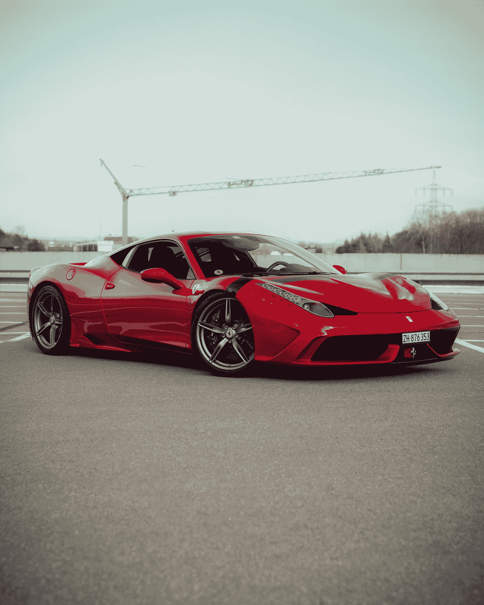
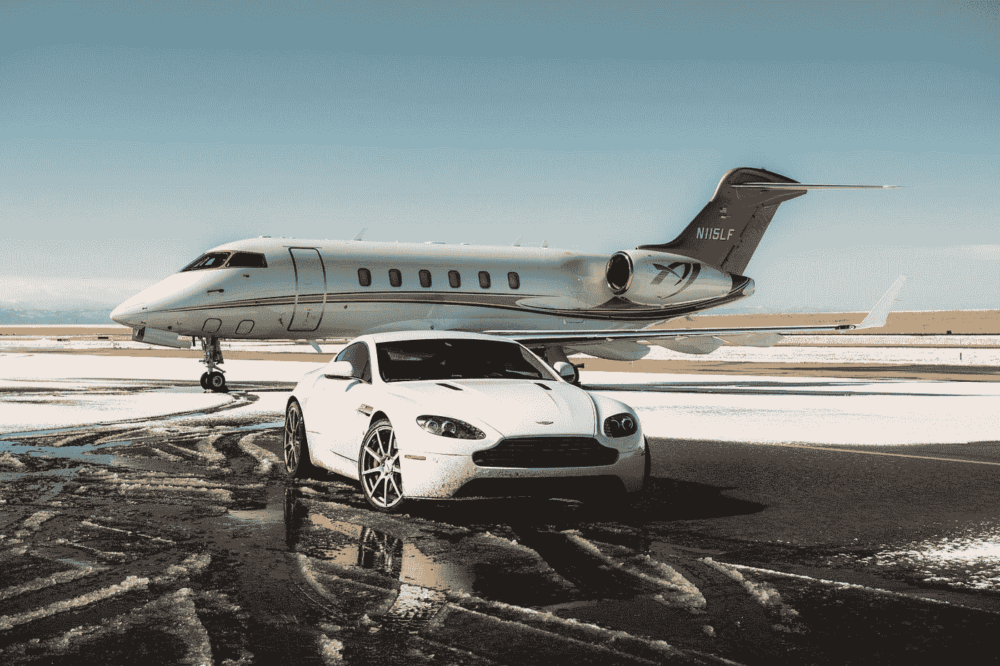

# 超跑和超级跑车值得买吗？

> 原文：<https://medium.com/nerd-for-tech/are-supercars-and-hypercars-even-worth-buying-57a6ac54487d?source=collection_archive---------7----------------------->

## 被愚弄的一代人

## 营销是如何摧毁了许多人的大脑！

照片由[威廉·基瑟林](https://unsplash.com/@pictorious?utm_source=medium&utm_medium=referral)在 [Unsplash](https://unsplash.com?utm_source=medium&utm_medium=referral) 上拍摄

哇！追了这么多速度，速度还算个东西吗？

嗯，我仍然记得对每一辆法拉利和兰博基尼都垂涎三尺，希望有一天能买下它们。

2000 年代之前的每辆超跑 0-60(0-100)都被限制在 3.6- 4 秒，直到最近大多数超跑的这一数字被降至 3.5 秒以下。

然后开始了超级汽车的时代——它们漂亮而卑鄙，速度惊人。人们应该注意到最近的布加迪凯龙星，它被称为世界上最快的汽车，0-60(0-100)需要 2.3 秒，与 21 世纪 20 年代的平价电动汽车相比，这是非常慢的。

在过去的二三十年里，汽车工业在技术进步和消费者适应性方面开始蓬勃发展。在过去的 20-30 年里，我们只能将大多数由燃料驱动的超级跑车和超级跑车的 0-60 秒从大约 4 秒缩短到 3 秒以下。

问题是，即使随着时间的推移，这种无可挑剔的壮举和技术进步，超级汽车和超级汽车值得为微薄的速度增长和毫无意义的钱包燃烧的快感而花钱吗？

# 超级跑车和超级跑车热的诱人营销

婴儿潮一代……咳咳……我们的父母——他们中的大多数人从来没有把速度和刺激作为购买新车的首要考虑因素。他们仔细检查了各种规格，并一一做了标记——但是速度和刺激不在他们的十大清单中。

驾驶快速、酷炫、运动型的汽车是汽车制造商和电影制作人创造并助长的一种魅力——他们在电影中展示昂贵的汽车。

照片由[雅各布·罗森](https://unsplash.com/@jakobnoahrosen?utm_source=medium&utm_medium=referral)在 [Unsplash](https://unsplash.com?utm_source=medium&utm_medium=referral) 拍摄

虽然没有错，但重点是，现在速度是不是只留给超级和超车了？我们真的需要他们来体验这种刺激吗？

# 未使用的速度:

虽然我们日常驾驶的汽车通常可以达到超过 145 英里每小时(233 公里每小时)的最高速度，但我们仍然没有每天最大限度地发挥其潜力。

法拉利 488 GTB 的最高时速是 205 英里/小时(329 公里/小时)——但问题是，我们为什么渴望这么高的速度？为什么我们仅仅因为比日常驾驶的汽车增加了几英里/小时就被收取高额费用？

正确看待我们是如何被欺骗的。世界上张贴的最高速度限制是 99 英里每小时(159 公里每小时)，适用于阿联酋的两条高速公路。以法拉利 488GTB 为例，我们只是在浪费它的潜力，比日常驾驶的汽车消耗更多的燃料。

超级跑车和超级跑车非常耗油，因为它们使用强大而沉重的发动机，这些车虽然运动，光滑，独特，速度快。他们给地球带来了巨大的代价——在已经成为全球持续危机的情况下，产生了更多的二氧化碳。

比尔·牛津在 [Unsplash](https://unsplash.com?utm_source=medium&utm_medium=referral) 上的照片

因此，如果我们不能使用它所有的肌肉——那为什么还要购买它们呢？

# 高速旅行的问题

# 行人:

让我们承认，无论如何，道路不仅仅是为汽车而建的——至少汽车可以被造得会飞。但是我们人类只会走路。所以道路是人车共享的。快速的车辆意味着可能的致命事故。

不可否认的是，即使有很多法规和安全措施，每天还是会有事故被报道。

照片由[摩根勒布勒东](https://unsplash.com/@morgane_lb?utm_source=medium&utm_medium=referral)在 [Unsplash](https://unsplash.com?utm_source=medium&utm_medium=referral) 拍摄

让我抓狂的是，我们选择或梦想购买我们的“超级跑车”和“超级跑车”，仅仅是因为这些车可能相当“快”和“酷”。不可否认，它们不是，但问题是，汽油汽车仍然是跑得最快的吗？

我同意所有这些车看起来都很酷，是一种财富声明，并描述了你的社会地位。但是为了速度而买是很傻的。

此外，目前许多电动汽车已经更快了，加速比许多超级汽车都快。

特斯拉格子的加速已经达到了 1.90 秒，超过了布加迪凯龙星的 2.4 秒。

# 轮胎磨损

布加迪威龙——凯龙星的前身，它的轮胎在 250 英里/小时(402 公里/小时)的速度下只能坚持 15 分钟，我们现在还在谈论威龙。

如果一辆“汽车”有如此多的局限性，并且只是吹嘘它的威力和力量，但这是我们永远无法征服和体验的，无论是在街道上还是在赛道上。为什么它值得称赞，被视为一个永远无法检验或体验的工程奇迹？

阿瑟尼·托古列夫在 [Unsplash](https://unsplash.com?utm_source=medium&utm_medium=referral) 上的照片

一个有趣的事实:威龙被认为是当时最快的汽车，每 15 分钟的惊险刺激，它的轮胎更换费用高达 42，000 美元。

据说凯龙星的轮胎更换比威龙便宜，但是他们到底有多“便宜”呢？

# 我们会默认以最快的速度旅行吗？

当卡尔·本茨在 1886 年推出第一辆汽车时，汽车的最高速度为 10 英里/小时(16 公里/小时)，从那时起，我们已经发展到通常在高速公路上以 75-95 英里/小时(120-150 公里/小时)的速度行驶，在城市里大约以 30-40 英里/小时(50-60 公里/小时)的速度行驶(取决于每个国家和州授权的速度限制。)

问题是，为什么我们被限制在高速公路或街道上开足马力开车？

照片由[在](https://unsplash.com/@laurentmedia?utm_source=medium&utm_medium=referral) [Unsplash](https://unsplash.com?utm_source=medium&utm_medium=referral) 上画

车辆是科学和创新进步的原因——我们在各个方面进行创新，将我们的工作量转移到机器上。

这些跑车和超级跑车作为声望和成功的产品的无休止的营销只是制造了一个鸿沟，当他们只返回一个微薄的改善，而不是大多数人选择的负担得起的溢价。

# 特斯拉

当世界的目光被缩小到气体车辆作为未来几个世纪唯一的交通选择时。一些不安的人试图改变这种路线和观点，并试图使驱动车辆所需的能源多样化。

随着埃隆·马斯克(Elon Musk)对特斯拉的指责，电动汽车通过展示它们的无碳排放、拥有和运行电动汽车的成本以及速度唤醒了我们。

特斯拉一次又一次地向世界证明了大众问题的解决方案，即碳污染的主要贡献者之一——燃气汽车，并在所有人都不相信他的时候，通过他对电动汽车技术的坚定信念给出了解决方案。

事实上，特斯拉汽车的加速速度比超级汽车还快，更不用说超级汽车了。

# 电动车速度的未来

未来是电动的，这是毫无疑问的。随着特斯拉 4680 电池的推出，许多其他汽车制造商转向电动汽车。很明显，燃气汽车将成为历史。

蒂姆·莫斯霍尔德在 [Unsplash](https://unsplash.com?utm_source=medium&utm_medium=referral) 上的照片

与几十年前的汽油发动机相比，仍处于起步阶段的电动汽车技术已经显示出了它的威力。它们速度很快，它们的里程数每年或两年都在增加，它们非常未来，安静，自主，可以减少听力损失和噪音污染，以及交通和急转弯汽车的紧张压力。

随着世界一步步向互联世界迈进，很明显，有一天汽车可以相互对话，并可能大大减少交通事故。

同样随着最近福特 F150 的上市。福特已经超越其竞争对手，允许其电动 F150 在停电 3 天的情况下充当发电机。

电动汽车技术是探索最少的。它的潜力和它的能力正以一种迅速而又充满激情的方式被发掘出来。

而从天然气到电力的转变花了几十年时间。这一运动已经导致研究人员和许多汽车制造商寻找和投资更多的替代能源，用有机和容易产生的替代能源解决方案为我们的家庭和车辆提供动力。其中，被认为是未来能源解决方案的是氢能。