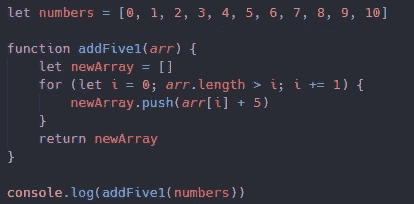
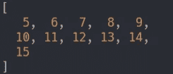
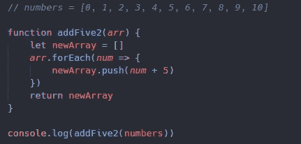
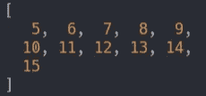
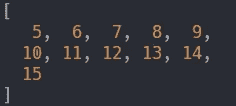
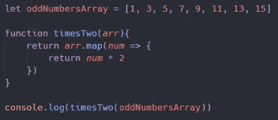
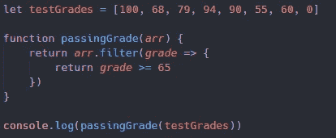
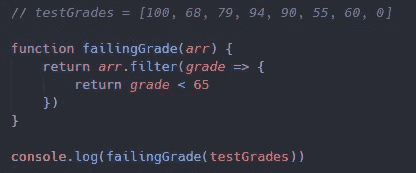
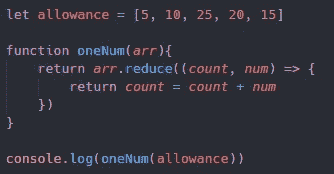

# 数组方法第二部分

> 原文：<https://medium.com/nerd-for-tech/array-methods-part-ii-b8b2abd17368?source=collection_archive---------41----------------------->

## JavaScript 还能为您和您的阵列做些什么？

欢迎回到 JavaScript 数组方法回顾的第二部分。正如第一部分承诺的，这是我们解决四大问题的地方；过滤，为每一个，映射，并减少。我喜欢把它们看作四大方法，因为没有一个开发人员在面对大量数据时会缺少这些方法。如果你已经对这些方法有所了解，因为每一种方法看起来都与众不同。如果这对于你来说是全新的，不要担心，因为我们将会全面介绍这种方法以及比较。所以让我们开始吧！

## forEach()

这个方法使我们能够创建一个循环，特别是 for 循环，它为数组的每个元素执行给定的函数。简单地说，我们可以使用这种方法，而不是创建一个 for 循环，并且必须创建这样做的逻辑。这为我们节省了时间，因为我们只需编写更少的代码就可以达到同样的目的。举个例子，我们有一个从 0 到 10 的数组。我们的任务是创建一个函数，将数组中的每个数字加 5。让我们先来看看如何使用 for 循环给每个元素加 5。

*回报*

如您所见，我们使用了一个 for 循环来遍历数组的每个索引。我们创建一个等于第一个 index 的变量，只要我们数组的长度大于 index，index 就会增加 1，最后我们将把数组当前的 index 加 5 放入我们的新数组中。冲洗并重复。现在让我们看看如何使用 for each 来实现相同的目标，同时编写更少的代码并使其更具可读性。

*回报*

听着我们得到了相同的答案，但是我们到底是怎么得到的？for each 把每个元素分解成一个临时变量。在这个逻辑中，我们决定称它为 num，这是我们处理数字的自然方式。然后我们将这个数字加 5 放入新的数组中。顾名思义，这将对数组中的每个元素重复进行。看一看这两个例子，它们对于正在发生的事情肯定是可读和可理解的，但是你不得不同意，对于每一个例子来说，事情都变得清晰了许多。

## 地图()

我们可以用这种方法去做每一个人能做的和有的事情。它不仅允许我们循环遍历数组中的每个元素并对它们执行函数，还会返回一个包含这些元素的新数组。让我们在每个示例中使用时快速浏览一下。

*返回*

如您所见，我们不需要创建一个新的数组来保存我们的新值。我们只需要返回映射的数组和函数，因为我们需要明确返回的内容，在本例中是数字加 5。让我们快速看一下另一个例子，我们将把一个奇数数组乘以 2。

*返回*

同样，我们正在返回我们的映射数组。当它“映射”原始数组中的每个元素时，它被乘以 2，然后返回映射后的数组。一旦完成，映射的数组将从函数中返回。

## **滤镜()**

这个方法让我们能够为每个数组元素创建一个测试。然后，像 map 一样，将循环遍历并返回一个新的元素数组，但与 map 不同的是，这些元素需要通过我们已经实现的测试。举个例子，你是一名教授，有一系列的考试成绩。您创建了一个函数，该函数将返回所有及格分数(65 分或更高)的数组。让我们来看看如何实现这一目标。

*回报*

为了进一步细分，我们将遍历每个年级。如果分数为 65 或更高，它将返回到筛选数组。如果没有，不要担心它不会永远消失，但不会成为返回的过滤数组的一部分。我们也可以通过简单地改变我们的一些逻辑来获得不及格的分数，或者低于 65 分的分数。

*返回*

通过改变我们函数的名字，以及对我们的测试做一些小改动，我们现在有了一个函数，它将返回给我们一系列的不及格分数。

## **reduce()**

你猜对了，我们可以使用这个方法，根据我们提供的函数，将数组缩减为一个值。值得一提的是，有两个参数减少了需求，不像对于每一个，map 和 filter。我们首先需要我们的总值或初始值，这取决于函数所在的位置，其次是我们的当前值，这是我们的 for each、map 和 filter 每次接收的值。举个例子，我们想为我们的一个孩子或弟弟妹妹创建一个函数，把他们五周的零花钱加起来。虽然这笔钱仍在他们的储蓄罐里，但他们在日记里做了非常详细的记录，并能向我们提供他们每周得到多少钱。

*返回*

为了把它分成几部分，我们正在减少我们的津贴。我们的总/初始值默认为零，我们恰当地将其命名为 count。我们的当前值，再次恰当地命名为 num，表示我们在数组中的当前数字。然后，我们只需要每次重置我们的计数，以计数加上下一个数字。这样我们得到的不是一个数组，而是数组包含的总值。

我要感谢你的阅读，并希望你学到了新的东西！请关注未来的更多文章！

如果您想查看这些示例的副本，供您自己使用或参考，您可以在这里找到 GitHub Repo 的链接。