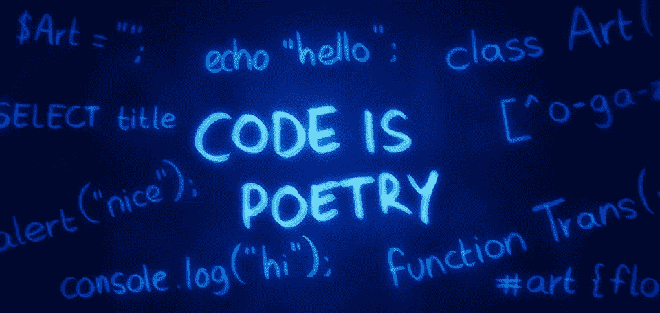

# 代码的艺术

> 原文：<https://medium.com/nerd-for-tech/art-of-code-faddd4c10dd8?source=collection_archive---------19----------------------->

TLDR:《代码》是一首充满激情和爱的诗篇。朋友，如果你不同意，这个帖子是给你的，更好看。否则，我们都在同一页。

早期的编程是以某种方式组合 1 和 0 来告诉机器一项计算任务。但现在已经演变到不再是 1s 和 0s 独舞的地步了。现在，项目团队非常庞大，许多程序员在同一个代码库工作。*因此，如今最重要的是如何为读者编写代码，而且肯定有人会把它修改成在机器上运行。*因此，编码成了一门艺术，不像以前了。



一般来说什么是艺术？

所以作为代码。

我们都在*凌乱的代码库*中工作过，总觉得这些代码不被关心或喜爱。好的代码应该是为读者而不是为机器写的。我们如何识别代码是否被很好地维护？可以在试图理解代码的同时，用 wtf 力矩的*数来衡量。或者，我们可能需要在代码中四处寻找，以了解它在做什么。仅仅几行代码就让读者精疲力尽。*

那么我们如何关心一个代码呢？

*   对所有变量/类/接口/方法使用适当的命名约定
*   命名为名词的类和命名为动词的方法
*   方法负责定义明确的单一任务
*   保持名称的一致性。您可以将 person 对象命名为 PersonEntity，这样更好地将 employee 对象命名为 EmployeeEntity，而不是 employee object
*   方法名应该描述它正在执行的单个任务。假设我们有一个方法来获取给定用户 id 的用户。所以最好把方法命名为 getUserById(int id)。因此，读者不需要阅读内容来理解行为。

如果我们仔细观察一首诗，我们会发现没有杂乱无章的东西——只有清晰传达思想所需要的东西。还有代码，我们不需要不必要的混乱。在过去，我们被告知要尽可能多地使用注释。但是真的值得吗？有很多评论可能会分散读者的注意力。此外，评论从来没有被清理过(除了原作者之外，大多数人都害怕接触评论。)当我们读一首诗时，我们不需要任何评论就能欣赏它，代码也应该如此。除非真的需要，否则我们应该避免评论。代码本身应该充当注释。怎么会？

让我们看看这段代码。

```
**public** **Integer** **calculation(Integer** var1**,Integer** var2**){**
    *//adding given two numbers*
    **Integer** temp **=** var1 **+** var2**;**
    **return** temp**;**
  **}**
```

在上面的代码中，我们不得不使用一个注释来通知读者这个方法将两个给定的数字相加。但是我们能不能把评论分散在代码上。让我们试试。

```
**public** **Integer** **add(Integer** numOne**,Integer** numTwo**){**
    **Integer** total **=** numOne **+** numTwo**;**
    **return** total**;**
  **}**
```

你认为我们需要评论吗？没有权利。代码本身就是一个注释。方法签名就足够了。

艺术是经过深思熟虑的。诗人已经决定了哪里有讽刺，哪里有高潮，什么时候说什么。所有的组织和写作都是有原因的。所以作为代码。应该是精心设计的。应该适当地提取类和接口，使代码变得简单(…是的，就是 KISS)。

诗歌不是一口气写出来的。写作可能需要 1 周时间，但编辑和微调需要几周时间。掌握这门艺术是令人厌倦的。这就是为什么伟大的艺术作品是罕见的。这需要时间和汗水。代码也没什么特别的。它也需要大量的返工。好代码的背后是数小时的重构和意见之战。不奇怪。所以一旦你写了代码并执行，你还没有完成。你需要重新审视、重构和清理这些混乱，再打磨几轮，然后你就可以完成*了*。

再说一遍，**代码是一首充满激情和爱的诗篇**。你可能仍然有不同的想法。我们在这个帖子的最后有一个讨论。喜欢听你的想法。开枪吧。

一如既往，注意安全。编码快乐！。

*原载于 2021 年 5 月 30 日*[*https://isurunuwanthilaka . github . io*](https://isurunuwanthilaka.github.io/software-engineering/2021/05/30/art-of-code.html)*。*