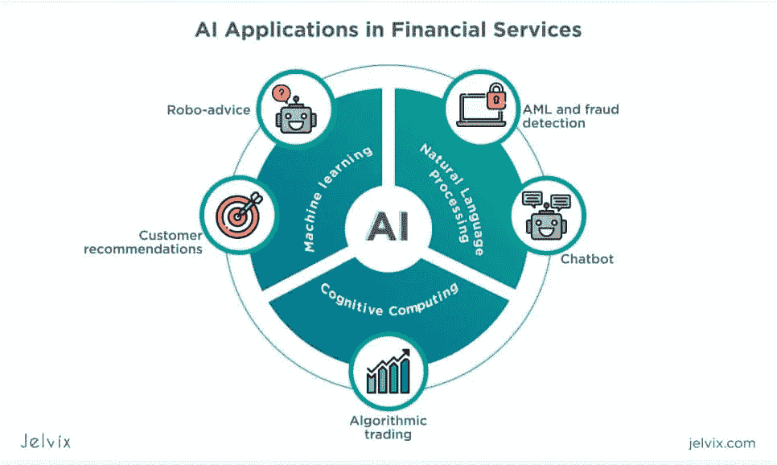
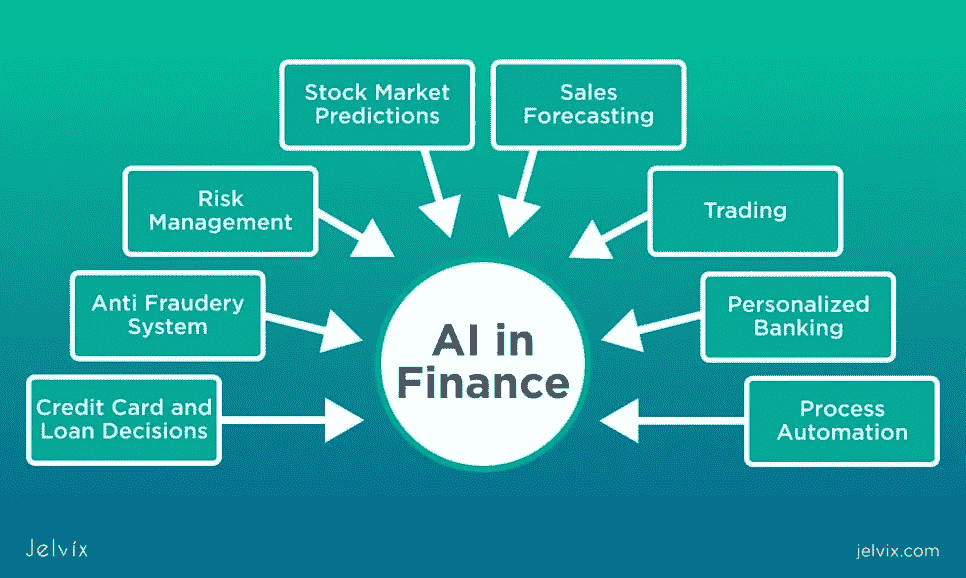
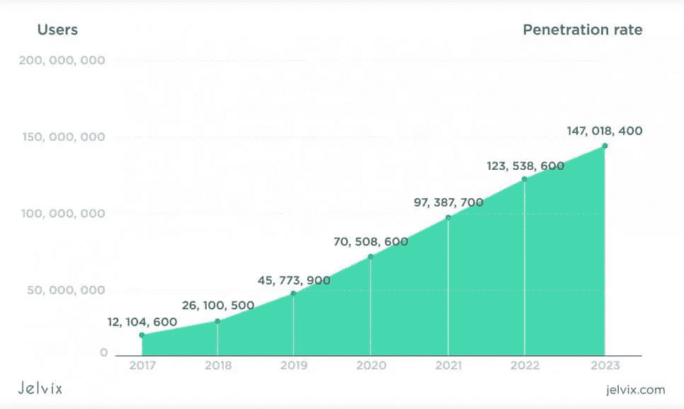
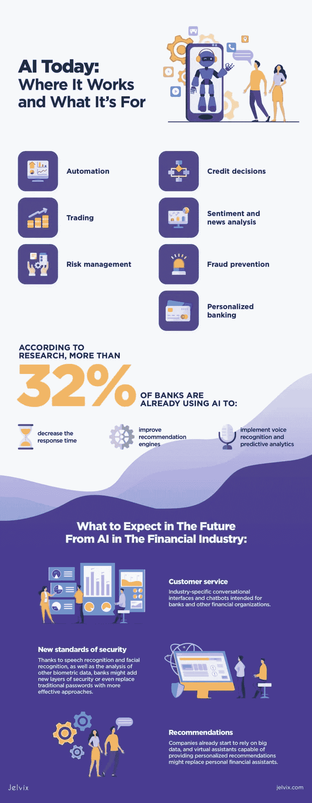

# 人工智能在金融服务中的应用

> 原文：<https://medium.com/nerd-for-tech/artificial-intelligence-applications-in-financial-services-8e2097b5f0bb?source=collection_archive---------3----------------------->

人工智能是一种独特的技术，可以用在不同的行业，金融也不例外。鉴于人工智能的主要优势是其处理海量数据的能力，金融可以从使用人工智能中受益，甚至超过其他领域。人工智能已经被许多在保险、银行和资产管理等领域工作的公司所使用。

人工智能的一个伟大之处在于它可以以不同的方式使用。例如，人工智能驱动的聊天机器人可以帮助金融机构与客户沟通。AI 也是虚拟助手的基础。[机器学习](https://jelvix.com/blog/ai-vs-machine-learning-vs-deep-learning)算法还支持算法交易，可用于风险管理、欺诈检测和关系管理。

金融领域的人工智能提供了许多好处。或许，AI 的主要优势在于，它给了无数的自动化机会。反过来，自动化可以帮助金融机构提高许多流程的生产率和效率。此外，鉴于人工智能可以在某些情况下取代人类，它有助于消除人类的偏见和各种由情绪或心理因素导致的错误。

显然，AI 也更擅长分析数据。机器学习使计算机能够识别数据中的模式，为决策者提供有价值的见解，并帮助组织获得更精确的报告。

那么，人工智能在金融中是如何运用的呢？

# 今日人工智能:它在哪里工作，它的用途是什么

## 自动化

自动化不仅仅是一个跨行业的趋势。它之所以如此受欢迎，是因为它使组织能够提高生产率并削减运营成本。过去需要花费大量时间并需要组织雇用低技能员工团队的任务现在可以更快、更容易地完成。例如，人工智能可以使用字符识别来自动验证数据，并根据某些参数生成报告。

自动化有助于公司消除人为错误，并使员工能够专注于机器无法完成的更重要的任务。据统计，AI 帮助公司节省了高达 70%的与数据输入和其他重复性任务相关的成本。

许多大公司意识到了人工智能的优势，因此他们开发了自己的人工智能驱动的解决方案，或使用现有的自动化解决方案，使您能够适应并使用它们来实现您的特定目标。例如，[摩根大通](https://www.jpmorgan.com/global/cib/ts/demystifying-tech)使用[机器人流程自动化(RPA)](https://jelvix.com/blog/rpa-use-cases) 来遵守必要的法规、提取数据和捕获文档。

## 信贷决策

人工智能还可以帮助银行更快、更准确地评估潜在借款人，同时节省成本。基于人工智能的解决方案可以立即分析无数可能对银行决策产生影响的因素。AI 使用比传统系统更复杂的信用评分方法，因此银行可以了解某人是高风险申请人还是仅仅没有足够的信用记录。

人工智能驱动的软件提供了更高程度的客观性。机器没有偏见，这是一个很关键的因素，尤其是在金融 app 开发中。贷款发放应用和数字银行允许银行提供各种个性化选项，并将替代数据(包括智能手机数据)整合到决策过程中。

人工智能不仅有利于银行，也有利于许多其他公司。例如，汽车贷款公司报告称，人工智能的使用使他们每年能够减少 23%的损失。

## 贸易

在过去十年中，数据驱动的投资趋势一直在稳步增长。两年前，数据驱动的投资[接近一万亿美元](https://inventurerecruitment.com/news/2018/10/2/quant-hedge-funds-closing-in-on-1-trillion-in-aum)。AI 和机器学习用于所谓的高频交易，也称为量化或算法交易。这种类型的交易变得越来越受欢迎，因为它提供了许多好处。

人工智能驱动的交易系统可以比人类更快地分析大量数据。他们可以处理非结构化和结构化数据。数据处理的速度快导致决策和交易的速度快，使交易者在相同的时间内获得更多的利润。

此外，人工智能算法做出的预测更准确，因为它们可以分析大量的历史数据。人工智能算法可以测试不同的交易系统，提供一个新的验证效率水平，以便交易者可以在使用某个系统之前评估所有的利弊。

AI 可以分析特定投资者的长期和短期目标，以提供最强投资组合的建议。金融机构经常使用人工智能来管理他们的整个投资组合。人工智能的预测能力也得到了众多公司的赞赏。

例如，彭博推出了其[羊驼预测矩阵](https://www.welcome.ai/tech/finance/alpacaforecast)，该矩阵通过将来自彭博的实时市场数据与复杂的学习算法相结合来帮助投资者，该算法可以识别价格动态的模式，从而做出最准确的预测。

## 情感和新闻分析

对冲基金不喜欢分享有关他们运作方式的信息，因此很难理解他们到底会如何使用情绪分析。然而，人工智能已经展示了它在数字营销方面的能力，它处理社交媒体数据的能力也可以用于金融行业。

期待机器学习不仅用于各种自动化和定制任务，还用于新闻趋势、社交媒体和其他与交易和股票价格无关的数据源，这是有道理的。

股票市场对数百种不同的因素做出反应，而不仅仅是股票代码。在搜索新趋势和获取信号时，人工智能可以用来模仿和增强我们的直觉。然而，要执行这样的任务，AI 不仅需要处理数据，还需要更好地理解其上下文，这仍然是一个挑战。

例如，基于人工智能的聊天机器人可以为问题提供简洁的答案；然而，人工智能还远远不能撰写全面的文章或广告文案，因为它无法理解它所处理的信息的上下文。

## 风险管理

风险管理是机器学习在金融领域的另一个应用领域。鉴于人工智能提供了令人难以置信的处理能力，可以处理大量的结构化和非结构化数据，它可以比人类更有效地处理风险管理任务。机器学习算法还可以分析风险的历史，并在潜在问题发生之前检测到任何迹象。

人工智能在金融领域的主要优势之一是，它使组织能够实时分析各种金融活动，而不管市场环境如何。组织可以为他们的业务规划选择任何重要的变量，并使用它们来获得详细的预测和准确的预测。

Crest Financial 是开始使用人工智能的租赁公司之一。这家公司使用亚马逊网络服务人工智能进行风险分析，据[报道，该公司取得了重大改进](https://www.marketwatch.com/press-release/covid-19-impact-on-global-artificial-intelligence-as-a-service-market-2020-technology-share-demand-opportunity-projection-analysis-forecast-outlook-2026-2020-06-03)。例如，它设法消除了使用传统数据科学方法时出现的部署延迟。

## 欺诈防范

人工智能也被证明在预防和打击欺诈方面非常有效。网络犯罪分子不断开发新的、更有效的策略，但基于人工智能的解决方案可以使用机器学习，并快速适应黑客的策略。

这种解决方案在打击信用卡欺诈时尤其有效。由于在线交易和电子商务的日益普及，这种类型的欺诈在过去几年变得越来越常见。

人工智能驱动的欺诈检测工具可以分析客户的行为，跟踪他们的位置，并确定他们的购买习惯。因此，他们可以迅速发现任何偏离特定客户正常消费模式的异常活动。

银行也可以利用人工智能来应对其他类型的金融犯罪。例如，人工智能可以用来打击洗钱。机器学习算法可以快速检测可疑活动，并将调查洗钱计划的成本降至最低。根据研究，人工智能可以降低 20%的调查成本。

## 个性化银行服务

当涉及到个性化和为用户提供额外好处时，人工智能的优势变得显而易见。例如，银行使用人工智能聊天机器人提供及时的帮助，同时也最大限度地减少了呼叫中心的工作量。金融机构也可以使用各种语音控制的虚拟助手。

这样的解决方案是自我学习的，所以当你使用它们时，它们会变得越来越有效。虚拟助手和聊天机器人都可以与其他软件集成。例如，他们可以安排付款、监控账户活动和检查余额。

也有许多应用程序提供个性化的财务建议，以便用户可以实现他们的财务目标。这些智能系统可以跟踪常规支出、收入和购买习惯，以提供必要的财务建议和优化计划。

包括美国银行、富国银行和大通银行在内的许多知名银行已经提供了方便的移动应用程序，可以提醒用户账单，确保银行和客户之间及时有效的沟通，并帮助用户规划支出。交易和交互都更加方便和简化。

# 人工智能如何改变金融业

自 20 世纪 90 年代中期以来，金融业发生了翻天覆地的变化。这个领域受到了数字技术的强烈影响，现在由于数字银行和移动银行，它比以往任何时候都更加数字化。我们生活在一个速度和便捷是任何行业主要竞争优势的时代。

千禧一代和 Z 世代实际上是 T2 最大的劳动力群体，他们习惯于通过简单地点击移动设备的屏幕来获取所有必要的信息和购买产品。

金融业的数字化转型加剧了竞争，并创造了所谓的新银行，如仅在线运营的 [Chime](https://www.chimebank.com/) 或 [Varo](https://www.varomoney.com/) 。甚至包括谷歌在内的一些科技公司也开始探索个人银行业务。

因此，这个市场变得更加不稳定，竞争更加激烈。为了经受住激烈的竞争，公司需要跟上最新的技术趋势。人工智能是一项技术，它通过简化众多流程为公司带来显著优势。

专家预测，到 2030 年，人工智能将为金融公司节省大约[1 万亿美元。根据研究，超过 32%的银行已经在使用人工智能来缩短响应时间，改进推荐引擎，并实施语音识别和预测分析。新的应用领域一直在出现，公司学习使用人工智能来实现他们的特定目的。](https://thefinancialbrand.com/72653/artificial-intelligence-trends-banking-industry/)

创新中最强劲的趋势之一是使用人工智能来改善客户体验。一些面向客户的解决方案，如聊天机器人，已经成为主流。与此同时，算法分析、任务自动化和流程自动化在金融领域也变得越来越受欢迎，因为公司意识到这些技术具有哪些优势。

机器人还能让公司雇佣更少的员工。[根据 Gartner](https://www.gartner.com/en/finance/trends/robotic-process-automation) 的数据，机器人流程自动化的成本比在岸员工低五倍，比离岸员工低三倍。

*全球机器人顾问用户数量*

虽然机器人自动化过程涉及基于规则的系统，但在技术上并不智能，这项技术通常与各种人工智能解决方案一起使用。机器学习可能是与人工智能相关的最常见的技术类型，总体而言，它在银行和金融业的转型中也发挥着重要作用。

机器学习已经在各个行业展现出了巨大的潜力，金融领域也不例外。机器学习在金融行业的主要好处是收集、处理和组织大量数据。

基于机器学习的解决方案几乎不需要人类的帮助。他们能够从历史数据中学习，检测其中的模式，并利用这些见解在未来操作数据。一些解决方案也使用这些模式进行预测。

在谈论 AI 时，最常提到的是机器学习和自动化。这些人工智能子集确实非常有用，它们可以快速提供惊人的结果，因此公司可以快速评估新技术的好处及其投资回报率。然而，也有一些不太明显的人工智能领域非常有趣。

例如，语音识别使人们只需对着他们的设备说话就能进行银行活动。如果一家公司使用聊天机器人，这项技术也非常有用。

# 对金融行业的人工智能未来有什么期待

## 客户服务

对话界面和聊天机器人变得越来越普遍。有许多通用的聊天机器人解决方案可供不同领域的公司使用，但像 [Kasisto](https://kasisto.com/) 这样的公司已经在开发面向银行和其他金融机构的行业专用软件。这种软件将帮助客户进行必要的计算，并快速评估他们的预算。

此外，语音识别使银行能够以最方便的方式提供帮助。这种解决方案将不可避免地成为巨大的竞争优势，因为提供快速交互和查询的银行将能够吸引传统银行的客户，传统银行要求其用户登录银行门户，寻找必要的功能，并自己搜索必要的信息。

## 新的安全标准

未来几年，密码、用户名和安全问题可能会从金融行业消失。安全性在金融行业尤为重要，因为大多数人宁愿自己的社交媒体账户被黑，也不愿成为黑客窃取其信用卡信息的受害者。

因此，金融行业最有可能使用人工智能支持的安全解决方案，以确保没有人能够访问他们客户的数据。

我们已经提到，人工智能可以检测不寻常和可疑的行为。由于语音识别和面部识别，以及其他生物数据的分析，银行可能会增加新的安全层，甚至用更有效的方法取代传统的密码。

## 推荐

金融销售的自动化解决方案已经存在，但并不是所有的都涉及机器学习。通常，这些都是基于规则的系统。然而，虚拟助手也可以以更智能的方式提供推荐。例如，他们已经能够就投资组合的可能变化提出建议，但他们也可以分析各种网站，提供保险服务建议，并帮助你选择符合你目标的计划。

人工智能驱动的应用变得越来越个性化，个性化推荐不再是网飞和 Spotify 等公司的专属。例如，保险公司已经开始[依赖大数据](https://www.nytimes.com/2015/01/19/technology/insurance-via-internet-is-squeezing-agents.html?_r=0)，能够提供个性化建议的虚拟助理可能会取代个人财务助理。

# 结论

聊天机器人和自动化软件并不是与人工智能相关的金融机器学习的唯一进步。机器学习使金融机构能够简化大量耗时的任务，并大幅削减成本，因此毫不奇怪，金融行业已经在各个领域使用人工智能。

例如，人工智能可以帮助最小化风险，打击欺诈，并协助银行做出信贷决策。

AI 的另一大优势是提供了无数的个性化机会。移动银行将继续发展，未能适应最新技术趋势的金融公司可能会失去客户。鉴于人工智能可以处理海量数据，并根据一系列必要的因素做出预测，机器学习在交易中的作用也将增长。

人工智能早已永远改变了很多行业，其巨大的潜力毋庸置疑。因此，期待人工智能在金融领域得到更广泛的采用并为其提供的新机会做好准备是有意义的。

*杰米·弗莱——有目标、有前途的作家。现在他在* [*写作评委*](https://www.writingjudge.com/) *论文写作服务公司工作，复习和提高他的博客技能。自信地走向他的目标。他有创作原创内容的天赋。他人生的主要信念:“在你正在发展的领域里成为最好的”。总是在寻找新的想法。*

*原载于*[*https://jelvix.com*](https://jelvix.com/blog/ai-in-finance)*。*