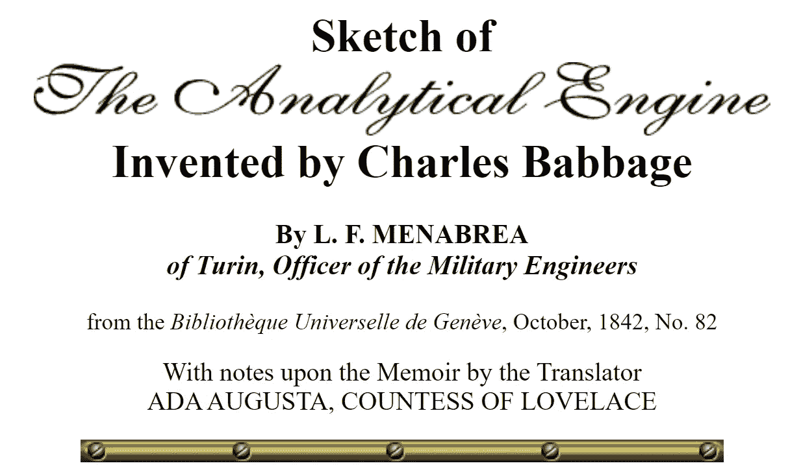
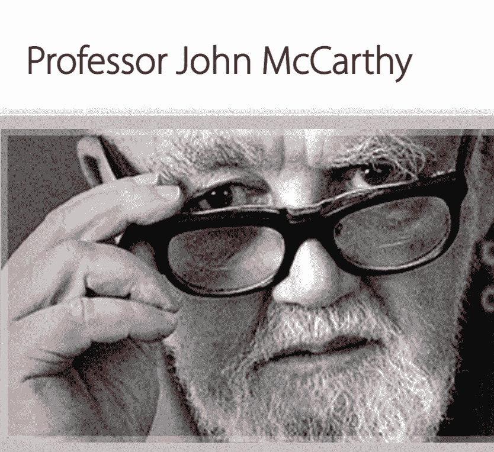
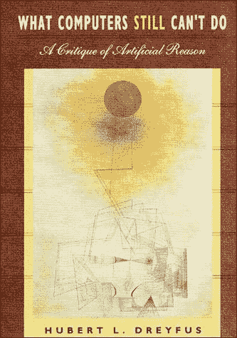
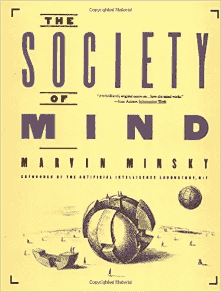
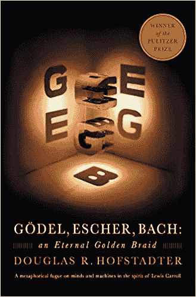
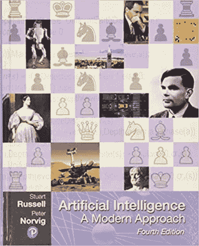
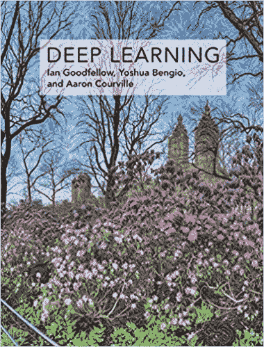
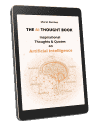

# 人工智能:为什么在早期阶段形成的思想和想法往往是最鼓舞人心的

> 原文：<https://medium.com/nerd-for-tech/artificial-intelligence-why-the-thoughts-and-ideas-framed-in-the-early-stages-are-often-the-most-561b047bc99c?source=collection_archive---------8----------------------->

shutterstock ( [Jjustas](https://www.shutterstock.com/de/g/jjustas)

很多人认为，如果一篇 AI 或机器学习的文章或论文的年龄超过三年，就不值得阅读。但这种假设是错误的，你冒着增加知识与本质差距的风险。当然，一些论文提到了最初的早期作品，但这通常是表面上的，以或多或少地证明作者的观点。

技术早期阶段写的论文最有价值的情况并不少见。这是因为作者做了或多或少的基础研究，而且大多不受多余的外部影响。结果，他们对他们正在看的东西有了更清晰的看法。因此，我的建议是:如果你想深入研究人工智能，先阅读在技术或科学早期阶段撰写的重要文章或作品。

下面我列出了一些资源(历史、哲学和技术的混合),供你在开始“职业生涯”时考虑，以便对人工智能有一个基本的了解:

# **查尔斯·巴贝奇/阿达·洛芙莱斯:**

来源:[分析引擎草图(fourmilab.ch)](https://www.fourmilab.ch/babbage/sketch.html)

[分析引擎草图(fourmilab.ch)](https://www.fourmilab.ch/babbage/sketch.html)

1842 年，意大利数学家 Luigi Federico Menabrea 根据巴贝奇的一次法语演讲发表了对发动机的描述。1843 年，该描述被翻译成英文，并由八年前就对发动机感兴趣的**阿达·洛芙莱斯**做了大量注释。为了表彰她对 Menabrea 论文的补充，包括使用机器计算伯努利数的方法(被广泛认为是第一个完整的计算机程序)，她被称为第一个计算机程序员。([维基百科](https://en.wikipedia.org/wiki/Analytical_Engine))

# 艾伦·m·图灵

艾伦·m·图灵(来源:[维基百科](https://en.wikipedia.org/wiki/Alan_Turing#/media/File:Alan_Turing_Aged_16.jpg))

[***计算机械与智能***](https://www.csee.umbc.edu/courses/471/papers/turing.pdf)

1.  《模仿游戏》

我提议考虑这个问题，“机器能思考吗？”这应该从术语“机器”和“思考”的定义开始。这些定义可能是为了尽可能地反映这些词的正常用法，但这种态度是危险的，如果要通过考察“机器”和“思考”这两个词的通常用法来发现它们的含义，就很难避免这样的结论，即“机器能思考吗？”这个问题的含义和答案是在诸如盖洛普民意测验的统计调查中寻求的。但这是荒谬的。我不会试图给这个问题下定义，而是用另一个问题来代替，这个问题与这个问题密切相关，并且用相对明确的语言表达。(艾伦·m·图灵)

# **约翰·麦卡锡:**

来源:【AI 的哲学与哲学的 AI(stanford.edu)】

[***AI 的哲学与 AI 的哲学***](http://jmc.stanford.edu/articles/aiphil2.html)

人工智能(AI)与哲学的科学联系比其他科学更紧密，因为 AI 与哲学有许多共同的概念，例如，行动，意识，认识论(关于世界的合理说法)，甚至自由意志。这篇文章讨论了人工智能的哲学，但也从人工智能的角度分析了一些哲学和人工智能共有的概念。

[约翰·麦卡锡更多文章](http://jmc.stanford.edu/articles/index.html)

# 休伯特·l·德雷福斯

来源[麻省理工学院](https://mitpress.mit.edu/books/what-computers-still-cant-do)

[***计算机还做不到的事——人工理性批判***](https://mitpress.mit.edu/books/what-computers-still-cant-do)

当休伯特·德雷福斯(Hubert Dreyfus)在 1972 年首次发表关于脱离实体的机器天生无法模仿高级心理功能的宣言时，在人工智能界引起了轩然大波。自那时以来，世界已经发生了变化。今天，基于使用符号表示产生一般智能的想法的“老式人工智能”显然正在衰落(尽管一些信徒仍然追求它的一桶金)，人工智能社区的焦点已经转移到更复杂的思维模型。人工智能研究人员寻求和研究哲学也变得越来越普遍。在他现在的经典著作的这个版本中，Dreyfus 增加了一个冗长的新介绍，概述了这些变化，并评估了改变该领域的连接主义和神经网络的范式。

# **马文·明斯基**

来源:亚马逊

[***【心灵学会(视频讲座)***](https://ocw.mit.edu/courses/electrical-engineering-and-computer-science/6-868j-the-society-of-mind-fall-2011/video-lectures/)

马文·明斯基是计算机科学之父之一，也是麻省理工学院人工智能实验室的创始人之一，他对这个古老的问题给出了革命性的答案:“大脑是如何工作的？”明斯基出色地将大脑描绘成一个由本身无意识的微小组件组成的“社会”。根据他的理论，明斯基大胆地将心智社会描绘成一个智力拼图，它的各个部分是一路组装起来的。每一章——在一个独立的页面上——对应于拼图中的一块。随着书页的翻动，一个统一的精神理论浮现出来，就像一幅马赛克。巧妙，有趣，易于阅读，*心灵的社会*是想象中的冒险。

# 道格拉斯·霍夫施塔特

来源:亚马逊

[***哥德尔、埃舍尔、巴赫:一条永恒的金色辫子***](https://www.amazon.de/Godel-Escher-Bach-Eternal-Golden/dp/0465026567/ref=sr_1_1?__mk_de_DE=%C3%85M%C3%85%C5%BD%C3%95%C3%91&crid=2S5LXQIVMJOMC&dchild=1&keywords=godel+escher+bach&qid=1623098745&sprefix=goedel+e%2Caps%2C177&sr=8-1)

道格拉斯·霍夫施塔特的书直接关注“地图”的本质或者形式系统之间的联系。然而，根据霍夫施塔特的观点，构成所有精神活动基础的正式系统超越了支持它的系统。如果生命可以从细胞的正式化学基质中生长出来，如果意识可以从正式的神经元放电系统中产生，那么计算机也可以达到人类的智能。*哥德尔、埃舍尔、巴赫*是对认知科学核心的迷人思想的精彩探索:意义、归约、递归等等。

# 斯图尔特·j·拉塞尔，彼得·诺维格

来源:亚马逊

[***人工智能:一种现代方法***](https://www.amazon.de/Artificial-Intelligence-Approach-Stuart-Russell/dp/0134610997/ref=pd_lpo_14_img_0/259-0526702-8668841?_encoding=UTF8&pd_rd_i=0134610997&pd_rd_r=e8abd598-16d0-4daf-872c-06daabdb4fc1&pd_rd_w=8OY5W&pd_rd_wg=ydXC8&pf_rd_p=149f160f-468b-48f5-aa84-5abbe57cf06d&pf_rd_r=0HFDBQNDSH4W30FEDT41&psc=1&refRID=0HFDBQNDSH4W30FEDT41)

期待已久的 ***人工智能修订版:现代方法*** 探索了人工智能(AI)领域的全部广度和深度。**第四版**为读者带来了最新技术的最新动态，以更统一的方式呈现了概念，并提供了机器学习、深度学习、转移学习、多智能体系统、机器人、自然语言处理、因果关系、概率编程、隐私、公平和安全人工智能的新的或扩展的覆盖范围。

# 伊恩·古德菲勒、约舒阿·本吉奥、亚伦·库维尔

来源:亚马逊

[***深度学习***](https://www.amazon.de/Deep-Learning-Adaptive-Computation-Machine/dp/0262035618/ref=pd_sim_3/259-0526702-8668841?pd_rd_w=lFjaO&pf_rd_p=904108be-63c8-423f-8039-eaaf91407844&pf_rd_r=D17E7WE8PRDJKF7GT6D9&pd_rd_r=54c6540b-c1ed-4597-9083-db226c59bad9&pd_rd_wg=bnRmf&pd_rd_i=0262035618&psc=1)

**对深度学习中广泛主题的介绍，涵盖数学和概念背景、行业中使用的深度学习技术以及研究视角。**

“由该领域的三位专家撰写，*深度学习*是关于该主题的唯一一本综合书籍。”
**~埃隆马斯克**，

# 亲爱的读者们:

# 你可以在亚马逊上限时以 0.99 美元的价格买到电子书《人工智能思想书》。

# 不要错过

[Amazon.com](https://www.amazon.com/dp/B08Z4BWN1X)——[Amazon . de](https://www.amazon.de/dp/B08Z4BWN1X)——[Amazon.co.uk](https://www.amazon.co.uk/dp/B08Z4BWN1X)——[Amazon . fr](https://www.amazon.fr/dp/B08Z4BWN1X)——[Amazon . es](https://www.amazon.es/dp/B08Z4BWN1X)——[Amazon . it](https://www.amazon.it/dp/B08Z4BWN1X)——[Amazon . nl](https://www.amazon.nl/dp/B08Z4BWN1X)——[Amazon.co.jp](https://www.amazon.co.jp/dp/B08Z4BWN1X)——[Amazon.com.br](https://www.amazon.com.br/dp/B08Z4BWN1X)——[Amazon . ca](https://www.amazon.ca/dp/B08Z4BWN1X)——[Amazon.com.mx](https://www.amazon.com.mx/dp/B08Z4BWN1X)——[Amazon.com.au](https://www.amazon.com.au/dp/B08Z4BWN1X)——