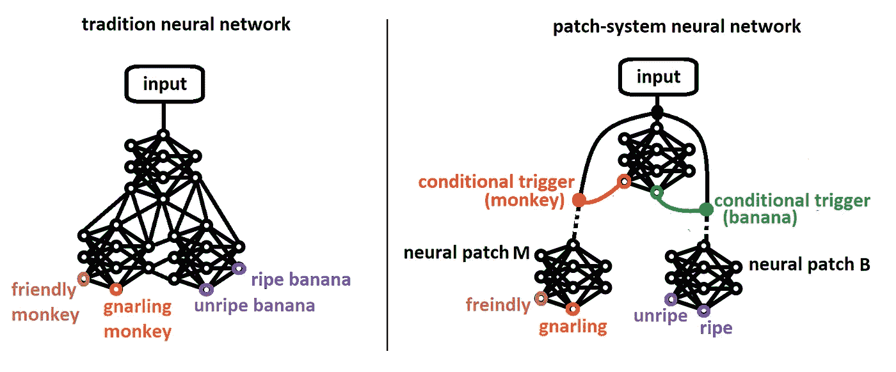
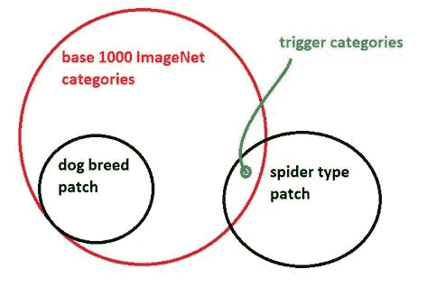
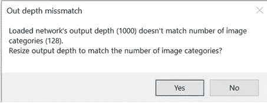
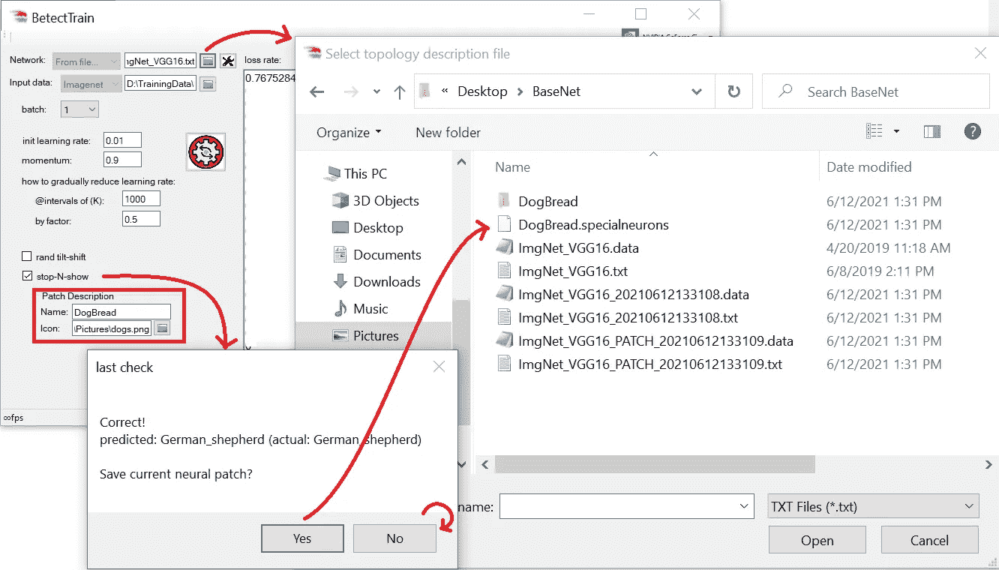
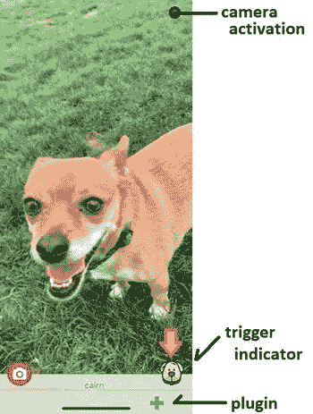

# 人工神经贴片

> 原文：<https://medium.com/nerd-for-tech/artificial-neural-patches-3ade7b3a4d57?source=collection_archive---------11----------------------->

本文描述了什么是神经补丁和补丁系统，它们相对于传统神经网络设计的优势，以及为什么我们正在寻找人们训练有趣的人工神经补丁用于图像分类。它讲述了使用简单的 [Windows](https://www.microsoft.com/en-us/p/betect-train/9nc2cmrjzjxr?activetab=pivot:overviewtab) 工具训练这种补丁的步骤，如何在移动设备( [iOS](https://apps.apple.com/us/app/betect/id1442454694) 和 [Android](https://play.google.com/store/apps/details?id=com.advancedkernels.betect) )上测试它们，并提交它们进行发布审查。

# 背景:神经补丁

2006 年，研究人员使用 fMRI(功能性磁共振成像)和单个神经细胞的电记录来寻找当猕猴观察另一只猴子的脸时变得活跃的下颞叶区域。他们发现，只有当一张脸被识别时，一些神经区域才会被触发。并且那些触发其他区域，这些区域只对面部的特定方向或特定特征的夸大显示出敏感性。在存在某些粗略特征的情况下，*有条件地*激活，然后提取更多精细特征的神经网络区域被称为神经补片。这些相互连接的贴片的集合称为贴片系统[1]。这里的关键是激活的条件性。

神经贴片有两个有趣的方面。第一是它们是*递增* *累加的。*补丁系统可以通过添加越来越多的补丁来逐渐增加大小，这些补丁由其他神经补丁触发，并且它们自己也触发其他神经补丁——在这个过程中提取越来越多的细节。第二，它们是可以独立训练的。虽然一个神经补片可以由一个“父”神经补片识别的特定粗糙特征的存在而触发，但实际激活对于系统中的所有补片是相同的。真正区分不同小块的是它们被什么触发，即它们观察到的输入类型(被训练的输入类型)。因此，一个父神经补片可以被细化，只要它对相同的粗糙特征进行分类，它的子补片就不需要以任何方式进行改变。

**左:**传统的单片神经网络，激活来自前面的层。**右:**一个补丁系统神经网络，具有相同激活的补丁，但仅在达到所需的粗糙特征时被触发。

神经补片的使用使得能够以传统神经网络不可能的方式提取越来越精细的细节。这是通过在已经观察到 *某些粗糙特征*的条件下 *s* 在提取精细特征*时特殊化小块来实现的。换句话说，补丁系统中的补丁不是通过传统深度神经网络中的生产者-消费者关系(顺序地将来自先前层的原始输出值提供给各层)，而是通过主-从关系(主控制从是否醒着)来渐进地瞄准更精细的细节。*

如上所示，从修补程序与其主修补程序消耗相同的输入激活。毕竟，区分猴子和香蕉的必要且充分的特征对于区分愤怒的猴子和友好的猴子来说并不重要，对于区分香蕉的成熟度来说也不重要。换句话说，一旦一个人评估出正在观察的是一只猴子的脸，他就需要回去重新评估那些能够辨别它是否是一只咆哮的猴子的特征——而这些扭曲的特征对于仅仅辨别它是否是一只猴子来说可能是不必要或不充分的。因此，猴子补丁是一个*主人*控制 gnarling 补丁的激活，而不是一个*生产者*喂养它。这种区别对于如何在人工神经网络中使用这种设计有很大的意义。

## 人工神经网络的面片模型

在人工神经网络中使用补丁系统模型的第一个优点是，它允许*逐步开发*，在需要时增加检测进一步细节的能力(作为“补丁插件”)。此外，这些插件可以由不同的团队以特定的方式开发，并且可以随着更好版本的出现而单独“升级”。这与预定义神经网络的集中式端到端训练的传统方法(可能具有迁移学习和权重锁定)相反。使用补丁系统的第二个优势是它引入了*可编程性和可理解性*的元素，因为触发神经补丁的条件是有形的软件 if-条件。

主补丁配置的唯一要求是其输出具有逻辑损失函数，例如 soft-max。因此，单个输出神经元将指示某一特征的强度或存在/不存在，这可随后用于触发从属贴片。这将被整合到我们即将使用的基础网络中作为示例，因此在开始时您不必担心。

使用补丁系统改变人工神经网络的发展的最重要的方式是，它将人工神经网络变成以数据为中心的训练任务，而不是探索网络拓扑的任务。神经贴片的网络设计不需要多样或复杂。事实上，它们都可以有简单统一的拓扑结构。区别一个补丁和另一个补丁的是触发它的原因和它被训练的数据，而不是它的拓扑结构。因此，开发神经补丁所涉及的主要工作实际上是细化训练数据及其触发条件(除了实际的训练和测试过程本身之外)。

为了帮助解决这个问题，我们一直在开发一些简单的工具，这样补丁开发者就可以专注于创新的东西，而不是摆弄框架参数。我们正在寻找感兴趣的人来尝试这些工具，以训练新的神经补丁来识别整洁的图像特征。在移动 iOS/Android 应用程序上测试它们，并看到它们在野外触发和识别精细功能，这其实非常有趣。我们甚至会把你在神经市场开发的整洁的放在你的名下(这样其他人可以免费使用)，我们也会给你寄一份感谢礼物。所以让我们回顾一下如何使用工具来创造这些东西。

# 训练一个神经补丁

创建我们将要讨论的神经补丁的起点是在 [Windows 商店](http://www.advancedkernels.com/betect)上提供的一个免费的自包含解决方案。它不需要神经网络的高级知识或访问高端图形卡(任何有 OpenCL 支持的像样的图形设备就足够了)。你真正需要知道的是，它在一个神经补丁上执行梯度下降训练，从 Xavier 初始化开始，给定一个固定的 VGG16 基网络，并激活 soft-max 输出，从输入图像中提取粗略特征。

训练没有结束条件，一旦开始就无限期地继续，同时报告损失函数的滚动平均值。训练满意后，可以暂停并生成扩展名为*的插件文件。特种神经元*出口。这个插件包含神经补片的权重，触发它的基础网络输出条件，以及输出分类。另外，当*被触发*时，可以提供图标图像以显示在推理设备上。这个*。specialneurons* 文件可以作为附带应用程序的插件部署到移动设备上，用于在真实世界的设置/光线中进行测试。您需要向训练工具提供的唯一输入是到*基础网络快照*和*训练图像数据的路径。*

补丁培训工具的主要字段(Betect)

## 基础网络

基本网络是从原始图像中提取粗略特征的网络。一旦它们被触发，神经贴片就会使用它们来识别更细微的细节。所以先下载并解压 [**这个**](http://www.advancedkernels.com/betect/theory/BaseNet.zip) 基础网络配置文件，将工具的*网络*字段指向解压后的*。txt* 文件(*)。txt* 和*。数据*文件需要在同一路径中可用)。

我们将使用这个特定的基础网络，因为它是当前部署在 iOS/Android 应用程序中的，将用于现场测试。出于好奇，它提取了类似 VGG16 网络的最后一个全连接层的特征。我们将在这里训练的神经贴片由一个完全连接的层组成，具有软最大输出激活。每个人都试图在粗略的图像子类别中识别一些细微的细节。基本的神经网络和神经贴片拓扑可以被改变用于更高级的用途——我们不会在这里深入讨论。

## 训练图像数据

每个神经补丁都需要自己的训练数据(因为这是它们彼此之间的区别)。假设它们将仅在识别出粗略特征时被触发，因此它们应该仅用“属于”触发类别的数据来训练。构建这些数据是创建好的神经修补程序的主要繁重工作。它需要被组织在一个文件夹中，根文件夹中有一个 *map_clsloc.txt* 。该文件定义了触发修补程序的图像类别，或者是修补程序的输出类别(在 training 文件夹中有样本数据),或者两者都有，并带有它们的标识符标签和可显示的名称。

[**作为模板，这个**](http://www.advancedkernels.com/betect/theory/map_clsloc.txt) 就是基础神经网络的 *map_clsloc.txt* 文件。它由三列组成，每行对应一个图像类。第一列表示每个类的标签，后面是它的*输出索引*和它的可显示名称。基本网络的标签在 [ImageNet](http://www.image-net.org/synset?wnid=n03489162) 中被称为它们的 Synset。为了保持一致性，尽可能坚持这种约定是一种很好的做法。但是这里对标记的真正要求是它们以字符“n”开头，后面跟一个唯一的整数来标识它们。输出指数表示识别该类别的输出神经元深度。

对于要被触发的神经补片，其 *map_clsloc* 类别必须与基本神经网络的类别至少有一个重叠。所以首先选择补丁将识别的类别，以及它将被触发的基本类别。然后将它们全部添加到一个 *map_clsloc* 文件中。补丁可以在它们的 *map_clsloc* 中定义类别，仅用于触发目的，而不将该类别作为输出选项(或者它甚至出现在训练数据中)。这对于从一组基本类别中识别超类别是有用的(例如，从小型犬中识别大型犬，而不考虑品种)。

构建(a) **狗品种补丁**的分类的示例，其分类全部在基础网络内并在相同类别上触发，以及(b) **蜘蛛类型补丁**的分类比基础网络中的分类更广泛，且触发类别限于基础网络中的类别。

接下来是主要工作！将每个类别的代表性图像添加到训练数据文件夹中。这些图像越多样，你的神经贴片在被触发时识别目标特征的能力就越强。每个单独的图像文件的名称只需要以它所属类别的标识符标签开始，后面跟着一个下划线字符(后面跟着任何其他可选的字符串)。为了便于管理，建议将每个类别的图像放在单独的文件夹中。一旦训练过程开始，训练工具将随机挑选图像，递归地搜索子文件夹。首先，下载 [**this**](http://www.advancedkernels.com/betect/theory/SampleDataFormat.zip) 作为补丁的图像数据文件夹的简单模板(在本例中用于狗面包检测)。

## 开始训练

一旦提供了基本网络的补丁和正确构造的图像数据，您就可以通过简单地单击训练按钮(如上所示)来开始训练神经补丁。还有设置批量大小、学习率、动量和衰减率的字段。但是让它们默认开始应该没问题。监控损失率日志，确保其下降。

注意，在开始新的神经补片的训练过程时，输出层将需要重新配置以匹配新补片的预期类别数(由 *map_clsloc* 文件中的行数标识)。这是因为新补丁的输出神经元的数量很可能与基础网络的 1000 不匹配。在显示下面的对话框进行验证后，培训工具将自动对此进行调整。选择“是”开始训练过程，最后一层重新配置为补丁的输出类别数。

重新配置补丁输出深度的消息。

应用程序的主窗口将实时显示随机输入到 back-prop 训练管道的图像。监控这些图像，以确保修补程序正在使用的图像类别有足够的多样性。rand-tilt-shift 复选标记将启用/禁用图像增强，具有随机倾斜和颜色偏移。这通过数据扩充引入了轻微的正则化。还有一个 stop-N-show 复选标记，可随时暂停训练。这还将显示当前的推断结果以进行抽查，并且还提供了保存神经修补程序快照和导出最终可分发修补程序的选项。

训练需要运行的时间取决于所收集的训练数据的大小、类别的数量以及显卡的容量。这是你需要试验的，取决于你的目标的准确性。一旦“充分”训练，是时候导出补丁，看看它在手机摄像头直播中表现如何。

[这个](https://www.youtube.com/watch?v=ksedPPsjeVA&t=293s)视频是一个演示(无音频),展示如何组织图像数据和训练神经补丁。这个具体的例子是在基础网络的鲨鱼类别上触发的，并试图检测鲨鱼是在水下还是在水上被观察。你能想出什么新的精细分类？

## **导出并传输补丁**

要将神经修补程序导出为可共享文件，首先在下面显示的“修补程序描述”字段中提供修补程序的名称。当用作插件时，该名称将用于唯一识别神经补丁。还提供一个可选的 png 文件，该文件将在修补程序被触发时显示。然后只需设置停止 N-显示复选标记。这将弹出一个消息框，询问您是否要保存当前快照(除了显示最后的推理结果之外)。如果选择“是”，当前完整快照(可用于进一步训练)和一个*。specialneurons* 补丁快照(可用于传输到移动应用程序)将被转储到基本网络文件的位置(标记有基于时间的哈希)。

导出已训练神经补片的可共享快照的步骤。

要在此之后继续训练，请在主窗口中取消 stop-N-show 复选标记，然后在消息框中选择“否”(注意消息框隐藏在主窗口后面)。

## 在移动设备上测试补丁

现在有趣的部分来了！免费的移动应用程序可以在这里访问 [iOS](https://apps.apple.com/us/app/betect/id1442454694) 和 [Android](https://play.google.com/store/apps/details?id=com.advancedkernels.betect) 。请注意，Android 版本确实需要支持 OpenCL 的设备——最近三星、LG、索尼和摩托罗拉的设备都支持 OpenCL！

点击应用右上角的相机按钮，可以使用 1000 个 ImageNet 类别的基本神经网络进行实时设备上的对象检测。在第一次启动时，这两个应用程序都会执行大量的 bese 神经网络下载。所以一定要上 wifi。应用程序屏幕底部的进度条指示神经网络层的推理进度。在每个推断的结尾，主要识别对象的名称会显示在进度条的上方。每样本推断的速度将取决于您的移动图形设备，因为所有处理都是在设备上完成的(而不是在云中)。

在应用程序的右下角有一个插件按钮(带加号)。这是我们的神经补丁插件的入口。点击此按钮一次，您将进入我们的神经市场，在那里您可以下载已审核的补丁。但是长按这个按钮会打开一个文件浏览器，从这里你可以插入任何本地存储的神经补丁。这就是你如何测试你自己开发的。

把你训练过的神经补丁当做插件的手机应用。

只是转移你的*。通过电子邮件或一些云共享空间将 specialneurons* 文件下载到您的设备。本地下载。然后长按插件按钮，找到文件，点击它。如果格式正确，应用程序将表明它现在已经插入了新的补丁。现在，当该补丁的触发类别被识别时，将显示补丁图标，并且该补丁将被触发以识别图像的子类别。

此外，在应用程序的左下角有一个快照按钮，可以用来拍摄被补丁错误识别的对象。退出实时相机模式会将您带到开始屏幕，在那里可以转发拍摄的图像，以便用补丁容易出错的东西增强您的数据集。

## **提交训练好的神经补丁进行审核**

一旦你用有趣的收集图像训练了你的补丁，发送导出的*。特殊神经系统*文件作为*submission@advancedkernels.com*的附件。该扩展必须在 Android 和 iOS 设备上测试，必须有一个有效的触发图标。描述神经补丁识别的内容，以及触发神经补丁的分类。我们将对其进行测试，如果合适且有趣，将以您的名义发布到神经市场，供他人免费下载。

[1]“猕猴面部贴片系统:海龟大脑的下腹部”，*《自然评论神经科学》，2020 年 11 月*。