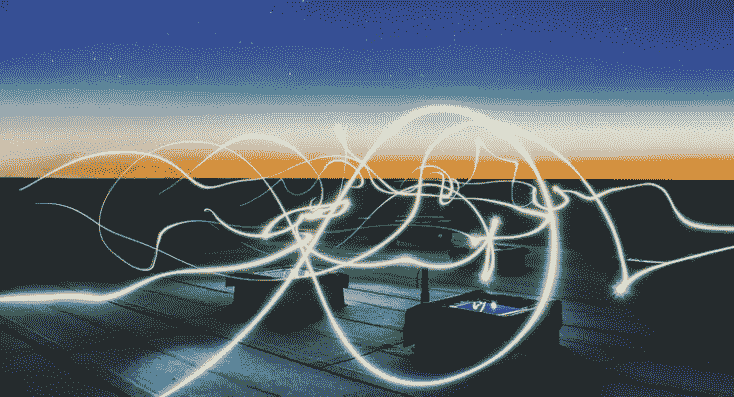

# 城市规划中的增强现实

> 原文：<https://medium.com/nerd-for-tech/augmented-reality-in-urban-planning-56710a90a0fd?source=collection_archive---------1----------------------->

费德里科·贝卡里在 [Unsplash](https://unsplash.com/s/photos/smart-city?utm_source=unsplash&utm_medium=referral&utm_content=creditCopyText) 上的照片

你在历史悠久的哈利法克斯市中心徘徊了一会儿，来到了[公共花园](https://www.novascotia.com/see-do/attractions/halifax-public-gardens/1345)，哈利法克斯是加拿大新斯科舍省的一个中等城市。七月了，万物都要开花了！是时候去看看了。你戴着今年早些时候上市的新[增强现实](https://www.apple.com/ca/augmented-reality/)眼镜，它们帮助你在城市的市中心不迷路，并沿途找到关于这座历史名城的一些好信息。当你漫步进入维护得非常好的花园时，你几乎会忘记你被高耸的建筑包围着。你会看到有趣的树木、植物和花朵，每次你看的时候，你的 AR 眼镜都会弹出一些有趣的仿真物。你甚至可以将一些信息保存到智能手机中，以备后用，然后用智能手机拍照，在社交媒体上与朋友分享。你会有点迷路，但眼镜会告诉你如何导航，甚至会弹出花园边上冰激凌摊的折扣代码。完美！外面很热！

这可能只是我们在不久的将来穿越城市甚至农村中心的一种方式。甚至可能是在通过蜂窝 5G 或类似网络接近数据服务的地区徒步旅行。自从十多年前智能手机推出以来，我们已经将它们深深融入了我们的生活。从笔记、任务管理和财务等个人用途，到通过社交媒体开展更多社交活动。如今，大多数智能手机也能够利用增强现实(AR)实现一些有趣的壮举。但消费者对 AR 的接受度仍然非常低，并且非常局限于小型用例场景。

谷歌希望它能随着谷歌眼镜的推出而腾飞，但这在消费者中失败了，尽管它在工业应用中取得了胜利。Snap 推出了他们的版本，但这些也仍然是小众使用。谣言四起，称苹果将推出自己的产品。也许吧。但是 AR 的使用仍然相当局限于游戏、医学、一些导航和工业用途。

但它可以在城市规划和建筑中发挥关键作用。有一家公司使用 AR 带领客户穿过正在建设的建筑，看看最终的结果会是什么。也许房地产经纪人会用它来帮助潜在买家了解他们可以用房子做什么？

城市规划者可以使用 AR 来放置桥梁，查看重新开发的交通路口，或者获得风如何影响建筑物开发和街道上行人移动的视觉效果。通过与景观设计师合作，他们可以在现实世界中看到带有 AR 覆盖层的地面项目。潜在的大型城市规划项目可以覆盖到前往该地区的市民，如居住在附近的居民，以查看项目并给出反馈。这可以使更多的公民参与这些项目。

可以实现额外的信息层来帮助在城市中寻找道路，在游客四处走动时为他们提供建筑物信息，或者查询附近的博物馆、餐馆和商店。

然而，目前 AR 在城市规划和设计中的应用仍然相当有限。欧洲和北美已经尝试了一些产品和技术的试验，但它们在很大程度上是由学术界推动的，没有明确的商业应用程序走到了前台。一些建筑师开始考虑各种选择，但城市规划者通常在有限的预算内工作，这些技术的开发和部署仍然很昂贵。对于那些买不起智能手机，更不用说智能眼镜的人来说，还有一个包容性的问题。

虽然存在令人兴奋的机会和应用，但 AR 仍然处于主要消费者接受和使用的尖端。智能手机花了十年时间才如此深入地融入我们的日常生活。甚至智能家居技术也停滞不前，看不到太大的增长。

技术可能需要一段时间才能被社会所吸收，今天的快速发展速度远远超过了社会发现价值的能力，无论是社会还是个人，以及如何适应我们当前世界的文化和系统。AR 尚未开发，但在未来的智能城市中拥有巨大的潜力。