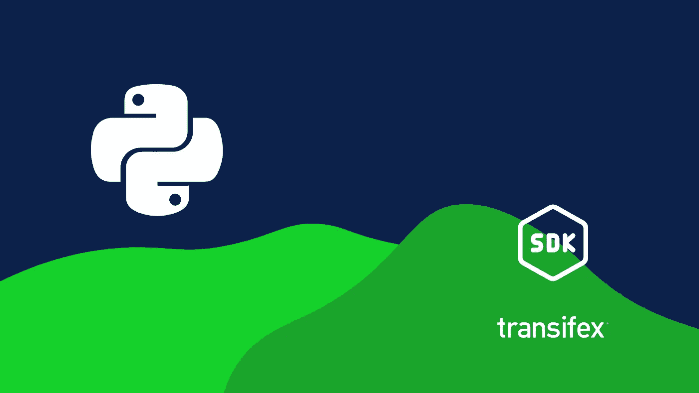

# 使用 TX 的 Python SDK 实现自动化本地化

> 原文：<https://medium.com/nerd-for-tech/automate-localization-with-txs-python-sdk-532a92d32001?source=collection_archive---------14----------------------->



继我们的 [Transifex APIv3](https://transifex.github.io/openapi/index.html) 发布之后，今天我们宣布发布我们的 Python API SDK。

这个 SDK 将是 *transifex-python* 包的一部分，该包也托管我们的 transifex 原生 [Python](https://docs.transifex.com/python-sdk/quickstart) 和[Django](https://docs.transifex.com/django-sdk/quickstart-1)SDK。API SDK 的导入路径为“ *transifex.api* ”,而原生 SDK 的路径将保持为“ *transifex.native* ”。

# 基于{json:api}的 api 和 SDK

正如我们在 [API blogpost](https://www.transifex.com/blog/2020/transifex-api-version-3/) 中讨论的，我们选择遵循 [{json:api}规范](https://jsonapi.org/)的指导方针来开发我们的 API。其中一个主要原因是，通过这种方式，我们的 API 在它期望什么样的请求和它返回什么样的响应方面将是非常可预测的。因此，理解{json:api}原理的集成开发人员可以非常熟悉我们的整个 api。即使他们与其他{ JSON:API } API 合作过，或者只与我们的一小部分进行过交互，也应该如此。

从逻辑上来说，这意味着一个通用的{json:api} SDK 库(一个帮助您创建 SDK 的库)可以应用于 Transifex API，几乎不需要修改。我们研究了现有的{json:api} SDK 库,以便最大限度地减少所需的工作量，但是我们决定构建自己的库，以便充分利用我们的 api 和{json:api}规范提供的功能。

我们自己的“*transi fex . API . JSON API*”SDK 库是我们引以为豪的东西，我们相信它可以成为现有库的有力竞争者。根据我们的 SDK 获得的牵引力，我们很可能自己开源它(尽管你仍然可以通过导入` *transifex.api.jsonapi* `来构建你的 SDK)。它提供了一个类似 ORM 的界面，灵感来自 Django 的 ORM。“实际的”Transifex SDK 是最小的，这可以通过查看源代码来验证，因为几乎所有的功能都是在 SDK 库中实现的。

这种方法为我们提供的主要优势之一是，SDK 可以适应我们的 API 的未来变化，而无需任何更改！例如，我们可能会在 API 端点上引入新的字段或过滤器，而您无需更新您的 SDK 就可以在您的集成中使用这些更新。

作为一名 Transifex 开发者，我几乎每天都在使用这个 SDK。当我想重现我们的用户报告的问题时，我可以快速直观地设置任何项目、资源、翻译等。我也可以在我们的生产环境中这样做，然后测试修复问题前后报告的行为。

# 它是如何工作的

我们从下载 SDK 开始:

```
pip install transifex-python
```

然后我们开始一个脚本:

```
from transifex.api import transifex_api transifex_api.setup(auth="...")
```

“setup”方法的“auth”参数是您从 [Transifex UI](https://www.transifex.com/user/settings/api/) 生成的 API 令牌。

SDK 应该和我们的 [API v3 文档](https://transifex.github.io/openapi/)一起使用。我们首先需要找到我们的组织。观察“/organizations”端点，我们可以看到我们可以利用的“slug”。所以:

```
organization = transifex_api.Organization.filter(slug="my_organization")[0]
# or
organization = transifex_api.Organization.get(slug="my_organization")
```

*(注:`*。all() *`用于确保我们迭代潜在分页响应的所有页面；如果我们不希望有多个页面，我们可以使用`*。list() *`)*

查看文档，我们可以看到:

1.  组织对象与其项目有关系，并且
2.  “/projects”端点有一个我们可以使用的“filter[slug]”过滤器

利用这些事实，确定项目变得更加容易:

```
project = organization.fetch('projects').get(slug="my_project")
```

现在，让我们检查项目团队。查看 API 文档，我们可以看到“/projects”返回的有效负载具有“团队”关系:

```
team = project.fetch('team')
print(team.name)
```

让我们为我们的项目创建并分配一个新的团队(我们再次交叉检查 API 文档，看看在创建新团队时哪些字段是可用的/必需的):

```
old_team = project.fetch('team')
new_team = transifex_api.Team.create(
    organization=organization,
    name="New team",
)
project.change('team', new_team)
```

*(注意:第二次调用* `.fetch()` *不会向服务器发出新的请求，因为团队已经被获取)*

并删除旧团队:

```
old_team.delete()
```

我们刚刚注意到这个项目有“葡萄牙语(巴西)”语言，而我们想要的是普通的“葡萄牙语”。让我们来解决这个问题:

```
pt = transifex_api.Language.get(code="pt")
pt_BR = transifex_api.Language.get(code="pt_BR")
project.remove('languages', [pt_BR])
project.add('languages', [pt])
```

最后，让我们在项目中启用翻译记忆库填充:

```
project.save(translation_memory_fillup=True)
```

你可以在我们的[自述文件](https://github.com/transifex/transifex-python/blob/devel/transifex/api/README.md)中了解更多信息。与任何记录的端点进行交互都使用与您目前看到的完全相同的界面。您现在知道如何与我们的 API 的整体进行交互了！

如果您有任何问题或想了解更多细节，请随时[联系我们](https://www.transifex.com/contact/)或[在我们的 Github repo](https://github.com/transifex/transifex-python) 上发帖。

这个帖子最初是[在这个页面](https://www.transifex.com/blog/2021/how-to-automate-localization-with-transifexs-python-sdk/)上发表的。