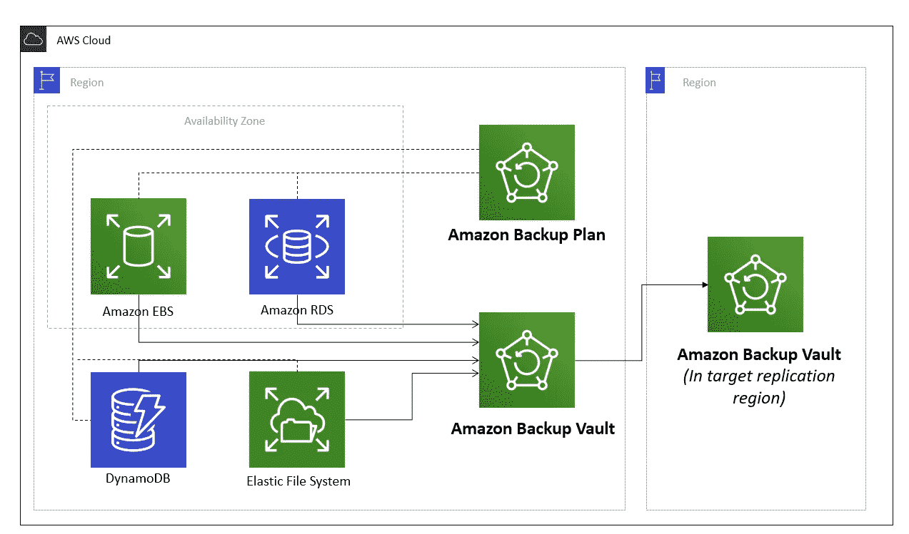
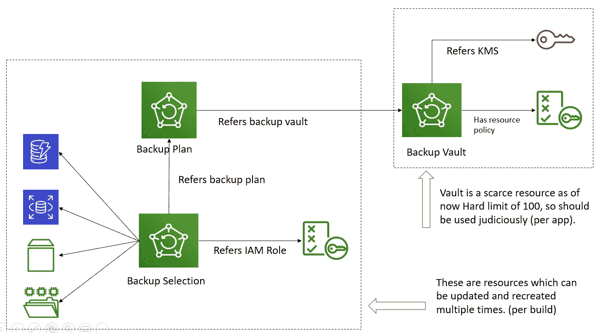
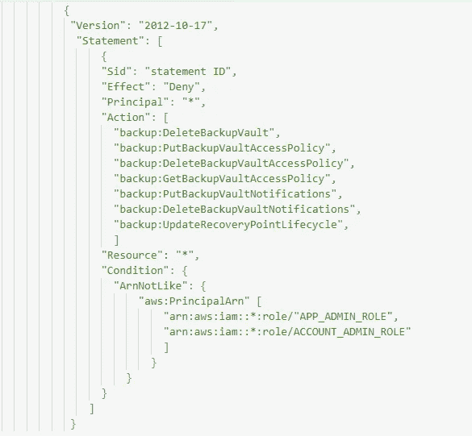
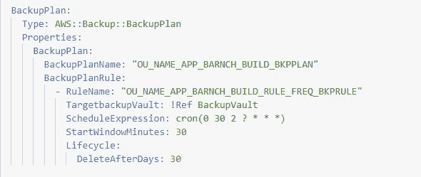
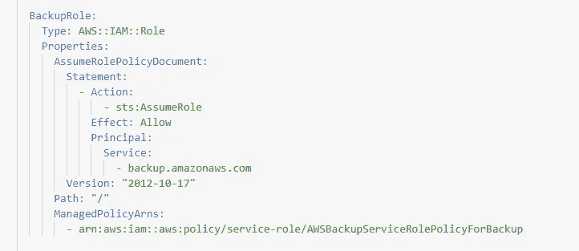
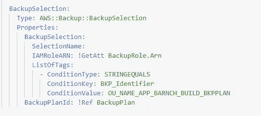

# AWS 备份—集中管理存储合规性

> 原文：<https://medium.com/nerd-for-tech/aws-backup-centrally-manage-storage-compliance-42c5346aefc?source=collection_archive---------1----------------------->

如果您在各种数据服务(如 EBS、EFS、RDS 和 Dynamo)上的 AWS 中存储数据，您必须使用某种备份解决方案来满足数据保留要求。这需要一个强大的解决方案来调度(cloudwatch 事件)、清理(S3 的生命周期配置)、各种服务的通用 api 抽象(每个服务都有自己的快照 API)、高可用性和易维护性。我经历过建立这样的解决方案的痛苦。AWS 备份有助于减轻工作量。

让我们看看这项服务如何适应 AWS 全球基础设施。

因此，AWS 备份与绑定到 AZ 的 EBS 和 RDS 一起工作，而 DynamoDb 和 EFS 是区域性服务。此外，Vault 是一项区域性服务，可以复制到不同的区域，这有助于防止区域故障。

现在让我们来研究一下服务的分层图。

让我们使用 CFN 创建每个子资源。首先，我们需要创建一个保险库。

现在我们添加了访问策略，类似于 S3 桶策略或用于其他服务的资源策略。这决定了谁可以管理和消费。

在这里，我添加了一个拒绝策略，如果呼叫者不是管理员或应用程序所有者。

接下来，我们将创建一个备份计划，作为备份的时间表。

现在，我们将创建一个 IAM 角色，该角色将由备份服务承担。

最后，我们将资源与要备份的某些标记相关联。

一旦我们部署了此 CFN，所有具有标记关键字 BKP 标识符和值 OU _ NAME _ APP _ barn ch _ BUILD _ BKPPLAN 的卷、DynamoDb 表、EFS 和 RDS 都将在下一个时间表(世界协调时第二天 2:30)进行备份。完成后，您可以在控制台中看到作业状态。

根据 AWS 文档和 re:Invent 会话，我们可以推断 AWS backup 使用本机服务功能来构建解决方案。这意味着，当它备份 RDS 时，它使用 CreateDBSanpshot API 调用。这就是为什么服务特定配额适用于此处。这里还要注意的一点是，尽管快照在各自的服务控制台中可见，但它们的生命周期是通过备份来管理的，您无法从服务控制平面更改这一点。

参见 API 调用日志，以上所有调用都是由备份服务进行的，并且所有调用都是服务特定的控制平面调用。

希望这有用。享受阅读！！