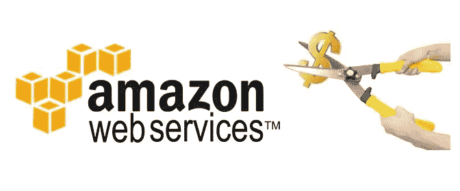
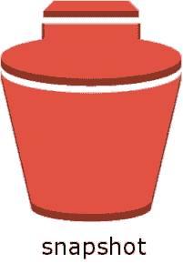

# AWS —关注成本

> 原文：<https://medium.com/nerd-for-tech/aws-keep-an-eye-on-cost-57516a0157cc?source=collection_archive---------19----------------------->

在云世界中，事情变得更加简单，因为我们需要花费更少的时间来设置基础架构、开展运营工作，并且我们可以专注于构建核心业务逻辑。

每当我们构建 AWS 架构或使用任何服务时，仔细考虑所有成本方面是很重要的，忽略这一点可能会给我们带来账单冲击。互联网上有成百上千的文章可以避免这些成本上的意外，我在列表中增加了一条。

构建任何解决方案的主要部分是核心逻辑以及我们将如何使用/使用什么服务，我们应该养成查看这些服务的定价文档的习惯。这里总结了一些有助于成本优化的东西。

**最低收费限制:**AWS 服务有最低收费标准，我们应该在实施任何服务之前了解这些标准。

一些例子是-

> S3 标准 IA 专为较大的对象设计，具有 128KB 的最低对象存储费用和 30 天的最低存储费用。
> 
> 粘合 ETL 作业**——每 DPU 小时 0.44 美元，每秒计费，对于 Apache Spark 类型的每个 ETL 作业，最少 1 分钟(粘合版本 2.0)或最少 10 分钟(粘合版本 0.9/1.0)**
> 
> **AWS Lambda 用于充电的持续时间至少为 100 毫秒。现在在最近的[公告中](https://aws.amazon.com/about-aws/whats-new/2020/12/aws-lambda-changes-duration-billing-granularity-from-100ms-to-1ms/)计费粒度从 100ms 变为 1ms。**

**对于小文件问题，我们可以使用 EMR S3DistCp 将文件合并成更大的文件，只需一次开销。更好的是，在摄取阶段本身，我们可以使用微批处理服务，如具有适当缓冲区大小和缓冲区间隔的 Kinesis Firehose。**

**除了 Spark 作业之外，Glue 还为 python shell 作业提供了选项，在这种情况下，作业可以在最小 0.0625 DPU 上运行。这适用于处理少量数据。For Ex —在红移集群上调度存储过程，因为所有处理都发生在红移集群内，所以我们只需要一台客户机来运行该过程。BTW Redshift 还宣布了针对 SQL 查询的调度器[。有一个很好的 python 库叫做](https://aws.amazon.com/about-aws/whats-new/2020/10/amazon-redshift-supports-scheduling-sql-queries-by-integrating-with-amazon-eventbridge/) [AWSWrangler](https://github.com/awslabs/aws-data-wrangler) ，它可以在 Glue shell 工作中使用，以便与 AWS 服务(如 S3/雅典娜/红移)轻松集成。**

****

****快照费用:**快照非常昂贵，我们需要仔细考虑备份保留期，并删除不需要的手动快照。RDS 快照成本核算的工作原理如下:**

> **对于一个地区，不超过总数据库存储容量 100%的备份存储不收取额外费用。额外的备份存储每月每 GiB 0.095 美元。**

**如果出于合规性原因，企业需要将快照保留更长时间，请考虑逻辑备份，并将这些备份保存在 S3 (Standard/IA/Glacier)上。RDS 引入了[快照导出功能](https://aws.amazon.com/about-aws/whats-new/2020/01/announcing-amazon-relational-database-service-snapshot-export-to-s3/)，使用该功能可以将快照导出到 S3 上的高效拼花格式，并使用 Athena 进行查询。这里要考虑的重要一点是，与快照备份恢复相比，将逻辑备份恢复到数据库将花费更多的时间。**

****意外账单:**虽然 S3 和冰川存储成本众所周知，但有时我们会忽略从 S3 到冰川的生命周期转换成本。当我们希望降低转换大量数据的成本，但这种转换活动可能会增加费用时。**为什么？****

*   **AWS 向 Glacier 收取每 1000 个 put 请求 0.05 美元的费用，因此大量的小文件转换会增加成本。**
*   **Glacier 为每个文件添加了 32Kb 的元数据。同样，如果我们有数百万个小文件，32Kb 的开销会比预期的多。**

***更新* **:** AWS 最近[宣布](https://aws.amazon.com/about-aws/whats-new/2021/03/amazon-s3-glacier-announces-price-reduction-for-put-and-lifecycle-requests/)从 S3 到冰川的数据转换降价。**

****与其他服务的集成/使用:**使用 Athena/Redshift 频谱时，我们知道价格是每 TB 扫描数据 5 美元。这里我们还需要考虑其他相关的成本构成。**

*   **数据存储导致的 S3 成本。**
*   **Athena/Spectrum 正在获取 S3 对象的请求。**
*   **KMS 收费，如果加密启用。**
*   **雅典娜结果集对 S3 的指控。**

****CPU 限制的许可成本:**当使用 EC2 机器用于外部软件时，这些软件根据 CPU 的数量收费，我们可以考虑使用 z1d 实例。**

****其他:**成本优化与最新功能:**

*   **红移数据 Api——使用红移数据 Api，我们可以异步运行查询，并且不需要等待确认。**
*   **Aurora 快速克隆—如果我们需要测试某些功能，我们可以创建 Aurora 快速克隆。这节省了存储成本，因为存储最初是共享的(直到我们进行数据块更改)。**
*   **AWS 实例调度器——这是一个很好的工具，可以在您定义的时间自动启动/停止 RDS/EC2。**
*   **GP3 卷**—借助最近发布的 GP3 卷，IOPS 和吞吐量可以扩展，而无需调配额外的数据块存储容量。****

******数据传输成本:**终端服务可以降低数据传输成本，使数据不需要通过互联网传输，也更加安全。****

****我最近在 Postgres Aurora 集群中使用 CloudWatch 日志记录的一个经验是，CW 日志记录每月花费我们大约 5000 美元。经过进一步检查，我注意到 db 参数 log_statement 被设置为“all ”,而我们只想审计“ddl”语句。我更改了 db 参数以减少日志记录，并将 CW 日志组的保留时间设置为 1 个月。****

******结束语:**
所有 AWS 服务都在快速发展，AWS 不断推出新功能。我们必须与即将到来的新变化保持同步，以构建和改进我们的架构。****

****AWS 提供了一些工具来建议成本优化机会，如值得信赖的顾问、计算优化器。此外，还有许多外部参与者，他们收取一些费用，作为对您节省成本的回报。最近开始了解[颗粒](https://granulate.io/)。我将探索一下，有趣的是，在没有任何代码更改的情况下，它们是如何带来如此多的价值的。****