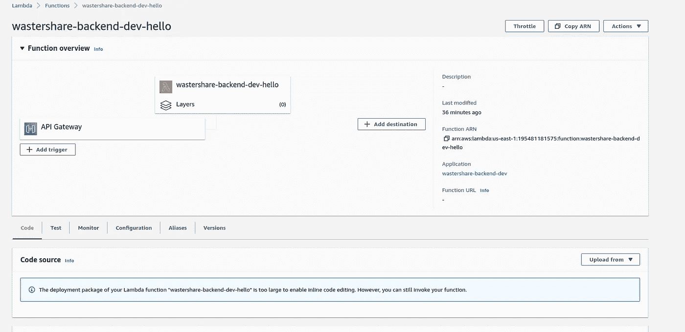

# AWS Lambda +无服务器+ Kotlin Waste share 应用程序系列—创建用户 API — DynamoDB 设置

> 原文：<https://medium.com/nerd-for-tech/aws-lambda-serverless-kotlin-waste-share-app-series-creating-the-user-api-dynamodb-setup-bd56f0a1d996?source=collection_archive---------0----------------------->

大家好，在我们的上一个教程中，我们学习了如何用无服务器和 kotlin 创建一个简单的 lambda 函数。在本教程中，我们将使用这些技术创建一个完整的 API。要访问上一个教程，请使用以下链接

[](/nerd-for-tech/aws-lambda-serverless-kotlin-waste-share-app-series-intro-ef3adc8f0d57) [## AWS Lambda +无服务器+ Kotlin 废物共享应用程序系列—简介

### 因此，在开始创建应用程序之前，我只是想让你们知道，我们正在为此实现后端…

medium.com](/nerd-for-tech/aws-lambda-serverless-kotlin-waste-share-app-series-intro-ef3adc8f0d57) 

现在，在深入研究用户 API 之前，让我们先回顾一下之前创建的 lambda 函数。如果我们登录到我们的 AWS 帐户，并转到 lamda 函数服务，我们的 waste share 函数将被列为 wastershare-backend-dev-hello。如果你点击它，你会看到这样的东西。



> 在这里，当您创建和部署 Kotlin 项目时，如果没有这个 API 网关，您可以使用+Add trigger 按钮手动创建它。

现在，如果我们试图理解这个图，我们这里有我们创建的 lambda 函数，然后是 API 网关，它提供了对这个函数的公共访问。因此，我们在上一个教程中创建的是一个 get 请求。如果我们在不使用无服务器的情况下这样做，并且对于我们将要创建的**用户 API** ，可能至少有 4 个端点，那么我们将必须分别创建 4 个不同的 lambda 函数。但是无服务器框架的酷之处在于它创建了我们在 AWS 的 serverless.yml 文件中定义的所有东西。

现在，为了实现最佳实践，让我们创建两个文件夹作为处理程序和响应，并将我们已经创建的文件放入这些文件夹中。我们的 lambda 函数将是处理程序类，所有其他文件只是支持文件。对于我们的用户 API，我们在这个阶段有 6 个不同的端点。

*   增加
*   编辑
*   删除
*   获取所有用户
*   获取一个用户
*   编辑状态

有了上一段的知识，你应该知道，现在我们必须创建 6 个处理程序类来处理每一个场景，这些类必须包含在带有端点路径的 serverless.yml 文件中。

现在，在开始创建处理程序类之前，让我们决定在这个应用程序中使用什么数据库。因此，选择数据库时的主要问题是，我们是否将拥有大量数据。如果是这样的话，Aurora 和 DynamoDB 都是选项。但是如果我们没有复杂的查询，我们可以使用 Dynamo DB。所以要添加 DynamoDB，我们只需像这样编辑我们的 serverless.yml 文件。

```
service: wastershare-backend
frameworkVersion: '3'

provider:
  name: aws
  runtime: java11
  environment:
    DYNAMODB_CUSTOMER_TABLE: ${self:service}-userTable-${sls:stage}
  iam:
    role:
      statements:
        - Effect: 'Allow'
          Action:
            - 'dynamodb:PutItem'
            - 'dynamodb:Get*'
            - 'dynamodb:Scan*'
            - 'dynamodb:UpdateItem'
            - 'dynamodb:DeleteItem'
          Resource: arn:aws:dynamodb:${aws:region}:${aws:accountId}:table/${self:service}-userTable-${sls:stage}

package:
  artifact: build/libs/hello-dev-all.jar

functions:
  hello:
    handler: com.serverless.Handler

resources:
  Resources:
    UsersTable:
      Type: AWS::DynamoDB::Table
      Properties:
        AttributeDefinitions:
          - AttributeName: primary_key
            AttributeType: S
        BillingMode: PAY_PER_REQUEST
        KeySchema:
          - AttributeName: primary_key
            KeyType: HASH
        TableName: ${self:service}-userTable-${sls:stage}
```

在这里，我们为 provider 设置了一组值，并在这里设置了一个新的资源。所有这些都是为了配置 DynamoDB 表。让我们在下一个教程中讨论 API 创建任务。快乐编码:)