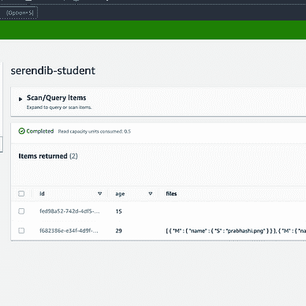

# AWS Lambda Typescript(慈善网站应用程序)—连接到 DynamoDB 的学生服务

> 原文：<https://medium.com/nerd-for-tech/aws-lambda-typescript-charity-web-app-student-service-connected-to-dynamodb-814405a95f3f?source=collection_archive---------3----------------------->

嘿伙计们！！！在上一个教程中，我们处理了学生服务的基本 CRUD 操作。我们写了一些返回硬编码值的伪方法。在本教程中，我们将更进一步，将我们的服务连接到一个 DynamoDB。链接到我们到目前为止所做的事情。


迪穆图·维克拉马那亚克

## AWS Lambda(慈善网络应用)系列

[View list](https://billa-code.medium.com/list/aws-lambda-charity-webapp-series-cd878238f932?source=post_page-----814405a95f3f--------------------------------)5 stories

DynamoDB 是一种 nosql 类型的数据库。因为我们的用例非常小，所以我要用这个。在进行任何逻辑更改之前，我们必须在 template.yaml 文件中包含我们的新基础结构。所以还是更新一下吧。

```
AWSTemplateFormatVersion: '2010-09-09'
Transform: AWS::Serverless-2016-10-31
Description: serendib-scholarship-ws
Globals:
  Function:
    Timeout: 3

Resources:
  StudentFunction:
    Type: AWS::Serverless::Function
    Properties:
      CodeUri: student/
      Handler: app.lambdaHandler
      Runtime: nodejs16.x
      Architectures:
        - x86_64
      **Policies:
        - DynamoDBCrudPolicy:
            TableName: !Ref SampleTable
      Environment:
        Variables:
          SAMPLE_TABLE: !Ref SampleTable**
      Events:
        Student:
          Type: Api
          Properties:
            Path: /student
            Method: get
    Metadata:
      BuildMethod: esbuild
      BuildProperties:
        Minify: true
        Target: "es2020"
        EntryPoints: 
        - app.ts

  **SampleTable:
    Type: AWS::Serverless::SimpleTable
    Properties:
      PrimaryKey:
        Name: id
        Type: String
      ProvisionedThroughput:
        ReadCapacityUnits: 2
        WriteCapacityUnits: 2**

**Outputs:
  WebEndpoint:
    Description: "API Gateway endpoint URL for Prod stage"
    Value: !Sub "https://${ServerlessRestApi}.execute-api.${AWS::Region}.amazonaws.com/Prod/"**
```

我已经删除了许多多余的代码。因此，如果你看到一个大的变化，从以前的文件，不要担心。现在，正如你所看到的，我已经创建了一个动态表，现在让我们在处理程序中实现更改。首先，您必须更新 package.json 文件以包含一些依赖项。

```
{
  "name": "student",
  "version": "1.0.0",
  "description": "Student service for serendib scholarship ws",
  "main": "app.js",
  "repository": "https://github.com/deBilla/serendib-scholarship-ws/student",
  "author": "SAM CLI",
  "license": "MIT",
  "dependencies": {
    **"@aws-sdk/client-dynamodb": "3.194.0",
    "@aws-sdk/util-dynamodb": "3.194.0",
    "@aws-sdk/lib-dynamodb": "3.194.0",**
    "esbuild": "^0.14.14"
  },
  "scripts": {
    "unit": "jest",
    "lint": "eslint '*.ts' --quiet --fix",
    "compile": "tsc",
    "test": "npm run compile && npm run unit"
  },
  "devDependencies": {
    "@types/aws-lambda": "^8.10.92",
    "@types/jest": "^27.4.0",
    "@types/node": "^17.0.13",
    "@typescript-eslint/eslint-plugin": "^5.10.2",
    "@typescript-eslint/parser": "^5.10.2",
    "esbuild-jest": "^0.5.0",
    "eslint": "^8.8.0",
    "eslint-config-prettier": "^8.3.0",
    "eslint-plugin-prettier": "^4.0.0",
    "jest": "^27.5.0",
    "prettier": "^2.5.1",
    "ts-node": "^10.4.0",
    "typescript": "^4.5.5"
  }
}
```

记住把它们放在 dependencies 部分，而不是 devDependencies 部分(我得到了一个错误)。现在，在处理程序文件中，我们要做的第一件事是初始化 DynamoDB 的 DB 客户端。之后，对于每个 CRUD 操作，我们可以实现代码。

```
import { APIGatewayProxyEvent, APIGatewayProxyResult } from 'aws-lambda';
**import { DynamoDBClient,  ScanCommand, PutItemCommand, GetItemCommand, DeleteItemCommand, UpdateItemCommand } from "@aws-sdk/client-dynamodb";
import { marshall, unmarshall } from "@aws-sdk/util-dynamodb";**
**import { v4 as uuidv4 } from 'uuid';**

**const tableName = process.env.SAMPLE_TABLE;
const client = new DynamoDBClient({ region: "us-east-1" });**

export const lambdaHandler = async (event: APIGatewayProxyEvent): Promise<APIGatewayProxyResult> => {
    let results: any;
    let response: APIGatewayProxyResult;

    try {
        switch (event.httpMethod) {
            case 'GET':
                if (event.pathParameters.id != *null*) {
                    results = await getStudent(event.pathParameters.id);
                } else {
                    results = await getStudents();
                }

                break;
            case 'POST':
                results = await createStudents(event);
                break;
            case 'PUT':
                results = await updateStudents(event)
                break;
            case 'DELETE':
                results = await deleteStudents(event.pathParameters.id)
                break;
            default:
                throw new Error('Unidentified event!!!');
        }

        response = {
            statusCode: *200*,
            body: JSON.stringify({
                message: results,
            }),
        };
    } catch (err: unknown) {
        console.log(err);
        response = {
            statusCode: *500*,
            body: JSON.stringify({
                message: err instanceof Error ? err.message : 'some error happened',
            }),
        };
    }

    return response;
};

const getStudents = async () => {
    **try {
        const params = {
            TableName : tableName
        };
        const { Items } = await client.send(new ScanCommand(params));

        return Items;
    } catch (e) {
        throw e;
    }**
}

const getStudent = async (studentId: string) => {
    **try {
        const params = {
            TableName: tableName,
            Key: marshall({ id: studentId })
        };

        const { Item } = await client.send(new GetItemCommand(params));

        return (Item) ? unmarshall(Item) : {};
    } catch(e) {
        throw e;
    }**
}

const createStudents = async (event: APIGatewayProxyEvent) => {
    **try {
        const student = JSON.parse(event.body);
        const studentId = uuidv4();
        student.id = studentId;

        const params = {
            TableName: tableName,
            Item: marshall(student || {})
        };

        return await client.send(new PutItemCommand(params));
    } catch(e) {
        throw e;
    }**
}

const updateStudents = async (event: APIGatewayProxyEvent) => {
    **try {
        const requestBody = JSON.parse(event.body);
        const objKeys = Object.keys(requestBody);   

        const params = {
          TableName: tableName,
          Key: marshall({ id: event.pathParameters.id }),
          UpdateExpression: `SET ${objKeys.map((_, index) => `#key${index} = :value${index}`).join(", ")}`,
          ExpressionAttributeNames: objKeys.reduce((acc, key, index) => ({
              ...acc,
              [`#key${index}`]: key,
          }), {}),
          ExpressionAttributeValues: marshall(objKeys.reduce((acc, key, index) => ({
              ...acc,
              [`:value${index}`]: requestBody[key],
          }), {})),
        };

        return await client.send(new UpdateItemCommand(params));
    } catch(e) {
        console.error(e);
        throw e;
    }**
}

const deleteStudents = async (studentId: string) => {
    **try {
        const params = {
          TableName: tableName,
          Key: marshall({ id: studentId }),
        };

        return await client.send(new DeleteItemCommand(params));
    } catch(e) {
        throw e;
    }**
}
```

如果您仔细查看 app.ts 文件，可以看到我们在环境变量中保留了表名。因此，当进行本地 Lambda 调用时，这需要被检索。为此我创建了另一个名为 env.json 的 json 文件。

```
{
    "StudentFunction": {
        "SAMPLE_TABLE": "serendib-student"
    }
}
```

在这之后，如果我们还没有将 Lambda 函数部署到云上，我们可以做的只是进入 AWS 帐户，创建一个名为 **serendib-student** 的 DynamoDB 表。

在继续之前，为了让您的本地终端访问 AWS 帐户，您应该提供相关的安全令牌。创建这些令牌的方法可以在我以前的一篇文章中找到。为了方便起见，我用粗体字标出了访问键描述的字母。

[](/nerd-for-tech/aws-certified-solution-architect-iam-8930ce442515) [## AWS 认证解决方案架构师— IAM

### IAM 的意思是身份和访问管理服务。当我们在之前的教程中创建 AWS 帐户时，我们…

medium.com](/nerd-for-tech/aws-certified-solution-architect-iam-8930ce442515) 

设置访问密钥并下载文件后，使用以下命令将其导出到环境中。

```
export AWS_ACCESS_KEY_ID=<YOUR_KEY>
export AWS_SECRET_ACCESS_KEY=<YOUR_SECRET>
export AWS_DEFAULT_REGION=us-east-1
```

之后我们像这样调用 Lambda 函数。

```
sam local invoke StudentFunction --event events/student_post.json --env-vars env.json
```

您可以看到我在命令中包含了 env.json。对于每个 CRUD 操作，我都更新了事件。这些可以从这个链接中查看。

[](https://github.com/deBilla/serendib-scholarship-ws/tree/main/events) [## seren DIB-奖学金-ws/main deBilla/seren DIB 的活动-奖学金-ws

### 奖学金。在 GitHub 上创建一个帐户，为 deBilla/seren DIB-scholarship-ws 开发做贡献。

github.com](https://github.com/deBilla/serendib-scholarship-ws/tree/main/events) 

您可以尝试调用不同的事件，在事件文件中，请将 id 更新为您自己的数据库中创建的 id 之一。所以这几乎是所有与此相关的东西。现在剩下的是为我们的应用程序实现文件上传。我将在另一个教程中讨论它。[该应用的 Github 链接可以在这里找到](https://github.com/deBilla/serendib-scholarship-ws)。直到那时快乐编码！！！:p