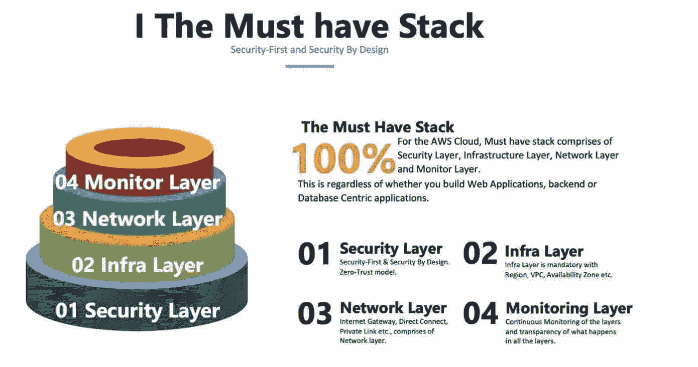
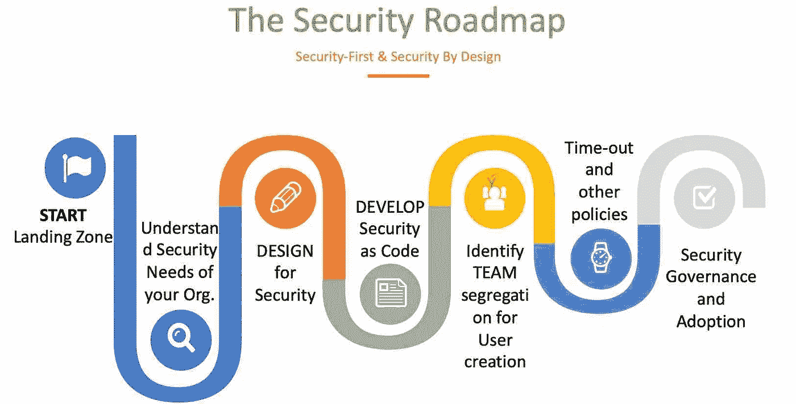
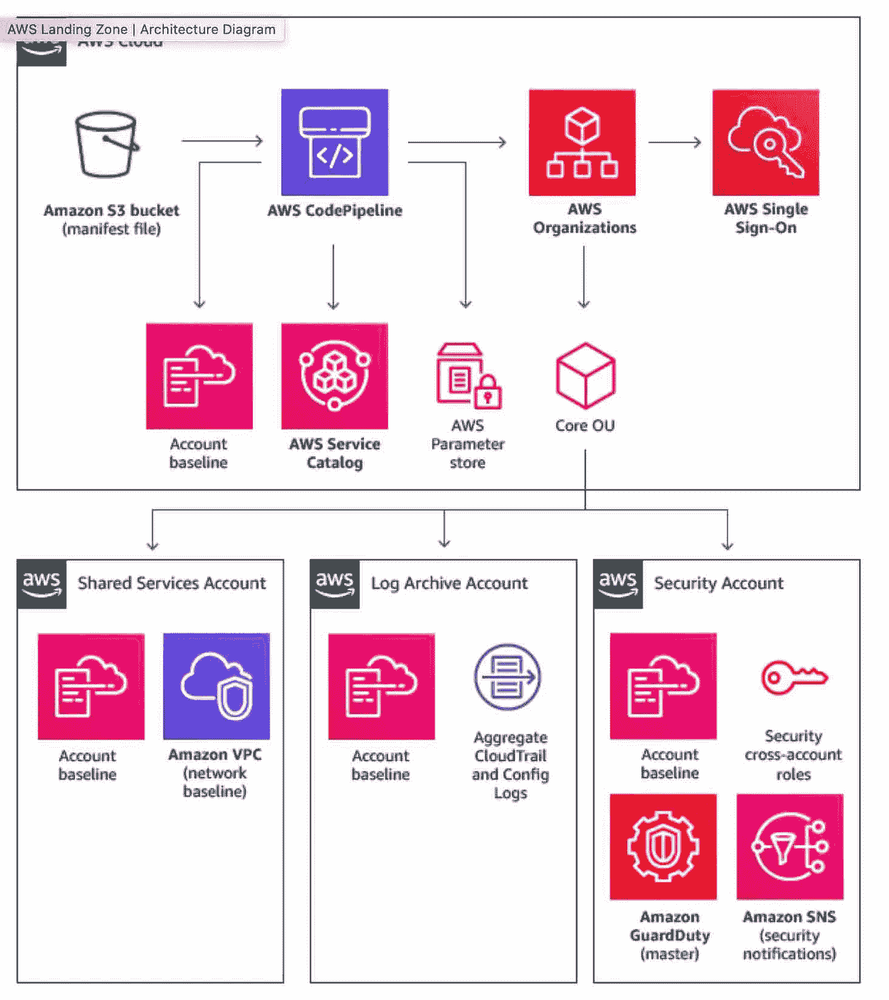
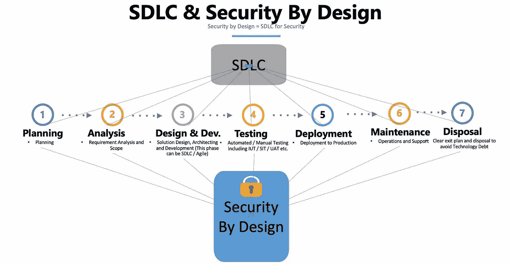
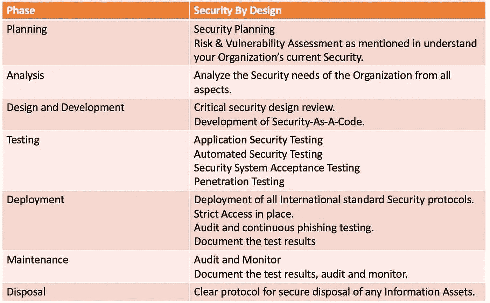
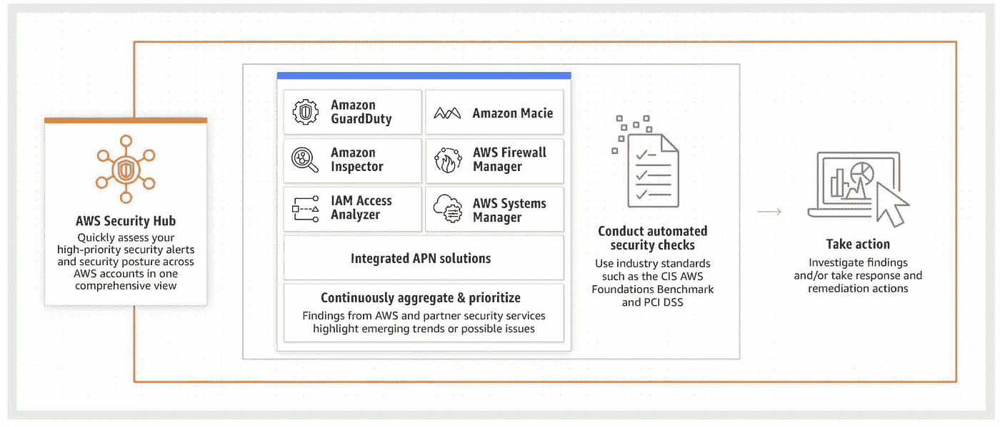
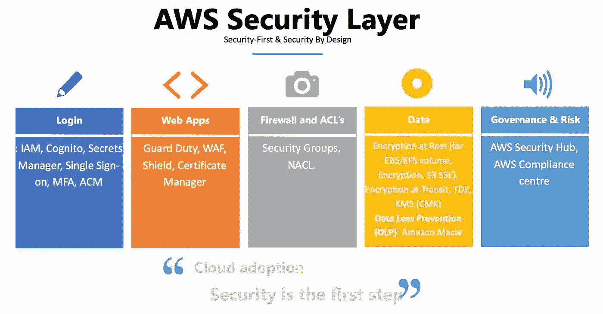

# AWS 系列#2:云安全路线图

> 原文：<https://medium.com/nerd-for-tech/aws-series-2-cloud-security-roadmap-c53df433a243?source=collection_archive---------4----------------------->

AWS 系列的这一部分是关于**云安全路线图**。您必须了解多少安全性被认为是必要的，以及什么被认为是您的组织的过度安全架构。一个好的规则是，将所有数据和信息资产视为严格私有，在向用户提供访问权限时，采用受限的、基于需求的、极其保守的方法。安全层是“必备堆栈”的一部分，处理安全层的第一个基本步骤是为您的组织制定一个清晰的安全路线图。

在开始考虑云安全的“S”之前，组织必须有一个**云安全专家**和团队来制定路线图和安全层。团队的规模取决于公司的规模。虽然安全团队可能已经实施了强大的安全协议，并且在本地环境中运行良好，但云是另一回事，云安全专家和本地安全专家必须携手合作，制定清晰的云安全路线图并设计 AWS 安全层。我不是 AWS 云安全专家。本文是围绕我正在编写的四个堆栈的 AWS 系列文章的一部分。以下内容仅作为指示/代表，不得视为蓝图。提到的 AWS 云安全必须由组织的“云安全专家”设计。话虽如此，但每个人都必须意识到这一点，并且必须在整个组织中实施安全性。

# 您将如何确保您的组织遵循安全第一的体系结构:

如今，每个组织都是一个“互联网组织”，组织都在朝着采用云的方向发展。所有使用公共/私有/云计算的组织都暴露在各种“网络安全威胁”之下，确保采用安全第一的方法变得非常重要，不再是可选的。DevSecOps / SecOps 是一个新兴领域，它与应用程序/平台架构和软件开发生命周期有效地集成在一起。为了实施安全第一的架构，每个组织都必须有一个强大的安全设计框架，在公司内部采用这一框架必须是所有参与云相关工作的人的 KPI 的一部分。

## 通过设计构建安全性框架:

无论您的组织规模如何，安全性都是关键，尤其是对于云架构，组织必须拥有强大的安全性设计框架。本文是关于如何通过设计框架来构建安全性，并为您的组织采用安全第一的方法。安全性不是事后才想到的，作为架构一部分的所有产品和服务都必须包含在安全性中。在为您的组织设计安全框架之前，您需要了解以下内容

作为贵组织技术风险管理流程的一部分，必须维护和更新威胁和风险登记簿。设计安全固然重要，但如何应对威胁以及采取何种流程来防范威胁也很重要。大多数国家/州/市的技术风险管理指南将建议公司采取什么、如何、何时、何地以及哪些安全和治理措施。这是公司审计流程的一部分，必须提供和调查，任何发现都必须在规定的期限内解决。

## 1.建立并维护威胁和风险登记册

1.  定义贵公司面临/可能面临的所有类型的威胁。
2.  最敏感的数据和遵循的数据保护协议类型包括静态加密、传输加密和使用加密。

## 2.评估贵公司的当前政策、补救管理和日常工作

## 3.拥有可靠、结构化、简单、可采用且可衡量的安全路线图。

## 4.持续评估和衡量您公司的安全策略

# 着陆区:

AWS **登录区是为您的组织**设置安全的多帐户环境的重要第一步。撰写本文时(2021 年 6 月)，AWS 着陆区提供长期支持，喜欢使用着陆区的组织必须通过 [AWS 控制塔](https://aws.amazon.com/controltower/faqs/)和 AWS 控制塔定制来使用。在了解组织的安全需求之前或之后创建着陆区都是可以的，因为着陆区本身将指导需要做什么，并将带您走向正确的方向。

AWS 登陆区包括 4 个账户 **(1)组织账户(2)共享服务账户(3)登录阿奇账户(4)安全账户**。附加产品也可以使用 AWS 服务目录进行部署，例如集中式登录解决方案和 AWS 管理的 AD 和目录连接器，用于 AWS 单点登录。

参考:自动气象站着陆区。

## (1)组织账户:

登录区已创建并部署到 AWS 组织帐户中。提供创建和财务管理用户帐户的能力。使用此帐户，您可以配置登录区配置、S3 存储桶和管道、组织的服务控制策略和单点登录。

## (2)共享服务账户:

此帐户是创建共享服务(如目录服务)的参考。该客户托管跨多个 AWS 服务的 AD、SSO 集成。

## (3)日志归档账号:

此帐户包含中央 S3 存储桶，用于在日志归档帐户中存储监控工具 CloudTrial 和 AWS 配置文件的所有副本。

## (4)安全账户:

此帐户创建(1)审计员的只读权限(2)从帐户到所有 AWS 登录区管理帐户的管理交叉帐户角色的读写权限。

# 了解您组织的安全需求:

为了了解您组织的安全需求，您首先需要了解**您的组织面临哪些安全威胁**，如果您迁移云，您可能面临哪些**潜在威胁**。安全设计应该贯穿于各个层面

1.  围绕云基础架构的安全防护
2.  登录安全性
3.  从 AWS 添加的每项服务和产品都采用安全第一的设计。
4.  数据安全
5.  网络服务器和日志等的安全。

这将作为 AWS 安全层的一部分进一步讨论。

在继续进行安全的目标状态之前，了解现有的现状安全以及您希望潜在地向期望的状态前进的地方，对安全进行清晰和结构化的差距分析是必须的。

对于上述大部分情况，作为技术风险管理(TRM)和监管需求的一部分，应记录并维护适当的风险登记和行动。作为云安全路线图练习的一部分，必须阅读和理解现有的，以便可以将云安全部分修改为现有的 TRM。

**一般风险评估:**

1.  公司中所有信息资产的列表，包括数据、源代码、客户信息、业务关键信息等。对公司至关重要的。
2.  所有业务流程的威胁和漏洞列表。
3.  如果面临任何风险，有哪些法律、财务和运营风险。
4.  衡量这种风险的标准方法是什么？
5.  现有的风险监控、报告、审查和处理机制是什么？

**加密评估:**

1.  哪些信息资产必须受到保护，在何种安全协议下受到保护，如 HIPPA、PII 等。
2.  公司当前的加密实践、算法和协议是什么，使用的是什么产品。
3.  如何确保加密算法的安全性、损坏，如何对加密算法执行网络钓鱼测试，
4.  目前如何监控加密技术的使用。
5.  密钥和算法在内部以及与外部提供者轮换的频率。加密密钥管理协议。密钥过期、密钥撤销等。

**网络安全漏洞评估:**

1.  识别网络安全威胁和潜在漏洞。
2.  公司在过去 3 年中遭受了何种网络安全威胁，采取了何种处理和补救措施。
3.  现有的网络安全渗透测试协议、网络安全演习、网络事件检测方法和工具。
4.  网络事件响应管理以及最大法律行动、处罚等。，由公司因某一事件支付。

**数据安全需求:**

1.  数据/信息资产登记以及组织内哪些是易受攻击的数据或信息资产。
2.  有哪些不同种类的数据资产，如个人数据、客户数据、财务数据、图像、物联网等。以及它们中的每一个是如何被保护的，以及用来保护的国际标准和协议是什么。
3.  数据威胁、泄露、罚款、数据锁定问题和付款等。，是在过去 3 年中制作的，它的哪一部分受到了损害，补救措施是什么。
4.  当前的数据虚拟化水平。
5.  数据访问和共享协议。

**基础设施安全需求:**

1.  当前硬件和软件基础设施以及采用的国际标准。
2.  列出现有的早期检测方案的工具和标准。
3.  端点保护、系统环形防护等。，就位
4.  妥协、威胁、罚款、锁定和支付等的数量。，是在过去 3 年中制作的。
5.  当前病毒化水平。
6.  系统访问协议。

**网络安全需求:**

1.  发生的网络入侵次数、违反网络访问控制等。以及过去 3 年中发生的事故、罚款和支付的款项。
2.  拒绝服务和网络攻击列表和补救。
3.  局域网和广域网安全协议和隔离到位。
4.  服务器和公共系统中的互联网和网页浏览，以及允许和拒绝网站和服务。
5.  网络安全设备、网络访问控制、DDoS 保护等。就位。

# 为安全而设计或通过设计实现安全:

安全设计必须与 SDLC 和技术风险管理相结合。适用于 SDLC 的内容也适用于安全性。

## 基于设计生命周期和框架的安全性:

**安全设计生命周期**必须遵循**软件开发生命周期**(更多步骤取决于组织)。

除此之外，建立清晰的控制关口、完善的监控协议和风险的早期检测也是必不可少的。

基于组织的规模和类型(金融、医疗保健、制造等。)组织必须根据上述生命周期建立明确的安全设计框架。

# 开发安全代码:

与基础设施即代码一样，**安全性即代码**是安全性设计的最佳实践，因此可以建立标准、治理和所需的协议，并且是核心的，对法规或合规性的任何更改都在一个位置受到影响，而不是通过设计拥有多个移动组件来实现安全性。安全即代码是关于将安全性构建到开发工具和实践中，即**开发工具 CI/CD。**

就像 [12 因子 App](https://12factor.net) 包含了无服务器设计的所有基本要素一样，安全代码包含了不同类型应用程序所需的所有安全协议，并且必须在任何系统设计之前包含这些协议。这确保了整个基础设施和每一个组件都是安全的。一旦集成到 DevOps 中，它就是组织设计和交付的任何应用程序的重要组成部分，无论是面向内部还是面向外部。随着软件的开发，您将软件的目的记在心里，并试图达到最终状态，安全性可能经常受到损害。对于代码安全性，安全性也是软件最终目的的一部分。安全即代码的关键组件包括

1.  安全测试
2.  漏洞扫描
3.  访问限制和策略控制

随着大多数公司转向 DevOps 模式，实施 DevSecOps 可确保公司设计和开发了安全产品，能够更快地响应任何**安全或合规性变化，更轻松地应对威胁，更好地跨业务部门和团队协作，更好地实现安全自动化，增加应用程序安全测试，安全知识因其可见性而变得容易，因快速漏洞扫描而使发布变得更容易、更简单，等等。，安全补丁和升级可以更快地完成。**

# 为用户创建确定团队隔离和用户:

一旦 DevSecOps(安全设计的基本要素)就位，为每种不同类型的应用程序清楚地标识管理员、超级用户、超级用户和简单用户，并在策略级别将他们关联起来，就成为安全代码的一部分。谁应该访问什么，以什么级别访问，公司在数据访问方面应该有多保守，等等。将在中央公司层面上定义，它不需要本质上是一个独立团队的决策。将有现成的策略可用，此阶段的唯一工作是简单地将用户附加到此类策略，以便用户和创建的隔离和访问不仅更简单，而且高度符合组织的中央安全系统。因此，审计、监控和收集问题变得更加容易，威胁的早期识别也变得更加简单。

# 超时和其他策略:

有了 DevSecOps，不同级别的策略(包括超时和其他几个策略)都得到了很好的定义和配置。上一节所述的大多数方法。

# 安全治理和采用:

## 安全中心和 AWS 组织:

[安全中枢](https://docs.aws.amazon.com/organizations/latest/userguide/services-that-can-integrate-securityhub.html)提供 AWS 中安全状态的全面视图，并支持根据安全行业标准和最佳实践检查您的环境。它收集您使用的 AWS 帐户和服务(包括第三方)的安全数据，识别并报告任何最高优先级的安全问题。如果安全中心与 AWS 组织一起使用，则会自动为所有帐户启用安全中心。

参考文献:AWS

## 云安全治理:

1.  严格执行**开发和安全设计**
2.  **达马还是 DCAM** —数据治理和安全
3.  AWS 博客中关于云安全的一个很好的参考。
4.  [Drew Firment](https://medium.com/u/7d7993c5880e?source=post_page-----c53df433a243--------------------------------) 有几篇关于云治理的精彩参考文献。

注意:文章的这一部分将在不久的将来更新。

## AWS 合规中心:

AWS Compliance Center 针对与云相关的法规要求，支持研究您所在行业对相关国家/地区的影响。您可以直接联系 AWS，为您的组织感兴趣的国家启用此功能。

*好处:*

*   确定法规要求
*   浏览特定国家的资源
*   了解 AWS 合规计划。

# AWS 安全层:

接下来的 5 篇系列文章是关于 AWS 安全层的。

AWS 安全层

母篇: [AWS 多件套系列。](/nerd-for-tech/aws-series-multi-part-series-on-aws-cloud-and-related-guidelines-c7c2437f1639?source=your_stories_page-------------------------------------)