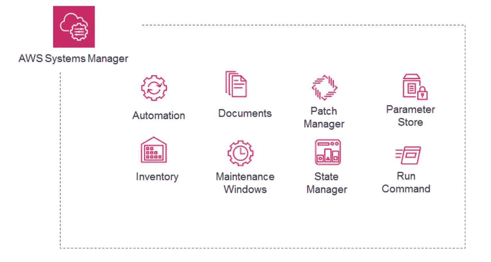
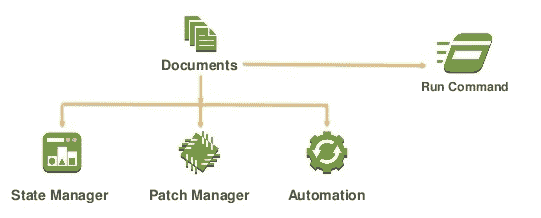

# AWS 系统经理|在一个地方获得运营见解

> 原文：<https://medium.com/nerd-for-tech/aws-system-manger-gain-operational-insights-at-one-place-a26b0cbd65b7?source=collection_archive---------5----------------------->

在我们研究 System Manager 提供的服务之前，我们需要先讨论一下代理。沉住气。不是詹姆斯·邦德或特工玛丽亚·希尔。它的 ssm 代理。它是系统管理器的核心。

SSM 代理是桥梁，让我们进入我们的服务器，而不用担心太多。SSM 代理使系统管理器能够更新、管理和配置服务器。我们必须在要与 Systems Manager 一起使用的每台服务器上安装 SSM 代理。它预装在某些 AWS AMIs 上。现在我们可以转到系统管理器。

AWS Systems manager 是一项基于代理的服务，它让我们能够对我们的服务器进行操作控制。这些服务器可能在 AWS 上，也可能在本地或虚拟机上，或者在不同的云提供商上。这些服务器可以是 Linux、Windows 或 Raspberry Pi 等平台。让我们看看系统管理器提供了什么。

下面是作为 System Manager 软件包一部分的主要服务的快照。

除了上面提到的服务，还有一些服务也很重要。下面列出了它们。

> AWS 运营中心
> 合规部
> 分销商
> 资源经理
> 运营仪表板

## 资源组

如果你认为系统管理器只适用于 EC2，那你就错了。(最初它是 EC2 页面的一部分)。使用资源管理器，您可以对 AWS 资源进行分组，并在一个地方查看它们。它允许我们基于 APP/ENV/OU/BU 对基础架构建模。它支持 DynamodDb、Sagemaker、ECS、EMR 和其他服务的标签。使用标签，你可以在一个地方获得所有的资源并管理它们。

# 经销商

AWS Systems Manager Distributor 通过一个简化的界面，自动将监控代理和安全代理等软件打包和发布到托管服务器。您需要上传软件以及压缩文件中的 install.sh、uninstall.sh 和清单文件。AWS 会处理剩下的事情。

 [## 打包到发行版-使用 AWS Systems Manager Distributor 部署 Datadog | Amazon Web…

### AWS Systems Manager Distributor 自动化了将软件打包和发布到托管 Windows 和 Linux 的过程…

aws.amazon.com](https://aws.amazon.com/blogs/mt/packaging-to-distribution-using-aws-systems-manager-distributor-to-deploy-datadog/) 

# 文件

文档使基础设施成为允许我们配置、管理和自动化我们的服务器的代码。SSM 文档定义了我们希望在托管实例上执行的操作。Systems Manager 提供了各种预定义的公共文档，并提供了定制这些文档的能力。Systems Manager 甚至允许我们使用像 downloadContent 和 runDocument 这样的插件来执行复合文档。下图显示了该文档在 SSM 的使用情况。

# 运行命令

Run command 让我们可以在服务器上运行 shell 命令，而无需使用 bastion 主机、SSH 或远程 PowerShell。它在内部使用 Document 来运行命令。

# 补丁管理器

Patch Manager 自动将与安全或应用程序相关的更新应用到托管实例。它可以对 Windows 和 Linux 服务器应用补丁。它还可以用来修补 AWS 之外的服务器。它使用修补程序基准、修补程序组和维护窗口来应用这些修补程序。SSM 允许我们在创建补丁基线时定义自己的补丁源。

 [## 使用 AWS Systems Manager | Amazon Web Services 进行大规模 TCS 混合云补丁管理

### 作者 Giridharan Varatharajan，TCS 云交付平台架构负责人，马德哈万·阿南撒查里，云交付…

aws.amazon.com](https://aws.amazon.com/blogs/mt/tcs-hybrid-cloud-patch-management-at-scale-using-aws-systems-manager/) 

# 自动化

SSM 自动化是 AWS 托管的服务，使用自动化作业来简化常见的实例和系统维护部署任务。使用这个服务，我们可以进行任何 AWS API 调用。像 RunInstances 启动 EC2，GetParameter 获取 SSM 参数等等。

# 州经理

状态管理器是一种服务，可以自动将服务器保持在我们定义的状态。我们通过创建一个协会来做到这一点。状态管理器使用 SSM 文档创建关联

# 服从

使用合规性，我们可以扫描托管实例，查看补丁合规性和配置不一致性。为此，合规性使用状态管理器和修补程序基线关联。它还支持 Chef InSpec。

# 会话管理器

会话管理器让我们可以通过一个基于浏览器的交互式单击外壳或通过 AWS CLI 来管理我们的 Amazon EC2 实例。它这样做不需要 SSH 端口或防火墙设置。我们还可以决定谁可以使用 IAM 访问什么实例。

# 维护窗口

维护窗口让我们可以定义一个时间表，确定何时在我们的服务器和服务上执行操作。维护窗口让我们可以安排对亚马逊 S3、SQS、KMS 等服务的操作。它有四个基本结构:时间表、目标、任务和最大持续时间。

# 存货

使用 AWS 清单，我们可以获得托管服务器的元数据。我们可以配置我们希望在清单报告中看到的内容。AWS 组件，应用程序，域名系统，域名，IP，文件，标签服务和许多其他服务。如果我们需要 AWS 没有提供的东西，那么我们可以创建自己的定制库存。它还允许我们将来自多个地区和客户的报告合并到一个地方，并进行数据同步。

# 参数存储

参数存储允许我们存储参数(安全和纯文本)并在需要时使用它。它以分层的方式存储参数。它使用 SecureString 参数来区分纯文本和安全内容。

 [## 使用 AWS 系统管理器参数存储 AWS CloudFormation 模板中的安全字符串参数…

### 当使用 AWS CloudFormation 模板对您的基础设施进行编码时，您应该考虑将最佳实践应用于…

aws.amazon.com](https://aws.amazon.com/blogs/mt/using-aws-systems-manager-parameter-store-secure-string-parameters-in-aws-cloudformation-templates/)