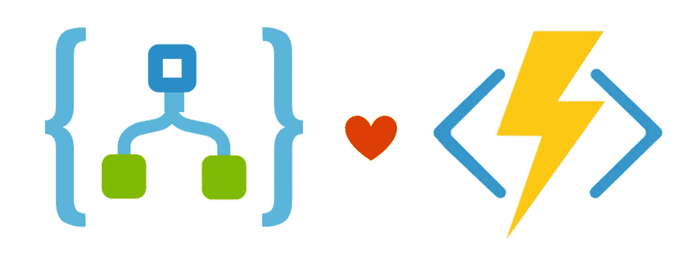
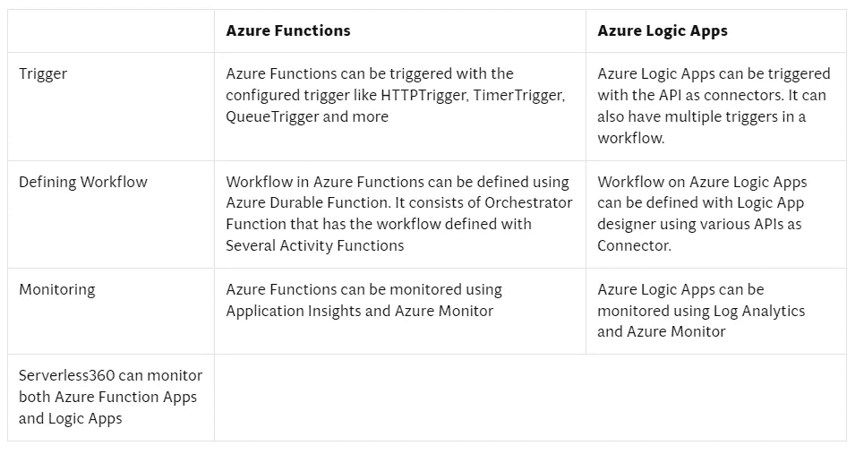

# Azure Logic App 还是 Azure 函数？

> 原文：<https://medium.com/nerd-for-tech/azure-logic-app-or-azure-function-8c6ce8a349a1?source=collection_archive---------0----------------------->

# Azure Logic App 是什么？

Azure Logic Apps 是一个云平台，在这里你可以用很少的代码甚至不用代码来创建和运行自动化的工作流。通过使用可视化设计器并从预构建的操作中进行选择，您可以快速构建一个集成和管理您的应用程序、数据、服务和系统的工作流。

Azure Logic Apps 简化了您跨云、内部和混合环境连接传统、现代和尖端系统的方式，并为您提供低代码-无代码工具，以便为您的企业和企业对企业(B2B)场景开发高度可扩展的集成解决方案。

此列表仅描述了一些可以使用 Azure Logic 应用程序自动化的示例任务、业务流程和工作负载:

*   当发生特定事件(例如，上传新文件)时，使用 Office 365 安排和发送电子邮件通知。
*   跨内部系统和云服务路由和处理客户订单。
*   将上传的文件从 SFTP 或 FTP 服务器移动到 Azure 存储。
*   监控推文，分析情绪，并为需要审阅的项目创建警报或任务。

# 何时使用逻辑应用程序

逻辑应用程序是“事件驱动”的，这意味着它们基于触发器运行。即 HTTP 请求、队列中的消息、容器中创建的 blob 或时间表。

逻辑应用的典型场景有:

*   SaaS 事件处理
*   基于计时器的处理
*   数据摄取
*   业务流程
*   (云服务)之间的集成
*   基于内容的路由
*   数据转换和丰富

# Azure 功能是什么？

Azure Function 是一种无服务器的计算服务，使用户能够运行事件触发的代码，而不必供应或管理基础架构。作为一个基于触发器的服务，它运行一个脚本或一段代码来响应各种事件。

Azure 功能可用于实现解耦、高吞吐量、可重用性和共享。由于更加可靠，它还可以用于生产环境。

# 何时使用函数

像 Logic Apps 这样的 Azure 功能是“事件驱动”的，这意味着它们基于关联和配置的事件或“触发器”运行。例如，一个 Azure 函数可以由一个简单的定时器触发。例如每 24 小时运行一次流程或由文档管理系统中的事件触发。此外，当新文档上载到 SharePoint 库时。Azure 函数也可以响应特定于 Azure 的事件。例如添加到存储 Blob 的图像或到达消息队列的通知。

Azure 函数的典型场景有:

*   基于计时器的处理
*   Azure 服务事件处理
*   SaaS 事件处理
*   无服务器 web 应用架构
*   无服务器移动后端
*   实时流处理
*   实时机器人消息

# Azure 功能 Vs 逻辑应用

Azure 函数是由事件触发的代码，而 Azure Logic 应用是由事件触发的工作流。

Azure Logic App 可以轻松定义工作流，将一系列 API 用作连接器。这些连接器将执行工作流中定义的一系列操作。和 Azure Logic Apps 一样，持久的 Azure 函数也可以用来定义代码结构中的工作流。

# 摘要

在这篇博文中，我们讨论了 Azure 逻辑应用和 Azure 功能，它们如何在云原生集成场景中协作，逻辑应用与 Azure 功能，以及何时使用它们。逻辑应用和 Azure 功能都是“*真正的平台即服务(PaaS)*或“ [*无服务器*](https://learn.microsoft.com/en-us/azure/architecture/reference-architectures/serverless/web-app) ”，并为您的云原生解决方案提供价值。

***资源*** *:微软，无服务器 360*