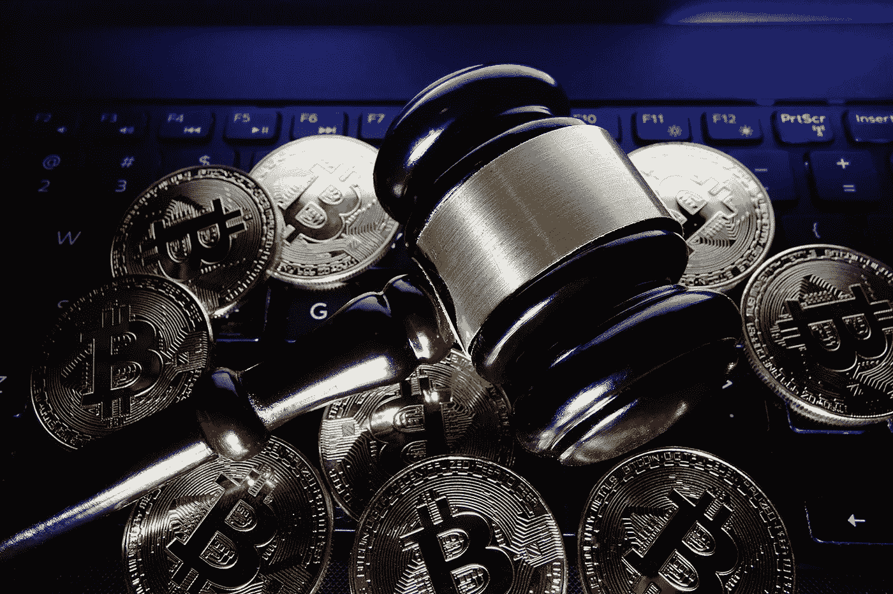

# 加密禁令不会遏制勒索病毒的流行。更好的软件可以

> 原文：<https://medium.com/nerd-for-tech/banning-crypto-wont-curb-ransomware-epidemic-better-software-will-5dc72fa550a3?source=collection_archive---------17----------------------->

美国陷入勒索软件海啸的原因有很多。

勒索软件攻击相对容易，因为许多组织都有带有可利用漏洞的软件。

利润丰厚。加密你的受害者的数据(也窃取它用于进一步勒索杠杆)，在他们向你支付解密密钥并承诺不将他们的数据发布到网上后，带着数万到数百万美元离开。

相对无风险。大多数最具破坏性的勒索软件攻击都是由美国执法机构无法控制的罪犯在敌对国家实施的。它是通过在计算机上击键来完成的。没有子弹或高速追逐。

此外，非常重要的是，加密货币支付是匿名的，难以追踪。不涉及银行。不用交税，也就是说毛额就是净值。对于一个罪犯来说，有什么不喜欢的呢？

但对于守法和执法的世界来说，很多人都不喜欢。因此，随着勒索软件攻击的数量和严重性增加——本月早些时候，总部位于俄罗斯的帮派 REvil 针对网络管理公司 Kaseya Ltd. 的[攻击只是一系列持续攻击中的最新一起——关于政府是否应该监管加密货币、彻底禁止加密货币或更积极地入侵帮派使用的加密货币基础设施的辩论也在增加。](https://www.lawfareblog.com/kaseya-ransomware-attack-really-big-deal)

这是一场远远超出安全会议专家小组讨论范围的辩论。卡西亚遇袭后，[一位未透露姓名的白宫官员说](https://urldefense.com/v3/__https:/www.bostonglobe.com/2021/07/09/world/biden-tells-putin-us-will-take-any-necessary-action-after-latest-massive-ransomware-attack-white-house-says/?et_rid=1745622484&s_campaign=todaysheadlines:newsletter__;!!A4F2R9G_pg!MNmuKR6dwD1zczISFqesbUZ_K6j1YjkYRIw_0ePHnbYt9qoFTEC1P0pID0ADRbOG$)“这真的是关于我们作为一个国家面对这些袭击的恢复力。这是为了应对加密货币带来的挑战，加密货币为这类交易提供了动力。”

**很复杂**

那么，去掉“燃料”，去掉威胁？

嗯，正如数字世界中通常的情况一样，事情没那么简单。首先，加密货币在现代金融中根深蒂固，无法彻底禁止。你不妨试着禁止互联网。

虽然比特币仍然是最知名的加密货币(也是最常用于勒索支付的货币)，但还有成千上万的其他货币，其中许多在小众社区非常受欢迎。

但即便是比特币本身“也大到无法禁止。对加密货币的禁令或监管只会增加与勒索软件攻击相关的成本，”Synopsys 软件完整性小组的技术策略师 Travis Biehn 说。

他说，禁令会带来意想不到的后果，只会让市场转入地下运作。“美国对加密货币的全权禁令将抹去主要是美国加密货币持有者的价值——特斯拉和像 MicroStrategy ( [截至 6 月 21 日拥有 105，085 个比特币](https://www.microstrategy.com/en/investor-relations/press/microstrategy-acquires-additional-bitcoins-and-now-holds-over-105000-bitcoins-in-total_06-21-2021))这样的企业。”

“比特币的价格将会下跌，但关键是，网络本身将继续运行。加密货币将继续在不被禁止的地方全天候交易，并且很可能在它所在的桌子底下交易。这意味着攻击者仍然会要求比特币赎金，但美国公司将不得不转向黑市购买加密货币，”他说。

并不是说一些政府没有尝试至少限制它。新思软件诚信集团(Synopsys Software Integrity Group)产品营销经理 Anna Chiang 表示，“中国等威权政府最近限制了比特币等加密货币，因为它们已经成为[“投机工具](https://www.theguardian.com/world/2021/jul/09/currency-and-control-why-china-wants-to-undermine-bitcoin)”，给金融安全和社会稳定带来了潜在风险。中国已经[通知其银行](https://www.bbc.com/news/business-57549543)和在线支付渠道不要为加密货币交易提供产品或服务。”

但她补充说，“在美国这样的自由社会，监管加密货币或彻底禁止加密货币是对企业家精神的冒犯。最好是让像脸书·迪姆这样的公司在没有限制性政府法规的情况下，自己把握比特币市场的机会。”

**一大锅谩骂**

不是每个人都同意。AgeLight 咨询和研究集团的管理合伙人、在线信任协会的前执行董事和主席克雷格·斯皮兹勒(Craig Spiezle)说，他的想法已经发展到“我不是加密的倡导者。交易所需要监管，因为它现在是充满弊端的蛮荒西部，更不用说是逃税和洗钱的巨大平台了。”

Silverado Policy Accelerator 的执行主席、网络安全公司 Crowdstrike 的联合创始人兼前首席技术官 Dmitri Alperovich 在 RSA conference 的一次视频采访中表示，“加密是整个生态系统得以存在的原因”，并且确实有可能通过包括“了解你的客户”在内的加密货币监管来击败勒索软件团伙，这是一项要求金融服务机构验证任何客户的身份、适用性和风险的要求。目标是防止企业被犯罪分子用于洗钱。

Alperovitch 说，如果外汇交易所拒绝遵守规定，并“被禁止与美国金融体系互动并接受美元，这对他们来说将是毁灭性的”。

但是，当禁令是否有效的争论还在继续时，代表执法部门或政府追踪和揭露勒索软件团伙的所谓道德黑客呢？事实上，在 Colonial Pipeline 向俄罗斯的 DarkSide 勒索软件团伙支付了据称 440 万美元后，[司法部宣布](https://arstechnica.com/gadgets/2021/06/us-seizes-2-3-million-colonial-pipeline-paid-to-ransomware-attackers/)已经通过追踪和扣押黑客使用的比特币钱包追回了其中的 230 万美元。

此外，正如过去一周广泛报道的那样，REvil 神秘地从黑暗网络中消失了，这促使人们猜测执法部门或政府已经将其删除，尽管也有同样的猜测认为该团伙只是为了“重塑形象”以避免更多的政治压力。

一些专家多年来一直表示，加密货币的安全性和匿名性是一个神话。ShapeShift.io 的 CISO 兼加密货币认证联盟主席迈克尔·佩克林(Michael Perklin)几年前曾表示，“比特币是地球上最容易追踪的货币之一，与过去几年媒体的错误报道相反，比特币不是匿名的，它对用户的隐私保护很少。”

但独立安全评估公司的执行合伙人特德·哈灵顿表示，这种笼统的声明并没有涵盖整个加密货币市场。“要参与像比特币基地和币安这样对用户更友好的交易所，你必须证明身份，这使得识别资金接受者变得很容易。但收集加密货币支付的犯罪分子通常更精明，直接将赎金收集到匿名的钱包中。因此，执法部门可以看到资金的去向，但不一定知道它们属于谁，”他说。

这将使 Colonial 案在执法部门没收勒索软件付款时更像是一个轶事般的例外，而不是一种趋势。斯皮兹勒说，在殖民地的情况下，“罪犯是草率的，并留下了有助于执法的‘面包屑’。”

**意想不到的后果**

比恩同意，他说当罪犯看到他们中的一个犯了错误时，他们会很快适应。“攻击者的收益将被没收，直到他们学会如何混淆资金来源，避免与美国合作的集中交易，并保护自己的加密货币，”他说在威慑或减少伤害方面，花在黑客钱包上的钱不太可能有坚实的投资回报，因为防止这种类型的扣押的解决方案既便宜又容易获得。"

还有一个现实是，赋予执法部门更多权力或工具来打击犯罪，可能会产生意想不到的后果。哈林顿说:“理论上，执法部门可以侵入金融工具来收回非法资金，但这似乎是一个滑坡。”“谁来划定他们可以入侵的界限？这感觉类似于执法部门希望加密中有“只有执法部门才能使用的后门”，这在实践中是一个可怕且不可能的想法。”

对于加密货币的好处是否大于坏处，也存在分歧。Spiezle 说他们不会，不仅提到它如何帮助勒索软件，而且提到它的波动性，导致一些投资者损失他们的钱。

但是其他人相信它的好处比坏处多得多。哈林顿说:“汇款人和收款人之间以非常低的费用直接转移资金，而中间没有臃肿的银行，这种几乎瞬间转移资金的能力是金融业的未来。”

比恩指出，它允许普通人绕过传统金融体系的看门人。“加密货币的好处主要在于，它们提供了一种摆脱传统金融市场和监管的方式，”他说。“对委内瑞拉人来说，这意味着他们可以购买一种不会过度膨胀的资产，因此他们可以每天购买鸡蛋。对于萨尔瓦多人来说，这意味着他们可以在不需要长时间等待的情况下，以较低的费用立即将价值送回家。”

“对叙利亚人来说，”他继续说，“这是一种摆脱绝望的方式，这种方式会让你容易受到极端主义的影响；他们可以在全球市场上立即获得报酬，例如网络开发人员。对美国人和欧洲人来说，这是对通胀和救市做法的一种抗衡，这些做法不对称地惠及富人和有关系的人。”

最后，加密货币的倡导者表示，限制或禁止加密货币不会解决勒索软件问题，因为加密货币不是问题的根源。“加密货币不是问题。安全性差才是问题所在，”哈灵顿说。"让我们小心不要把两者混为一谈。"

比恩说，勒索软件实际上有一个有用的功能，因为它以一种非常鲜明和痛苦的方式说明了糟糕的安全性的代价。“勒索软件就像一个市场，促进基本信息安全实践和卫生的价格发现，”他说。

“随着勒索软件的攻击和高效的支付轨道，社会有了一个基本的机制来理解和定价网络安全妥协。我们不应该打断这个对社会有益的市场的进程。”