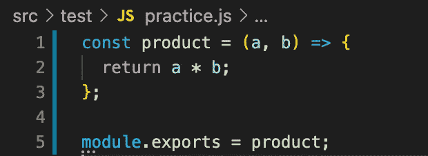
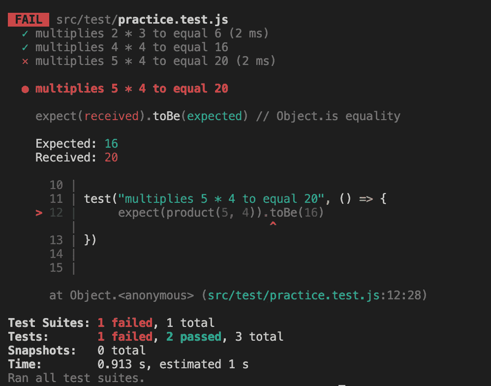

# 用 Jest 进行基本节点单元测试

> 原文：<https://medium.com/nerd-for-tech/basic-node-unit-testing-with-jest-716d0b3e5d5d?source=collection_archive---------12----------------------->

作为一名初级开发人员，你也许可以在对测试了解不多(或一无所知)的情况下找到一份工作。然而，随着你职业生涯的进展，这是无价的信息，因为所有的软件工程角色最终都需要某种形式的测试。所以理解测试及其实现可以让你作为一个新的程序员脱颖而出。

重要的是要理解，首先，有许多不同复杂程度和自动化程度的测试。我将从基础开始，触及最简单的形式之一，单元测试。

单元测试(有时被称为组件测试)是一个很好的起点，因为它需要你考虑你的代码和它应该如何操作，因此，它可能会失败。您正在测试代码的单个组件或单元，尤其是您的函数。当你写一个函数时，你期望某个输入返回某个输出。

Jest 是一个 JavaScript 测试库，可以与 Node、React、Angular 和 Vue 等框架一起使用。它内置于 Create React 应用程序和其他应用程序中，有助于测试前面提到的输入/输出场景，以及您可能编写的更复杂的逻辑。

Jest 文档包含大量有用的例子、方法和实现实践。基于这些，我建立了一个简单的节点示例来理解单元测试。

练习文件中的简单函数

考虑到上面的函数，下面是如何创建一个简单的测试。首先，创建一个测试文件。Jest 将自动测试任何包含“测试”或“规范”的文件然后你用你期望的结果测试你的变量。由于该函数是简单的算术运算，我们可以如下实现测试:

测试一些数学

现在您已经编写了一个测试，在您的终端中键入“npm run test ”,得到以下输出:

测试通过

您可以看到验证您的代码是多么简单。这里有一个失败的例子:

失败

在上面的例子中，我为 product 函数添加了两个测试，但是我对其中一个做了一些不正确的计算。Jest 方便地指出错误发生的代码行，并指出接收到的输入(您传入的内容)与预期的输出(Jest 根据您的代码知道哪些是正确的)有何不同。

但是，您可以看到，用户错误很容易导致误报或漏报。例如，在上面失败的测试中，我传入了一个具有正确输入和输出的字符串，但这无关紧要。绳子可以说任何东西。因为我的测试期望答案是(16)，所以我的变量应该组合起来返回那个乘积，但是它们没有。

Jest 指的是像 toBe(16)这样的措辞，作为" [matcher](https://jestjs.io/docs/using-matchers) "当你有确切的期望时使用。匹配器的其他例子包括 toEqual、toBeNull、toBeTruthy、toContain 和 toBeGreaterThan 等等。通过实现各种匹配器，随着代码变得越来越复杂，您可以潜在地避免边缘情况的错误。一些匹配器更具体地指字符串或布尔值，以及可重复项甚至错误。

Jest 允许您创建比我上面概述的更复杂的测试，包括异步请求的测试，例如 API 获取。但是这是开始测试具有预期输出的功能的良好起点。

随着你成为一名程序员，你将会编写自动运行程序的测试，并且处理更困难的任务，但是单元测试是确保你理解你自己的代码的一个很好的方法。