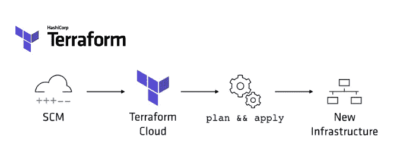

# 创建 EC2 实例的 Terraform 的基本设置

> 原文：<https://medium.com/nerd-for-tech/basic-setup-of-terraform-to-create-ec2-instance-1dcd51bdcca6?source=collection_archive---------4----------------------->



我们将在本文中讨论的主题。

*   aws_vpc
*   aws _ 子网
*   aws _ 互联网 _ 网关
*   aws _ route _ 表
*   aws _ route _ table _ 关联
*   aws _ 实例

# 什么是 Terraform，为什么？

Terraform 是**一款开源的基础设施代码软件工具，用于**在 AWS、Azure、DigitalOcean、GoogleCloud 等云平台上提供基础设施代码。

Terraform 是一种工具，可帮助管理基础设施的整个生命周期，将基础设施作为代码使用。这意味着在 XXX.tf 文件中声明基础设施组件，然后 Terraform 使用这些组件在各种云提供商中提供、调整和维护基础设施。

## 如何连接云提供商(AWS)？

**第一步** :-在你的系统中安装 Terraform。使用下面的脚本并在你的 ubuntu 系统中执行或者参考[https://learn.hashicorp.com/tutorials/terraform/install-cli](https://learn.hashicorp.com/tutorials/terraform/install-cli)

```
#!bin/bash
sudo apt-get updatesudo apt-get update && sudo apt-get install -y gnupg software-properties-common curlcurl -fsSL https://apt.releases.hashicorp.com/gpg | sudo apt-key add -sudo apt-add-repository "deb [arch=amd64] https://apt.releases.hashicorp.com $(lsb_release -cs) main"sudo apt-get update && sudo apt-get install terraform
```

地形命令:-

terraform init-back end-config = " ACCESS _ KEY = $ AWS _ ACCESS _ KEY _ ID "-back end-config = " SECRET _ KEY = $ AWS _ SECRET _ ACCESS _ KEY ":-将 terra form 与您的云提供商连接。

地形初始化:-初始化特定项目的地形。

地形图:-显示所有组件部署图。

terraform 应用/ terraform 应用-自动批准:-开始在您的云提供商中部署您的组件。

terraform destroy/terra form destroy-auto-approve:-开始销毁您的云提供商中保存在您的 terra form 状态中的组件，而不是全部。

**步骤 2** :-创建一个 S3 桶来保存地形的状态。

**第 3 步** :-我们有多种方式向云提供商进行认证，我们使用最推荐的方式。

在/添加您的凭据。AWS/凭据位置。

```
[default]
aws_access_key_id = XXXXXX
aws_secret_access_key = XXXXXX
```

这里我们使用 main.tf 文件来配置后端并连接到云提供商。

```
terraform { backend "s3" { bucket = "XXXX" // provide created s3 bucket name key = "state/main/key" // path of saved state region = "us-east-2" //    }}provider "aws" { region = "us-east-2" shared_credentials_file = "$HOME/.aws/credentials" profile = "XXX"
}
```

当我们运行 terraform 计划或在内部应用 terraform 时，创建一个部署或依赖流，所有 tf 文件将在计划或应用时合并。

# aws_vpc

虚拟私有云，vpc 是亚马逊网络服务云的一个逻辑隔离部分。我们可以根据需要创建多个子网，公共或私有，私有子网的机器不能通过公共互联网访问。

让我们通过 terraform 创建 vpc

```
resource "aws_vpc" "aws-vpc" { cidr_block       = "10.0.0.0/16" instance_tenancy = "default" enable_dns_support = "true" enable_dns_hostnames = "true" enable_classiclink = "false" tags = { Name = "XXX" }}
resource "aws_internet_gateway" "vpc-internet-gateway" { vpc_id = aws_vpc.aws-vpc.id}
```

# aws _ 子网

子网或子网络，每个子网必须属于一个 vpc。子网是 IP 网络的逻辑划分，分为多个更小的网段。

```
resource "aws_subnet" "aws-subnet" { vpc_id = aws_vpc.aws-vpc.id cidr_block = "10.0.0.0/24" map_public_ip_on_launch = "true" availability_zone = "us-east-2a" tags = { Name = "subnet-private-1" }}
```

# aws _ route _ 表

路由表包含一组称为路由的关系，用于解析来自子网或网关的网络流量的定向位置。

```
resource "aws_route_table" "route-table" { vpc_id = aws_vpc.aws-vpc.id route { cidr_block = "0.0.0.0/0" gateway_id = aws_internet_gateway.vpc-internet-gateway.id } tags = { Name = "route-table" }}
resource "aws_route_table_association" "route-table-association" { subnet_id      = aws_subnet.aws-subnet.id route_table_id = aws_route_table.route-table.id}
```

# aws _ 实例

aws_instance 为**提供了一个 EC2 实例资源**。它授权创建、更新和删除实例。实例也支持资源调配。

```
resource "aws_instance" "aws-instance" { ami           = "ami-00399ec92321828f5" instance_type = "t3.medium" key_name = "XXX" availability_zone = "us-east-2a" vpc_security_group_ids = [ aws_security_group.XXX.id ] tags = { Name = "aws-EC2-instance" } private_ip = "10.0.0.60" subnet_id  = data.aws_subnet.aws-subnet.id}
```

我希望你在这里学到了新东西。

谢谢你的 time☺️

如果您有任何与 JS/Terraform 相关的疑问，请随时联系社交媒体

[https://instagram.com/rkstarji](https://instagram.com/rkstarji?igshid=j6twh39s09n9)

https://twitter.com/RkStarJi