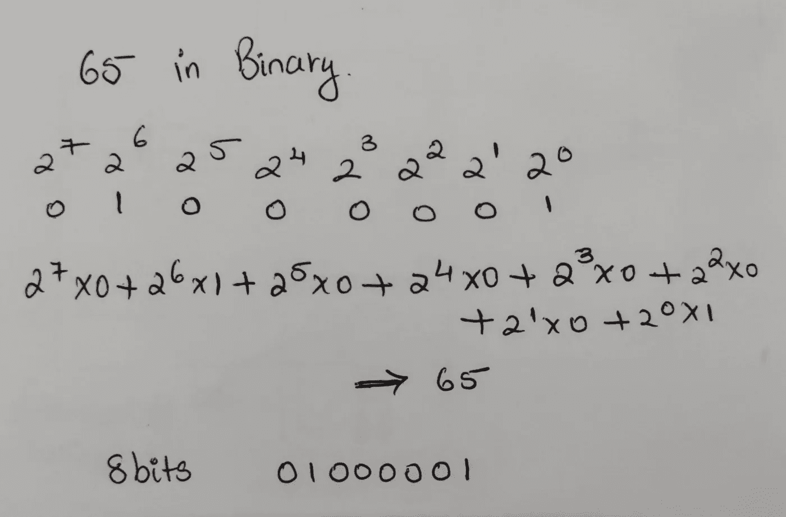

# C 程序设计基础-字节和二进制代码解释。

> 原文：<https://medium.com/nerd-for-tech/basics-of-c-programming-bytes-binary-code-explained-42f3fee5dfb0?source=collection_archive---------6----------------------->

让我先说，当我从许多不同的来源开始学习什么是二进制语言和许多其他与计算机科学相关的东西时；我注意到许多人说他们已经获得了计算机科学的学士学位，他们知道计算机使用二进制语言。但是，当有人要求他们解释二进制代码是如何工作的？什么是一点？他们不知道答案。

这可以归咎于教育系统，或者在某种程度上，这也可能是我们对获取知识的疏忽或无知。在阅读这个博客之前，你所需要的只是一个巨大的好奇心来学习这个微小但却重要的计算机科学分支。

开始吧！

# 二进制是什么意思？

许多方法被用来解释这一点，但基本上，这只是涉及“两个国家”是真还是假。在计算机中，电流流动时的“开”状态代表真，而“关”状态代表假。我们也可以把二进制写成 1 和 0，而不是真或假。人们选择对或错是有原因的，只是用计算机执行任何事情的两种状态。一个完整的数学分支已经存在，处理真值和假值；布尔代数。你可以这样看，你所知道的高中代数有数值作为数字，对这些数字的运算是加、减、乘或除。但是在布尔代数中，变量的值是真和假，操作是逻辑的。布尔代数的三种主要运算:非运算、与运算和或运算。这就把我们带到了逻辑门的话题，这个话题将在另一篇博文中讨论。

我们可以将二进制视为一种存储数据的方式，或者仅仅是一种可靠的计数系统。后一种解释方式是看待这一点的一种有趣方式。早些时候，当人们想要统计他们的群体中有多少人或者他们有多少头牛的时候；他们需要一个计数系统。之所以需要这样的系统，是因为人类记忆的局限性，主要是因为社会规模变得越来越大，很难保持跟踪。最早公认的计算工具是算盘。我们只能说，在这种情况下，理货标志也可能是一种记录方式。算盘的基本版本是每行代表 10 的不同次方。最下面一行中的每个珠子代表一个单位，下一行代表 10，上面一行代表 100，依此类推。他们过去常常一次将一个珠子从任何一行滑到另一行来记录数据。我相信你也会同意，使用算盘是比理货更有效的方法。

十进制现在是我们常用的计数方法。如果我们说 4*10⁰；它基本上是以十进制形式表示的数字 4。同样，如果我们用基数 2 代替基数 10；然后我们用二进制形式表示。我们举个例子。

**数字 65 是十进制形式，这可以用二进制形式表示为:**

# 比特和字节。

如果我们考虑以二进制形式 01000001 表示值 65 的上述例子，1 和 0 中的每一个被称为一位。这只是表示每个操作符或数据类型的空间。为了输入一个整数值，我们使用 int 作为数据类型，它定义了一个变量将在内存中占用多少空间。一般来说，8 位内存称为一个字节。int 的大小是 2 字节(16 位)，char 的大小是 1 字节(8 位)。这些算子的大小可以用程序查出来。

*虚空主()*

*{*

*printf("%d "，sizeof(int))；*

*返回 0；*

*}*

**输出:4 个**

类似的，浮点- 4 字节。双 8 字节和长双 12 字节。

(注:内存也取决于您使用的设备。)

# 为什么不是十进制？

由于物理限制，我们使用二进制而不是十进制。最基本的需求是让我们的电脑能够计数。为此，我们使用晶体管，它是计算机的主存储器。晶体管在高电压和低电压之间转换。处理器读取晶体管；“开”被认为是 1，“关”被认为是 0。对于 8 位，我们可以看到，如果一行中的所有晶体管都处于截止状态(00000000)，则值为零，当所有晶体管都处于导通状态(11111111)时，则值为 255。你一定听说过 4 字节或 16 字节器件。当时人们意识到，即使将 4 个字节相加，我们也只能得到 1020 的值。因此，新的计算机被设计来读取或识别 2 个字节作为一个单一的数字。所以现在我们可以用 65535 代替 255。

unsplash。

# 你看的视频背后的计算机科学！

你观看的任何视频在一帧中都包含了成千上万的像素。每个像素由二进制序列中的三原色(红、蓝、绿)表示。每个序列都给出了一个数字，这个数字决定了颜色的强度。然后一个程序传输这个信息，我们就能在视频中看到不同的颜色。

二进制代码本身没有任何意义。如果没有提到上下文，你永远不知道你在读的是二进制数还是二进制文本。

我们看到或听到的一切都可以用二进制代码来表示，这就是现在一切的工作原理。这都是关于比特和二进制代码的基础知识。希望这个博客对你有用。请在回复部分留下您的评论。