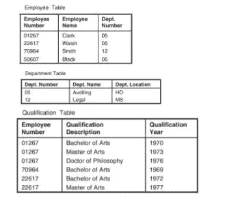

# 数据结构基础

> 原文：<https://medium.com/nerd-for-tech/basics-of-data-structure-eb96aed4e4f3?source=collection_archive---------11----------------------->

数据结构基础

**简介**

主要的工具是规范化，这是一组将数据分配到表中的规则，以消除某些类型的冗余和不完整性。

规范化通常是数据建模项目中的后期活动之一，因为在确定需要哪些列(数据项)之前，我们无法开始规范化。

规范化用于逻辑数据库设计阶段，在需求分析和概念建模之后。

**规范化的非正式例子**

规范化本质上是一个两步过程:

1.将数据放入表格中(通过删除重复组)。

2.将重复的数据移至单独的表中。

如果我们想把这些数据存储在数据库中，首要任务是把它制成表格。但是我们马上就遇到了一个问题:因为一个雇员可以拥有多项资格，所以将资格数据放入一个表的一行中是很不方便的。

**关系符号**

桌子

我们需要学习更多关于符号的知识。使用表名后跟括号中的列名的关系表示法的规范化模型。

**确定列**

我们需要做一些准备和整理。规范化依赖于关于数据表示方式的某些假设，我们需要确保这些假设是有效的。还有一些正常化没有解决的问题，最好在一开始就解决这些问题，而不是在整个正常化过程中背负过多的包袱。

1.  每列一个事实

首先，我们确保表中的每一列只代表一个事实。两个截然不同的事实。这三个事实应该分别记录在不同的栏目中。我们将会看到这个决定对我们最终模型的结构产生了重要的影响。

2.隐式数据

整理的第二部分包括确保我们在转换成表格的过程中没有丢失任何数据。这里最常见的问题是，我们不能依赖于表中的行以任何特定的顺序存储。假设最初的调查表是按照返回的顺序归档的。

3.可推导数据

记住我们非冗余的基本目标。我们应该删除任何可以从表中其他数据导出的数据，并相应地修改列。

4.确定主键

最后，我们为表确定一个主键 4。主键的选择是一项关键(有时很复杂)的任务。

**重复组和第一范式**

第一范式(1NF)涉及重复基团的去除。这种重复组的例子是联系人和类别。因此，对于给定的客户，可以存在一个或多个联系人和一个或多个类别。对于每个重复组，该重复组将被移动到单独的表格中。

1.  最大出现次数的限制

我们的“重复组”数据的一个问题是，我们必须设置一个任意的最大重复次数，大到足以容纳实践中可能出现的最大次数。

2.数据可重用性和程序复杂性

你可能会说，有些调查本质上总是比其他的更复杂。但是考虑一下，如果我们在“每个实体一行”的基础上设计表，会发生什么。

3.识别重复组

在这一点上，我们还应该检查是否有没有被标记为重复的组。为此，我们需要询问是否有任何数据项对于给定的键值可能有多个值。

4.删除重复组

一个通用且灵活的解决方案不应该对重复组出现的最大
次数设置任何限制。它还应该灵活地处理
很少或没有发生的情况。

5.确定新表的主键

找到新表的键并不容易(事实上，这通常是整个规范化过程中最棘手的一步)。我们不得不问，“唯一标识一个
行所需的最小
列组合是多少？”。

6.第一范式

第一范式(1NF)是关系数据库中关系的属性。当且仅当每个属性的域仅包含原子(不可分)值，并且每个属性的值仅包含来自该域的一个单个值时，关系才是第一范式。

**第二范式**

为了理解第二范式，你必须理解函数依赖的概念。功能依赖是属性之间的关系。

1.  第一范式中的表格问题

我们需要显式地以不同的方式处理“最后的操作”，这显然违反了我们的优雅标准。

2.消除冗余

我们可以通过将数据信息转移到一个单独的表中来解决所有这些问题，在这个表中，每个实体编号只出现一次。

3.决定因素

重要的是要理解，分离数据的整个过程依赖于这样一个事实，即对于一个给定的数字，可能只有一个实体。事实上，我们可以将数据对数字的依赖性视为问题的原因。

**第三范式**

要理解第二范式，你必须理解泛函的概念。第二范式的表特别容易受到某些类型的修改异常的影响，特别是那些来自传递依赖的异常。当一个属性依赖于第二个属性，而第二个属性又依赖于第三个属性时，就会出现传递性依赖。

1.  第二范式怎么了？

我们的方法直接将我们从第一范式(表格形式的数据)带到第三范式。大多数文本将此视为两阶段过程，首先处理作为表的关键部分的决定因素，然后处理非关键决定因素。

2.「第三范式」和「完全正规化」一样吗？

不幸的是，没有。还有三种更好的范式:Boyce-Codd 范式(BCNF)、第四范式(4NF)和第五范式(5NF)。特别是，4NF 和 5NF 问题通常只在处理每个列都是键的一部分的表时出现。

顺便说一下，“所有键”表是合法的，在完全规范化的结构中出现得相当频繁。已经提出了第六范式(6NF ),主要是为了处理在表示依赖于时间的数据时出现的问题。

3.性能呢？所有这些桌子肯定会减慢速度吗？

对于看起来相对较少的数据，肯定有很多表格。对于看起来相对较少的数据，肯定有很多表格。

**定义和一些改进**

1.  定义和一些改进

等效地，我们可以说其他指定的列在功能上依赖于行列式。行列式概念是 3NF 的全部内容；我们只是将数据项按照它们的决定因素进行分组。

2.主键

主键是指定的列或列的组合，对于表中的每一行都有不同的值。每个表都有一个(且只有一个)主键。

3.候选键

我们在这里所做的只是创建第二个表，它将保存与第一个表完全相同的数据——尽管主键不同。

为了正式涵盖这种情况，我们需要在规则中更具体地说明哪些决定因素用作新表的基础。我们之前排除了主键；我们需要将此扩展到所有候选键。

4.第三范式的更正式定义

Boyce-Codd 范式(BCNF)的定义甚至更简单:如果任何列的唯一决定因素是候选键，则该表在 BCNF。我们推迟讨论 BCNF 的原因是，确定一个 BCNF 问题。

5.外键

回想一下，当我们将重复组删除到一个新表中时，我们携带了原始表的主键，以便交叉引用或“指向”源。在从第一范式转移到第三范式的过程中，我们留下了行列式，作为对新表中相关行的交叉引用。这些交叉引用的列称为外键，它们是我们链接不同表中数据的主要手段。

6.参照完整性

现代 DBMSs 提供引用完整性特性，自动确保每个外键值都有一个匹配的主键值。

7.更新异常

关于正常化的讨论经常提到更新异常。术语
很好地抓住了标准化解决的大部分问题，特别是如果“更新”一词在其最广泛的意义上被用来包括数据的
插入和删除，并且如果我们谈论的是结构，那么
至少是以表格的形式。

8.反规范化和非规范化

正如我们所知道的，有时为了达到另一个目标，需要牺牲一个数据建模目标。偶尔，我们将不得不实现不完全规范化的数据库设计，以实现一些其他目标(最常见的是性能)。在这样做的时候，重要的是要超越“规范化”这个目标本身，看到它所提供的潜在好处:完整性、非冗余性、扩展重复组的灵活性、数据重用的便利性以及编程的简单性。当我们实现非规范化或者仅仅部分规范化的结构时，这些就是我们所牺牲的。

9.列名和表名

我们从原始的报告表单中获取列名，并根据需要创建表名。

10.选择、创造力和正常化

到目前为止，在我们关于规范化的讨论中，选择和创造性并没有占据太多的位置。的确，正常化本身是一个确定性的过程，这使得它对教师特别有吸引力；能够用一个正确的答案来设置一个问题总是好的。规范化的严格性，以及在教学和研究中对它的重视，有时会鼓励一种观点，即数据建模作为一个整体是确定性的。

11.术语

大多数关于关系结构的理论工作使用了一组不同的术语:关系、属性和元组。这是因为表格数据组织的许多理论，包括规范化，都来自关系演算和关系代数的数学领域。

**结论**

规范化是一组技术，用于将数据组织成表格，以便在更新数据时消除某些类型的冗余和不完整性以及相关的复杂性和/或异常。

规范化依赖于行列式和键的正确识别。在本章中，我们讨论了第三范式(3NF)的规范化。如果一个非关键字项的每个行列式都是一个候选关键字，则该表在 3NF 中。

**参考**

数据建模理论与实践

[第一范式—维基百科](https://en.wikipedia.org/wiki/First_normal_form)

[SQL 第一、第二和第三范式—虚拟模型](https://www.dummies.com/programming/sql/sql-first-second-and-third-normal-forms/)