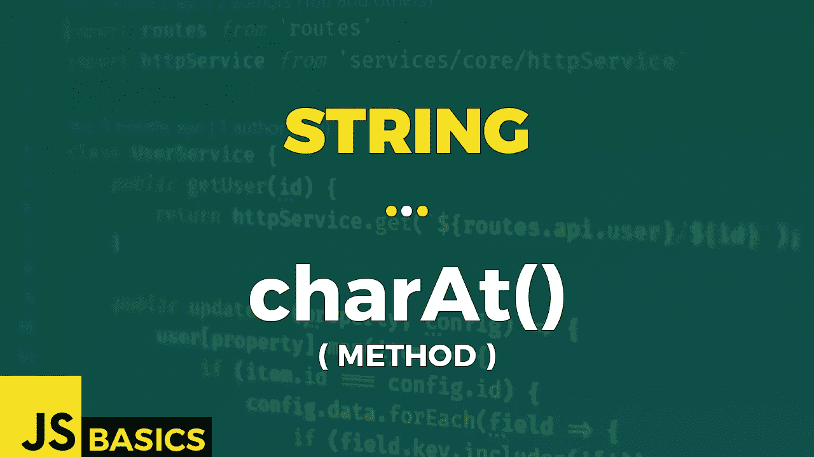

# Javascript String charAt()的基础知识(方法)

> 原文：<https://medium.com/nerd-for-tech/basics-of-javascript-string-charat-method-51c2f92740fb?source=collection_archive---------16----------------------->



这篇文章是我在 youtube 上免费发表的关于网络开发基础的系列文章的抄本。如果你更喜欢看而不是读，请随时访问我的频道“Dev Newbs”。

大家好，欢迎阅读 Javascript 基础知识系列中关于字符串的下一篇文章。今天，我们将介绍第一个字符串对象方法。我们将按字母顺序介绍所有的方法。所以第一个是 charAt。我们开始吧。

charAt()方法返回字符串中指定索引处的字符。第一个字符的索引或位置是 0，第二个字符的索引是 1，依此类推。最后一个字符的索引等于字符串长度减一。

```
let FivecharactersLongString= "Hello";FivecharactersLongString.charAt(0)   // H
FivecharactersLongString.charAt(1)   // e
FivecharactersLongString.charAt(2)   // l
FivecharactersLongString.charAt(3)   // l
FivecharactersLongString.charAt(4)   // o
```

很少有 charAt()方法返回空字符串的情况。其中之一是如果你提供负值作为指数。另一个是如果你提供一个等于或大于字符串实际长度的正值。

```
// valid range is from 0 to 4FivecharactersLongString.charAt(-1)  // empty string
FivecharactersLongString.charAt(5)   // empty string
```

从第二个例子中，我们可以清楚地看到，所有使用的索引都超出了我们的字符串的范围，因此，结果值是一个空字符串。

如果作为 index 给出的值不能转换为整数，或者您根本没有提供索引值，则使用默认值 0。

```
FivecharactersLongString.charAt("H")   // H
FivecharactersLongString.charAt(NaN)   // H
```

值得一提的是，返回值是一个新的字符串基元值，由单个 UTF-16 代码单元组成。那是什么意思？我们已经提到一些字符由一个以上的代码单元组成。

好吧，如果指定索引处的字符由多个代码单元组成，您将不会得到实际的字符，而只是它的一部分——特别是给定位置的代码单元值。

```
let thumbsUpIcon = "👍";thumbsUpIcon.length         // 2
thumbsUpIcon.charAt(0)      // "\ud83d"
thumbsUpIcon.charAt(1)      // "\udc4d"[...thumbsUpIcon][0]        // "👍"
```

这对我们来说显然是个问题。幸运的是，在上一篇关于字符串对象属性长度的文章中，我们已经解决了这个问题。如果你没有看到这篇文章，去读一读。简而言之，我们需要使用 spread 语法将字符串值转换成数组。然后，我们可以对原始索引使用方括号符号，就像使用 charAt()方法一样。

但是这给我们带来了一个问题，为什么使用 charAt()方法，当在一些边缘情况下，它失败得很惨？在过去——大约十年前，正方形符号并没有在所有主流浏览器中实现(向 Internet Explorer 致意),所以你没有真正的选择。如果你需要你的代码通用，你必须使用字符串对象方法。幸运的是，那些过去的日子已经一去不复返了，没有真正的理由不到处使用方括号符号。这样，你就把字符串当作一个类似数组的对象，一切都会好的。

然而，在一些边缘情况的结果中有一些微小的差异，我们将在例子中显示。

所以在一天结束的时候，你需要考虑的是哪种边缘情况行为更适合你的用例，并且坚持那个。

好了，说够了。让我们看看实际的行动差异。

```
'hello'[NaN]                  // undefined
'hello'.charAt(NaN)           // 'h''hello'[true]                 // undefined
'hello'.charAt(true)          // 'e'
```

当使用 charAt()方法和方括号符号时，这些边界情况的结果值是不同的。原因在于它们是如何被指定和实现的。默认情况下，如果没有给定适当的索引值，charAt()将返回字符串的第一个字符。另一方面，访问数组中未初始化的索引的默认行为是返回 undefined。仅仅是因为给定索引处的值确实还没有定义。

好了，这一集就到这里。我们已经讨论了将近 40 个字符串对象方法中的第一个。希望你学到了一些有趣的东西，并喜欢这一集。

非常感谢您的宝贵时间，我们将在下一篇文章中再见。