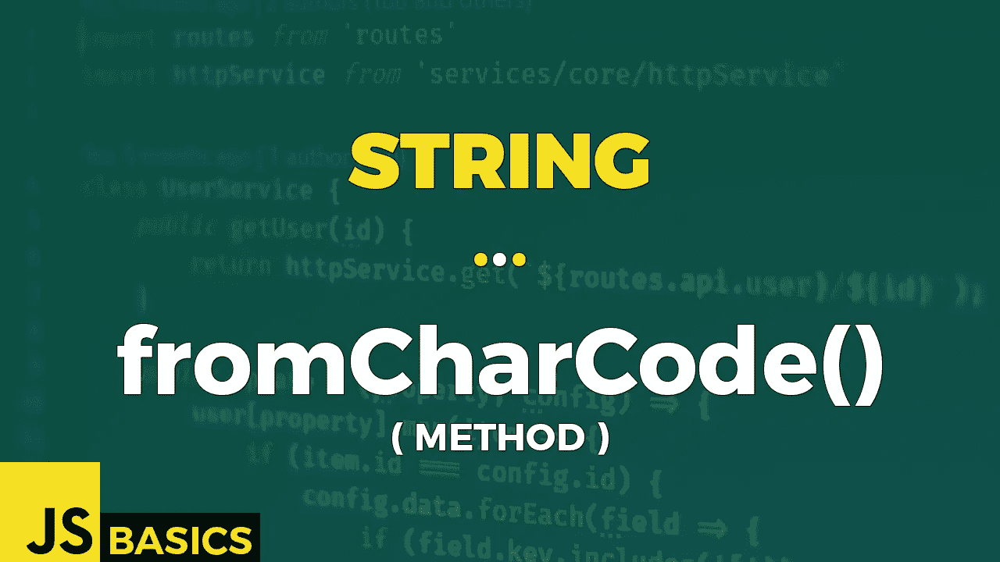

# 基础 Javascript 字符串 fromCharCode()(方法)

> 原文：<https://medium.com/nerd-for-tech/basics-of-javascript-string-fromcharcode-method-a35dd47124a0?source=collection_archive---------9----------------------->



这篇文章是我在 youtube 上免费发表的关于网络开发基础的系列文章的抄本。如果你更喜欢看而不是读，请随时访问我的频道“Dev Newbs”。

向所有开发新手问好。我的名字是雅各布，我将教你一些新的东西，希望对今天的弦乐方法感兴趣。我们按时间顺序讲述了所有的字符串对象方法，今天是 fromCharCode()方法的一天。我们开始吧。

此静态方法返回从指定的 UTF-16 代码单元序列创建的字符串。

我应该首先澄清当一个方法是静态的时候意味着什么。这意味着您不需要对字符串对象调用方法。相反，您只需键入“String.fromCharCode()”并在括号内提供参数。

让我们看看它在示例 1 中是如何工作的。

```
// 'A' -> 65 or 0x41
// 'a' -> 97 or 0x61// single unicode value
String.fromCharCode(65)                             // A
String.fromCharCode(0x41)                           // A// multiple unicode values at once
String.fromCharCode(65, 66, 67)                     // ABC
String.fromCharCode(0x41, 0x42, 0x43)               // ABC
```

该方法接受一个或多个需要为数值的参数。大多数情况下，您希望提供的值要么是十进制值，要么是十六进制值，因为这些是 unicode 字符最常用的值。但是如果你喜欢冒险，欢迎使用二进制或任何其他数字格式。只要你能正确地表示数字格式，你可以使用任何你喜欢的格式。

有时，您会传递不期望作为此方法的有效输入的参数值或类型。对于那些情况，知道发生了什么是很好的，这样你就可以相应地修改你的程序。让我们看看该方法在一些意外参数的边缘情况下是如何表现的。

```
String.fromCharCode("X").charCodeAt()               // 0
String.fromCharCode(true).charCodeAt()              // 1
String.fromCharCode(false).charCodeAt()             // 0
String.fromCharCode(null).charCodeAt()              // 0
String.fromCharCode({}).charCodeAt()                // 0
String.fromCharCode([1,2]).charCodeAt()             // 0
```

正如我们所看到的，该方法试图将值转换成数字，并且在它工作的地方，它使用该数字。如果转换不成功，则默认值为零。我在这个例子中做了一点修改，因为我们得到的值 0 和 1 实际上并不是可见的符号。因此，我们在输出中看到的将是空白。因此，我使用众所周知的方法 charCodeAt()将返回的字符转换回它的 unicode 值，看看我们得到了什么。

此方法的参数可以作为表示 UTF-16 代码单元的数字序列传递。每个数字的可接受范围在 0 到 65535 之间，这是一个代码单位的范围。

如果参数列表中的任何数字超出了该范围，该数字将以特定方式被截断以适应该范围。

截断的逻辑如下:

*   对于低于有效范围的数字(负数),该方法会一直增加数字 65536，直到该值在有效范围内
*   对于高于有效范围(大于 65535)的数字，该方法会一直减去数字 65536，直到该值在有效范围内

让我们在第三个例子中看看这种行为。

```
// -65500 + 65536 = 36 -> '$'
String.fromCharCode(-65500)                    // $
String.fromCharCode(36)                        // $// null character - not visible character
String.fromCharCode(0)                         // white character// ordinary one code unit characters
String.fromCharCode(100)                       // d
String.fromCharCode(600)                       // ɘ// -65600 + 65536 = 64 -> '@'
String.fromCharCode(65600)                     // @
String.fromCharCode(64)                        // @// 150000 - 65536 - 65536 = 78 -> 'N'
String.fromCharCode(131150, 131150)            // NN// -150000 + 65536 + 65536 = 72 -> 'H'
String.fromCharCode(-131000, -131000)          // HH
```

有一个注释解释了给定行的截断，所以可以随时暂停视频以进一步检查发生了什么。但一般来说，每当参数超出有效范围时，就会应用上述逻辑。这确保了只有有效的 unicode 字符作为方法的结果返回。

现在，你可以看到我没有包括任何由多个代码单元组成的表情符号和其他字符的例子。这是有原因的。

仅用一个代码单元表示的字符是基本多语言平面的一部分(通常被快捷方式称为 BMP)。这些是使用带有单个参数值的 fromCharCode()方法可以获得的唯一字符。

由两个代码单元组成的字符称为补充字符。它们由两个 16 位代码单元表示，称为代理。

如果需要使用 fromCharCode()方法返回这样的字符，需要在参数列表中将每个代码单元的值指定为一个单独的数字。如果您只提供给定补充字符的代码点值，该方法将截断该值，您得到的是与基本多语言平面完全不同的字符。

这听起来很复杂，但事实正好相反。让我们在下面的例子中检查一下，你自己就会明白了。

```
// get the code point of '🤦'
'🤦'.codePointAt());                              // 129318

// try to get character using code point
String.fromCharCode(129318));                     // 臘// 129318 - 65536 = 63782 -> '臘'
String.fromCharCode(129318).charCodeAt());        // 63782

// now try properly using code units values
// '🤦' -> 55358 + 56614 or 0xD83E + 0xDD26
String.fromCharCode(55358, 56614)                 // 🤦
String.fromCharCode(0xD83E, 0xDD26)               // 🤦
"\uD83E\uDD26"                                    // 🤦
```

例如，facepalm 表情符号的十进制码位值为 129318，十六进制码位值为 0x1F926。当转换成两个代理代码单元时，十进制格式的值为 55358 和 56614，或者 0xD83E 和 0xDD26。您也可以使用' \u '前缀写同样的东西，表示该值是 unicode 代码单元值。在这种情况下，你可以写成“\uD83E\uDD26”。

在这个补充代码点值和代码单元的代理对之间有一个数学关系，但是这需要一些计算，并且总的来说你自己做不是一个好主意。如果您只知道代码点值，而不想进行代码单元的转换，您可以使用下一行的方法:fromCodePoint()，它接受代码点和代码单元。但下次会有更多关于这个话题的讨论。

感谢您的关注，我迫不及待地想在下一篇文章中见到您。