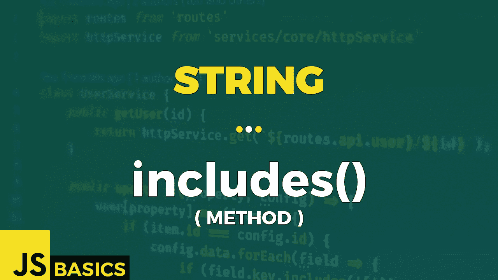
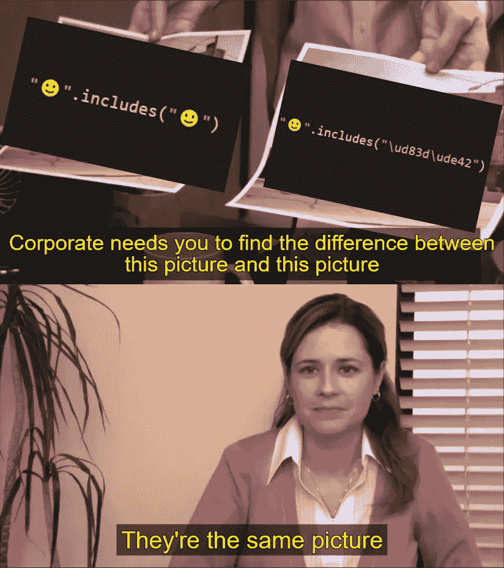

# Javascript 字符串基础包括()(方法)

> 原文：<https://medium.com/nerd-for-tech/basics-of-javascript-string-includes-method-107b6094f00b?source=collection_archive---------20----------------------->



这篇文章是我在 youtube 上免费发表的关于网络开发基础的系列文章的抄本。如果你更喜欢看而不是读，请随时访问我的频道“Dev Newbs”。

大家好，我的开发新手伙伴们，欢迎回到关于内置对象字符串的 Javascript 基础系列。这可爱的一天的话题是方法包括()。我们不要徘徊。我们要一头扎进去。

includes()方法执行区分大小写的搜索，以确定是否可以在搜索的字符串中找到指定的字符串。根据搜索结果，返回值可以是 true 或 false。方法有两个参数。第一个参数是必需的，它是在搜索字符串中被检查是否出现的字符串的值。第二个参数是可选的，指定开始搜索的位置。如果没有提供，则默认值为 0。让我们看看在第一个例子中它是如何工作的。

```
let searchedString = "Hello my fellow dev newbs! 🙂";
let stringToLookFor = "fellow";searchedString.includes(stringToLookFor)               // true
searchedString.includes(stringToLookFor, 9)            // true
searchedString.includes(stringToLookFor, 12)           // false
```

第一个和第二个结果为真，因为用于搜索的范围包括我们正在检查是否出现的字符串“fellow”。最后一个结果是 false，因为我们指定的索引 12 导致搜索的字符串从单词“fellow”的中间开始，这意味着我们无法在指定的范围内找到整个单词。

我已经提到了，但这是一个常见的错误，所以我将再次强调它。此方法区分大小写。这意味着它区分字母字符的小写和大写。如果你试图寻找这些，请记住这一点。

让我们看看我在例 2 中所说的。

```
searchedString.includes("Dev")                     // false
searchedString.includes("dev")                     // truesearchedString.includes("hello")                   // false
searchedString.includes("Hello")                   // truesearchedString.includes("NEWBS")                   // false
searchedString.includes("newbs")                   // true
```

由于区分大小写，每个搜索字符串的第一个版本都不正确。下面这个是正确的。这是非常清楚的，所以没有必要进一步剖析它。只要在你的代码中关注它。因为你知道他们说什么吗？愚蠢的错误是最难发现的。

好了，这一切都很好，但是让我们转到更严肃的事情上来，处理代码单元和代码点。我没有提到它，但在这一点上，它几乎是一个潜规则:如果我们处理指数或位置，我们总是使用代码单位。那么在字符由多个代码单元组成的情况下，这个方法如何表现呢？让我们看看今天最后一个例子:

```
let smileyFace = "🙂";// smileyFace:
//   0 -> "\ud83d" 
//   1 -> "\ude42"smileyFace.includes("🙂")                         // true
smileyFace.includes("\ud83d\ude42")               // truesmileyFace.includes("🙂", 1)                      // false
smileyFace.includes("\ude42", 1)                  // true// 2 smiley faces:
//   0 -> "\ud83d" 
//   1 -> "\ude42" 
//   2 -> "\ud83d" 
//   3 -> "\ude42""🙂🙂".includes('\ude42\ud83d', 1)               // true
"🙂🙂".includes('\ude42\ud83d', 2)               // false
```

我们有一个字符串变量保存一个笑脸表情符号。该字符串的长度等于 2 个代码单位。前两个案例基本相同。我们正在检查一个带笑脸的字符串是否包含一个带笑脸的字符串。显然结果是真的。唯一的区别是我如何指定要查找的字符串。在第一种情况下，我直接使用表情符号。在第二种情况下，我使用带有前缀' \u '的 unicode 语法。然而，对于 Javascript 来说，这是一回事。

在我们看第二对案例之前，先看看我在声明变量 smileyFace 之后写的注释。它显示了表情符号保存到变量中的方式，以及哪个代码单元值保存在哪个索引处。好吧，回到代码上。

第二组中的第一种情况是错误的，因为我们将搜索范围限制在表情符号的第二个代码单元，而不包括整个表情符号。然而，后半部分包含的正是我们在第二种情况下要搜索的值，所以结果为真。

最后一组展示了一个更复杂的例子，有两个表情符号。让我们轰轰烈烈地结束这一集，好吗？第一种情况是搜索由表情符号的后半部分和后半部分组成的字符串。幸运的是，这正好是从位置 1 到位置 2 的值，所以结果为真。第二种情况具有更有限的搜索范围，不包含这种代码单元序列。这会导致搜索结果返回 false。

好了，includes()方法到此为止。我认为从现在开始，您将能够在代码中使用 includes()方法。

这是我为这篇文章做的一个愚蠢的迷因，希望你能笑一笑。这是这样的:



感谢您的关注，我迫不及待地想在下一篇文章中见到您。