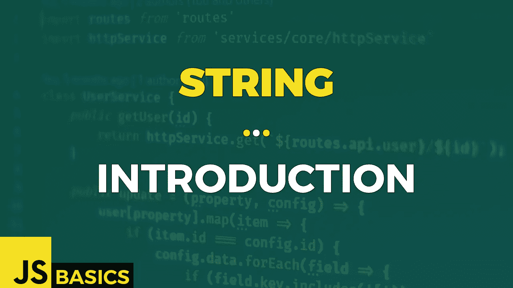

# Javascript 字符串基础介绍

> 原文：<https://medium.com/nerd-for-tech/basics-of-javascript-string-object-introduction-ebda3f4fe454?source=collection_archive---------24----------------------->



这篇文章是我在 youtube 上免费发表的关于网络开发基础的系列文章的抄本。如果你更喜欢看而不是读，请随时访问我的频道“Dev Newbs”。

大家好，欢迎来到激动人心的 web 开发世界。我叫 Jacob，我将是这个 javascript 基础知识系列的主持人，重点介绍 Javascript 内置对象 String。

我将尽力指导您了解所有的字符串属性和方法，因此在本系列的最后，您将能够像专业人士一样使用 Javascript 处理字符串。所以，事不宜迟…让我们开始吧。

JavaScript 字符串允许我们存储和操作文本。真的就这么简单。每个字符串由零个或多个用引号括起来的字符组成。您可以使用单引号(')和双引号(")，但您必须始终在开头和结尾使用同一种引号。

您还可以使用反斜杠字符(`)，它用于指定模板文字，但这是另一个主题，所以我们不要太详细，除了我们可以像使用引号一样使用它。

让我们看看初始化字符串的实际代码示例。

```
const string1 = "Hello, I am a string variable";
const string2 = 'Hello, I am a string variable';
const string3 = `Hello, I am a string variable`;
```

在这三种情况下，我们都得到相同的字符串值。您可以在字符串本身中自由使用任何类型的引号，只要封装是用另一种类型的引号完成的。

```
let string4 = "It's going to be a great introduction";
let string5 = "I think it should be rather called 'Intro'";
let string6 = `Yeah, "Intro" sound way cooler!`;
```

如果出于某种原因，您需要在字符串中使用相同类型的引号，并且为了封装字符串，您可以使用反斜杠转义字符。

```
let string7 = "We are the  \"dynamic duo\". Pleasure to meet you.";
let string8 = 'We are the \'dynamic duo\'. Pleasure to meet you.';
let string9 = `We are the \`dynamic duo\`. Pleasure to meet you.`;
```

还有更多的特殊字符需要用反斜杠字符进行“转义”,但目前，我们只关心下面这些字符:

*   单引号(')
*   双引号(")
*   反斜杠(`)
*   反斜杠(\)

字符串与数组也有某些相似之处。其中之一是我们可以使用方括号([])来访问字符串的特定字符。重要的是要记住，字符串索引是从零开始的。这意味着字符串的第一个字符可以通过索引 0 来访问。另一个例子:

```
let x = "Hello Guru!";
console.log(x[0]);     // you will get 'H' as the output
```

到目前为止，示例中的所有变量都是字符串原语。但是还有一种东西叫做字符串对象。那么到底有什么区别，为什么我们会在乎呢？

首先，我们将在后续文章中涉及的属性和方法属于一个 Javascript 内置对象 String。对我们来说，好消息是当我们试图在一个 string 原语变量上调用 String 对象方法时，Javascript 会自动进行转换。所以你自己不需要关心这个。由于这个事实，我们可以在 string 原语上调用 String 对象的任何方法。

那么，如果转换是自动完成的，我们使用哪一个又有什么关系呢？事实上这很重要。

您可以使用双等号比较字符串基元变量和字符串对象变量的值。这是可行的。

但是如果你尝试使用一个三重等号来比较变量的值和类型，你每次都会得到假的结果，因为它们的类型不相等。

```
let name1 = "Jacob";
let name2 = new String("Jacob");typeof(name1)   // tring
typeof(name2)   // objectname1 == name2  // TRUE
name1 === name2 // FALSE
```

更糟糕的是，当谈到对象时，你甚至不能在彼此之间进行比较。对象对对象的比较，无论你做什么，永远不会解析为真。不管你用两个还是三个等号比较都没关系。

```
let name3 = new String("Michael");
let name4 = new String("Michael");name3 == name4   // FALSE
name3 === name4  // FALSE
```

我个人建议总是使用字符串原语，除非有特定的理由不使用它。你的代码不仅不会那么复杂，而且运行速度也会更快。

介绍到此为止。下一次，我们将研究少数属性之一——但同时也是最常用的属性之一——string . length。

感谢您的时间，我们将在下一篇文章中再见。