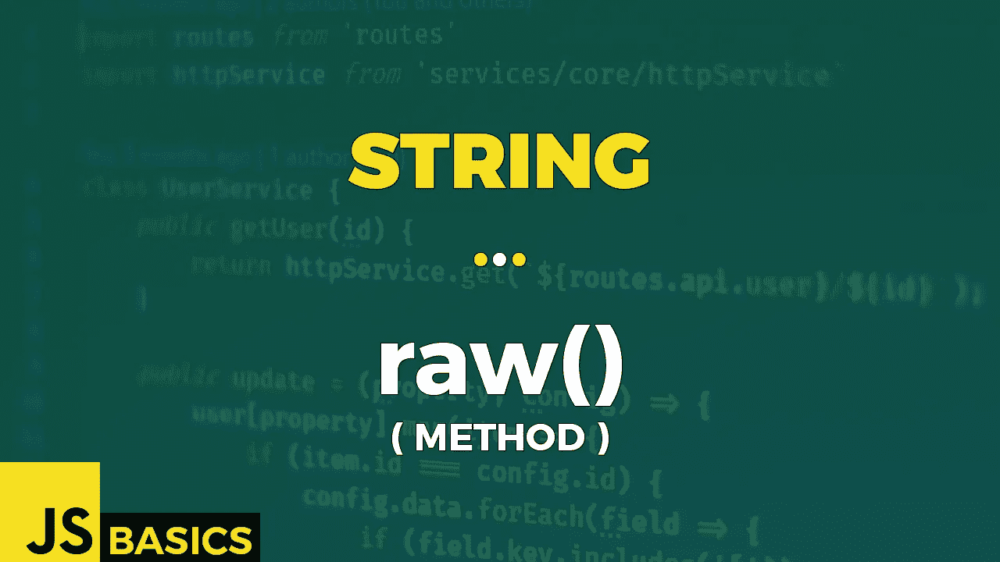

# Javascript String raw()的基础知识(方法)

> 原文：<https://medium.com/nerd-for-tech/basics-of-javascript-string-raw-method-449820039c39?source=collection_archive---------11----------------------->



这篇文章是我在 youtube 上免费发表的关于网络开发基础的系列文章的抄本。如果你更喜欢看而不是读，请随时访问我的频道“Dev Newbs”。

向所有优秀的开发新手问好！这一集的字符串方法将是原始的。我的意思是它将是关于方法 raw()。哈哈…逮到你了！

raw()方法是一个静态方法，就像 fromCharCode()和 fromCodePoint()方法一样。

我们通过键入“String.raw”来调用它，并为它提供参数。

这个方法允许我们获得模板文字的原始字符串形式。换句话说，我们得到了变量替换，但是没有处理转义字符。它们是生吃的。我想这就是它的名字。

```
const filePathRaw = String.raw`C:\Development\Strings\nevergonnagiveyouup.html`;
const filePath = `C:\Development\Strings\nevergonnagiveyouup.html`;// The file was uploaded from: 
// C:\Development\Strings\nevergonnagiveyouup.html// backslashes from Windows path are not processed
`The file was uploaded from: ${filePathRaw}`// backslashes are processed (\n is processed as new line)
`The file was uploaded from: ${filePath}`// The file was uploaded from: C:DevelopmentStrings
// evergonnagiveyouup.html
```

在第一种情况下，我们使用 String.raw，它禁用处理。因此，所有反斜杠及其后面的字符都被视为普通字符。当您处理文件或文件夹的路径时，这很方便。

我故意在示例中使用了“\n”。在第二种情况下，您可以看到该字符被处理为一个新的行字符，并在输出中显示出来。

好吧，我实际上跳过了理论中的参数部分，现在开始。可以通过两种不同的方式调用该方法。

第一个需要两个参数。一个是结构良好的模板调用站点对象，我将在下面的例子中展示它。第二个实际上是一个或多个替代值。

或者，您可以只使用一个参数来调用该方法，这个参数就是模板文字字符串，它最好还包含一些变量的替换。否则，就没必要了。

还有一点需要注意，如果第一个参数不是一个格式良好的对象，就会抛出 TypeError。

太好了。规范阶段完成后，让我们跳到更多的例子。

```
let str1 = `Hi\n${2+3}!`;
let raw1 = String.raw`Hi\n${2+3}!`;`${str1} (${str1.length})`                     // Hi
                                               // 5! (5)
`${raw1} (${raw1.length})`                     // Hi\n5! (6)let str2 = `Hi\u000A!`;
let raw2 = String.raw`Hi\u000A!`;`${str2} (${str2.length})`                     // Hi
                                               // ! (4)
`${raw2} (${raw2.length})`                     // Hi\u000A! (9)const myVar = "DEV_NEWBS";// equals to `foo${2+3}bar${'Java' + 'Script'}baz`
let raw3 = String.raw
(
    {
        raw: ['foo', 'bar', 'baz', 'fye']
    }, 
    2 + 3, 
    'Java' + 'Script',
    myVar
);raw3                            // foo5barJavaScriptbazDEV_NEWBSfye

// equals to `t${0}e${1}s${2}t`:
String.raw({ raw: 'test' }, 0, 1, 2)            // t0e1s2t
```

此方法主要用于模板文本。第一种语法很少使用，老实说，即使是例子也没有确切地显示使用它的附加值。

但我们还是会报道的。

前两个例子展示了使用 String.raw 所带来的区别。这就是我们已经提到过的大部分内容——禁止处理特殊转义字符，但允许变量替换。到目前为止一切顺利。

最后两个例子向我们展示了现实生活中罕见的语法。这并不令人印象深刻，因为它所做的一切都可以通过标准操作或一点字符串魔术和 concat()方法来完成。我们基本上提供了任何可迭代的项——数组、对象，甚至字符串，并在可迭代的各个项之间添加了附加值。如我所说。没什么了不起的。不过话说回来。可能是我不懂吧。那也有可能。如果您碰巧找到了它的一个用例，请告诉我，我会很乐意更新这篇文章。

这就是静态方法 raw()。这是我对你的告别。

感谢您的关注，我们下次再见。