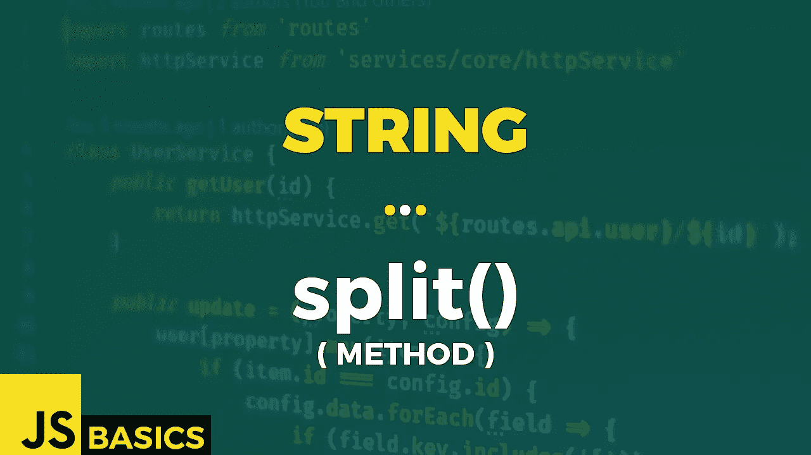

# Javascript String split()的基础知识(方法)

> 原文：<https://medium.com/nerd-for-tech/basics-of-javascript-string-split-method-4647aa1b0f4e?source=collection_archive---------7----------------------->



这篇文章是我在 youtube 上免费发表的关于网络开发基础的系列文章的抄本。如果你更喜欢看而不是读，请随时访问我的频道“Dev Newbs”。

向观看这一集的所有开发人员问好！今天的方法是我最喜欢的方法之一。请不要问我为什么喜欢字符串方法。我想我只是有点奇怪。但是现在说真的——我们将会疯狂地分离琴弦。振作起来！

split()方法用于将一个字符串拆分成一个子字符串数组，并返回新的数组。split()方法不会更改原始字符串。该方法有两个参数。两者都是可选的。

首先指定用于拆分字符串的字符或正则表达式。如果省略参数，整个字符串将作为只有一项的数组返回。另一方面，如果使用空字符串("")作为分隔符，字符串将在每个字符之间拆分。

第二个参数是一个整数，指定拆分的数量。拆分限制之后的项目将不会包含在结果数组中。

让我们看看它在示例 1 中是如何工作的。

```
const str = "Hello Dev Newbs! 😃";// separator is not provided
str.split()                   // ["Hello Dev Newbs! 😃"]// separator is empty string
str.split("")// ["H", "e", "l", "l", "o", " ", "D", "e", "v", " ", "N", "e", "w", // "b", "s", "!", " ", "\ud83d", "\ude03"]// separator is empty space
str.split(" ")                // ["Hello", "Dev", "Newbs!", "😃"]// separator is RegExp specifying (optional) empty space + capital letter
str.split(/[\s]*[A-Z]/)       // ["", "ello", "ev", "ewbs! 😃"]// separator is empty string & limit is 5 first letters
str.split("", 5)              // ["H", "e", "l", "l", "o"]
```

正如我们在第一个例子中看到的，省略输入参数会导致数组中只有一个由整个字符串组成的元素。

空字符串将字符串拆分为单独的 UTF-16“字符”。我想指出，由多个代码单元组成的字符将被拆分成代码单元，而不是代码点。因此，我们的表情符号被分割成代码单元值，正如我们在输出中看到的那样。

如果我们使用正则表达式，必须找到精确的匹配，否则结果是一个数组，其中一个元素由整个字符串组成。

如果拆分字符或正则表达式在开头或结尾，拆分仍然会发生，我们会在开头或结尾得到一个空字符串元素，具体取决于是哪种情况。在分隔符是正则表达式的情况下，您可以看到这种情况，我们正在搜索大写字母，前面可以有空格。字符串开头的大写 H 符合这一条件，因此拆分会创建空白空间作为结果数组的第一个元素。

当谈到我应该提到的正则表达式时，有一些违反直觉的行为。如果 separator 是一个带有捕获括号的正则表达式，那么每次 separator 匹配时，捕获括号的结果(包括任何未定义的结果)都会拼接到输出数组中。

让我们看看第二个例子中的行为。

```
const months = 'January,February ,March,April, May, June , July,August,  ...';const re1 = /\s*,\s*/;
const re2 = /\s*(,)\s*/;months.split(re1) // ["January", "February", "March", "April", "May", "June", "July", // "August", "..."]months.split(re2)// ["January", ",", "February", ",", "March", ",", "April", ",", 
// "May", ",", "June", ",", "July", ",", "August", ",", "..."]
```

第一个正则表达式没有使用括号，我们得到了我们所期望的。但是在第二种情况下，括号中包含逗号，所以这个匹配也被添加到结果数组中。

这个例子还有另一个有趣的方面，那就是使用表达式“\s*”来删除一个或多个潜在的空格。当我们试图分割没有精确定义结构的字符串时，这很方便。

让我们再看一个实际展示用例的例子，当这个行为有意义的时候。

```
const numbers = 'Uno  Dos Three  4 Five 6 Sieben Osem 9 zehn';const re = /\s*(\d+)\s*/;numbers.split(re) // ["Uno  Dos Three", "4", "Five", "6", "Sieben Osem", "9", "zehn"]
```

我们正在尝试拆分包含不同数字表示的字符串。我们的数字可以用不同的语言写成单词，甚至可以用数字。我们首先要把字符串分成单词数字和数字数字。我们可以使用提供的正则表达式做到这一点。然后我们可以按照我们认为合适的方式处理每组单词数。

当然，还有许多其他的解决方案，有些比其他的更有效，但是……有这个选项也很好。

好了，这就是 String 方法 split()的内容。我希望你喜欢这一集。

一如既往，感谢您的宝贵时间。我非常感激。下一篇文章再见。