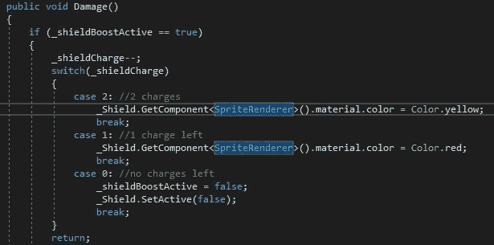
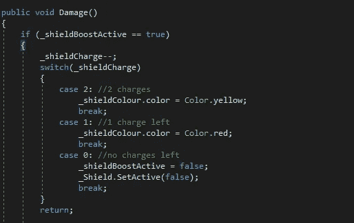
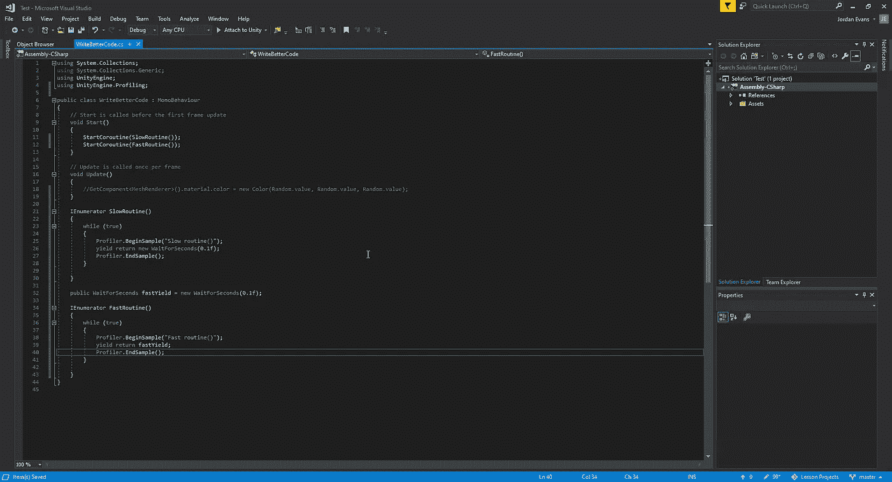
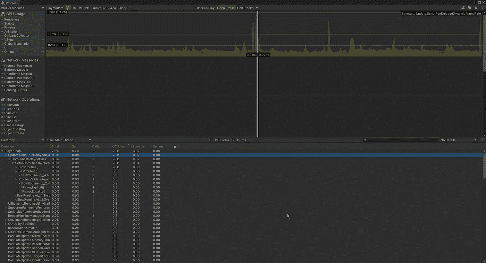
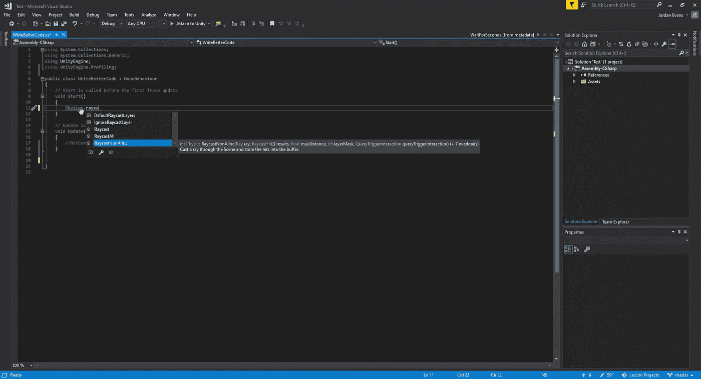
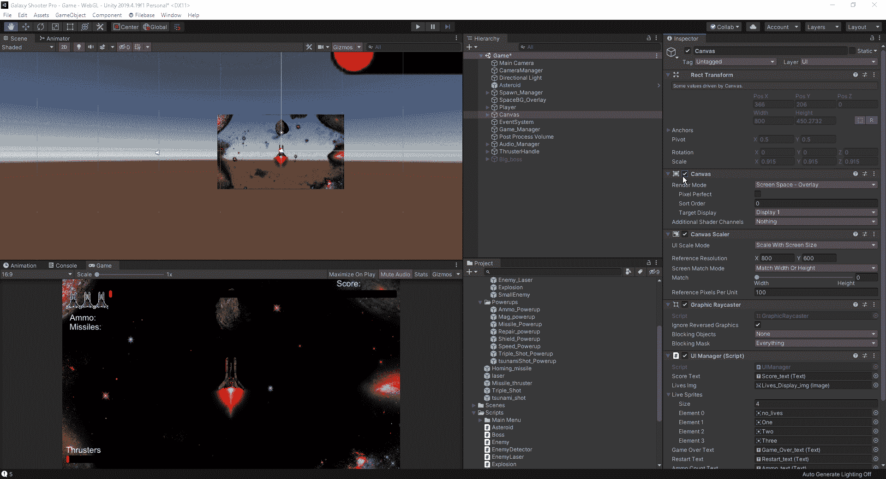

# Unity 中的优化基础

> 原文：<https://medium.com/nerd-for-tech/basics-of-optimization-in-unity-dc10fab79f43?source=collection_archive---------8----------------------->

现在，我们已经花了一些时间为各种不同的项目创建代码，并对如何构建代码有了一个好的想法，让我们回过头来看看如何在代码创建中变得更加优化。有无数种方法可以优化我们的方法。我将只是概述一些，但肯定还有更多可以找到。

1.  尽可能避免 GetComponent

使用 GetComponent 可能会耗尽一些 GC 分配。为同一目的或像相机这样的关键元素多次使用它，会导致 GC 的累积。为了防止这些问题，通常最好将组件缓存到它自己的对象中，然后当我们以后需要调用它时，我们可以使用缓存的值。

一个很好的基本规则是，如果对象碰巧是一个类，我们希望它被缓存，如果它是一个结构，我们可以使用 GetComponent 而不需要缓存它。

浏览我工作的第一个项目中的一些代码，我注意到我用这些代码来改变我的船盾的颜色。这一小段代码可以通过缓存 material 类来优化:

因此，由于材质是一个类，我们可以创建一个 _shieldColour 的新私有材质，并在我们的 void start 中分配它:

在这里赋值后，我们可以返回到原始代码并替换 GetComponents:

这可能看起来有点琐碎，但是通过我们编写的代码进行这样的更改可以帮助节省 GC 分配。我们只能说，在我们改变它之前，它已经用完了 200b 的 GC 分配。如果我们像这样使用 GetComponent 有 5 个不同的方法，我们已经有 1kb 的 GC 了。较小的值会很快增加，并在项目中产生 fps 问题，因为 it 必须处理所有未优化代码的多余 GC。

2.优化协程

在协同例程中，我们可以为 WaitForSeconds 创建一个缓存值:

这里我们有两个独立的协程，它们执行完全相同的过程。但是，1 缓存了它的 WaitForSeconds，而另一个没有。为了了解这两者之间的区别，我们可以创建一个样本组，并为其指定一个标题，以便在查看我们的层次结构时能够理解:

现在，在运行一段时间后，查看我们的分析器，我们可以看到偶尔会构建 20B 个 GC alloc。通过进一步的调查，我们可以发现它来自于我们缓慢的日常生活。这是因为我们在实际的协程中使用了新的 WaitForSeconds，而不是为它创建一个缓存并在那里分配它。

3.尽可能使用非字母版本

当我们在项目中使用 raycast 时，可以选择 RaycastNonAlloc，它将执行相同的过程，但是它不会产生任何垃圾。

4.尽可能使用列表而不是数组

与数组相比，列表更容易使用，可以更容易地在代码中清除，并且占用的内存更少。

5.使用活动和静态画布

当构建一个项目时，要养成的一个好习惯是创建一个活动的和一个静态的画布。将所有的 UI 元素放在一个画布中会弄脏整个画布。这是因为当你有一些东西改变了它的值，整个画布将被刷新。这包括所有其他的视觉效果，但不要改变。相反，UI 元素将改变为 1 个画布，静态元素将改变为自己的画布。

6.隐藏画布组件，而不是对象

这些只是我们在 Unity 中优化应用的众多方法中的一部分。外面还有很多，所以花点时间看看你能在网上找到什么。