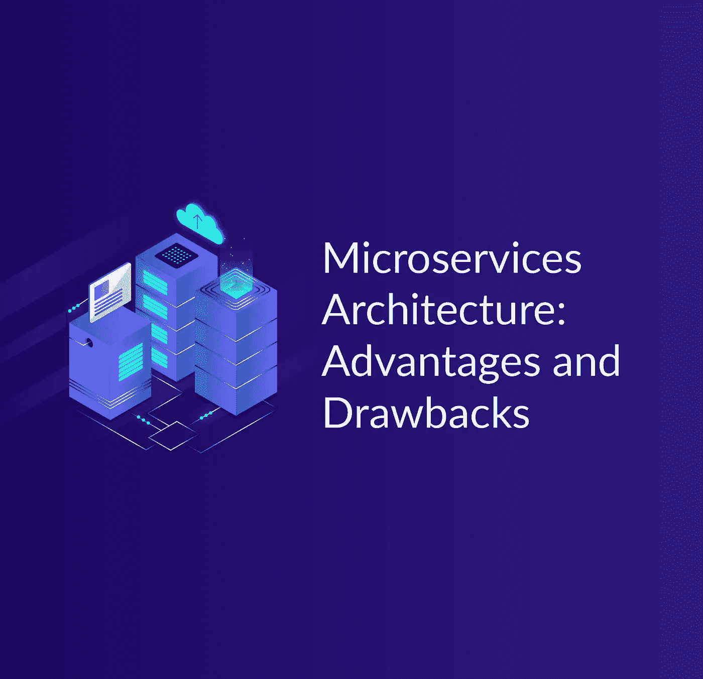

# 微服务的优势

> 原文：<https://medium.com/nerd-for-tech/benefits-of-microservices-92a1821aaba?source=collection_archive---------3----------------------->

# 微服务架构

*   [微服务架构](https://www.technologiesinindustry4.com/)风格是一种将一个应用程序开发成一套小型服务的方法。
*   每个都在自己的进程中运行，并与轻量级机制(通常是 HTTP 资源 API)进行通信。
*   微服务确实有明显优势:

**更好的组织**

*   [微服务架构](https://www.technologiesinindustry4.com/)通常组织得更好
*   每个微服务都有一个真正特定的工作，它不涉及其他组件的角色。

**解耦**

*   分离的服务也更容易改变、更新和重新配置，以满足不同类型的应用程序的需求
*   它们还可以在一个更大的集成系统中快速、独立地交付各个部件。

**性能**

*   在适当的情况下，微服务也可以凭借其组织方式获得性能优势。
*   隔离热门服务并独立于应用程序的其他部分进行扩展是可能的。

# 面向微服务

*   云原生应用构建为一个[微服务系统。](https://www.technologiesinindustry4.com/)这种架构风格的总体思想是实现一个由多个相对较小的应用程序组成的系统。这些被称为微服务。
*   它们共同为您的系统提供一般的功能。每个[微服务](https://www.technologiesinindustry4.com/)实现；
*   恰好一个功能
*   有明确的边界和 API(应用编程接口——用于通信)。
*   由相对较小的团队开发和运营

# [微服务的好处](https://www.technologiesinindustry4.com/)

*   在[微服务](https://www.technologiesinindustry4.com/)架构中，服务是细粒度的，因此协议是轻量级的。
*   服务是围绕业务能力组织的。
*   服务规模小，支持消息传递，受上下文约束，自主开发，独立部署。
*   这使得设备更容易理解、开发、测试，并且对架构侵蚀更有弹性，更容易实现和理解提供一种功能的较小应用程序，而不是构建一个做所有事情的超大应用程序。
*   这加速了开发，并使服务适应变化的或新的需求变得非常容易。
*   由于微服务的实施和部署彼此独立，即它们在独立的流程中运行，因此它们将被独立监控和扩展。
*   你会希望少强调看似鸡饲料的意想不到的副作用，你会专注于手头的事件任务。
*   它还允许您更高效地扩展。
*   尽管您仅仅使用了 monolith 的一小部分，您仍然需要为其他未使用的部分获取额外的资源，但是在云环境中，您购买了硬件资源的使用。

# 使用微服务的挑战

*   有句话说:天下没有免费的午餐。微服务消除了服务本身的一些复杂性，并提供了更好的可扩展性，但你现在正在构建一个分布式系统。
*   这在系统层面上增加了很多复杂性。
*   当微服务的数量很多时，要确保依赖的服务找到彼此并有效地通信是一项具有挑战性的任务。
*   我们还需要处理缓慢或不可用的服务，以便它们不会影响整个系统。
*   我们系统的分布式本质也使得在生产中监控和管理我们的系统变得更加困难。
*   我们现在需要监控一个微服务系统，而不是几个整体，对于每个服务，可能有几个并行运行的实例。

更多详情请访问:[https://www . technologiesinindustry 4 . com/2020/08/benefits-of-micro-services . html](https://www.technologiesinindustry4.com/2020/08/benefits-of-micro-services.html)