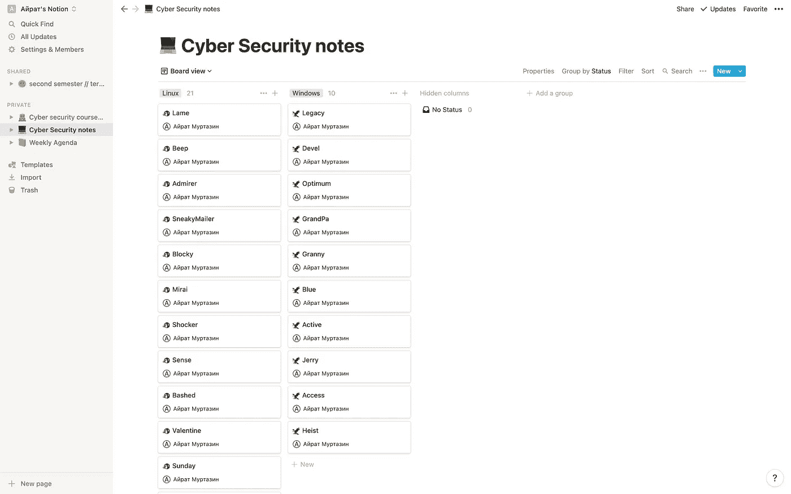
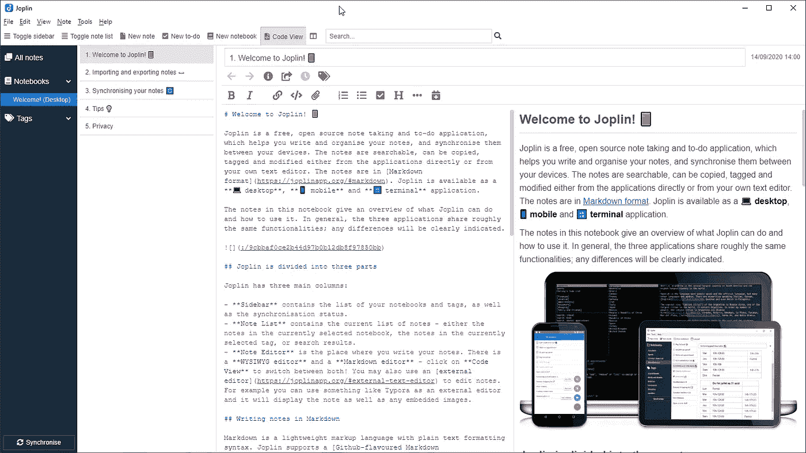

# 最佳考试笔记应用程序

> 原文：<https://medium.com/nerd-for-tech/best-note-keeping-apps-for-notes-and-oscp-prep-as-a-pentester-6e04e82eb7c0?source=collection_archive---------4----------------------->

## 笔记和考试准备的三大最佳应用

Hause Lin 截图

# 概念

我每天用的最好的。把所有东西都放在那里非常简单方便。一旦你需要在那里找到什么，你可以很容易地用快速查找来完成

**概述:**提供强大的、数据库驱动的笔记体验，这与大多数应用程序不同。

**兼容性:** Mac、iOS、Android、Windows、浏览器

**优点:**

*   **灵活的页面。观念有一个模板引擎，允许你把几乎任何东西变成一个容易复制的模板，包括多层的页面集合。它还拥有强大的媒体嵌入和预览工具，包括照片和视频的图库视图。**
*   **功能强大的表。观念中的表格不仅仅是图表；它们是数据库。把概念的数据库想象成 Google Docs + Google Sheets:表格中的每一行都是它自己的概念页面，你可以进入并更新它。**
*   **嵌套的层级组织。**你可能对此感到厌倦。但是观念做到了这一点。你甚至可以把一组文本变成下拉菜单，这样当你想去掉非即时信息时就可以把它们卷起来。
*   **混合编辑器。**概念可以让你用 Markdown 或者使用普通的键盘快捷键和 UI 元素来格式化你的文本。
*   **免费个人账户。观念曾经相当昂贵，现在仍然适用于团队计划。然而，个人计划最近变得完全免费。**

**缺点:**

*   **编辑中由于闭塞系统而产生的怪癖。不幸的是，观念在格式部门严重动摇，这都要归功于他们的阻止系统。每个段落都是一个块，每个块都可以移动，变成不同的元素，加上标签和颜色。不幸的是，一旦你选择了超过一个块，你现在选择的是块，而不是文本。目前，它仅仅是一个令人惊叹的数据存储应用，但它是一个低于平均水平的写作应用。(观念团队:如果你正在阅读这篇文章，也许你可以让我们在块模式和写模式之间切换，或者让这些模式一起播放更好，比如 Medium？)**
*   **不支持离线。**目前，你需要有一个互联网连接才能使用概念。该团队正在努力改变这一点，但目前这是一个很大的限制。

# 黑曜石

约翰·哈蒙德将其命名为 OSCP 笔记的最佳笔记应用，所以，让我们相信他)一些截图:

Hause Lin 截图

该应用程序提供了各种结构，给你一个充满文件夹的侧边栏，你可以用来组织，但也强调内部超链接。这里的一个核心思想是，您将经常创建新的笔记，然后在其他文档中链接回它们。这就创建了一个你可以轻松浏览的知识网络，而且还有一个快捷的键盘快捷键，可以按名称或内容调出笔记。这几乎就像一个个人维基，但更好。

这听起来很奇怪，但是开始使用它，这个概念很有意义，很快。你可以让它完全按照你想要的方式工作。关于界面的一切都是可定制的，你可以在同一个窗口中打开多个笔记。但是真正的力量来自社区插件，它允许你添加一些功能，比如每日日志条目的日历或者成熟的看板。

# 乔普林

界面是传统笔记 app 的界面，笔记本和笔记整理在左栏。你也可以使用标签来组织笔记，并且你可以使用 [web clipper](https://joplinapp.org/clipper/) 从网上剪辑文章。主编辑器在 Markdown 中，但是如果你不习惯的话，还有一个可选的富文本编辑器。还支持在外部应用程序中打开笔记，所以如果你有一个最喜欢的 Markdown 编辑器，你可以使用它。