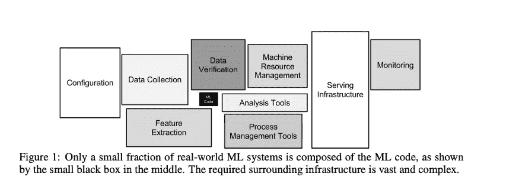

# 超越 Jupyter 笔记本

> 原文：<https://medium.com/nerd-for-tech/beyond-jupyter-notebooks-f99aa0e45234?source=collection_archive---------2----------------------->

## 介绍

当我谈论数据科学和机器学习时，我发现自己一次又一次地想起一个形象。很多人已经看过了，但我仍然喜欢展示它，因为它是这个系列文章背后的推理，这个系列文章叫做《超越 Jupyter 笔记本》。

问题中的图像是来自谷歌工程师的同名论文的*机器学习系统中隐藏的技术债务*(见下文)([https://papers . nips . cc/paper/5656-Hidden-Technical-Debt-in-Machine-Learning-systems . pdf](https://papers.nips.cc/paper/5656-hidden-technical-debt-in-machine-learning-systems.pdf))。

*机器学习系统中隐藏的技术债务*

时至今日，数据科学家/机器学习工程师这个头衔根据你所在的组织而有不同的含义。但在我看来，这两个角色都应该在某种程度上对机器学习中隐藏的技术债务有所了解。换句话说，我认为*数据科学家/机器学习工程师*应该更加关注端到端。有些人甚至会说，这份工作最终会变成带有数据味道的软件工程。

因此，这篇文章的标题是《拜永·朱庇特笔记》。我们很多人都是通过笔记本学习在线课程，如 Data Quest、Data Camp 或学术课程。这些都是很棒的课程，但是它们主要集中在 ML 代码上，而没有触及机器学习管道的所有其他组件。

考虑到这一点，我设计了一系列文章，带您了解如何部署具有递增复杂性的模型。遵循敏捷思维，我们将在每个部分的末尾部署一个模型。

以下是 Jupyter 笔记本之外的系列*部分:*

*   [第 0 部分:建立 ML 项目](https://gregjan.medium.com/beyond-jupyter-notebooks-11af930c6bf7)
*   [第 1 部分:使用烧瓶和对接器的非 ML 模型部署](https://gregjan.medium.com/beyond-jupyter-notebooks-6fd11322d313)
*   [第 2 部分:使用 Streamlit 和 Docker 的非 ML 模型部署](/nerd-for-tech/beyond-jupyter-notebooks-63b169c43c44)
*   [第 3 部分:带烧瓶和对接器的 ML 模型部署](https://gregjan.medium.com/beyond-jupyter-notebooks-8fc0333517f3)
*   第 4 部分:使用 Streamlit 和 Docker 的 ML 模型部署*(未发布)*