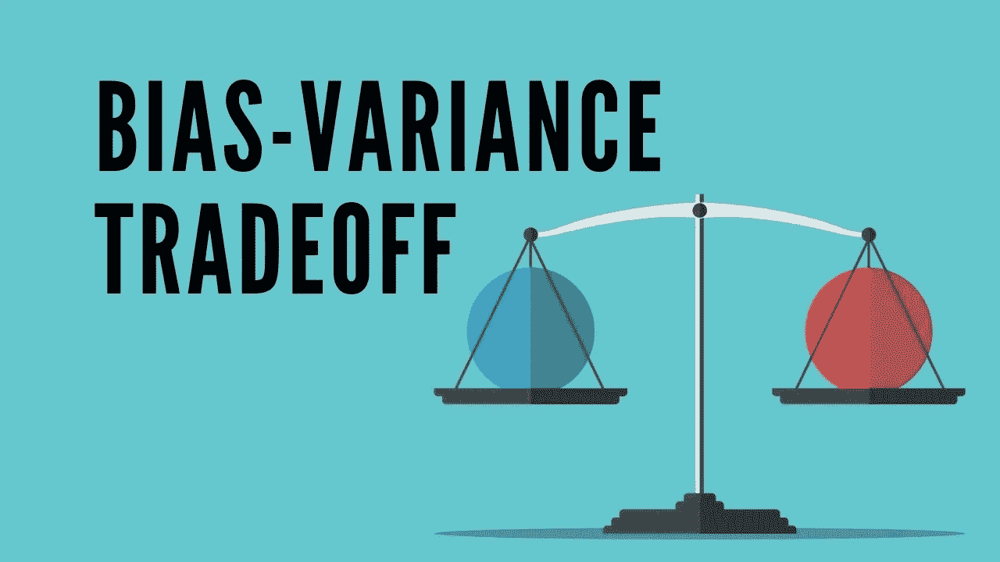
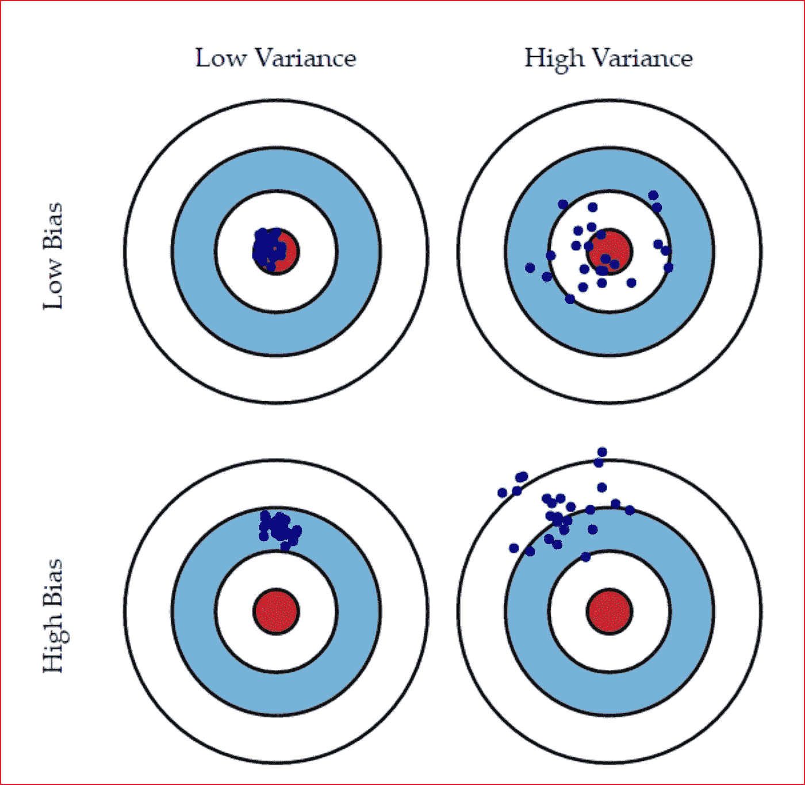
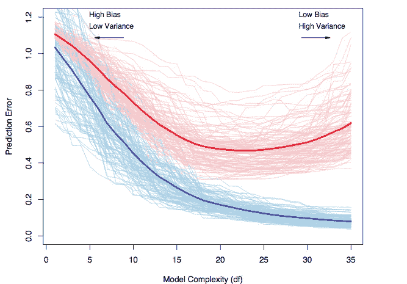

# 假人的偏差-方差权衡

> 原文：<https://medium.com/nerd-for-tech/bias-variance-tradeoff-for-dummies-9f13147ab7d0?source=collection_archive---------1----------------------->

“简单的模型是最好的模型”——奥卡姆剃刀

## 偏差和方差概述

偏差是模型为使目标函数更容易学习而做出的简化假设。偏差是一种以自我为中心的方法，它告诉我们决策与数据有多远。(通俗地说，偏见有它的自我，它不在乎数据)

一般来说，线性算法有很高的偏向性，这使得它们学习起来很快，也更容易理解，但通常不太灵活。就预测性能而言，它们在无法满足简化假设的复杂问题上表现不佳。大量的偏差可能会导致数据拟合不足，因为如果我们有很高的偏差，它甚至会在不关心数据的情况下做出假设。

*   **高偏差**:暗示关于目标函数形式的更多假设。高偏差机器学习算法包括线性回归、线性判别分析和逻辑回归。
*   **低偏差**:暗示对目标函数形式的假设较少。低偏差机器学习算法包括决策树、k 近邻和支持向量机。

*图 1:偏倚和方差的图解说明。
来源:*[*http://scott.fortmann-roe.com/docs/BiasVariance.html*](http://scott.fortmann-roe.com/docs/BiasVariance.html)

方差是如果使用不同的训练数据，目标函数的估计将改变的量。它指的是算法对特定训练数据集的敏感度，即如果你在不同的训练数据集上训练，机器学习模型的预测会改变多少。(通俗地说，方差指的是紧跟数据点，即随波逐流)

具有高方差的机器学习算法受到训练数据细节的强烈影响。高方差机器学习算法对数据非常敏感，这可能导致训练数据的过拟合。

*   **高方差**:表示目标函数的估计值随着训练数据集的变化而发生较大变化。高方差机器学习算法包括决策树、k 近邻和支持向量机。
*   **低方差**:建议随着训练数据集的改变，对目标函数的估计进行小的改变。低方差机器学习算法包括线性回归、线性判别分析和逻辑回归。

## 偏差-方差二分法

这里的概念是，虽然增加机器学习模型的复杂性可能会提高对训练数据的拟合，但它不需要提高对训练数据(即新数据)的预测精度。

*图 2:偏差-方差权衡的图解说明(蓝色-训练拟合，红色-测试拟合)*

从上图中，我们可以看到，随着模型复杂性的增加，通过密切跟踪训练数据集的拟合，测试数据的拟合变得更好。测试数据的预测误差随着模型复杂性的增加而减小，直到某一点(当达到模型的正确复杂性时预测误差最小，也称为“最佳点”)，然后预测误差随着模型复杂性的进一步增加而增加。

> 在这里，奥卡姆剃刀理论出现了，它说“没有必要，实体不应该繁殖”。在机器学习的背景下，这意味着与简单模型相比，不必要地增加模型复杂性将产生相对糟糕的结果。

## **例子**

偏见车将是一种不太关心数据而做出简化假设的车，无论我们以何种方式训练，它都不会有任何不同。但另一方面，如果我们制造一辆对数据有极强感知能力(即高方差)的汽车，那么它只能复制它以前见过的东西。这个模型的问题是，它在以前没有见过的情况下反应很差，因为它没有正确的偏见来归纳新的数据。

## 结论

实际上，我们希望在一定程度的偏差和方差之间找到一个中间点，称为偏差-方差权衡。最佳的机器学习模型应该具有一定的归纳权威，但同时，它应该非常开放地听取数据。

如果你想了解更多，或者想让我写更多关于这个主题的东西，请随时联系…

我的社交链接:[LinkedIn](https://www.linkedin.com/in/shubhamsaboo/)|[Twitter](https://twitter.com/Saboo_Shubham_)|[Github](https://github.com/Shubhamsaboo)

*如果您喜欢这篇文章或觉得它有帮助，请花一分钟时间按一下鼓掌按钮，它会增加文章对其他媒体用户的可见性。*

## 参考资料:

*   [http://www . cs . Cornell . edu/courses/cs 4780/2018 fa/lectures/lecture note 12 . html](http://www.cs.cornell.edu/courses/cs4780/2018fa/lectures/lecturenote12.html)
*   [https://en . Wikipedia . org/wiki/Bias % E2 % 80% 93 variance _ trade off](https://en.wikipedia.org/wiki/Bias%E2%80%93variance_tradeoff)