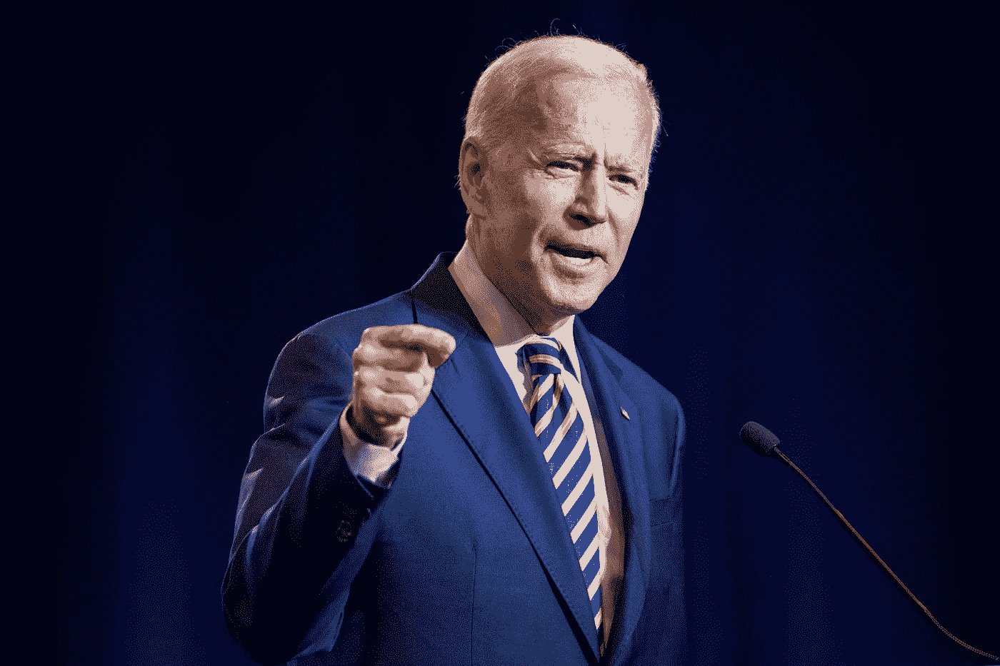

# 拜登谈网络安全:100 天了，评论褒贬不一

> 原文：<https://medium.com/nerd-for-tech/biden-on-cybersecurity-100-days-in-reviews-are-mixed-7db54f0ff46e?source=collection_archive---------15----------------------->

## 总统已经开了一个好头。但它执行的策略是最难的部分

快门架

不，总统的遗产应该仅仅取决于他执政的头 100 天里发生的事情。这还不到一个学期的 7%。

但不管是好是坏，100 天已经成为新总统的一个标志，既标志着期待什么，也标志着政府可能能够完成什么。这是一个“蜜月期”,重大政策提案最有可能在分裂的国会获得通过。

所有这些导致了本周对乔·拜登总统轨迹的分析，从疫情到气候变化、移民、基础设施、税收和网络安全，无所不包。

是的，网络安全。总统在就职前表示，这将是他的[“首要任务”之一](https://www.bloomberg.com/news/articles/2020-12-17/biden-calls-cybersecurity-a-top-priority-after-russian-hack)

应该是。正如我们现在每天都被提醒的那样，数字世界对现实世界有着直接的影响，不管是好是坏。它提供了便利和力量，这在一代人之前只是科幻小说中的梦想，但它也对隐私、人身安全以及个人、企业和国家安全构成了威胁。

如果总统真的成功地以实质性的方式移动安全针，他将是第一个。自比尔·克林顿以来，网络安全已经产生了一系列美国总统的行政命令和倡议，从 2000 年克林顿的[国家信息系统保护计划](https://clintonwhitehouse4.archives.gov/WH/Work/021600.html)开始，该计划被称为“有史以来第一个保护国家计算机网络免受蓄意攻击的国家战略”

在特朗普政府执政期间，最近的一次是 2018 年 12 月提出的[“网络安全登月”](https://www.dhs.gov/sites/default/files/publications/DRAFT_NSTAC_ReportToThePresidentOnACybersecurityMoonshot_508c.pdf)，然后是 2020 年 3 月[美国网络空间日光浴室委员会](https://www.lawfareblog.com/announcing-cyberspace-solarium-commission)的一份 182 页的报告，提出了 80 多项建议，以实施“分层网络威慑”战略。

“我们在这里试图做的是一份没有 9/11 的 9/11 委员会报告，”委员会的两位联合主席之一、缅因州参议员安格斯·金(Angus King)当时告诉《连线》杂志。"我们试图在问题演变成灾难之前解决它。"

但在过去 20 年里，互联网已经像前几代人的汽车和电视一样深入现代生活，网络安全行业没有人会说它是安全可靠的。

事实上，美国政府可以在保护国家免受从物联网设备到关键基础设施到选举投票系统的一切恶意网络攻击方面发挥主导和有效作用的想法可能会让许多人觉得荒谬。其灾难性的安全失败是众所周知的:

*   [人事管理办公室(OPM)](https://oversight.house.gov/wp-content/uploads/2016/09/The-OPM-Data-Breach-How-the-Government-Jeopardized-Our-National-Security-for-More-than-a-Generation.pdf) 无法保护超过 2200 万现任和前任联邦雇员的个人身份信息(PII)。
*   [国家安全局](https://nakedsecurity.sophos.com/2017/11/15/shadow-brokers-cause-ongoing-headache-for-nsa/)无法保护自己隐藏的所谓零日(未公开)漏洞，它希望利用这些漏洞来监视或攻击敌对国家或恐怖组织。相反，这些秘密最终落入了维基解密的手中。
*   最近，政府无法阻止，甚至检测不到对 IT 供应商网络安全管理软件产品的灾难性网络攻击，这次攻击损害了 9 个联邦机构和(到目前为止)大约 100 家私营公司。
*   另一个正在进行的攻击来自中国，它利用了微软的 Exchange Server 中的零日[漏洞，这是一个企业电子邮件产品。据报道，它已经影响了美国至少 30，000 个组织，包括律师事务所、国防承包商和地方政府。](https://krebsonsecurity.com/2021/03/at-least-30000-u-s-organizations-newly-hacked-via-holes-in-microsofts-email-software/)
*   就在几周前，美国国家安全局(NSA)、网络基础设施安全局(CISA)和联邦调查局(FBI)的一份联合咨询报告(T1)警告称，俄罗斯对外情报局(SVR)正在积极利用五个主要软件漏洞攻击美国及其盟友的目标。

所有这些并不意味着政府应该停止改善国家网络安全的努力。这种威胁属于“明确而现实的危险”一类。拜登像所有 2020 年的总统候选人一样，发誓要为此做点什么。

100 天后，这是总统为实现这一誓言所做的一些事情:

*   上周，他发布了一项行政命令[宣布对俄罗斯实施制裁](https://thehill.com/homenews/administration/548367-biden-administration-unveils-sweeping-sanctions-on-russia)，原因是网络安全管理软件产品袭击事件和据称俄罗斯试图干涉 2020 年大选。这些制裁针对的是俄罗斯央行、六家俄罗斯科技公司和 32 名个人，美国称他们参与了俄罗斯影响 2020 年大选的努力。它还包括驱逐 10 名俄罗斯外交官。俄罗斯[迅速宣布驱逐 10 名美国外交官，将 8 名美国官员加入制裁名单，并表示将限制美国非政府组织在俄罗斯的活动。](https://www.npr.org/2021/04/16/988116668/russia-retaliates-against-bidens-new-sanctions-expelling-10-u-s-diplomats)
*   总统宣布了主要的网络安全任命，让一些人所谓的 NSA 校友协会负责国家的网络安全。他们包括国家安全委员会新设立的网络安全副国家安全顾问安妮·纽伯格(前国家安全局各种高级职位)；珍·伊斯特利(美国国家安全局反恐中心前副主任)担任 CISA 负责人；约翰“克里斯”英格里斯(前国家安全局副局长)担任国家网络主管。罗布·西尔弗被任命为国土安全部负责政策的副部长，是唯一一个没有国安局背景的人。
*   大约两个月前，白宫宣布拜登将发布一项行政命令，鼓励软件开发商将安全性融入他们的产品中。Neuberger 在 [SANS 协会的 ICS 安全峰会](https://www.sans.org/event/ics-security-summit-2021)上说，订单将“集中于软件标准的建立，特别是用于关键领域的软件。”
*   总统提议，国会最近通过了[1.9 万亿美元的冠状病毒救助计划](https://fortune.com/2021/03/10/3rd-stimulus-package-update-checks-house-passes-1-9-trillion-plan-passed-covid-relief-aid-bill-biden-congress/)，其中 6.5 亿美元专门用于 CISA。
*   4 月 20 日，政府宣布了一项“旨在保护电网免受网络攻击的百日计划”。国家安全委员会发言人艾米丽·霍恩(Emily Horne)称其为“政府为多个关键基础设施部门规划的更广泛的网络安全倡议的试点”，并表示这将是一种公私合作伙伴关系。霍恩表示，政府将“协助所有者和运营商实现网络安全防御的现代化，包括增强检测、缓解和取证能力。它还要求政府承包商在发现攻击后的几天内，向联邦政府客户报告他们的网络和软件受到的攻击。此前不久，北美电力可靠性公司(NERC) [报告](https://www.cyberscoop.com/nerc-solarwinds-backdoor-electric-sector/)称，大约 1500 家与 NERC 共享数据的电力公司中，约有四分之一表示他们安装了名为 Orion 的恶意网络安全管理软件产品软件更新，尽管其中大多数没有发现任何妥协的证据。
*   基础设施计划还包括 1000 亿美元用于改善电网，其中一些预计将用于改善网络安全。

这在技术社区是如何进行的呢？迄今为止，评论褒贬不一。

在某些情况下，它会受到热烈欢迎。Dmitri Alperovitch，CrowdStrike 的联合创始人和前首席技术官，现 Silverado 政策加速器的主席，[在推特上说，拜登的任命是“梦之队的网络版”。](https://twitter.com/DAlperovitch/status/1381430265378185218)

但是，Red Branch Consulting 的创始人保罗·罗森茨韦格(Paul Rosenzweig)在 Lawfare 的一篇帖子中极力称赞被任命者是“出色的专业人士”,并宣称自己是“NSA 的超级粉丝”,但他仍然认为这些任命对 NSA 来说太重了。

他说，该机构过于专注于进攻，而一名具有“私营部门背景或非军事政府背景的被任命者，本可以为他们的审议带来更多的多样性，并对私营部门网络安全如何运作有更微妙的理解。”

BitSight 负责通信和政府事务的副总裁雅各布·奥尔科特(Jacob Olcott)表示，政府已经“组建了一个非常强大的团队”，并同意国会设立一个“将允许(国会山)实施更多监督”的职位。他还表示，他认为政府对网络安全管理软件产品和微软交易所的攻击做出回应是有建设性的。

但是他说还有很多工作要做。“FBI 主动从易受攻击的 Exchange 服务器中清除后门 webshell 漏洞的声明意义重大。这是美国政府对商业实体采取更主动的补救措施的开始吗？对未来的努力有什么法律和隐私影响？”他说，并补充说，政府“需要建立一个运营战略，以解决表现不佳的组织的长尾问题，这些组织的脆弱性使我们处于危险之中。”

在其他方面，尽管基础设施法案中指定用于 CISA 的 6.5 亿美元是受欢迎的，但批评人士说这远远不够。与 CISA[关系密切的前众议院情报委员会工作人员安迪·凯瑟告诉政治](https://www.politico.com/news/2021/03/30/cisa-cybersecurity-problems-478413)，该机构“工作过度，人手不足，从某种意义上来说，是在盲目战斗。”

**俄国越过了哪条线？**

当谈到对俄罗斯的制裁时，俄罗斯立即做出了同样的回应，这看起来更像是双方的象征，而不是对渗透美国政府并窃取未知数量数据的真正惩罚。

正如多年来一直所说的那样，美国很可能正在利用网络攻击来监视其敌人。

德克萨斯大学法学院教授兼副院长 Robert Chesney 在 Lawfare 上的一篇帖子中质疑俄罗斯的攻击越过了什么样的“规范”界限。

政府给出的制裁理由之一是，网络安全管理软件产品的攻击利用了软件供应链。“这是断然禁止的吗？这可能不是美国的立场，因为这绝不是第一次软件供应链攻击，以前的此类攻击都没有引发这样的抵制，”切斯尼写道。

最后，谈到网络战略，Anomali 的网络情报战略主管 AJ Nash 在安全周上的一篇[帖子中称，政府不需要制定新的网络战略。它充斥着前几届政府或国会的模板。](https://www.securityweek.com/what-cybersecurity-policy-changes-should-we-expect-biden-administration?utm_source=feedburner&utm_medium=feed&utm_campaign=Feed%3A+Securityweek+%28SecurityWeek+RSS+Feed%29)

他说，最好的是索拉里姆委员会的报告，这份报告只有大约一年的历史，提供了“重大变革的大胆建议，我相信拜登总统可能会将这些建议用作重建美国在网络空间运作方式的蓝图。”

该报告的建议包括更新国家网络战略，并将其置于“单一执行所有者”的领导之下。

**关于执行的一切**

但是，一如既往，这将归结为一旦各部分(任命、资金和战略)到位，政府执行计划的能力有多强，而不是花言巧语或象征意义。至少一些专家说，它应该关注基础，而不是浮夸。

新思科技(Synopsys)首席顾问迈克尔·法比安(Michael Fabian)去年在谈到网络安全 Moonshot 提案时表示，“全面的信息安全需要做更少的变革性事情，更多的基础性事情。”

关于拜登的倡议，他说，更严格的标准要想有效，唯一的办法是要有资金和真正的问责制。如果一家公司因网络安全松懈而危及数百万客户的个人和财务信息，愤怒的言辞将不足以改变公司的行为。他表示，这将让高端高管和股东承受“真正的痛苦”。

Synopsys 网络安全研究中心(CyRC)的首席安全策略师蒂姆·麦基(Tim Mackey)表示，确实需要进行转型，至少是重点转型，从过时的“更好的防火墙”模式转向解决攻击者关注的焦点，“应用程序中的弱点以及操作这些应用程序的人员和流程。”

他说，这将意味着解决安全链中的“最薄弱环节”，这可能不是在联邦政府，而是在地方或州政府一级。

他说，如果攻击者“认为攻击国营系统甚至地方政府的系统是最具破坏性的，那么同等的联邦服务器保护得再好也没用。”

麦基说，这意味着联邦资金应该更好地用于“社区问题，而不是依靠有限的地方预算来抵御国家级的攻击”。

“这种投资有多种形式，例如在美国救援计划为技术现代化基金投资 10 亿美元；通过 CISA 向州、地方和部落政府提供的服务；在网络事件后，如行政命令中提出的事件，增加披露和透明度；或关键数字基础设施的现代化努力，如拜登总统提出的基础设施倡议。”