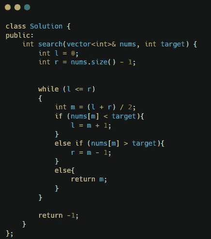

# 二进位检索

> 原文：<https://medium.com/nerd-for-tech/binary-search-d8363b22e684?source=collection_archive---------5----------------------->

二分搜索法是一种在有序数组中寻找给定目标的算法。二分搜索法算法将目标与数组的中间元素进行比较。假设目标不是中间元素，您将比较目标是大于还是小于中间元素。如果目标较大，那么您将忽略左边的元素，并继续寻找剩余一半的中间元素。如果元素更小，情况也是如此，只是忽略了右边的元素。然后重复此过程，直到找到目标，或者您用完了选项并确定目标不在阵列中。

**例子**

给定数字，1 到 10 找出数字 6。首先，我们将从中间的数字 5 开始。数字 5 小于 6，所以我们将忽略 5 左边的数字。

剩下的数字，我们将去中间的数字 7。数字 7 大于 6，所以我们将忽略右边的数字。

再次回到剩余数字的中间，我们得到数字 6。数字 6 等于 6，所以你知道你已经找到了目标。

这个算法的时间复杂度为 O(log *n* )，因为每次搜索都会将需要搜索的元素数量减少一半。

**代码实现**

这个 LeetCode 问题叫做****处理的就是这个问题。****

****要实现二分搜索法，您将创建一个变量来保存数组的左值和右值。最初左边是 0，右边是数组的长度减 1。****

********

****创建一个 while 循环，该循环将在左侧变量小于或等于右侧变量时循环。您还将创建一个新变量来保存数组的中间值。为了得到数组的中间值，我们可以将左边和右边的变量相加，然后除以 2。****

********

****现在，如果中间的元素小于目标值，你将把左边的变量设置为中间变量加 1，因为我们已经知道中间不是目标值。****

********

****如果中间的元素大于目标值，你将把右边的变量设置为中间变量减一。****

********

****如果我们通过了两个 If 语句，我们可以返回中间的变量，因为它是目标。****

********

****如果 while 循环结束，中间的变量没有返回，那么我们知道目标不在数组中。在 LeetCode 示例中，我们被指示返回-1。****

********

******整数溢出******

****您可以对这段代码做一点小小的改进。如果数组足够大，左变量和右变量可能会超过 32 位整数的最大值，当它们加在一起时会溢出。这会给你一个不正确的中间数字。解决这个问题的一种方法是计算左右变量之间的距离，然后将这个数除以 2。然后，您可以将这个数字添加到左边的变量中，以获得中间的数字。****

********