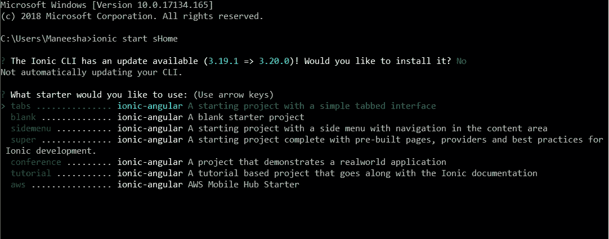
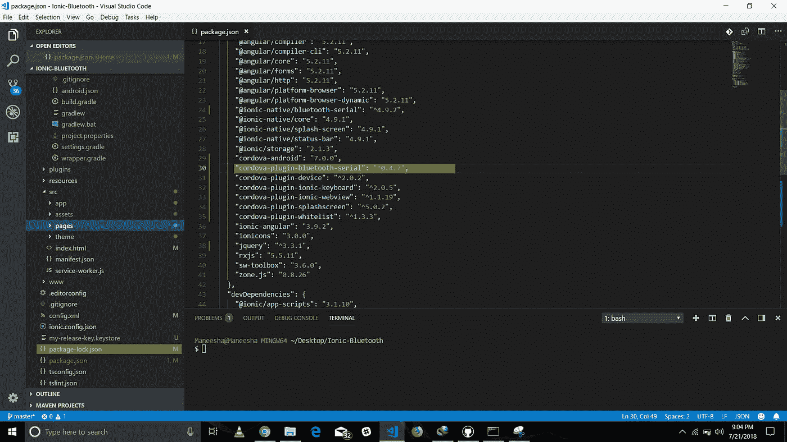
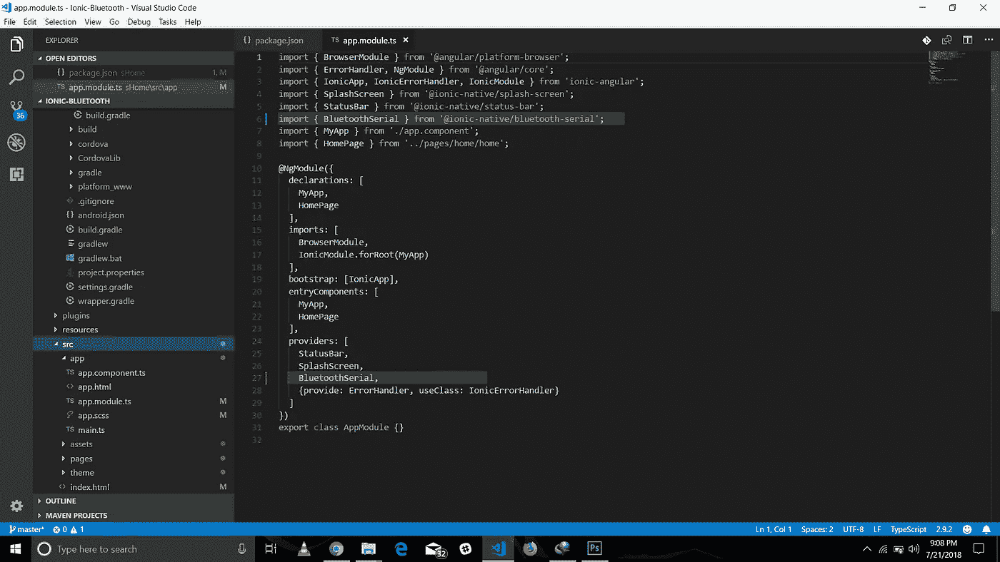
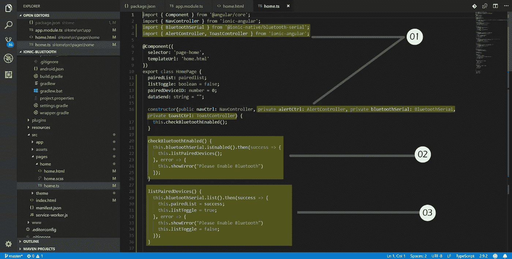
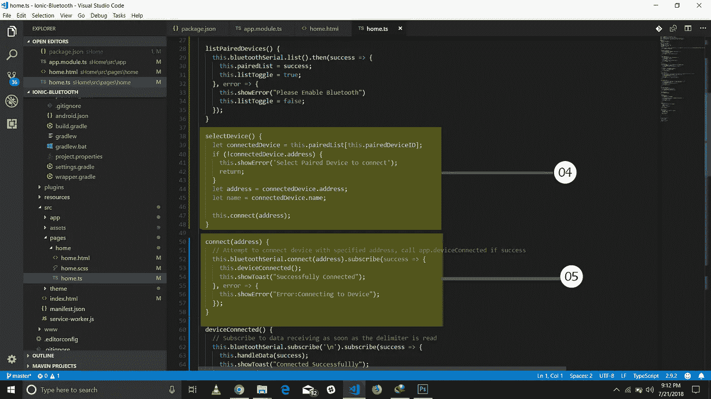
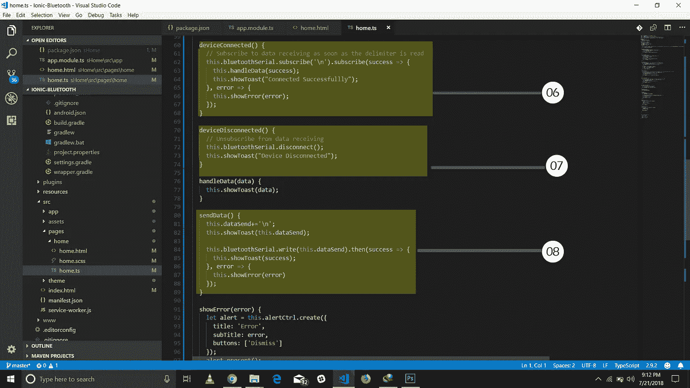
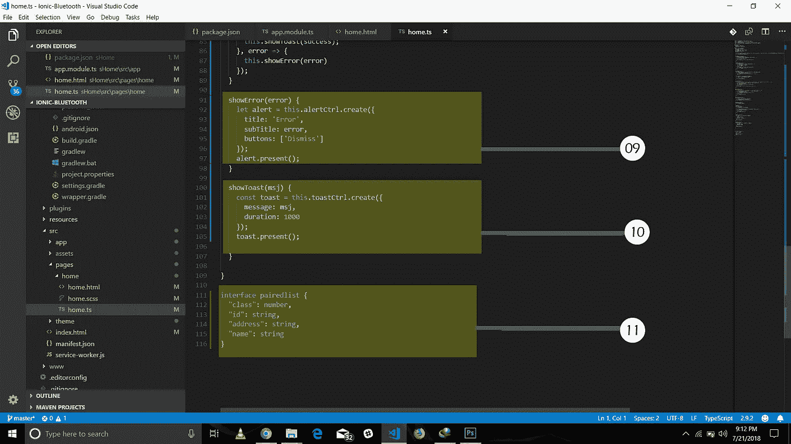
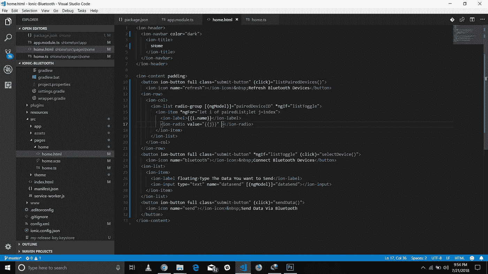
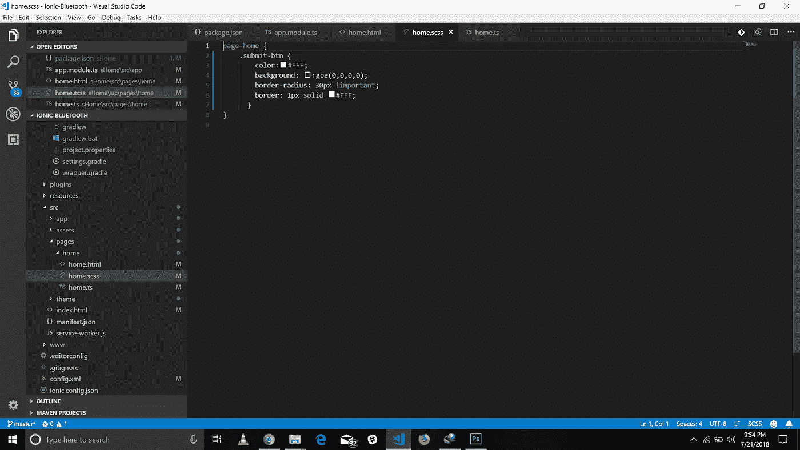
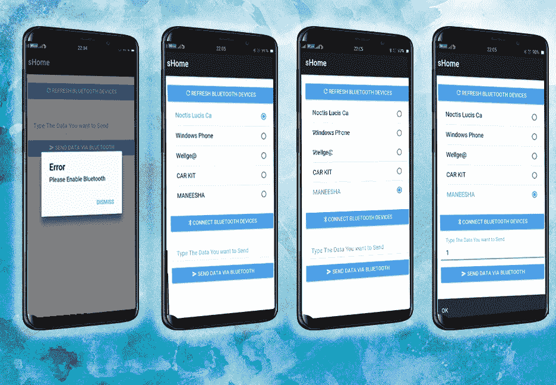

# 带离子接口的蓝牙串行接口

> 原文：<https://medium.com/nerd-for-tech/bluetooth-serial-interface-with-ionic-66c823792166?source=collection_archive---------0----------------------->

当你在做一个基于 Arduino 的项目时，你必须使用蓝牙或 WiFi 向你的 Arduino 电路发送数据。当我在做一个用手机点亮灯泡的项目时，我想创建一个可以将数据发送到微控制器的移动应用程序。首先我想使用 android 来实现，然后我想为什么不使用 Ionic 框架来构建一个原生应用呢？

Ionic Framework 是一个跨平台的支持框架，可用于开发原生移动应用，最新版本是 Ionic 3，主要使用 Angular 和 Cordova 插件。要使用 Ionic，您需要将 ***ionic-CLI*** 安装到您的机器中。因此，第一步是打开命令提示符并键入

> `$ npm install -g ionic`

然后它会安装在你的电脑上。然后使用 ***ionic-CLI 创建一个新项目。*** 然后在命令提示符下键入下面的命令来创建一个新项目。

> `$ ionic start sHome`

终端会给你一些选项供你选择，比如 android 的空项目，标签项目，菜单栏等等。

然后，要在手机上访问蓝牙，你需要使用 Cordova 插件。科尔多瓦插件将帮助您访问手机的任何部分，有大量的科尔多瓦插件，通常有助于访问手机上的任何东西。所以安装蓝牙科尔多瓦插件

> `$ ionic cordova plugin add cordova-plugin-bluetooth-serial`
> 
> `$ npm install --save @ionic-native/bluetooth-serial`

在 ***package.json*** 文件中，你会发现已经安装了 Cordova 插件。然后，您需要将它添加到 app.module.ts 文件中，您要安装的所有内容都将存放在该文件中。

所以在***app . module . ts***文件中，您需要添加那个 Cordova 插件，并将其作为提供者导入到您的项目中。之后，你可以在任何需要的时候调用你的应用程序中的 Cordova 插件。

好了，现在让我们创建应用程序，在 ***src*** 文件夹中，你会发现 pages 文件夹(这是你为你的移动应用程序创建页面的地方)和一个主页，它包括 3 个文件

> `home.html-where you put all html code`
> 
> `home.scss-where you put all SCSS styles that have to apply for page`
> 
> `home.ts-Where you will add logic to your page`

我们先来看看关于 ***home.ts*** 的页面

在这里的第一步，我们需要导入我们想要使用的模块，这里我想使用`alertController` 来给出警告信息，而 toast 控制器只是给出一些小信息，如“设备已连接”，最后是我们安装的蓝牙串行模块。为了在应用程序函数中使用它们，我们需要在构造函数中初始化它们。

然后，我们需要检查蓝牙是否已启用，这就是我们在第二个函数中要做的。然后我们需要一个配对设备的列表，这是第二个函数，这里可以看到分配给变量 I initialize 的配对列表的结果。因此，为了获得配对设备列表，我使用了第三个函数。

在第 4 个功能中，从配对设备列表中选择设备，在第 5 个功能中，连接到该设备，第 6 个功能是检查设备是否与移动设备连接并准备好传输数据，第 7 个功能是断开与设备的连接，第 8 个功能是向设备发送数据，第 9 个功能用于`alertController`，第 10 个功能用于`toastController` ，最后第 11 个功能用于配对列表的接口。

而对于 home.html 文件的**T5 来说，几乎和用 angular4 差不多，SCSS 的造型也差不多像 CSS。**

在 ionic 中，你可以在你的网页上使用模拟器，但是一旦你安装了 Cordova 插件，你就需要一个 android studio 的 android 模拟器或者一个移动设备来调试程序。我只是把现场服务器 CLI 命令，但它不会与科尔多瓦插件。ionic live 服务器是你能从 ionic 获得的最好的东西之一。要启动实时服务器并进行调试，请使用以下命令。

> `$ ionic serve`

然后它将在本地 web 浏览器中运行代码，因为 Ionic 使用 typescript。(***https:localhost:<port>/ionic-lab***)URL 会将你导向一个页面，在那里你可以在 iOS、android 和 windows 上运行你的测试应用。

创建应用程序后，它将如下所示。

## [https://github.com/maneeshaindrachapa/sHome.git](https://github.com/maneeshaindrachapa/sHome.git)

您可以从 git 资源库下载代码并更改样式。祝你好运。如果你喜欢这个，请给我买一杯[☕️](https://ko-fi.com/maneeshaindrachapa)咖啡