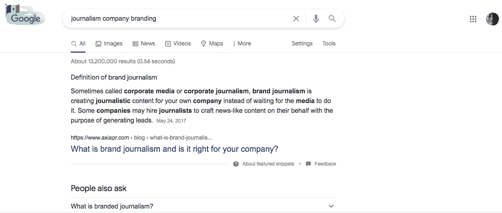

# 品牌和企业新闻

> 原文：<https://medium.com/nerd-for-tech/brand-and-corporate-journalism-d5af78770df7?source=collection_archive---------13----------------------->

B 兰德新闻和内容营销不一样。品牌新闻利用新闻的风格、策略和工具来讲述一个公司的故事。请记住，讲故事是营销的核心，品牌新闻也是如此。人们从来不买你的产品或服务，他们买的是这些产品和服务告诉他们的故事，以及一旦他们得到这些产品或服务，他们可以向他们的朋友和家人讲述什么有价值的故事。讲故事的第二部分是一些营销人员所说的病毒营销的核心，这是一种网络效应，可以使产品获得巨大成功。品牌新闻可能会与记录公司每天做的事情混淆，但即使这是它的一部分，品牌新闻也不止于此，如果在产品或服务设计之前就开始，效果会更好。这是一个从产品或服务的设计开始，直到投入市场的过程。这是一个持续的过程，需要讲故事和公共关系的技巧，如果你掌握了网络效应，这将有助于你了解想法或故事是如何在人与人之间传播的。虽然许多人关注技术层，但还是要关注故事层，因为故事是使产品成功的包装，而不是复杂的技术层。请记住，成功的产品或服务在技术上从来都不复杂，品牌新闻可以成为这种媒介，教会你的受众如何使用你的产品或服务，这样从你未来客户的角度来看，它们就不那么复杂了。

离开内容营销，专注于品牌和企业新闻，因为它比内容营销更具战略性和长期性，内容营销通常是由 SEO 和社交媒体或电子邮件营销驱动的短期策略的集合，以赢得信任。赢得信任是品牌和企业新闻的副作用之一，而信任是公司获得的最重要的资产。信任与你的公司、产品或服务无关。信任是关于你的核心受众。核心受众因为你没有义务瞄准大量的受众，从极少数关心你的故事传播的人开始比试图征服大众更重要。这是我们从技术采用生命周期中学到的，你可以阅读许多关于技术采用这一主题的书籍，如 T2·杰弗里·摩尔的《跨越鸿沟》。

请记住，了解人们如何从一份工作到另一份工作，对于了解公司如何采用技术以及他们的员工如何影响他们的东道国公司采用技术产品非常有帮助。[这篇文章](https://mkrdiop.medium.com/why-business-and-team-software-have-vitality-incorporated-eea14c5103f)谈了一些由员工推动的公司对科技产品的采用，slack 就是这类科技产品中嵌入网络效应的一个例子，因为病毒不是产品的一个特征，而是产品本身，Seth Godin 有一篇很棒的文章，讲述了病毒可以给营销人员上的一课[这里](https://seths.blog/2020/03/thoughts-on-a-virus/)

PS:我想我可以把这篇文章发给(但没有)我的一个哥哥，他给了我一个宝贵的机会，让我在有价值和有技能的人面前讲话，我还没有准备好。也感谢[另一位老大哥](https://www.facebook.com/BolyDiene)把我和他联系起来。他们都像你一样善良。所以感谢你们所有人的支持。

我的书《Gamestop，剖析股票空头泡沫》来了[这里](http://clickmetertracking.com/nglj)

游戏停止，剖析股票空头泡沫

Gamestop，剖析股票空头泡沫，内部观点

Gamestop，剖析股票空头泡沫，roaringkitty 章节